# EBC-X EV0 技术设计文档（design.md）

> **项目：EBC-X — Enterprise Business & Industrial Operating System（企业与工业智能运营操作系统）**
> **阶段：EV0 — Architecture & Policy Alignment → 技术设计（design.md）**
> **文档版本：v1.1（执行 EBCX-EV0-DESIGN-HARDENING-001 Architecture Hardening 修订）**
> **状态：� DESIGN v1.1（Architecture Hardening 完成，待大G项目经理体系 EV0-DESIGN Gate 复审）**
> **上一版本：v1.0（CONDITIONAL PASS，裁决不退回重做，仅要求 Architecture Hardening）**
> **需求基线：`.codeartsdoer/specs/ebcx_ev0_arch/spec.md` v1.1（EV0-SPEC PASS / CLOSED，不可变基线，本修订不得修改）**
> **产品/架构总设计：大G项目经理体系**
> **核心工程化：华为云团队**
> **全球交付与产品主权：HTKIS**

---

## 文档定位与约束声明

本文档是 spec.md（v1.1，EV0-SPEC PASS / CLOSED）的**技术化、工程化、可实现化**展开，回答：

> **"EBC-X 究竟怎样在 PostgreSQL + EventBus + Object Storage + Graph + Policy + Agent + Digital Twin 的组合下，真正跑起来。"**

**不可变基线约束**：本文档必须严格遵循 spec.md 已锁定的 13 条架构原则与 8 条架构红线，不得漂移。若设计与 spec.md 出现矛盾，以 spec.md 为准并显式标注矛盾点，但**不得擅自修改 spec.md**。

**Design Freeze Principle #1（锁定）**：第一阶段采用 **Modular Monolith + Event-Native**，而非 Microservice Showcase。13 个能力模块不拆成数十个独立微服务，模块边界通过稳定契约 + Event Backbone 隔离，选择性服务抽取留待后续 EV 阶段。

**覆盖范围**：D01~D24 共 24 项技术设计决策，每项含设计决策、关键组件、交互流程（PlantUML）、与 spec.md 对应需求映射、Non-Functional 约束。

---

## Architecture Hardening 修订声明（v1.0 → v1.1）

> **修订依据**：大G项目经理体系对 design.md v1.0 完成 EV0-DESIGN Gate 审查，裁决为 🟡 CONDITIONAL PASS，不退回重做，不修改 EV0-SPEC v1.1，仅要求对 design.md 做 Architecture Hardening，补齐 D-GATE-01~08 后重新提交 Design v1.1。
>
> **硬约束**：
> - ❌ 禁止修改 EV0-SPEC v1.1（spec.md 已冻结）
> - ❌ 禁止重新设计 EBC-X、增加大量微服务、推翻 Neo4j Projection / Event-Native / Evidence-First、进入 tasks 阶段
> - ✅ 只允许 design.md v1.0 → Architecture Hardening → design.md v1.1，补齐 D-GATE-01~08，重新执行 D01~D24 consistency check
>
> **已认可的正确决策（Hardening 不得漂移）**：Modular Monolith + Event-Native（14 模块）/ Evidence Ledger → Neo4j Projection（Outbox+EventBus 异步）/ Event-Native（State+Event+Evidence+Outbox+CQRS）/ 三层真相模型 / 24 类 Canonical Evidence Graph Core（含 Approval）/ Agent Evidence Provenance + 三重治理 / RPO 分级 / Benchmark Profile B1~B5 / 工信部政策 = 产品能力映射。
>
> **D-GATE 修订清单**：
>
> | D-GATE | 主题 | 严重度 | 落实位置 |
> |---|---|---|---|
> | D-GATE-01 | Evidence Ledger 不可篡改安全边界 | 🔴 必须补 | §2.4 D05 之后 |
> | D-GATE-02 | Transaction Orchestrator 与 Saga/Workflow 边界 | 🔴 必须补 | §2.4 D04 之后 |
> | D-GATE-03 | RPO ≤ 0 技术实现条件 | 🔴 必须补 | §2.4 D20 之后 |
> | D-GATE-04 | B1 Benchmark Profile 绑定 | 🔴 必须补 | §2.4 D21 之后 |
> | D-GATE-05 | Graph Projection ≤3s 适用条件与指标 | 🔴 必须补 | §2.4 D19 之后 |
> | D-GATE-06 | 24 Entity + 8 Edge Canonical Graph Contract | 🔴 必须补 | §2.4 D06 之后 |
> | D-GATE-07 | Agent Execution Authorization 模型 | 🔴 必须补 | §2.4 D11 之后 |
> | D-GATE-08 | 13 Capability / 14 Module / 6 Bounded Context 层级关系 | 🟠 必须澄清 | §2.4 D02 之后 |
> | 附加战略约束 | EBC-X ≠ SAP/Oracle 国产复刻（永久原则） | 🔴 必须锁定 | §2.5 Non-Functional Architecture Constraints 之后新增 §2.5.11 |

---

# 一、需求与存量功能关系分析

## 1.1 需求功能与存量功能对比

### 1.1.1 已实现功能（既有项目资产归并）

> EV0 阶段当前代码库无业务代码（仅 spec.md 与工具配置），符合 EV0 架构对齐阶段定位。"已实现功能"指 spec.md §3.2 声明的既有项目资产，作为 EBC-X 三大核心的归并来源。

| 需求功能（spec.md） | 存量功能（既有项目资产） | 资产位置/归并目标 | 匹配度 | 归并裁决依据 |
|---|---|---|---|---|
| Business Core / Transaction Core（§5.2 规则 2） | EITP 交易引擎 | EITP → EBC-X Transaction Core | 75% | EITP 提供交易引擎资产，但未具备 Evidence Ledger / Outbox / Graph Projection，需扩展 |
| Industrial Manufacturing Core（§5.2 规则 3） | AirPLM / MES 制造能力 | AirPLM/MES → EBC-X Manufacturing Core | 75% | 制造能力资产可用，但未对接第一性原理链路与 Evidence 治理 |
| Digital Twin Validation Engine（§5.2 规则 3） | SeaFusion-X 数字孪生 | SeaFusion-X → EBC-X Digital Twin Adapter | 50% | 数字孪生资产可用，但需新增验证层与 Evidence Provenance 注入 |
| Evidence Governance Engine（§5.2 规则 4） | AeroForge-X 证据治理 | AeroForge-X → EBC-X Evidence Ledger + Graph Projection | 50% | 证据治理概念可用，但需重构为 PostgreSQL append-only + Neo4j 异步投影三层真相模型 |
| Enterprise Security Foundation（§5.2 规则 4） | HTKIS-AF 安全基座 | HTKIS-AF → EBC-X Security Architecture | 75% | 认证/鉴权/加密/审计能力可用，需统一为 OAuth2+JWT+RLS+审计 append-only |
| Evidence Storage / Data Preservation（§5.2 规则 4） | HTKIZ / HyperDisk 数据存储 | HTKIZ/HyperDisk → EBC-X Data Architecture + Artifact Store | 50% | 存储基础设施可用，需对接华为云 OBS 与三层真相模型 Artifact Truth |

### 1.1.2 需要扩展的功能

| 需求功能 | 存量功能 | 差异说明 | 扩展方向 |
|---|---|---|---|
| 第一性原理链路（§5.1.1 规则 1） | EITP 线性 ERP 模型 | EITP 为传统"订单→库存→财务"线性模型，缺少 Business→Event→Transaction→Data→Evidence→Policy→Decision→Agent→Execution→Verification→Closure 闭环 | 在 Transaction Core 上层引入 Orchestrator 编排 11 阶段链路；Read/Query 路径分流不强制走完整链路 |
| 三层真相模型（§5.3.1 规则 3） | AeroForge-X 单一 Graph Truth | AeroForge-X 原始设计存在"Graph Truth vs 持久层"二义性 | 重构为 Evidence Truth（PostgreSQL）+ Graph Truth（Neo4j Projection）+ Artifact Truth（OBS）三层，PostgreSQL 为最终裁决源 |
| Outbox + EventBus 异步投影（§4.2 规则 4） | AeroForge-X 同步 Graph 写入 | 原同步写入会拖垮 Transaction Core | 引入 Outbox 表（同事务原子写入）+ EventBus 异步消费投影至 Neo4j，最终一致 ≤3s，Neo4j 失败不拖垮 Transaction |
| Event-Native + CQRS + Evidence Ledger（§5.4.1 规则 6） | EITP 无 Event Sourcing | EITP 直接状态更新无事件流 | Core Transaction 引入 Command→Aggregate→Transaction→Event→Evidence→Projection，具备 Event Replay 能力；查询模型由 Projection 分发，不强制全量事件重放 |
| 24 类 Canonical Evidence Graph Core（§5.5.1 规则 1） | AeroForge-X 实体集不完整 | 缺少 Approval 作为一等公民，实体数量未锁定 24 类 | 锁定 24 类节点（含 Approval），定义归属/交易/产出/资产/证据/治理/审批/数据 8 类边，扩展实体留待后续 EV 阶段 |
| Governed Agent 三重治理（§5.6.1 规则 1） | 无既有 Agent Runtime | 既无 Agent 资产也无治理框架 | 新建 Governed Agent Runtime，依次通过权限/Policy/审批三重校验，Provenance 注入决策上下文 |
| RPO 分级（§4.2 规则 3） | EITP 单一 RPO 模型 | 既无分级 RPO 也无 Country Pack 部署等级 | 落地核心交易 RPO≤0 + 同城≤30s + 异地≤5min + 区域级按 Country Pack |
| Benchmark Profile B1~B5（§4.1 规则 3） | EITP 单一 TPS 指标 | 既无 Profile 框架也无分位延迟约束 | 建立 B1~B5 Profile 框架，B1 锁定 P95≤500ms / ≥2000 TPS / Error≤0.1%，B2~B5 预留 |
| Global Core + Country Pack（§5.8.1 规则 1） | EITP 单一部署模型 | 既无全球核心也无区域包 | 落地 Global Core + China/EU/US/Japan/ASEAN 五个 Country Pack 扩展点，核心表不分叉 |

### 1.1.3 需要新增的功能或接口

> 以下为 spec.md 要求但既有项目资产完全无对应实现的部分，对应 D01~D24 技术设计项。

**A. 架构地基类（D01/D02/D15/D18/D19）**
- **D01 Logical Architecture**：模块边界、依赖方向、PlantUML 逻辑架构图——既有项目均为独立系统，无统一逻辑架构
- **D02 Domain Boundary**：聚合根划分、限界上下文、Context Map——既有项目无 DDD 统一边界
- **D15 Data Architecture**：PostgreSQL schema + Neo4j schema + OBS 命名 + 迁移策略——需统一数据架构
- **D18 Consistency Model**：事务边界、Outbox 原子性、Graph 最终一致、Saga——既有项目无统一一致性模型
- **D19 Failure / Recovery Model**：Neo4j 故障不拖垮 Transaction、Outbox 重投、重建投影——既有项目无统一故障恢复

**B. 核心引擎类（D03/D04/D05/D06/D07/D08/D09）**
- **D03 Enterprise Core**：企业/组织/主数据/权限领域设计
- **D04 Transaction Core**：聚合根、命令、事件、Orchestrator 编排
- **D05 Evidence Ledger**：PostgreSQL append-only 表结构、版本、租户隔离 RLS
- **D06 Evidence Graph Projection**：Neo4j 节点/边 schema、投影规则、重建策略
- **D07 Outbox + EventBus**：Outbox 表结构、EventBus 选型、投递语义、至少一次/幂等
- **D08 CQRS**：Command 侧 / Query 侧分离、Read Model 投影、物化视图策略
- **D09 Data Lineage**：Evidence Provenance & Data Lineage 实现、溯源子图、Provenance 记录

**C. 治理与智能类（D10/D11/D12）**
- **D10 Policy Engine**：规则模型、评估流程、与 Agent/Approval 交互
- **D11 Agent Runtime**：Governed Agent Runtime、权限/Policy/审批三重治理、Provenance 注入
- **D12 Digital Twin Adapter**：与 SeaFusion-X 归并、验证层

**D. 横切关注点类（D13/D14/D16/D17/D22/D23）**
- **D13 Security Architecture**：HTKIS-AF 归并、认证/授权/审计、RLS、密钥管理
- **D14 Multi-Tenant Architecture**：租户隔离模型、RLS 策略、Pack 路由
- **D16 API / GraphQL**：REST API 第一入口（/api/v1/rel/*）+ GraphQL 适配层契约
- **D17 Event Contract**：事件命名、schema、版本化、向后兼容
- **D22 Observability**：日志/指标/链路追踪、Evidence 关联、告警
- **D23 Audit / Compliance**：append-only 审计、Evidence 不可篡改、数据保留、数据出境

**E. 运行时类（D20/D21/D24）**
- **D20 RPO / RTO**：RPO/RTO 分级落地、灾备分级、Country Pack 部署等级
- **D21 Benchmark Architecture**：B1~B5 Profile 落地、压测拓扑、Measured Baseline 路径
- **D24 Deployment Architecture**：华为云云原生、容器化、DevSecOps、CI/CD、环境分层

## 1.2 存量功能详细分析

### 1.2.1 EITP（Transaction Core 归并源）

- **接口契约**：提供订单/合同/发票/付款等交易接口，入参为业务文档，出参为业务状态，无 Evidence 引用
- **业务规则**：线性状态机（草稿→提交→审批→完成），无 Event Sourcing，无 Evidence 闭环
- **扩展点**：状态机可扩展，但缺少 Policy/Decision/Agent 环节
- **约束**：单库强一致，无 Outbox，无异步投影；迁移时需保证存量交易数据可读但新交易走 Evidence 闭环

### 1.2.2 AirPLM / MES（Manufacturing Core 归并源）

- **接口契约**：BOM/工艺路线/工单/质检接口，入参为制造文档，出参为生产状态
- **业务规则**：生产计划→执行→质检→入库，无 Evidence 治理
- **扩展点**：工艺路线可配置，但缺少与 Evidence Graph 的产出关系投影
- **约束**：实时性要求高（秒级），迁移时需保证生产连续性不中断

### 1.2.3 AeroForge-X（Evidence Governance 归并源）

- **接口契约**：证据写入/查询接口，原设计为单一 Graph Truth
- **业务规则**：证据 append-only，但 Graph 与持久层边界模糊
- **扩展点**：证据类型可扩展，但缺少三层真相模型分离
- **约束**：原同步 Graph 写入会拖垮 Transaction，必须重构为 Outbox+EventBus 异步投影

### 1.2.4 SeaFusion-X（Digital Twin 归并源）

- **接口契约**：数字孪生模型/仿真接口，入参为物理资产参数，出参为预测结果
- **业务规则**：基于实时工业数据预测，无 Evidence Provenance
- **扩展点**：模型可插拔，但缺少与 Evidence Graph 的验证层对接
- **约束**：仿真计算重，需异步执行，结果须经 Verification 后方可写入新 Evidence

### 1.2.5 HTKIS-AF（Security Foundation 归并源）

- **接口契约**：认证/鉴权/加密/审计接口
- **业务规则**：统一安全能力供给
- **扩展点**：可扩展多因子认证
- **约束**：必须作为唯一安全基座，禁止各模块自建；需对接 OAuth2+JWT+RLS+审计 append-only

### 1.2.6 HTKIZ / HyperDisk（Evidence Storage 归并源）

- **接口契约**：数据存储/保存接口
- **业务规则**：持久化与归档
- **扩展点**：可扩展存储后端
- **约束**：需对接华为云 OBS 作为 Artifact Truth，保持可迁移性不产生不可逆厂商锁定

### 1.2.7 存量功能约束汇总

| 约束类别 | 约束内容 | 影响的设计项 |
|---|---|---|
| 数据迁移约束 | 归并必须保证存量数据可迁移、存量接口可适配（§4.5 规则 2） | D15 / D24 |
| 核心表不分叉约束 | Global Core 核心表不得因本地化分叉（§5.8.1 规则 3） | D14 / D15 |
| 厂商可迁移约束 | 核心能力必须可在标准云原生环境运行（§4.5 规则 4） | D13 / D24 |
| 安全统一供给约束 | 安全能力必须由 HTKIS-AF 统一供给（§5.7.1 规则 1） | D13 |
| 异步投影约束 | Neo4j 失败不得拖垮 Transaction Core（§4.2 规则 4） | D06 / D07 / D19 |

---

# 二、增量设计方案

## 2.1 实现模型

### 2.1.1 上下文视图（D01 Logical Architecture）

**设计决策**：EBC-X 第一阶段采用 **Modular Monolith + Event-Native** 单进程多模块架构，模块边界通过 Go package / Rust crate 边界 + 稳定契约接口 + Event Backbone 隔离。不拆成数百微服务（遵守 Design Freeze Principle #1 与 spec.md §5.12.1 红线三）。

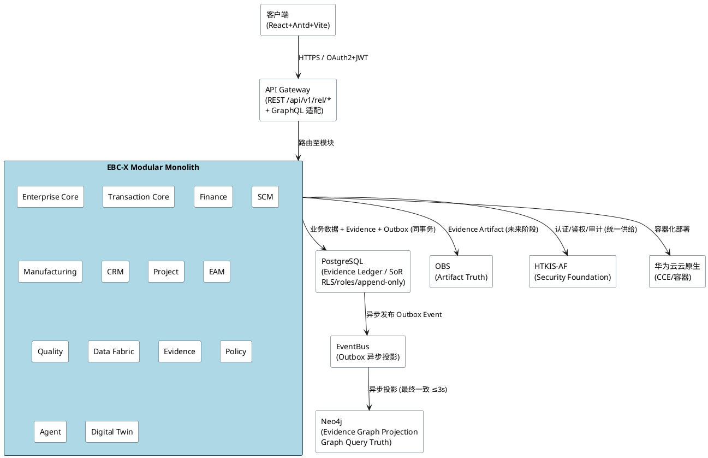

**关键组件**：
- **API Gateway**：REST 第一入口 + GraphQL 适配层，统一认证
- **Modular Monolith**：14 个模块（Enterprise/Transaction/Finance/SCM/Manufacturing/CRM/Project/EAM/Quality/Data Fabric/Evidence/Policy/Agent/Digital Twin），模块间通过接口契约 + Event 通信，禁止跨聚合直接调用
- **PostgreSQL**：System of Record，承载业务数据 + Evidence Ledger + Outbox
- **Neo4j**：Graph Query Truth，异步投影
- **OBS**：Artifact Truth，证据原件
- **EventBus**：Outbox 异步投影通道

**与 spec.md 映射**：§3.2 外部系统、§5.2 模块树、§5.3 技术栈、§5.12 红线三（禁止数百微服务）

**Non-Functional 约束**：模块边界编译期可校验（Go package / Rust crate）；模块间调用延迟 ≤5ms（同进程）；Event 投影收敛 ≤3s（§4.2 规则 4）

### 2.1.2 服务/组件总体架构（D02 Domain Boundary）

**设计决策**：采用 DDD 限界上下文划分聚合根，每个模块对应一个限界上下文，聚合根封装业务不变式，跨聚合流程由 Orchestrator 编排。Context Map 采用 Customer/Supplier 关系，Evidence 为所有业务上下文的 Shared Kernel（只读投影）。

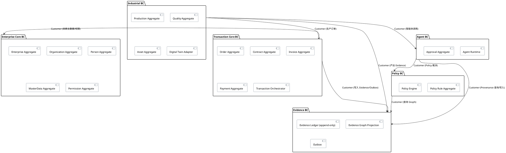

**聚合根划分（D02 核心）**：

| 限界上下文 | 聚合根 | 不变式 | 与 spec.md 映射 |
|---|---|---|---|
| Enterprise Core | Enterprise / Organization / Person / MasterData / Permission | 组织树层级 ≤5；权限继承单调 | §5.10 EV1 |
| Transaction Core | Order / Contract / Invoice / Payment | 金额一致性；状态机单调推进 | §5.10 EV2 / §5.1 链路 |
| Evidence | EvidenceLedger / Outbox / GraphProjection | append-only；Outbox 与业务数据同事务原子 | §5.4 / §5.5 / §4.2 规则 4 |
| Policy | PolicyRule | 版本单调；生效区间不重叠 | §5.5 治理关系 / §6.4 |
| Agent | AgentExecution / Approval | 三重治理顺序不可变；Approval 一等公民 | §5.6 / §5.5 Approval |
| Industrial | Production / Quality / Asset / DigitalTwin | 产出关系可追溯 Evidence | §5.10 EV6/EV7/EV10 |

**Context Map 关系**：Evidence BC 为 Shared Kernel（只读投影给 Policy/Agent）；Transaction Core 为 Customer of Enterprise Core；Agent 为 Customer of Policy + Evidence；Industrial 为 Customer of Transaction + Evidence + Agent。

**与 spec.md 映射**：§5.3.1 规则 5（DDD 聚合根 + Orchestrator）、§5.5（Evidence Graph 24 类节点对应聚合根）

**Non-Functional 约束**：聚合根边界编译期可校验；跨聚合调用必须经 Orchestrator；贫血模型在代码评审阶段拒绝

### 2.1.3 实现设计文档（D04 Transaction Core 编排 + D18 一致性 + D19 故障恢复）

**第一性原理链路编排（Mutation 路径）**：

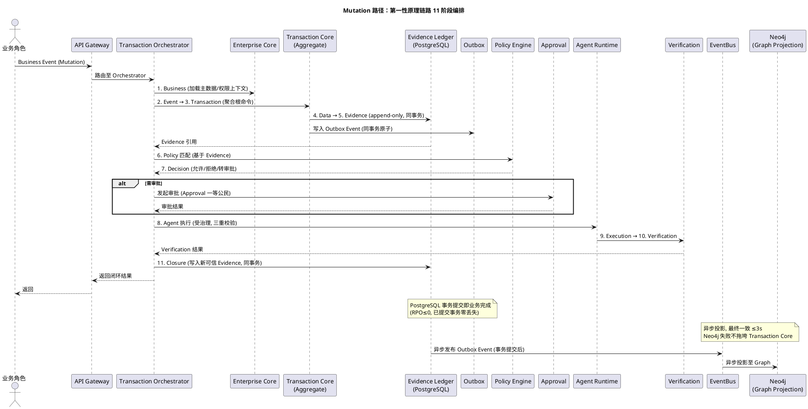

**Read/Query 路径分流**：

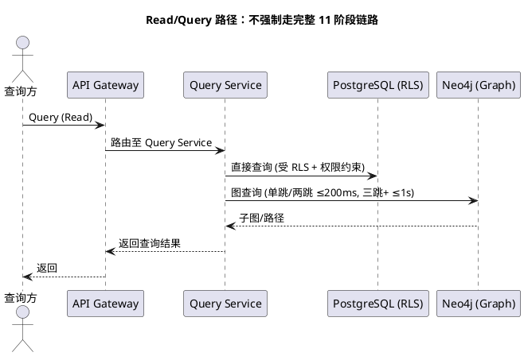

**一致性模型（D18）**：
- **事务边界**：PostgreSQL 单库事务，业务数据 + Evidence Ledger + Outbox Event 同事务原子提交（§4.2 规则 4）
- **Outbox 原子性**：Outbox 与业务数据在同一 PostgreSQL 事务内写入，事务提交即业务完成（RPO≤0）
- **Graph 最终一致**：Neo4j 通过 Outbox+EventBus 异步投影，收敛窗口 ≤3s；Neo4j 失败不回滚 Transaction
- **Saga（跨聚合长事务）**：跨聚合流程采用 Orchestrator 编排 Saga，补偿动作明确；同事务内聚合根操作无需 Saga

**故障恢复模型（D19）**：
- **Neo4j 故障**：Transaction Core 不受影响，Outbox Event 积压待 Neo4j 恢复后重投；查询降级至 PostgreSQL 直查 + 告警
- **Outbox 重投**：至少一次投递 + 幂等消费者（基于 event_id 去重）；重投间隔指数退避，最大 3s 收敛
- **重建投影**：Neo4j 可从 PostgreSQL Evidence Ledger 全量 Event Replay 重建；重建期间查询降级
- **PostgreSQL 故障**：RPO≤0（同步复制 + WAL 归档），RTO≤5min（§4.2 规则 3）

**与 spec.md 映射**：§5.1.1（第一性原理链路 + Read/Query 分流）、§4.2（一致性 + RPO）、§5.4（事件模型）、§5.6（Agent 治理）

**Non-Functional 约束**：核心交易 P95≤500ms（§4.1 规则 1）；Graph 投影收敛 ≤3s；RPO≤0；RTO≤5min

## 2.2 接口设计

### 2.2.1 总体设计（D16 REST + GraphQL）

**设计决策**：REST API 为第一入口（`/api/v1/rel/*`），GraphQL 为第二适配层复用同一认证体系（OAuth2+JWT）。禁止 GraphQL 为唯一入口（§5.3.1 规则 4）。接口按模块划分，版本化路径管理兼容。

**接口分类**：

| 接口类别 | 路径前缀 | 稳定性 | 说明 |
|---|---|---|---|
| Command（Mutation） | `/api/v1/rel/{module}/commands/*` | 稳定 | 触发第一性原理链路 |
| Query（Read） | `/api/v1/rel/{module}/queries/*` | 稳定 | 直接查询，受 RLS 约束 |
| Evidence | `/api/v1/rel/evidence/*` | 稳定 | Evidence 查询/溯源 |
| Policy | `/api/v1/rel/policy/*` | 稳定 | Policy 管理/评估 |
| Agent | `/api/v1/rel/agent/*` | 实验 | Agent 触发/状态 |
| Graph | `/api/v1/rel/graph/*` | 稳定 | Graph 查询（单跳/两跳/子图） |
| GraphQL 适配 | `/api/v1/graphql` | 稳定 | 复用 REST 认证 |

**接口变更策略**：破坏性变更新增版本号（`/api/v2/rel/*`），旧版本保留至少 2 个 EV 周期（§4.5 规则 1）。

**与 spec.md 映射**：§5.3.1 规则 4（REST 第一入口）、§4.5 规则 1（版本兼容）、§5.7.1 规则 3（统一认证）

### 2.2.2 接口清单（D17 Event Contract）

**事件契约（D17）**：

| 事件类别 | 事件命名 | schema 版本 | 向后兼容策略 |
|---|---|---|---|
| 业务事件 | `{module}.{aggregate}.{action}.v{n}` | semver | 新增字段可选；删除/重命名需新增版本 |
| Evidence 事件 | `evidence.created.v{n}` | semver | payload append-only，禁止变更已发布 schema |
| Outbox 事件 | `outbox.{aggregate}.{action}.v{n}` | semver | 与业务事件 1:1，含 event_id/tenant_id/traceId |
| Graph 投影事件 | `graph.projection.{node|edge}.{action}.v{n}` | semver | 投影失败重投，幂等 |
| Policy 事件 | `policy.evaluated.v{n}` | semver | 含裁决结果 + Evidence 引用 |
| Agent 事件 | `agent.{govern|execute|verify}.v{n}` | semver | 含三重治理结果 + Provenance |

**事件 schema 字段（统一）**：`event_id`（UUID）/ `event_type` / `event_version` / `tenant_id` / `aggregate_id` / `aggregate_version` / `trace_id` / `span_id` / `occurred_at` / `payload` / `evidence_ref` / `source_event_ref`

**核心接口签名（示例）**：

```
// Command: 创建订单（Mutation 路径，触发第一性原理链路）
POST /api/v1/rel/transaction/commands/create-order
Header: Authorization: Bearer <JWT>, X-Tenant-Id, X-Trace-Id
Body: { customerId, items[], contractRef?, ... }
Response: { orderId, evidenceId, transactionId, traceId, status }

// Query: 查询订单（Read 路径，不强制走完整链路）
GET /api/v1/rel/transaction/queries/orders/{orderId}
Header: Authorization: Bearer <JWT>, X-Tenant-Id
Response: { order, evidenceRefs[], lineageSubgraph? }

// Evidence: 查询溯源子图
GET /api/v1/rel/evidence/lineage/{businessObjectId}
Response: { sourceEvent, transaction, operator, policy, verification, relatedObjects[] }

// Graph: 图查询（单跳/两跳 ≤200ms）
POST /api/v1/rel/graph/queries/subgraph
Body: { startNodeIds[], hopDepth, edgeTypes[] }
Response: { nodes[], edges[] }

// Agent: 触发受治理智能体
POST /api/v1/rel/agent/commands/execute
Body: { agentId, inputEvidenceIds[], requestedAction }
Response: { agentExecutionId, governanceResult, verificationResult, outputEvidenceId? }
```

**与 spec.md 映射**：§5.4（事件模型）、§5.13（Data Lineage 查询）、§5.6（Agent 治理）、§6.1~6.5（数据约束）

**Non-Functional 约束**：核心交易接口 P95≤500ms；Graph 单跳/两跳 P95≤200ms，三跳+ P95≤1s；Agent 同步路径 ≤2s 或异步返回任务 ID

## 2.3 数据模型

### 2.3.1 设计目标（D15 Data Architecture）

**业务场景**：承载企业业务交易 + Evidence 治理 + Graph 投影 + Artifact 存储 + 多租户隔离 + 全球化本地化

**性能/容量/扩展性目标**：
- 核心交易 P95≤500ms，≥2000 TPS（B1 Profile）
- Evidence Ledger append-only，写入吞吐 ≥5000 EPS
- Graph 投影收敛 ≤3s，单跳/两跳查询 P95≤200ms
- 多租户严格隔离，RLS 行级过滤延迟 ≤5ms

**与存量数据兼容策略**：
- EITP 存量交易数据迁移至 Transaction Core，新交易走 Evidence 闭环，存量数据只读兼容
- 核心表不分叉（§5.8.1 规则 3），本地化字段以扩展表附加
- 迁移期间双写校验，迁移完成切换

### 2.3.2 模型实现（D03/D04/D05/D06/D14）

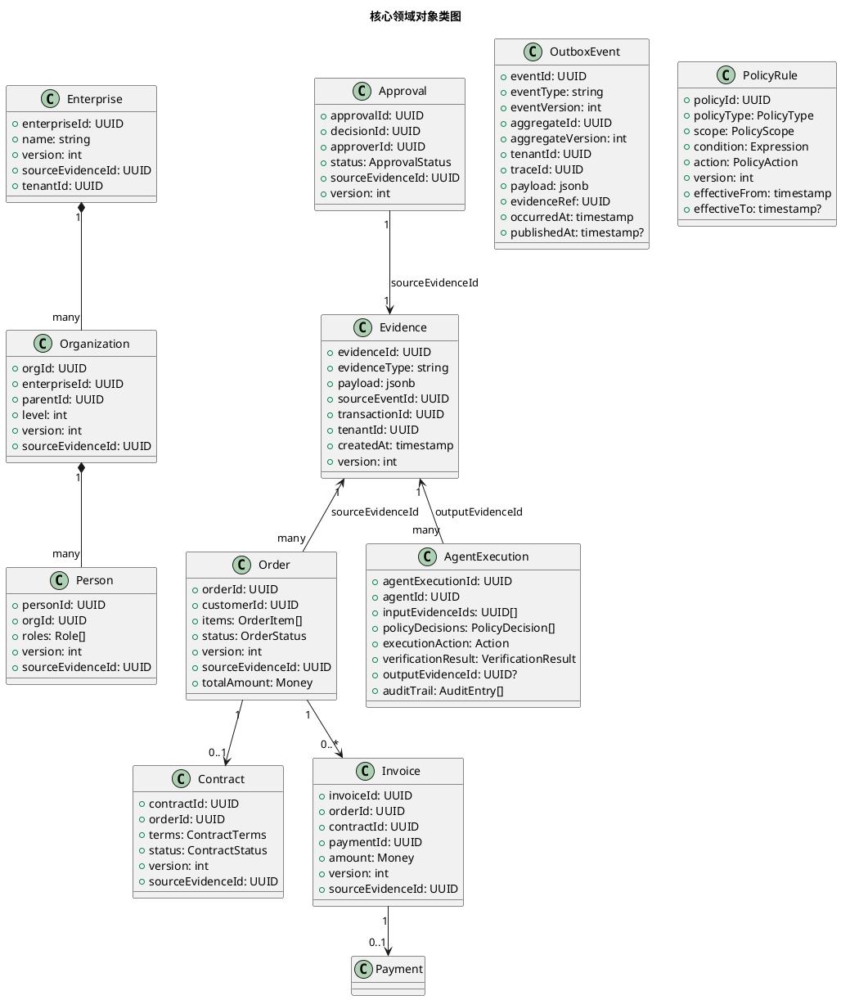

**核心领域对象**（对应 spec.md §6 数据约束）：
- **Enterprise / Organization / Person**（D03 Enterprise Core）：组织树层级 ≤5，权限继承单调
- **Order / Contract / Invoice / Payment**（D04 Transaction Core）：金额一致性，状态机单调推进，每对象必带 sourceEvidenceId
- **Evidence**（D05 Evidence Ledger）：append-only，含 evidenceId/evidenceType/payload/sourceEventId/transactionId/tenantId/createdAt/version/immutability（§6.1）
- **OutboxEvent**（D07 Outbox）：与业务数据同事务原子写入，含 eventId/eventType/aggregateId/traceId/payload/evidenceRef
- **PolicyRule**（D10 Policy）：含 policyId/policyType/scope/condition/action/version/effectiveFrom/effectiveTo（§6.4）
- **AgentExecution**（D11 Agent）：含三重治理结果 + Provenance + Verification（§6.5）
- **Approval**（D05/D10 一等公民）：审批实体作为 Evidence Graph 一等公民，承载审批流转事实

**持久化策略**：
- **PostgreSQL（Evidence Truth / SoR）**：业务表 + append-only evidence 表 + outbox 表，启用 RLS/roles/indexes；evidence 表通过数据库触发器或规则强制 append-only（禁止 UPDATE/DELETE）
- **Neo4j（Graph Query Truth）**：24 类节点 + 8 类边，通过 Outbox+EventBus 异步投影；可从 PostgreSQL Event Replay 重建
- **OBS（Artifact Truth）**：PDF/图片/CAD/质检报告等不可变原件，命名规范 `{tenantId}/{evidenceId}/{artifactType}/{version}/{filename}`

**多租户隔离（D14）**：
- **隔离模型**：共享 schema + 行级隔离（RLS），每表含 tenant_id 列，RLS 策略强制 `current_setting('app.tenant_id') = tenant_id`
- **Pack 路由**：请求头 `X-Tenant-Id` + `X-Country-Pack` 路由至对应 Country Pack 扩展表
- **核心表不分叉**：Global Core 核心表统一，Country Pack 本地化字段以 `{table}_{country}_ext` 扩展表附加（§5.8.1 规则 3）

**与 spec.md 映射**：§6.1~6.5（数据约束）、§5.5（24 类节点）、§5.7（RLS）、§5.8（Global Core + Country Pack）

**Non-Functional 约束**：append-only 数据库层强制；RLS 行级过滤 ≤5ms；Graph 投影收敛 ≤3s；核心表不分叉编译期校验

---

## 2.4 D01~D24 详细设计

### D01 Logical Architecture（逻辑架构）

**设计决策**：Modular Monolith + Event-Native 单进程多模块，14 个模块通过 Go package / Rust crate 边界 + 稳定契约接口 + Event Backbone 隔离。依赖方向单向：Transaction → Enterprise（主数据）、Policy → Evidence（查询）、Agent → Policy + Evidence（治理 + Provenance）、Industrial → Transaction + Evidence + Agent。

**关键组件**：API Gateway / 14 模块 / PostgreSQL / Neo4j / OBS / EventBus / HTKIS-AF

**依赖方向规则**：
- 上层 → 下层：API Gateway → Module → Evidence Ledger / Policy / Agent
- 禁止反向依赖：Evidence 不依赖 Transaction；Policy 不依赖 Agent
- 禁止跨聚合直接调用：必须经 Orchestrator 或 Event

**与 spec.md 映射**：§3.2、§5.2、§5.3、§5.12 红线三

**Non-Functional 约束**：模块边界编译期校验；模块间调用 ≤5ms；Event 投影收敛 ≤3s

### D02 Domain Boundary（领域边界）

**设计决策**：6 个限界上下文（Enterprise / Transaction / Evidence / Policy / Agent / Industrial），每上下文含多个聚合根，跨上下文通过 Event + Orchestrator 通信。Evidence 为 Shared Kernel（只读投影）。

**聚合根清单**：见 §2.1.2 表格

**Context Map**：Customer/Supplier 关系；Evidence 为 Shared Kernel；禁止 Shared Kernel 可变状态

**与 spec.md 映射**：§5.3.1 规则 5（DDD）、§5.5（24 类节点）

**Non-Functional 约束**：聚合根边界编译期校验；贫血模型评审拒绝

#### D-GATE-08：13 Capability / 14 Module / 6 Bounded Context 层级关系澄清（🟠 Hardening）

> **修订背景**：spec.md §5.2 写"13 Core Capability Modules"，design.md §2.1.1 写"14 Modules"，二者可能不矛盾但必须写清层级体系，否则 Tasks Agent 会混淆。

**五层层级体系（锁定）**：

```text
Layer 1 — Core Capabilities:    13 capabilities（业务能力，spec.md §5.2 声明）
        ↓ 归属映射
Layer 2 — Domain Modules:       14 implementation modules（实现模块，含 1 Platform/Governance 模块）
        ↓ 限界上下文聚合
Layer 3 — Bounded Context:      6 contexts（限界上下文，D02 定义）
        ↓ 节点投影
Layer 4 — Canonical Entities:   24 entities（Evidence Graph 节点，§5.5.1 规则 1）
        ↓ 横切支撑
Layer 5 — Cross-cutting Platform: Event / Evidence / Policy / Identity / Observability
```

**13 → 14 差异来源（明确）**：13 业务能力模块（spec.md §5.2）+ 1 平台/治理模块（Cross-cutting Platform，承载 Event/Evidence/Policy/Identity/Observability 横切能力）= 14 实现模块（design.md §2.1.1）。差异不矛盾，是"业务能力"与"实现模块"两个层级的不同视角。

**13 Capability → 14 Module 映射表**：

| # | Layer 1 Capability（spec.md §5.2） | Layer 2 Module（design.md §2.1.1） | Layer 3 Bounded Context | 归属 Core |
|---|---|---|---|---|
| 1 | Enterprise / Organization / MasterData / Permission | Enterprise Core | Enterprise BC | Business Core |
| 2 | Transaction（Order/Contract/Invoice/Payment） | Transaction Core | Transaction BC | Business Core |
| 3 | Finance | Finance | Transaction BC | Business Core |
| 4 | SCM | SCM | Transaction BC | Business Core |
| 5 | CRM | CRM | Enterprise BC | Business Core |
| 6 | Project | Project | Transaction BC | Business Core |
| 7 | Manufacturing（AirPLM/MES 归并） | Manufacturing | Industrial BC | Industrial Core |
| 8 | EAM（Asset） | EAM | Industrial BC | Industrial Core |
| 9 | Quality | Quality | Industrial BC | Industrial Core |
| 10 | Data Fabric | Data Fabric | Industrial BC | Industrial Core |
| 11 | Digital Twin（SeaFusion-X 归并） | Digital Twin | Industrial BC | Industrial Core |
| 12 | Policy Engine | Policy | Policy BC | Trust Core |
| 13 | Governed Agent Runtime | Agent | Agent BC | Trust Core |
| 14 | **Platform / Governance（横切）** | **Evidence + Event + Identity + Observability + Audit** | **Evidence BC + 横切** | **Trust Core** |

**6 Bounded Context（D02 锁定）**：Enterprise BC / Transaction BC / Evidence BC / Policy BC / Agent BC / Industrial BC。Context Map 关系见 §2.1.2。

**24 Canonical Entities（Layer 4，§5.5.1 规则 1）**：Enterprise / Organization / Person / Product / Material / Supplier / Customer / Order / Contract / Invoice / Payment / Production / Quality / Asset / Project / Patent / R&D / Data / Evidence / Event / Policy / Decision / Approval / Agent。

**Layer 5 Cross-cutting Platform**：Event（Outbox+EventBus）/ Evidence（Ledger+Graph+Artifact 三层真相）/ Policy（Engine+Rule）/ Identity（HTKIS-AF OAuth2+JWT+RLS）/ Observability（APM+Log+Trace+Audit）。这些横切能力不归属任一业务 Capability，由 Platform/Governance 模块统一承载。

**与 spec.md 映射**：§5.2（13 Capability + 三大核心划分）、§5.5.1 规则 1（24 类节点）、§5.3.1 规则 5（DDD 6 限界上下文）

**Non-Functional 约束**：层级映射编译期可校验；13→14 差异来源单一明确（Platform/Governance 模块）；Tasks Agent 不得将 13 与 14 视为矛盾

### D03 Enterprise Core（企业/组织/主数据/权限领域设计）

**设计决策**：归并 EITP 主数据能力，以 Enterprise / Organization / Person / MasterData / Permission 五个聚合根承载。组织树层级 ≤5，权限继承单调。Permission 聚合根对接 HTKIS-AF 统一供给（禁止自建，§5.7.1 规则 1）。

**关键组件**：
- `EnterpriseAggregate`：企业根节点
- `OrganizationAggregate`：组织树（parentId 自引用，层级校验）
- `PersonAggregate`：人员 + 角色
- `MasterDataAggregate`：产品/物料/客户/供应商等主数据
- `PermissionAggregate`：权限 + 角色 + RLS 上下文

**交互流程**：

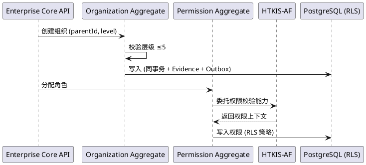

**与 spec.md 映射**：§5.10 EV1 Enterprise Core、§5.7 权限安全

**Non-Functional 约束**：组织树层级校验 O(n) n≤5；权限校验 ≤10ms

### D04 Transaction Core（交易核心：聚合根/命令/事件/Orchestrator 编排）

**设计决策**：归并 EITP 交易引擎，以 Order / Contract / Invoice / Payment 聚合根承载，TransactionOrchestrator 编排第一性原理链路 11 阶段（Mutation 路径）。Command → Aggregate → Transaction → Event → Evidence → Projection。

**关键组件**：
- `OrderAggregate` / `ContractAggregate` / `InvoiceAggregate` / `PaymentAggregate`：聚合根封装不变式（金额一致性、状态机单调）
- `TransactionOrchestrator`：编排 11 阶段链路
- `CommandBus`：命令分发
- `EventStore`：事件流持久化（具备 Event Replay 能力，§5.4.1 规则 6）

**状态机（Order 示例）**：

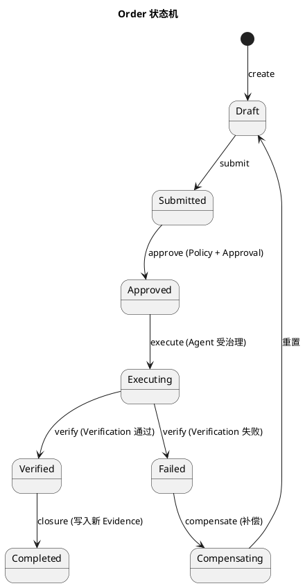

**与 spec.md 映射**：§5.1（第一性原理链路）、§5.10 EV2、§5.4（事件模型）

**Non-Functional 约束**：核心交易 P95≤500ms；状态机单调推进；Event Replay 可重建状态

#### D-GATE-02：Transaction Orchestrator 与 Saga/Workflow 边界（🔴 Hardening）

> **修订背景**：design.md v1.0 写"Orchestrator 编排 11 阶段链路"，但不得把 11 阶段做成一个巨型同步事务。未来必然跨外部系统（Payment Gateway / Bank / Tax System / Supplier / Warehouse / Manufacturing / Approval / External ERP），这些不是一个数据库事务。

**编排与事务的边界（锁定）**：

```text
Local ACID Transaction（单聚合内，PostgreSQL 单库事务）
        +
Domain Event（跨聚合/跨边界，Outbox+EventBus 异步）
        +
Workflow / Saga（跨服务/跨外部系统，Orchestrator 编排）
        +
Compensation（补偿动作，每步骤明确）
        +
Evidence（每步留证，append-only）
```

**关键原则**：Orchestrator 是**编排器**，不是**分布式事务管理器**。11 阶段链路不是单一 ACID 事务，而是"Local ACID + Domain Event + Saga + Compensation + Evidence"的组合。

**阶段分类矩阵（11 阶段归属）**：

| 阶段 | 阶段名 | 执行模式 | 事务边界 | Evidence |
|---|---|---|---|---|
| 1 | Business（加载主数据/权限上下文） | 同步读 | 无事务（读） | 不产生 |
| 2 | Event（接收业务事件） | 同步 | 无事务（入参） | 不产生 |
| 3 | Transaction（聚合根命令） | **Local ACID** | **PostgreSQL 单库事务** | 同事务写入 |
| 4 | Data（持久化） | **Local ACID** | 同上 | 同事务写入 |
| 5 | Evidence（append-only） | **Local ACID** | 同上 | 同事务写入 |
| 6 | Policy 匹配 | 同步读 | 无事务（读 Graph） | 不产生 |
| 7 | Decision（允许/拒绝/转审批） | 同步 | 无事务 | 可产生 Decision Evidence |
| 8 | Agent 执行（受治理） | **Saga/Workflow**（可能跨外部系统） | **跨服务编排 + 补偿** | 每步留证 |
| 9 | Execution（业务动作） | **Saga/Workflow** | 跨服务 | 每步留证 |
| 10 | Verification（独立验证） | 同步/异步 | 无事务 | 产生 Verification Evidence |
| 11 | Closure（写入新可信 Evidence） | **Local ACID** | PostgreSQL 单库事务 | 同事务写入 |

**跨外部系统编排示例（非单一事务）**：

```text
Order Created → Evidence → Event (Local ACID 闭环)
  → Contract Approval → Event (Saga 步骤 1, 跨 Approval 系统)
    → Invoice Issued → Event (Saga 步骤 2)
      → Payment Requested → External Payment Gateway (Saga 步骤 3, 跨外部)
        → Payment Verification → Evidence (Saga 步骤 4)
          → Closure (Local ACID 闭环)
```

**Saga 补偿动作（每步骤明确）**：

| Saga 步骤 | 正向动作 | 补偿动作 |
|---|---|---|
| Contract Approval | 发起审批 | 撤回审批请求 |
| Invoice Issued | 开具发票 | 作废发票（红冲） |
| Payment Requested | 请求外部支付 | 取消支付请求 / 退款 |
| Payment Verification | 验证支付结果 | 标记支付未决，转人工 |
| Closure | 写入新 Evidence | 写入补偿 Evidence（不删除原 Evidence，append-only） |

**关键约束**：
- **Local ACID 范围**：单聚合根内的原子操作（如 Order 聚合内状态变更 + Evidence 写入 + Outbox 写入，同 PostgreSQL 事务）
- **Domain Event 范围**：跨聚合/跨边界异步推进（Outbox+EventBus，最终一致 ≤3s）
- **Saga/Workflow 范围**：跨服务/跨外部系统编排（含补偿，每步留证）
- **Evidence 范围**：每个步骤（无论 Local ACID 还是 Saga）都必须产生 Evidence，补偿动作也产生补偿 Evidence（append-only，不删除）
- **禁止**：把 11 阶段做成一个跨外部系统的分布式 ACID 事务（不存在，且会拖垮系统）

**与 spec.md 映射**：§5.1.1（第一性原理链路 11 阶段）、§4.2 规则 4（Outbox+EventBus 异步投影）、§5.4.1 规则 6（Event-Native + CQRS + Evidence Ledger）

**Non-Functional 约束**：Local ACID 事务 P95≤500ms；Saga 跨服务编排端到端延迟按业务定义（秒级~分钟级）；每步骤必产生 Evidence；补偿动作必产生补偿 Evidence

### D05 Evidence Ledger（PostgreSQL append-only 表结构/版本/租户隔离 RLS）

**设计决策**：PostgreSQL append-only 表承载 Evidence Truth（System of Record）。通过数据库层（触发器或规则）强制 append-only，禁止 UPDATE/DELETE。版本号单调递增用于 Event Sourcing 并发控制。RLS 强制租户隔离。

**表结构（核心字段，对应 §6.1）**：

| 字段 | 类型 | 约束 | 说明 |
|---|---|---|---|
| evidence_id | UUID PK | NOT NULL | 全局唯一 |
| evidence_type | VARCHAR | NOT NULL | 证据类型 |
| payload | JSONB | NOT NULL | 业务事实快照 |
| source_event_id | UUID | NOT NULL | 来源事件 |
| transaction_id | UUID | NOT NULL | 关联交易 |
| tenant_id | UUID | NOT NULL, RLS | 租户隔离 |
| created_at | TIMESTAMP | NOT NULL, IMMUTABLE | 写入时间 |
| version | BIGINT | NOT NULL, MONOTONIC | 版本号 |

**append-only 强制**：通过 PostgreSQL 规则 `CREATE RULE ... INSTEAD NOTHING ON UPDATE/DELETE` 或触发器拒绝修改，并审计拒绝尝试（§4.2 规则 2、§5.4.1 规则 2）

**审计表（append-only）**：`evidence_audit` 记录所有 evidence 表访问（读/写尝试），含主体/时间/操作类型（§5.4.1 规则 3）

**与 spec.md 映射**：§4.2 规则 2（不可篡改）、§5.4.1 规则 2/3（append-only + 审计）、§6.1（数据约束）、§5.7.1 规则 2（RLS）

**Non-Functional 约束**：append-only 数据库层强制；写入吞吐 ≥5000 EPS；RLS 行级过滤 ≤5ms

#### D-GATE-01：Evidence Ledger 不可篡改安全边界（🔴 Hardening）

> **修订背景**：design.md v1.0 写"PostgreSQL append-only + 触发器强制 + RLS + 审计表"，但"触发器强制"不能作为最高等级安全边界。必须建立纵深防御的多层安全边界。

**Evidence Ledger Security Boundary（锁定，纵深防御分层）**：

| 防线层 | 机制 | 强制方式 | 绕过风险 |
|---|---|---|---|
| **第一层（最高权限边界）** | **DB 权限模型：Runtime DB Role 无 UPDATE/DELETE 权限** | `GRANT INSERT, SELECT ON evidence.* TO runtime_role; REVOKE UPDATE, DELETE ON evidence.* FROM runtime_role;` | 仅 DB Owner 可绕过 |
| **第二层** | **DB 触发器/RULE 拒绝 UPDATE/DELETE** | `CREATE RULE evidence_no_update AS ON UPDATE TO evidence DO INSTEAD NOTHING;` + 同 ON DELETE | 触发器可被 superuser 禁用 |
| **第三层** | **应用层校验** | Repository 层禁止 emit UPDATE/DELETE 语句；代码评审拒绝 | 应用层 bug 可绕过 |
| **第四层（纵深）** | **审计 + legal hold + 定期 hash 链校验** | 所有访问写审计；legal hold 阻止 retention 删除；定期校验 evidence_hash 链完整性 | DB Owner 绕过时由审计 + hash 校验发现 |

**Runtime Role 与 Migration/Admin Role 严格分离（锁定）**：

```text
DB Owner / Migration Role（DDL + DML 全权限，仅迁移窗口期可用）
        ≠
Application Runtime Role（仅 INSERT + SELECT on evidence.*，永久权限）
```

- **Runtime Role**：应用运行时连接池使用的角色，仅 `INSERT` + `SELECT` on `evidence.*` / `outbox.*` / `business.*`，**无 UPDATE/DELETE 权限**
- **Migration Role**：Flyway/Liquibase 迁移使用的角色，拥有 DDL + DML 全权限，**仅在迁移窗口期激活**，迁移完成后禁用
- **DB Owner**：数据库超级权限，**不用于应用运行时**，仅灾备/恢复/审计场景使用，所有操作写审计

**append-only 权限模型（PostgreSQL GRANT/REVOKE 强制）**：

```sql
-- Runtime Role：仅 INSERT + SELECT
GRANT INSERT, SELECT ON evidence.evidence_ledger TO ebcx_runtime_role;
GRANT INSERT, SELECT ON evidence.evidence_audit TO ebcx_runtime_role;
REVOKE UPDATE, DELETE, TRUNCATE ON evidence.evidence_ledger FROM ebcx_runtime_role;
REVOKE UPDATE, DELETE, TRUNCATE ON evidence.evidence_audit FROM ebcx_runtime_role;

-- Migration Role：DDL + DML（仅迁移窗口期）
GRANT ALL ON SCHEMA evidence TO ebcx_migration_role;  -- 迁移期

-- 审计 Role：仅 INSERT（审计写入）+ SELECT（审计查询）
GRANT INSERT, SELECT ON audit.* TO ebcx_audit_role;
REVOKE UPDATE, DELETE, TRUNCATE ON audit.* FROM ebcx_audit_role;
```

**Evidence 修改语义（不使用 UPDATE，使用新版本/新 Evidence）**：
- **修改 = 新版本**：Evidence 修正通过写入新版本 Evidence 实现，版本链通过 `correlation_id` + `causation_id` 串联，原 Evidence 保留不动（append-only）
- **删除 = tombstone / retention policy / legal hold**：
  - **tombstone**：写入 tombstone Evidence 标记逻辑删除，原 Evidence 物理保留
  - **retention policy**：合规保留期满后由独立 retention job 物理清理（需审计 + legal hold 校验通过）
  - **legal hold**：诉讼/调查期间锁定 Evidence，retention job 不得清理

**Evidence 必含字段（D-GATE-01 扩展，对应 §6.1 + Hardening）**：

| 字段 | 类型 | 约束 | 说明 |
|---|---|---|---|
| evidence_id | UUID PK | NOT NULL | 全局唯一 |
| evidence_type | VARCHAR | NOT NULL | 证据类型 |
| payload | JSONB | NOT NULL | 业务事实快照 |
| evidence_hash | BYTEA | NOT NULL | **证据哈希（payload + source_event_id + transaction_id 的 SHA-256）**，用于 hash 链校验 |
| source_event_id | UUID | NOT NULL | 来源事件 |
| transaction_id | UUID | NOT NULL | 关联交易 |
| tenant_id | UUID | NOT NULL, RLS | 租户隔离 |
| created_at | TIMESTAMP | NOT NULL, IMMUTABLE | 写入时间 |
| created_by | UUID | NOT NULL | **写入主体（用户/Agent/系统）** |
| version | BIGINT | NOT NULL, MONOTONIC | 版本号 |
| provenance | JSONB | NOT NULL | **Provenance 引用（source_event/transaction/operator/policy/verification）** |
| correlation_id | UUID | NULL | **关联 ID（同一业务流程的 Evidence 串联）** |
| causation_id | UUID | NULL | **因果 ID（本 Evidence 由哪个 Event/Evidence 触发）** |
| legal_hold | BOOLEAN | NOT NULL DEFAULT FALSE | **legal hold 标记，TRUE 时 retention 不得清理** |

**hash 链校验（纵深防御第四层）**：定期 job 校验 `evidence_hash = SHA256(payload || source_event_id || transaction_id)`，发现 hash 不匹配则告警 + 审计 + 阻断依赖该 Evidence 的决策。

**明确声明**：数据库超级权限（DB Owner）仍可绕过第一层权限边界，因此需配合审计 + legal hold + 定期 hash 链校验作为纵深防御。第一层权限边界是**最高等级防线**，但不是唯一防线。

**与 spec.md 映射**：§4.2 规则 2（不可篡改）、§5.4.1 规则 2/3（append-only + 审计）、§6.1（数据约束）、§5.7.1 规则 2/4（RLS + 审计不可篡改）

**Non-Functional 约束**：Runtime Role 无 UPDATE/DELETE；Migration Role 仅迁移窗口期；hash 链校验每日一次；legal hold 阻止 retention；写入吞吐 ≥5000 EPS

### D06 Evidence Graph Projection（Neo4j 节点/边 schema/投影规则/重建策略）

**设计决策**：Neo4j 承载 Graph Query Truth，24 类节点 + 8 类边。通过 Outbox+EventBus 异步投影，最终一致 ≤3s。Neo4j 失败不拖垮 Transaction Core（§4.2 规则 4）。可从 PostgreSQL Evidence Ledger 全量 Event Replay 重建。

**节点 schema（24 类，§5.5.1 规则 1）**：
Enterprise / Organization / Person / Product / Material / Supplier / Customer / Order / Contract / Invoice / Payment / Production / Quality / Asset / Project / Patent / R&D / Data / Evidence / Event / Policy / Decision / **Approval** / Agent

**节点属性（§6.2）**：nodeId / nodeType / version / sourceEvidenceId / tenantId / createdAt / properties

**边 schema（8 类，§5.5.1 规则 3）**：
- 归属关系：Order→Contract→Invoice→Payment、Organization→Person、Enterprise→Organization
- 交易关系：Customer→Order、Supplier→Order、Order→Production
- 产出关系：Production→Quality、Production→Product、R&D→Patent→Product
- 资产关系：Asset→Production、Asset→Organization
- 证据关系：Event→Evidence、Evidence→Decision、Decision→Agent
- 治理关系：Policy→Decision、Policy→Agent、Policy→Approval、Approval→Decision、Approval→Agent
- 审批关系：Decision→Approval→Execution、Approval→Evidence
- 数据关系：Data→Evidence、Data→Production

**边属性（§6.3）**：edgeId / edgeType / fromNodeId / toNodeId / direction / sourceEvidenceId / createdAt / properties

**投影规则**：Outbox Event → 转换为 Cypher MERGE 语句 → 异步执行；幂等（基于 event_id 去重）；失败重投指数退避

**重建策略**：Neo4j 全量重建 = 清空 → 从 PostgreSQL Evidence Ledger 全量 Event Replay → 重新投影；重建期间查询降级至 PostgreSQL 直查 + 告警

**Approval 一等公民**：审批实体作为 Graph 节点，承载 Decision→Approval→Execution 链路，可查询/可追溯/可治理（§5.5.1 规则 1）

**与 spec.md 映射**：§5.5（24 类 + 边 + Approval）、§4.2 规则 4（异步投影）、§6.2/6.3（数据约束）

**Non-Functional 约束**：投影收敛 ≤3s；单跳/两跳查询 P95≤200ms；三跳+ P95≤1s；重建 RTO ≤30min（全量）

#### D-GATE-06：24 Entity + 8 Edge Canonical Graph Contract（🔴 Hardening）

> **修订背景**：design.md v1.0"24 类节点 + 8 类边"方向正确，但进入 Tasks 前必须锁死 Contract，否则 Tasks Agent 无法落地 Graph Projection 规则。

**Node Contract（锁定，对应 §6.2 + Hardening）**：

| 字段 | 类型 | 约束 | 说明 |
|---|---|---|---|
| nodeId | UUID | NOT NULL, UNIQUE | 节点全局唯一 ID |
| nodeType | VARCHAR | NOT NULL, ENUM(24 类) | 节点类型，必须为 24 类之一 |
| entityId | UUID | NOT NULL | **对应业务实体 ID（与 nodeId 1:1）** |
| tenantId | UUID | NOT NULL, RLS | 租户归属 |
| version | BIGINT | NOT NULL, MONOTONIC | 节点版本号 |
| status | VARCHAR | NOT NULL | **节点状态（如 Order.status / Contract.status）** |
| createdAt | TIMESTAMP | NOT NULL | 创建时间 |
| updatedAt | TIMESTAMP | NOT NULL | **最近更新时间（投影更新）** |
| source | VARCHAR | NOT NULL | **来源（domain_event / migration / replay）** |
| sourceEvidenceId | UUID | NOT NULL, FK→evidence | 来源 Evidence 引用 |
| evidenceRefs | UUID[] | NOT NULL | **关联 Evidence 引用列表（含历史版本）** |
| properties | JSONB | NULL | 节点业务属性 |

**Edge Contract（锁定，对应 §6.3 + Hardening）**：

| 字段 | 类型 | 约束 | 说明 |
|---|---|---|---|
| edgeId | UUID | NOT NULL, UNIQUE | 边全局唯一 ID |
| edgeType | VARCHAR | NOT NULL, ENUM(8 类) | 边类型，必须为 8 类之一 |
| fromEntity | UUID | NOT NULL, FK→node | 起始节点 ID |
| toEntity | UUID | NOT NULL, FK→node | 终止节点 ID |
| tenantId | UUID | NOT NULL, RLS | 租户归属 |
| validity | VARCHAR | NOT NULL | **有效性状态（active / superseded / retracted）** |
| version | BIGINT | NOT NULL, MONOTONIC | 边版本号 |
| sourceEvent | UUID | NOT NULL, FK→outbox_event | **来源 Domain Event（驱动边创建）** |
| sourceEvidenceId | UUID | NOT NULL, FK→evidence | 来源 Evidence 引用 |
| createdAt | TIMESTAMP | NOT NULL | 创建时间 |
| properties | JSONB | NULL | 边业务属性 |

**关键原则（锁定）：边必须由 Domain Event 驱动创建，不得由 Graph AI/heuristic 推断**：

```text
正确路径：Domain Mutation → Domain Event → Outbox → Projection Rule → Graph Edge
禁止路径：Graph AI / heuristic → 猜关系 → 写边
```

**原则依据**：这与 Evidence-First 一致。Graph 是 Projection，关系的权威来源是 Domain Event，不是 Graph 自己推断。Graph AI/heuristic 仅可用于**查询时推理**（如路径推荐、子图扩展），不得用于**写入时创建边**。任何边必须有 `sourceEvent` 引用，可追溯到 Outbox Event，可追溯到 Domain Mutation，可追溯到 Evidence。

**24 Node Type 枚举（锁定，§5.5.1 规则 1）**：

```text
Enterprise / Organization / Person / Product / Material / Supplier / Customer /
Order / Contract / Invoice / Payment / Production / Quality / Asset / Project /
Patent / R&D / Data / Evidence / Event / Policy / Decision / Approval / Agent
```

**8 Edge Type 枚举（锁定，§5.5.1 规则 3）**：

| edgeType | 语义 | 示例 |
|---|---|---|
| BELONGS_TO | 归属关系 | Order→Contract→Invoice→Payment、Organization→Person、Enterprise→Organization |
| TRADES_WITH | 交易关系 | Customer→Order、Supplier→Order、Order→Production |
| PRODUCES | 产出关系 | Production→Quality、Production→Product、R&D→Patent→Product |
| USES_ASSET | 资产关系 | Asset→Production、Asset→Organization |
| EVIDENCED_BY | 证据关系 | Event→Evidence、Evidence→Decision、Decision→Agent |
| GOVERNED_BY | 治理关系 | Policy→Decision、Policy→Agent、Policy→Approval、Approval→Decision、Approval→Agent |
| APPROVED_BY | 审批关系 | Decision→Approval→Execution、Approval→Evidence |
| DERIVED_FROM | 数据关系 | Data→Evidence、Data→Production |

**Projection Rule 示例（Domain Event → Cypher MERGE）**：

```text
Domain Event: order.created.v1
  → Projection Rule:
    MERGE (o:Order {nodeId: $orderId, entityId: $orderId, tenantId: $tenantId})
    SET o.status = 'DRAFT', o.version = 1, o.source = 'domain_event',
        o.sourceEvidenceId = $evidenceId, o.createdAt = $occurredAt
    MERGE (c:Customer {nodeId: $customerId})-[r:TRADES_WITH]->(o)
    SET r.edgeType = 'TRADES_WITH', r.sourceEvent = $eventId,
        r.sourceEvidenceId = $evidenceId, r.validity = 'active'
```

**Contract 校验**：编译期/CI 校验 Projection Rule 仅由 Domain Event 驱动；禁止 Graph 内 AI/heuristic 写边；每边必有 sourceEvent + sourceEvidenceId。

**与 spec.md 映射**：§5.5（24 类节点 + 8 类边 + Approval 一等公民）、§6.2/6.3（数据约束）、§5.4.1 规则 6（Event-Native + CQRS）

**Non-Functional 约束**：Node/Edge Contract 锁死；边必由 Domain Event 驱动；禁止 Graph AI 写边；每边必有 sourceEvent + sourceEvidenceId

### D07 Outbox + EventBus（Outbox 表结构/EventBus 选型/投递语义/至少一次/幂等）

**设计决策**：Outbox 表与业务数据 + Evidence 同事务原子写入（PostgreSQL 单库事务）。EventBus 异步消费 Outbox 投影至 Neo4j。投递语义：至少一次 + 幂等消费者（基于 event_id 去重）。

**Outbox 表结构**：

| 字段 | 类型 | 约束 | 说明 |
|---|---|---|---|
| event_id | UUID PK | NOT NULL | 全局唯一，幂等去重键 |
| event_type | VARCHAR | NOT NULL | 事件类型 |
| event_version | INT | NOT NULL | schema 版本 |
| aggregate_id | UUID | NOT NULL | 聚合根 ID |
| aggregate_version | BIGINT | NOT NULL | 聚合版本 |
| tenant_id | UUID | NOT NULL | 租户 |
| trace_id | UUID | NOT NULL | 链路追踪 |
| payload | JSONB | NOT NULL | 事件负载 |
| evidence_ref | UUID | NOT NULL | Evidence 引用 |
| occurred_at | TIMESTAMP | NOT NULL | 发生时间 |
| published_at | TIMESTAMP | NULL | 已投递时间（NULL=未投递） |

**EventBus 选型**：华为云 DMS（Kafka 兼容）作为 EventBus；保持可迁移性不产生不可逆厂商锁定（§4.5 规则 4、§5.12 红线六）

**投递流程**：

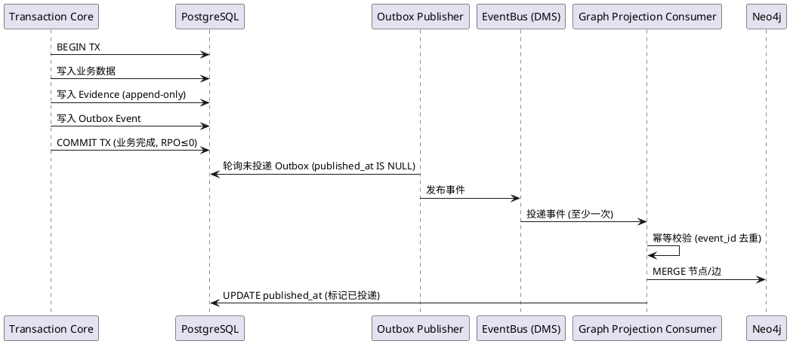

**与 spec.md 映射**：§4.2 规则 4（Outbox + EventBus 异步投影）、§5.4.2（交互流程）

**Non-Functional 约束**：Outbox 与业务数据同事务原子；至少一次投递；幂等消费者；收敛 ≤3s

### D08 CQRS（Command/Query 分离/Read Model 投影/物化视图策略）

**设计决策**：Command 侧（Mutation）走 Transaction Core + Evidence 闭环；Query 侧（Read）直接查询 PostgreSQL Read Model + Neo4j Graph，不强制走完整链路（§5.1.1 规则 1 Read/Query 分流）。Read Model 由 Projection 分发，不强制全量事件重放（§5.4.1 规则 6）。

**Command 侧**：CommandBus → Aggregate → Transaction → Event → Evidence → Outbox → Projection

**Query 侧**：
- 简单查询：PostgreSQL 直查（受 RLS 约束）
- 图查询：Neo4j Graph（单跳/两跳 ≤200ms）
- 聚合查询：PostgreSQL 物化视图或 Read Model 表（由 Projection 异步更新）
- 溯源查询：Evidence Ledger + Graph + Artifact 三层联合（§5.13）

**物化视图策略**：高频聚合查询（如 Dashboard）使用 PostgreSQL 物化视图，由 Outbox Event 触发增量刷新；低频查询直接查 Evidence Ledger

**与 spec.md 映射**：§5.1.1 规则 1（Read/Query 分流）、§5.4.1 规则 6（Event-Native + CQRS + Evidence Ledger）

**Non-Functional 约束**：Query 路径不触发 Agent 环节；物化视图刷新 ≤3s；查询 P95 满足 §4.1 规则 2

### D09 Data Lineage（Evidence Provenance & Data Lineage 实现）

**设计决策**：为重要数据建立完整 Data Lineage 链路（§5.13.1 规则 1）：Data→Source→Event→Transaction→Evidence→Transformation→Decision→Agent→Execution→Verification。任意 Evidence 可追溯到 Source Event / Transaction / Operator / Policy / Verification 形成完整溯源子图。

**Provenance 记录**：每条 Evidence 含 sourceEventId / transactionId / operatorId / policyId / verificationId 引用；查询时联合 Evidence Ledger（事实）+ Graph（关系）+ Artifact（原件）三层返回完整子图

**溯源子图查询接口**：`GET /api/v1/rel/evidence/lineage/{businessObjectId}` 返回完整引用链（§5.13.2）

**断链处理**：Data Lineage 缺失环节时标记"Lineage 不完整"，告警并阻断作为决策依据（§5.13.3 异常 1）

**与 spec.md 映射**：§5.13（Data Lineage 全模块）、§5.4（事件模型）

**Non-Functional 约束**：溯源子图查询 P95≤1s；Provenance 引用完整性校验；断链阻断决策

### D10 Policy Engine（规则模型/评估流程/与 Agent/Approval 交互）

**设计决策**：Policy Engine 基于 Evidence Graph 进行规则匹配与裁决，位于 Evidence 与 Decision 之间，是 Agent 执行前置约束（§5.5 治理关系）。规则模型含 policyId/policyType/scope/condition/action/version/effectiveFrom/effectiveTo（§6.4）。

**规则模型**：
- **policyType**：权限 / 审批 / 计算 / 禁止
- **scope**：节点类型 / 边类型 / 租户 / 组织
- **condition**：可执行表达式或规则集（基于 Evidence Graph 子图匹配）
- **action**：允许 / 拒绝 / 转人工审批

**评估流程**：

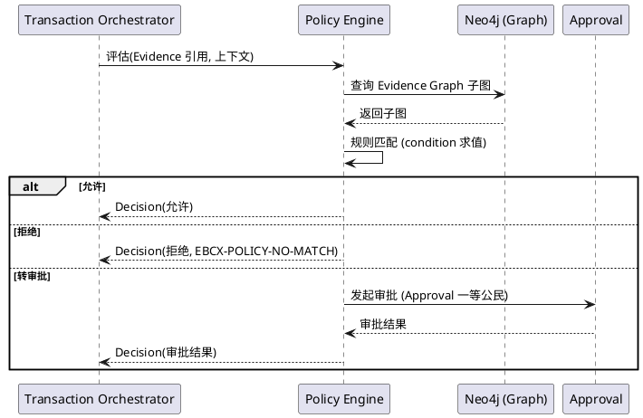

**与 Agent/Approval 交互**：Policy 裁决为"转审批"时发起 Approval 流转；Approval 作为 Evidence Graph 一等公民节点写入；Agent 执行前二次校验 Policy（§5.6.1 规则 1）

**与 spec.md 映射**：§5.5 治理关系、§5.6 Agent 治理、§6.4 Policy 数据约束

**Non-Functional 约束**：Policy 评估 ≤50ms；规则版本单调；生效区间不重叠

### D11 Agent Runtime（Governed Agent Runtime/三重治理/Provenance 注入）

**设计决策**：Governed Agent Runtime 依次通过权限校验 / Policy 匹配 / 审批流转三重治理后方可执行（§5.6.1 规则 1）。Agent 可读 Current State + Evidence + Policy + Master Data，但影响决策的关键事实必须可追溯 Evidence（§5.6.1 规则 2 Agent Evidence Provenance）。执行后产生 Verification 结果，通过后写入新 Evidence（§5.6.1 规则 4）。

**三重治理流程**：

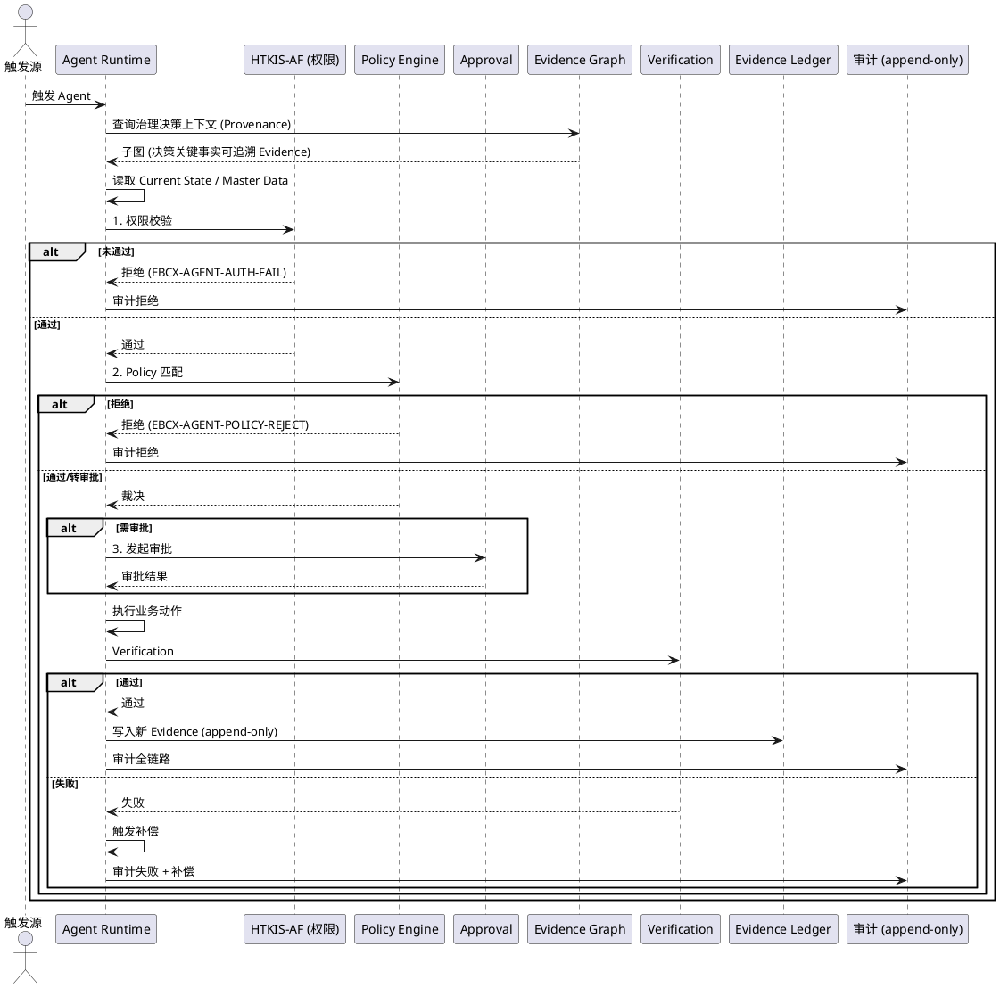

**Provenance 注入**：Agent 决策上下文查询时，Evidence Graph 返回子图同时附带 Provenance 引用；Agent 决策关键事实必须可追溯 Evidence，否则拒绝（§5.6.1 规则 7）

**执行记录（§6.5）**：agentExecutionId / agentId / inputEvidenceIds / policyDecisions / executionAction / verificationResult / outputEvidenceId / auditTrail / createdAt

**与 spec.md 映射**：§5.6（Governed Agent 全模块）、§6.5（数据约束）

**Non-Functional 约束**：同步路径 ≤2s 或异步返回任务 ID（§4.1 规则 4）；三重治理顺序不可变；禁止绕过治理修改核心账务（§5.12 红线五）

#### D-GATE-07：Agent Execution Authorization 模型（🔴 Hardening）

> **修订背景**：design.md v1.0"三重治理顺序不可变 + Provenance 注入 + Verification 闭环"方向正确，但必须落到执行权限。Agent 不能自己授予自己执行权限。

**Agent 执行链（锁定，不可变）**：

```text
Agent → Reason → Policy → Approval → Authorize → Execute → Verify → Evidence
```

**关键原则（锁定）：Agent 不能自己授予自己执行权限。**

**正确模式**：
```text
Agent → Policy → Approval → Execution → Independent Verification → Evidence
```

**禁止模式**：
```text
Agent → 修改订单 → Agent 自己判断成功（自证，禁止）
```

**Authorization 模型必含要素**：

| 要素 | 说明 | 强制方式 |
|---|---|---|
| Agent Identity | Agent 唯一标识（agentId + version） | 注册制，未注册 Agent 禁止执行 |
| Execution Scope | Agent 可执行的操作范围（如 create_order / modify_inventory / approve_payment） | Policy 显式授权，未授权能力禁止执行（§5.6.1 规则 5） |
| Tenant Scope | Agent 租户范围（agentId + tenantId） | RLS 强制，禁止跨租户执行 |
| Policy Decision | Policy Engine 裁决结果（allow / deny / require_approval） | Policy Engine 独立裁决，Agent 不得自决 |
| Approval Requirement | 是否需要审批 + 审批人/审批链 | Approval 一等公民节点，承载审批流转事实 |
| Execution Token | 授权执行令牌（短期有效，绑定 agentId + scope + tenant + expiry） | Authorize 签发，Execute 必须携带，过期作废 |
| Idempotency Key | 幂等键（agentExecutionId + idempotencyKey） | 重复执行返回同一结果，避免副作用 |
| Verification | 独立验证（非 Agent 自证） | 独立 Verifier 组件，与 Agent 解耦 |
| Evidence | 执行结果 Evidence（含 input/policy/approval/action/verification） | append-only 写入，D-GATE-01 安全边界保护 |

**Authorization 执行流程（PlantUML）**：

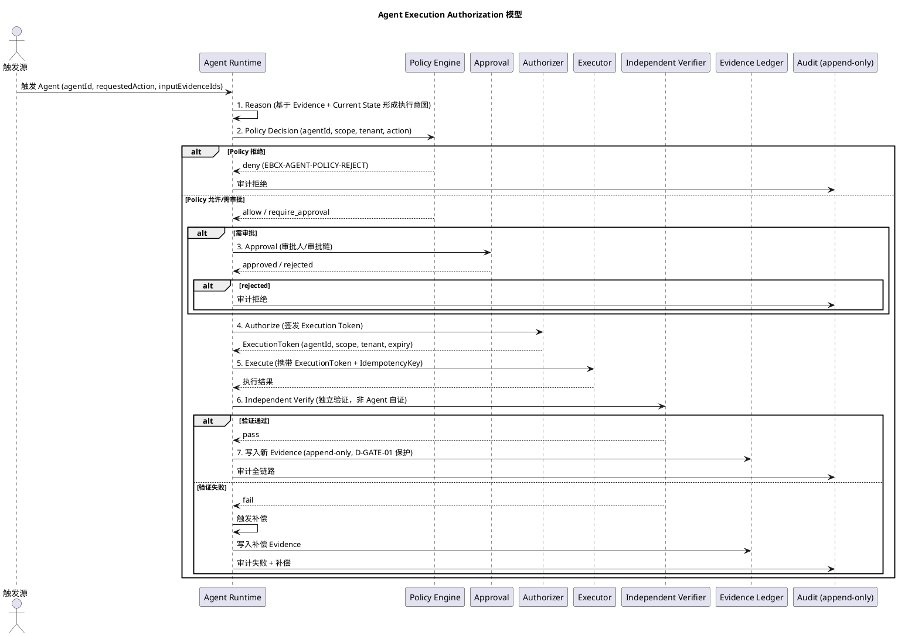

**禁止项（锁定）**：
- ❌ Agent 自己授予自己 Execution Token（必须由 Authorizer 签发）
- ❌ Agent 自己验证自己（必须由 Independent Verifier 验证）
- ❌ Agent 绕过 Policy 直接 Execute（§5.12 红线五）
- ❌ Agent 跨租户执行（RLS 强制）
- ❌ Agent 执行未授权能力（§5.6.1 规则 5）
- ❌ Agent 自证成功后写入 Evidence（必须 Independent Verification 通过）

**战略定位（EBC-X 核心护城河，锁定）**：

> **Governed Agentic ERP** — AI 可以建议、申请、执行，但**企业制度决定它能不能执行**，**Evidence 决定它做了什么**。不是"AI 帮你点按钮"。

这与 spec.md §5.6（Governed Agent）+ §5.12 红线四/五（禁止为 AI 而 AI / 禁止 Agent 绕过治理）一致，是 EBC-X 与传统 ERP + 简单 AI 助手的根本差异。

**与 spec.md 映射**：§5.6（Governed Agent 全模块）、§5.6.1 规则 1/4/5（治理前置 + Verification 闭环 + 能力边界）、§5.12 红线四/五、§6.5（Agent 执行记录）

**Non-Functional 约束**：Agent 不能自授执行权限；Independent Verifier 与 Agent 解耦；Execution Token 短期有效；幂等键去重；同步路径 ≤2s 或异步返回任务 ID

### D12 Digital Twin Adapter（与 SeaFusion-X 归并/验证层）

**设计决策**：归并 SeaFusion-X 数字孪生能力，新增验证层对接 Evidence Graph。数字孪生仿真结果须经 Verification 后方可写入新 Evidence（§5.6.1 规则 4 闭环）。Adapter 层封装 SeaFusion-X 接口，注入 Evidence Provenance。

**关键组件**：
- `DigitalTwinAdapter`：封装 SeaFusion-X 仿真接口
- `VerificationLayer`：仿真结果验证（与 Evidence Graph 对比）
- `ProvenanceInjector`：仿真输入注入 Evidence Provenance

**交互流程**：

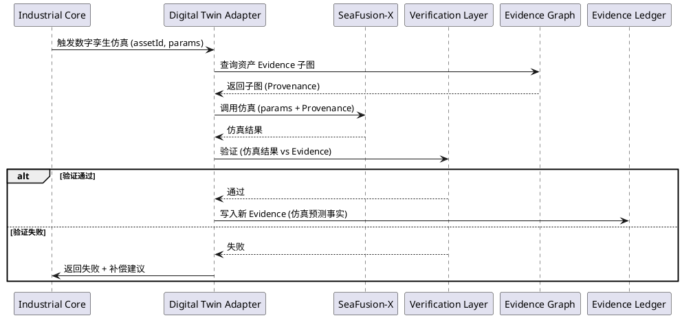

**与 spec.md 映射**：§5.2 规则 3（SeaFusion-X 归并）、§5.6.1 规则 4（Verification 闭环）

**Non-Functional 约束**：仿真异步执行；结果须经 Verification；Provenance 注入强制

### D13 Security Architecture（HTKIS-AF 归并/认证/授权/审计/RLS/密钥管理）

**设计决策**：归并 HTKIS-AF 作为唯一安全基座，统一供给认证/鉴权/加密/审计能力（§5.7.1 规则 1）。禁止各模块自建安全能力（§5.12 红线对应）。REST + GraphQL 复用同一 OAuth2+JWT 认证体系（§5.7.1 规则 3）。PostgreSQL RLS 强制租户/组织维度隔离。审计写入 append-only 存储。

**关键组件**：
- `AuthGateway`：OAuth2 + JWT 签发/校验（HTKIS-AF 供给）
- `RLSPolicy`：PostgreSQL 行级安全策略（tenant_id + org_id 维度）
- `AuditSink`：append-only 审计日志（关键操作必审计，§4.3 规则 4）
- `KMS`：密钥管理服务（字段级加密密钥轮换）
- `TLSGateway`：TLS 1.2+ 强制（§4.3 规则 3）

**认证/授权流程**：

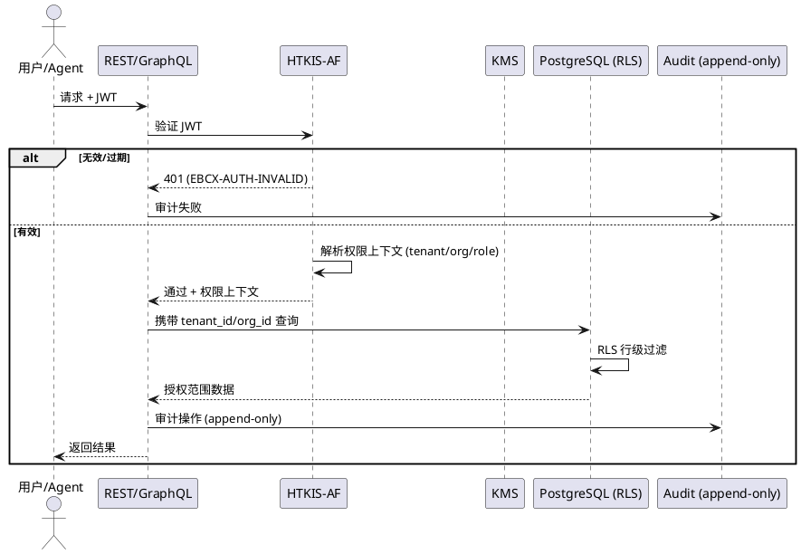

**密钥管理**：字段级加密密钥由 KMS 统一管理，定期轮换；敏感数据（凭证/PII）传输 + 存储双重加密（§4.3 规则 3）

**审计不可篡改**：审计日志写入 append-only 存储（PostgreSQL append-only 表或 OBS），禁止 UPDATE/DELETE（§5.7.1 规则 4）

**与 spec.md 映射**：§4.3（安全性）、§5.7（权限安全全模块）、§5.12 红线五

**Non-Functional 约束**：JWT 校验 ≤10ms；RLS 行级过滤 ≤5ms；审计写入不阻塞主事务（异步或同事务 append-only）

### D14 Multi-Tenant Architecture（租户隔离模型/RLS 策略/Pack 路由）

**设计决策**：共享 schema + 行级隔离（RLS）模型，每表含 tenant_id 列，RLS 策略强制 `current_setting('app.tenant_id') = tenant_id`。Country Pack 路由通过请求头 `X-Country-Pack` 路由至对应扩展表。核心表不分叉（§5.8.1 规则 3）。

**租户隔离模型**：

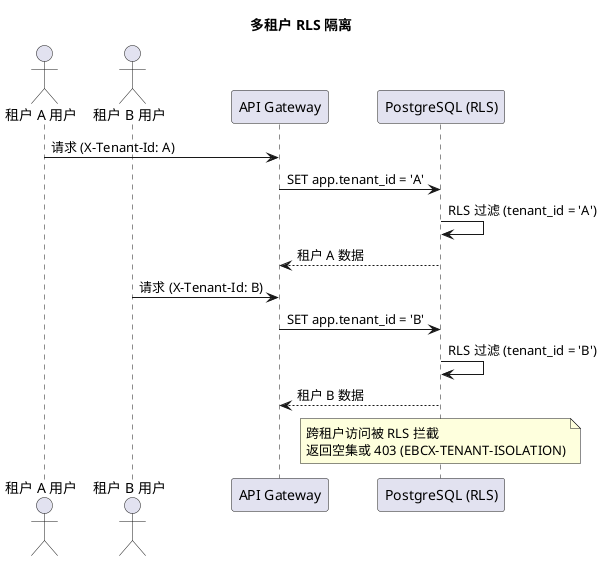

**Pack 路由**：请求头 `X-Tenant-Id` + `X-Country-Pack` → 路由至 Global Core 核心表 + `{table}_{country}_ext` 扩展表；本地化字段以扩展表附加，核心表统一

**核心表不分叉校验**：编译期/迁移期校验核心表结构跨 Country Pack 一致；本地化字段必须附加至扩展表

**与 spec.md 映射**：§5.7.1 规则 5（租户隔离）、§5.8（Global Core + Country Pack）

**Non-Functional 约束**：RLS 行级过滤 ≤5ms；跨租户访问被拦截并审计；核心表不分叉编译期校验

### D15 Data Architecture（PostgreSQL schema/Neo4j schema/OBS 命名/迁移）

**设计决策**：PostgreSQL 承载业务数据 + Evidence Ledger + Outbox + 审计（append-only）；Neo4j 承载 24 类节点 + 8 类边；OBS 承载 Artifact（不可变原件）。统一命名规范 + 迁移策略。

**PostgreSQL schema 划分**：
- `business` schema：业务表（Order/Contract/Invoice/Payment/Production/...）
- `evidence` schema：append-only evidence 表 + evidence_audit 表
- `outbox` schema：outbox_events 表
- `audit` schema：append-only 审计日志表
- `master_data` schema：主数据表（Enterprise/Organization/Person/Product/Material/...）
- `policy` schema：policy_rules 表
- `tenant` schema：租户/组织/Pack 路由配置

**Neo4j schema**：节点标签 = 24 类实体；边类型 = 8 类关系；索引 on nodeId/tenantId/sourceEvidenceId；约束 on nodeId 唯一

**OBS 命名规范**：`{tenantId}/{evidenceId}/{artifactType}/{version}/{filename}`；不可变（OBS WORM 或版本化 + 删除保护）

**迁移策略**：
- EITP 存量交易数据迁移至 `business` schema，新交易走 Evidence 闭环，存量数据只读兼容
- 迁移期间双写校验（旧表 + 新表），数据一致后切换
- 迁移脚本版本化管理（Flyway/Liquibase），禁止手工变更生产 schema（§5.9.1 规则 3 IaC）

**与 spec.md 映射**：§5.4（数据库与事件模型）、§5.5（Evidence Graph）、§4.5 规则 2（资产迁移）、§5.9.1 规则 3（IaC）

**Non-Functional 约束**：schema 迁移版本化；append-only 数据库层强制；OBS WORM 或等价不可变保护

### D16 API / GraphQL（REST 第一入口 + GraphQL 适配层契约）

**设计决策**：REST API `/api/v1/rel/*` 为第一入口，GraphQL `/api/v1/graphql` 为第二适配层复用同一认证（§5.3.1 规则 4）。接口按模块划分，版本化路径管理兼容（§4.5 规则 1）。

**REST 接口契约**：
- Command（Mutation）：`POST /api/v1/rel/{module}/commands/{action}` → 触发第一性原理链路
- Query（Read）：`GET /api/v1/rel/{module}/queries/{action}` 或 `POST`（复杂查询）→ 直接查询，受 RLS 约束
- 统一 Header：`Authorization: Bearer <JWT>` / `X-Tenant-Id` / `X-Country-Pack` / `X-Trace-Id`
- 统一错误码：`EBCX-{MODULE}-{REASON}`（如 EBCX-EVIDENCE-WRITE-FAIL）

**GraphQL 适配层契约**：
- 复用 REST 认证体系（§5.7.1 规则 3）
- Query 类型映射 REST Query 接口；Mutation 类型映射 REST Command 接口
- 嵌套查询深度限制 ≤3（防止过度嵌套性能问题）
- 图查询优先走 `/api/v1/rel/graph/queries/*` REST 接口

**接口稳定性等级**：稳定（Command/Query/Evidence/Policy/Graph/GraphQL）/ 实验（Agent）/ 废弃（旧版本）

**与 spec.md 映射**：§5.3.1 规则 4（REST 第一入口）、§4.5 规则 1（版本兼容）、§5.7.1 规则 3（统一认证）

**Non-Functional 约束**：核心交易接口 P95≤500ms；GraphQL 嵌套深度 ≤3；版本兼容保留 ≥2 个 EV 周期

### D17 Event Contract（事件命名/schema/版本化/向后兼容）

**设计决策**：事件命名 `{module}.{aggregate}.{action}.v{n}`，schema 采用 semver 版本化，向后兼容策略：新增字段可选；删除/重命名需新增版本。Outbox 事件与业务事件 1:1，含统一字段（event_id/tenant_id/trace_id/...）。

**事件契约清单**：见 §2.2.2 表格

**统一 schema 字段**：`event_id` / `event_type` / `event_version` / `tenant_id` / `aggregate_id` / `aggregate_version` / `trace_id` / `span_id` / `occurred_at` / `payload` / `evidence_ref` / `source_event_ref`

**向后兼容策略**：
- 新增可选字段：兼容，无需新版本
- 删除/重命名字段：破坏性，需新增版本号，旧版本保留 ≥2 个 EV 周期
- payload schema 注册至 Schema Registry（华为云 DMS Schema Registry 或等价），消费者按版本订阅

**与 spec.md 映射**：§5.4（事件模型）、§4.5 规则 1（版本兼容）

**Non-Functional 约束**：事件 schema 版本化；向后兼容策略强制；Schema Registry 校验

### D18 Consistency Model（事务边界/Outbox 原子性/Graph 最终一致/Saga）

**设计决策**：PostgreSQL 单库强一致事务，业务数据 + Evidence + Outbox 同事务原子提交（RPO≤0）。Neo4j 通过 Outbox+EventBus 异步投影最终一致 ≤3s。跨聚合长事务采用 Orchestrator 编排 Saga + 补偿动作。

**一致性矩阵**：

| 操作类型 | 一致性级别 | 事务边界 | 收敛窗口 |
|---|---|---|---|
| 核心交易（Mutation） | 强一致（线性化） | PostgreSQL 单库事务 | 即时（提交即完成） |
| Graph 投影 | 最终一致 | Outbox+EventBus 异步 | ≤3s |
| 跨聚合长事务 | Saga 最终一致 | Orchestrator 编排 + 补偿 | 业务定义 |
| Read/Query | 强一致（读已提交） | PostgreSQL 直查 | 即时 |
| 审计写入 | 强一致（同事务 append-only） | PostgreSQL 同事务 | 即时 |

**Outbox 原子性保证**：业务数据 + Evidence + Outbox 在同一 PostgreSQL 事务内写入，事务提交即业务完成（RPO≤0，已提交事务零丢失，§4.2 规则 3）

**Saga 编排**：跨聚合流程（如订单→合同→发票→付款）由 TransactionOrchestrator 编排，每步骤明确补偿动作；步骤失败触发补偿回滚

**与 spec.md 映射**：§4.2 规则 4（一致性 + 异步投影）、§5.4（事件模型）

**Non-Functional 约束**：核心交易 RPO≤0；Graph 投影收敛 ≤3s；Saga 补偿动作明确

### D19 Failure / Recovery Model（Neo4j 故障不拖垮 Transaction/Outbox 重投/重建投影）

**设计决策**：Neo4j 故障不影响 Transaction Core（§4.2 规则 4 架构约束）。Outbox Event 积压待 Neo4j 恢复后重投。重建投影从 PostgreSQL Evidence Ledger 全量 Event Replay。

**故障场景与恢复**：

| 故障场景 | 系统行为 | 恢复策略 | RTO |
|---|---|---|---|
| Neo4j 故障 | Transaction Core 不受影响；Outbox 积压；Graph 查询降级至 PG 直查 + 告警 | Neo4j 恢复后 Outbox 重投；或全量重建投影 | ≤30min（全量重建） |
| PostgreSQL 故障 | Transaction Core 不可用 | 同步复制 + WAL 归档切换 | ≤5min |
| EventBus 故障 | Outbox 积压待恢复 | EventBus 恢复后重投 | ≤5min |
| Outbox Publisher 故障 | Outbox 积压 | Publisher 恢复后轮询未投递 | ≤5min |
| 单 AZ 故障 | 流量切换至健康 AZ | 多 AZ 部署自动切换 | ≤30s |
| 同城灾备 | RPO≤30s | 同步复制 + 异步灾备 | ≤30s |
| 异地灾备 | RPO≤5min | 异步复制 | ≤5min |

**Outbox 重投机制**：至少一次投递 + 幂等消费者（event_id 去重）；重投间隔指数退避（1s/2s/4s/8s...），最大收敛 3s

**重建投影**：Neo4j 全量重建 = 清空 → 从 PostgreSQL Evidence Ledger 全量 Event Replay → 重新投影；重建期间查询降级 + 告警

**与 spec.md 映射**：§4.2 规则 4（Neo4j 失败不拖垮 Transaction）、§5.4.3（异常场景）

**Non-Functional 约束**：Neo4j 故障不拖垮 Transaction；Outbox 重投收敛 ≤3s；重建 RTO ≤30min

#### D-GATE-05：Graph Projection ≤3s 适用条件与指标（🔴 Hardening）

> **修订背景**：design.md v1.0"收敛≤3s"不能写成无条件承诺（Kafka backlog / Neo4j GC / 网络抖动 / replay / 节点故障恢复都可能超过）。必须明确适用条件与模式分级。

**适用条件（锁定）**：

> **B1 标准环境下的 Graph Projection convergence target P95 lag ≤3s**

"≤3s"是 **B1 标准环境 + Normal Mode** 下的 P95 目标，不是无条件承诺。在 Degraded/Recovery/Rebuild 模式下不保证 ≤3s，但保证可观测、可告警、可恢复。

**模式分级（锁定）**：

| 模式 | 触发条件 | projection lag 行为 | 系统行为 |
|---|---|---|---|
| **Normal Mode** | B1 标准环境，无故障 | P95 ≤ 3s | 正常投影，无告警 |
| **Degraded Mode** | Kafka backlog / Neo4j GC / 网络抖动 / 消费者慢 | lag 监控，告警阈值 P95 > 3s 持续 1min | 继续投影，告警，不阻断 Transaction |
| **Recovery Mode** | Neo4j 节点故障恢复 / 消费者重启 | lag 暂时升高，Outbox 积压重投 | 重投收敛，告警，查询可降级 |
| **Rebuild Mode** | Neo4j 全量重建 / Event Replay | lag 不适用（全量重建） | 重建期间查询降级至 PG 直查 + 告警，重建 RTO ≤30min |

**关键指标（锁定，纳入 D22 Observability）**：

| 指标 | 说明 | 告警阈值 |
|---|---|---|
| `event_lag` | Outbox Event 未发布延迟（published_at - occurred_at） | P95 > 1s 持续 1min |
| `projection_lag` | Graph 投影延迟（投影完成时间 - Event 发布时间） | P95 > 3s 持续 1min（Normal Mode） |
| `consumer_lag` | EventBus 消费者 lag（Kafka offset lag） | > 1000 持续 1min |
| `rebuild_duration` | 全量重建耗时 | > 30min |
| `failed_projection_count` | 投影失败次数（重投后仍失败） | > 0 |
| `dlq_count` | Dead Letter Queue 消息数（重投 N 次后进入 DLQ） | > 0 |

**指标采集**：通过 Outbox Publisher / Graph Projection Consumer / EventBus（DMS Kafka）暴露至华为云 APM/云监控（§5.9.1 规则 4）；告警接入 D22 Observability 告警通道。

**DLQ 处理**：重投 N 次（默认 N=5，指数退避 1s/2s/4s/8s/16s）后仍失败的 Event 进入 DLQ；DLQ 消息需人工介入 + 审计；DLQ 不阻断 Transaction Core，但阻断对应 Event 的 Graph 投影（标记为 `projection_failed`）。

**与 spec.md 映射**：§4.2 规则 4（异步投影收敛 ≤3s）、§4.4（可维护性指标）、§5.4.3（异常场景）

**Non-Functional 约束**：Normal Mode P95 projection_lag ≤3s；Degraded/Recovery/Rebuild 模式可观测可告警可恢复；DLQ 不阻断 Transaction；6 项指标全部接入监控

### D20 RPO / RTO（RPO/RTO 分级落地/灾备分级/Country Pack 部署等级）

**设计决策**：核心交易 RPO≤0（已提交事务零丢失，§4.2 规则 3）。灾备分级落地：同城 ≤30s / 异地 ≤5min / 区域级按 Country Pack 部署等级。RTO ≤5min。

**RPO 分级落地**：

| 场景 | RPO | 实现方式 |
|---|---|---|
| 单实例故障 | 0 | PostgreSQL 同步复制 |
| 单 AZ 故障 | 0 | 跨 AZ 同步复制 |
| 数据库节点故障 | 0 | 主备同步切换 |
| 同城灾备 | ≤30s | 同城异步复制 |
| 异地灾备 | ≤5min | 异地异步复制 |
| 极端区域级灾难 | 按 Country Pack / 部署等级 | Country Pack 独立部署 + 区域级灾备 |

**灾备架构**：

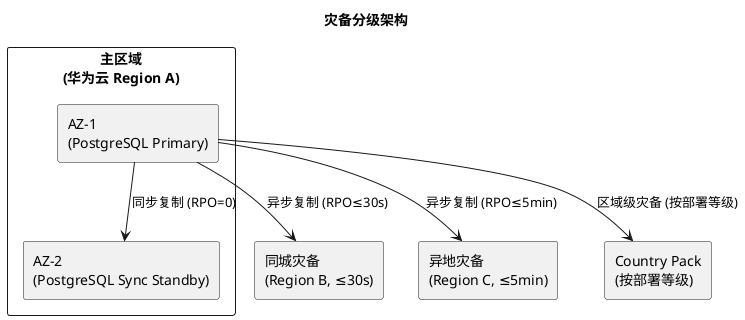

**与 spec.md 映射**：§4.2 规则 3（RPO 分级）、§5.8（Country Pack）

**Non-Functional 约束**：核心交易 RPO≤0；RTO≤5min；灾备分级按 §4.2 规则 3 表格

#### D-GATE-03：RPO ≤ 0 技术实现条件（🔴 Hardening）

> **修订背景**：EV0 要求 Tier 0 Core Transaction RPO≤0，design.md v1.0 必须回答"什么部署条件下才能实现"。不得写成泛化到整个系统的 SLA。

**RPO≤0 部署技术条件（锁定）**：

```text
Primary AZ (PostgreSQL Primary)
        ↓ synchronous replication（同步复制，WAL 同步流）
Secondary AZ (PostgreSQL Synchronous Standby)
        ↓ quorum commit（quorum 提交，多数派确认）
PostgreSQL HA Cluster（主备同步 + quorum）
```

- **同步复制**：Primary → Synchronous Standby，WAL 同步流，Primary 提交需等待 Standby 确认
- **quorum commit**：多数派确认（如 3 节点集群需 2 节点确认），避免单 Standby 故障导致 Primary 阻塞
- **PostgreSQL HA**：主备同步切换 + quorum，RPO=0（已提交事务零丢失）

**RPO≤0 适用范围（明确，不得泛化）**：

| 范围 | RPO≤0 适用 | 说明 |
|---|---|---|
| 单 AZ 内数据库节点故障 | ✅ 适用 | 同步 Standby 切换，RPO=0 |
| 多 AZ 数据库故障 | ✅ 适用 | 跨 AZ 同步复制，RPO=0 |
| 跨 Region 灾难 | ❌ 不适用 | 跨 Region 同步复制延迟不可接受，采用异步复制 RPO≤30s/5min |
| Object Storage（OBS） | ❌ 不适用（不同语义） | OBS 采用跨 AZ 复制 + 版本化，RPO 由 OBS SLA 定义 |
| EventBus（DMS Kafka） | ❌ 不适用（不同语义） | EventBus 采用多副本 + ISR，RPO 由 Kafka SLA 定义，EventBus 是传播机制不是真相源 |
| Neo4j Graph Projection | ❌ 不适用（投影层） | Neo4j 是投影，可从 PostgreSQL Event Replay 重建，RPO 不适用 |

**RPO 分级表（锁定，对应 §4.2 规则 3 + Hardening）**：

| Tier | 数据 | RPO | 技术实现 | 适用范围 |
|---|---|---|---|---|
| **T0** | Core Transaction（Evidence Ledger / Outbox / 业务表） | **≤0** | PostgreSQL 同步复制 + quorum commit + 多 AZ + WAL 归档 | 单 AZ / 多 AZ 数据库故障 |
| **T1** | Business Critical（如 Country Pack 配置 / Policy 规则） | **≤30s** | 异步复制 + 同城灾备 | 同城灾备 |
| **T2** | General Business（如非核心业务数据） | **≤5min** | 异地灾备 + 异步复制 | 异地灾备 |
| **T3** | Analytics / Projection（Neo4j Graph / 物化视图 / Search） | **profile-defined** | Outbox+EventBus 最终一致，可从 PostgreSQL Event Replay 重建 | 投影层，RPO 不适用，按 D-GATE-05 模式分级 |

**关键约束**：
- **T0 RPO≤0 仅适用于 Core Transaction（PostgreSQL Evidence Ledger / Outbox / 业务表）**，不泛化到整个系统
- **T3 投影层 RPO 不适用**，Neo4j / 物化视图 / Search 是投影，可重建，按 D-GATE-05 模式分级管理 lag
- **EventBus 是传播机制，不是真实性来源**（§5.3.1 规则 3 三层真相模型），RPO 由 Kafka SLA 定义，不强制 RPO≤0
- **Object Storage 是 Artifact Truth**，采用 OBS 跨 AZ 复制 + WORM + 版本化，RPO 由 OBS SLA 定义

**与 spec.md 映射**：§4.2 规则 3（RPO 分级 + 核心交易 RPO≤0）、§5.3.1 规则 3（三层真相模型）、§5.8（Country Pack 部署等级）

**Non-Functional 约束**：T0 RPO≤0 仅适用 Core Transaction；T1/T2/T3 按分级表；不泛化 RPO≤0 到整个系统；投影层按 D-GATE-05 模式分级

### D21 Benchmark Architecture（B1~B5 Profile 落地/压测拓扑/Measured Baseline 路径）

**设计决策**：建立 B1~B5 Benchmark Profile 框架，B1 锁定目标（P95≤500ms, ≥2000 TPS, Error≤0.1%），B2~B5 预留定义位（§4.1 规则 3）。压测拓扑模拟生产规模，Measured Baseline 路径记录每次压测结果。

**B1~B5 Profile 定义**：

| Profile | 场景 | Payload | 并发/CPU/Mem | Target | 状态 |
|---|---|---|---|---|---|
| B1 Transaction | Create Order + validation + tenant RLS + commit + evidence append + audit | ≤16KB | design.md 基准定义 | P95≤500ms, ≥2000 TPS, Error≤0.1% | 🔒 EV0 锁定 |
| B2 Contract | 合同签署流程 | design.md 细化 | design.md 细化 | design.md 细化 | 预留 |
| B3 Invoice | 发票生成流程 | design.md 细化 | design.md 细化 | design.md 细化 | 预留 |
| B4 Inventory | 库存周转流程 | design.md 细化 | design.md 细化 | design.md 细化 | 预留 |
| B5 Production | 生产执行流程 | design.md 细化 | design.md 细化 | design.md 细化 | 预留 |

**压测拓扑**：

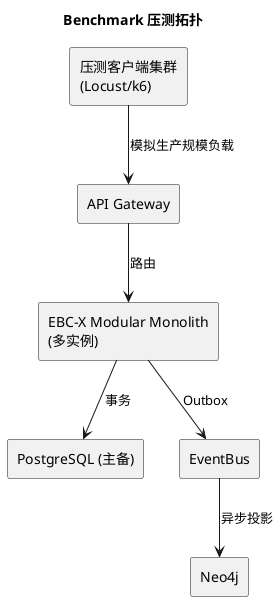

**Measured Baseline 路径**：每次压测结果记录至 `{repo}/benchmarks/baselines/{profile}/{date}.json`，含 P50/P95/P99/TPS/ErrorRate/机器规格；版本化管理

**与 spec.md 映射**：§4.1 规则 3（Benchmark Profile）

**Non-Functional 约束**：B1 锁定目标 P95≤500ms, ≥2000 TPS, Error≤0.1%；B2~B5 预留；Measured Baseline 版本化

#### D-GATE-04：B1 Benchmark Profile 绑定（🔴 Hardening）

> **修订背景**：B1（≥2000 TPS / P95≤500ms / Error≤0.1%）作为目标基线可保留，但不得让 Tasks Agent 理解成"随便部署就必须达到"。必须定义 B1 Hardware + Workload Profile，锁定可复现的 Profile。

**B1-EBCX-BASELINE Profile（锁定，可复现）**：

```text
B1-EBCX-BASELINE
  Hardware:
    CPU: 16 vCPU (x86_64, 2.5GHz+)
    RAM: 64 GB
    PostgreSQL: 8 vCPU / 32 GB RAM / NVMe SSD 2TB / shared_buffers=8GB / work_mem=64MB / max_connections=500
    Kafka(DMS): 3 broker, 4 vCPU / 16 GB RAM each, 3 partition, replication=3
    Redis: 4 vCPU / 16 GB RAM (缓存/幂等)
    OpenSearch: 3 node, 4 vCPU / 16 GB RAM each (Read Model 投影)
    Neo4j: 4 vCPU / 16 GB RAM / pagecache=8GB (Graph Projection)
  Workload:
    Tenant: 50 租户
    Users: 10000 注册用户
    Dataset: 1000 万 Order / 500 万 Contract / 500 万 Invoice / 200 万 Payment
    Concurrency: 2000 并发请求
    Transaction Mix: Order 40% / Contract 20% / Invoice 20% / Payment 20%
    Consistency Mode: PostgreSQL 同步复制开启（RPO≤0, T0）
    Evidence Write Ratio: 100%（每交易必写 Evidence）
    Graph Projection Mode: 异步（Outbox+EventBus, Normal Mode P95 lag ≤3s）
    EventBus Mode: 至少一次 + 幂等消费者（event_id 去重）
  Target:
    TPS ≥ 2000
    P95 ≤ 500ms
    Error ≤ 0.1%
```

**关键约束（锁定）**：
- **B1 是 Hardware + Workload 绑定的可复现 Profile**，不是"随便部署就必须达到"的绝对指标
- **若 Hardware 降配 / Workload 加大 / Consistency Mode 调整（如关闭同步复制）/ Evidence Write Ratio 提升**，则 B1 Target 不保证达成，需重新压测确认
- **B1 Target 达成前提**：Hardware ≥ B1 规格 + Workload ≤ B1 规模 + Consistency Mode = 同步复制开启 + Graph Projection = 异步 Normal Mode
- **Tasks Agent 不得**将 B1 Target 理解为无条件 SLA，必须绑定 B1-EBCX-BASELINE Profile

**B2~B5 Profile 预留框架（后续 EV 细化）**：

| Profile | 场景 | Hardware | Workload | Target | 状态 |
|---|---|---|---|---|---|
| B2-Standard-Enterprise | 中型企业标准负载 | 8 vCPU / 32 GB | 10 租户 / 2000 用户 / 500 并发 | P95≤800ms, ≥500 TPS, Error≤0.5% | 预留（EV1 细化） |
| B3-Large-Enterprise | 大型企业高负载 | 32 vCPU / 128 GB | 200 租户 / 50000 用户 / 5000 并发 | P95≤1s, ≥5000 TPS, Error≤0.1% | 预留（EV2 细化） |
| B4-High-Concurrency | 高并发场景 | 64 vCPU / 256 GB | 500 租户 / 100000 用户 / 10000 并发 | P95≤2s, ≥10000 TPS, Error≤0.1% | 预留（EV6 细化） |
| B5-Extreme | 极端场景（工业实时） | 定制 | 定制 | profile-defined | 预留（EV10 细化） |

**Measured Baseline 路径**：每次压测结果记录至 `{repo}/benchmarks/baselines/{profile}/{date}.json`，含 P50/P95/P99/TPS/ErrorRate/Hardware/Workload/ConsistencyMode；版本化管理，可追溯。

**与 spec.md 映射**：§4.1 规则 3（Benchmark Profile B1~B5）

**Non-Functional 约束**：B1 绑定 B1-EBCX-BASELINE Profile（Hardware + Workload）；B1 Target 达成前提明确；B2~B5 预留框架；Measured Baseline 版本化可追溯

### D22 Observability（日志/指标/链路追踪/Evidence 关联/告警）

**设计决策**：接入华为云 APM/云监控/日志服务（§5.9.1 规则 4）。结构化 JSON 日志含 traceId/spanId/租户/操作主体/业务对象 ID；Evidence 相关日志独立流转至 append-only 日志通道（§4.4 规则 2）。OpenTelemetry 全链路追踪（§4.4 规则 3）。

**关键指标**（§4.4 规则 1）：
- 核心交易 QPS / 延迟分位（P50/P95/P99）/ 错误率
- Evidence 写入速率 / Graph 投影延迟 / 投影一致性延迟
- Agent 执行成功率 / Policy 命中率 / Approval 流转时长
- RLS 拦截次数 / 跨租户访问尝试 / 审计写入速率

**日志格式**（结构化 JSON）：
```json
{
  "timestamp": "...",
  "level": "INFO",
  "traceId": "...",
  "spanId": "...",
  "tenantId": "...",
  "operator": "...",
  "businessObjectId": "...",
  "evidenceId": "...",
  "action": "...",
  "message": "..."
}
```

**Evidence 日志独立通道**：Evidence 相关日志流转至 append-only 日志通道（OBS 或 PostgreSQL append-only 表），与普通业务日志隔离

**链路追踪**：OpenTelemetry 从 REST 入口到 Evidence 写入串联单一 traceId；跨模块传播 trace context

**告警**：核心交易错误率 >0.1% / Graph 投影延迟 >3s / RLS 拦截异常 / Agent 治理拒绝异常 → 告警

**与 spec.md 映射**：§4.4（可维护性全模块）、§5.9.1 规则 4（可观测性）

**Non-Functional 约束**：结构化 JSON 日志；Evidence 日志独立 append-only；全链路 traceId 串联

### D23 Audit / Compliance（append-only 审计/Evidence 不可篡改/数据保留/数据出境）

**设计决策**：所有关键操作（核心账务修改/Evidence 写入/Policy 变更/Agent 执行）写入 append-only 审计日志（§4.3 规则 4）。Evidence 不可篡改（§4.2 规则 2）。数据保留按合规要求；数据出境按 Country Pack 合规（§5.8.1 规则 4）。

**审计范围**：
- 核心账务修改（Order/Contract/Invoice/Payment 状态变更）
- Evidence 写入（append-only 表写入尝试，含拒绝尝试）
- Policy 变更（规则创建/修改/失效）
- Agent 执行（三重治理结果 + Verification）
- 权限/RLS 拦截（越权访问尝试）
- 审批流转（Approval 状态变更）

**审计记录字段**：操作主体 / 时间 / 操作类型 / 前后状态 / Evidence 引用 / traceId / 结果

**Evidence 不可篡改**：append-only 表数据库层强制（触发器/规则拒绝 UPDATE/DELETE），任何篡改尝试被拒绝并审计（§4.2 规则 2）

**数据保留**：按合规要求配置保留策略（如中国数据保留 ≥10 年、EU GDPR 按用户请求删除）；保留期内数据不可删除

**数据出境**：Country Pack 合规校验（§5.8.1 规则 4）；中国数据出境需合规审批；EU GDPR 数据本地化；US SOC2 审计合规；未通过合规的 Country Pack 禁止上线（§5.8.3 异常 1）

**与 spec.md 映射**：§4.3 规则 4（审计）、§4.2 规则 2（不可篡改）、§5.8（全球化合规）

**Non-Functional 约束**：审计 append-only 强制；Evidence 不可篡改数据库层强制；数据出境合规校验

### D24 Deployment Architecture（华为云云原生/容器化/DevSecOps/CI/CD/环境分层）

**设计决策**：容器化部署于华为云 CCE（§5.9.1 规则 1）。DevSecOps 安全左移，CI/CD 集成 SAST/DAST/依赖扫描/镜像扫描（§5.9.1 规则 2）。IaC 管理基础设施，禁止手工变更生产（§5.9.1 规则 3）。多 AZ 高可用（§5.9.1 规则 5）。环境分层 dev/staging/prod。

**部署架构**：

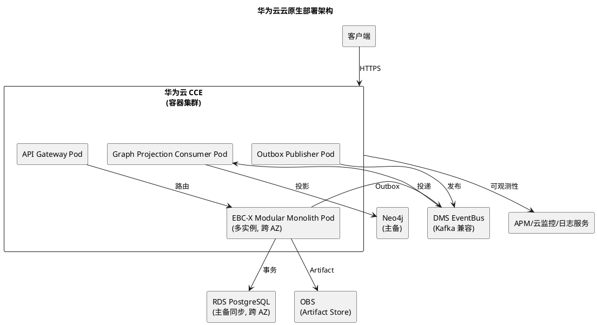

**DevSecOps CI/CD 流水线**：

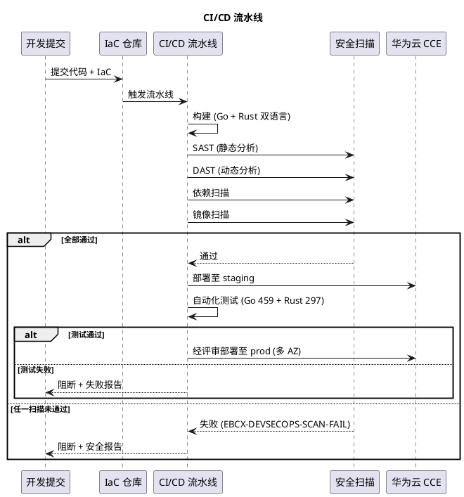

**环境分层**：
- `dev`：开发环境，单实例，可重置
- `staging`：预生产环境，模拟生产规模，压测验证
- `prod`：生产环境，多 AZ 高可用，IaC 管理

**IaC 管理**：Terraform 或等价 IaC 工具管理华为云资源（CCE/RDS/OBS/DMS/...）；禁止手工变更生产基础设施（§5.9.1 规则 6）

**双语言构建**：Go 主业务服务 + Rust 高性能/安全关键组件；通过明确接口边界协作（§5.3.1 规则 6）；CI/CD 分别构建 Go + Rust 产物

**前端构建**：React + Antd + Vite 构建（§5.3.1 规则 7）；Vite v6.4.3 + 工程化 UI

**与 spec.md 映射**：§5.9（华为云部署全模块）、§5.3.1 规则 6/7（双语言 + 前端）、§5.12 红线六/七

**Non-Functional 约束**：容器化部署；DevSecOps 四类安全扫描强制；IaC 管理生产；多 AZ 高可用；RTO≤5min

## 2.5 Non-Functional Architecture Constraints（锁定）

> 以下为 EV0-SPEC v1.1 已 PASS 并 CLOSED 的架构原则，design.md 必须严格遵循，不得漂移。本节作为不可变基线锁定。

### 2.5.1 Design Freeze Principle #1（锁定）

**原则**：第一阶段采用 **Modular Monolith + Event-Native**，而非 Microservice Showcase。13 个能力模块不拆成数十个独立微服务。

**落地路径**：
```text
Modular Domain Architecture
        ↓
Clear Domain Boundary (D02)
        ↓
Stable Contracts (D16/D17)
        ↓
Event Backbone (D07)
        ↓
Selective Service Extraction (留待后续 EV 阶段)
```

**禁止路径**：`13 Modules → 100 Microservices → Distributed Transaction Hell`

**与 spec.md 映射**：§5.12.1 红线三（禁止数百微服务）、§5.2（三大核心 + 模块树）

### 2.5.2 三层真相模型（锁定）

| 真相层 | 承载 | 角色 | 一致性 |
|---|---|---|---|
| Evidence Truth | PostgreSQL Evidence Ledger | System of Record，原始事实持久化真相源 | 强一致（事务提交即完成） |
| Graph Truth | Neo4j Evidence Graph Projection | Graph Query Truth，权威关系查询模型 | 最终一致（≤3s） |
| Artifact Truth | Immutable Object Storage (OBS) | 不可变证据原件存储 | 不可变（WORM） |

**裁决优先级**：PostgreSQL→Neo4j 不一致时，以 PostgreSQL Evidence Ledger 为最终事实裁决源，Neo4j 通过 Event Replay 重建（§5.3.1 规则 3）

**与 spec.md 映射**：§5.3.1 规则 3（三层真相模型）、§4.2 规则 4（异步投影）

### 2.5.3 Outbox + EventBus 异步投影（锁定）

**架构约束**：
- PostgreSQL 事务内同时写入业务数据 + Evidence Ledger + Outbox Event（同事务原子）
- 事务提交即业务完成（RPO≤0）
- Neo4j Graph 投影通过 Outbox+EventBus 异步消费，最终一致 ≤3s
- **Neo4j 失败绝不能拖垮 Transaction Core**（§4.2 规则 4 架构约束）
- 禁止 Neo4j 同步写入参与 PostgreSQL 事务协调

**与 spec.md 映射**：§4.2 规则 4、§5.4.2

### 2.5.4 24 类 Canonical Evidence Graph Core（锁定，含 Approval 一等公民）

**24 类节点**：Enterprise / Organization / Person / Product / Material / Supplier / Customer / Order / Contract / Invoice / Payment / Production / Quality / Asset / Project / Patent / R&D / Data / Evidence / Event / Policy / Decision / **Approval** / Agent

**8 类边**：归属 / 交易 / 产出 / 资产 / 证据 / 治理 / 审批 / 数据

**Approval 一等公民**：承载 Decision→Approval→Execution 链路审批流转事实，可查询/可追溯/可治理

**扩展实体**：Location/Workflow/Document/Shipment/Inventory/WorkOrder 等留待后续 EV 阶段评估，EV0 不无限扩张

**与 spec.md 映射**：§5.5.1 规则 1（24 类 + Approval）、§6.2/6.3（数据约束）

### 2.5.5 Governed Agent 三重治理（锁定）

**治理顺序（不可变）**：权限校验 → Policy 匹配 → 审批流转，三者任一未通过则禁止执行

**Agent Evidence Provenance**：Agent 可读 Current State + Evidence + Policy + Master Data，但影响决策的关键事实必须可追溯 Evidence（§5.6.1 规则 2）

**禁止**：Agent 绕过治理直接修改核心账务（§5.12 红线五）

**与 spec.md 映射**：§5.6（Governed Agent 全模块）、§5.12 红线五

### 2.5.6 RPO 分级（锁定）

| 场景 | RPO |
|---|---|
| 单实例/单 AZ/数据库节点故障 | 0（核心交易已提交事务零丢失） |
| 同城灾备 | ≤30s |
| 异地灾备 | ≤5min |
| 极端区域级灾难 | 按 Country Pack / 部署等级 |

**与 spec.md 映射**：§4.2 规则 3

### 2.5.7 Benchmark Profile B1~B5（锁定）

- **B1 Transaction Profile（EV0 锁定）**：P95≤500ms, ≥2000 TPS, Error≤0.1%
- **B2~B5**：预留框架，design.md 细化

**与 spec.md 映射**：§4.1 规则 3

### 2.5.8 Global Core + Country Pack（锁定）

- Global Core 为全球统一核心
- Country Pack 为 China/EU/US/Japan/ASEAN 区域合规与本地化包
- 核心表不分叉，本地化字段以扩展表附加

**与 spec.md 映射**：§5.8（全球化架构全模块）

### 2.5.9 华为云云原生 + DevSecOps（锁定）

- 容器化部署于华为云 CCE（§5.9.1 规则 1）
- DevSecOps 安全左移，CI/CD 集成 SAST/DAST/依赖扫描/镜像扫描（§5.9.1 规则 2）
- IaC 管理基础设施，禁止手工变更生产（§5.9.1 规则 3）
- 多 AZ 高可用（§5.9.1 规则 5）
- 保持可迁移性不产生不可逆厂商锁定（§5.12 红线六）

**与 spec.md 映射**：§5.9、§5.12 红线六

### 2.5.10 8 条架构红线（锁定）

| 红线 | 内容 | design.md 落地 |
|---|---|---|
| 红线一 | 禁止巨型 ERP | D01 Modular Monolith，非 1000+ 页面 |
| 红线二 | 禁止大杂烩 | 第一阶段 Core + Transaction + Evidence + Data + Policy 地基 |
| 红线三 | 禁止数百微服务 | D01/D02 模块边界 + 聚合根粒度 |
| 红线四 | 禁止为 AI 而 AI | D11 Agent 受治理服务于闭环 |
| 红线五 | 禁止 Agent 绕过治理 | D11 三重治理顺序不可变 |
| 红线六 | 禁止厂商锁定 | D07/D24 保持可迁移性 |
| 红线七 | 禁止绕过 EV0 编码 | EV0-G0 Gate 通过后方可启动 EV1 |
| 红线八 | 禁止开发团队决定产品架构 | 架构裁决权归属大G项目经理体系 |

**与 spec.md 映射**：§5.12（架构红线全模块）

### 2.5.11 EBC-X ≠ SAP/Oracle 国产复刻（永久原则锁定，Hardening 附加战略约束）

> **修订背景**：必须锁定 EBC-X 的战略定位，避免在后续 EV 阶段退化为"国产 SAP/Oracle 复刻"。这是产品主权层面的永久原则，不得因技术便利或市场压力而漂移。

**战略定位（锁定，永久原则）**：

```text
EBC-X ≠ SAP/Oracle 的国产复刻
```

**EBC-X 最终结构（锁定）**：

```text
                    EBC-X
                      │
        ┌─────────────┼─────────────┐
        ↓             ↓             ↓
      ERP          Evidence       Industrial
      Core           Graph           Core
        │             │               │
        └─────────────┼───────────────┘
                      ↓
               Enterprise Twin
                      ↓
              Governed Agents
```

**与传统 ERP 的根本差异（锁定）**：

| 维度 | 传统 ERP（SAP/Oracle/用友/金蝶） | EBC-X |
|---|---|---|
| 核心范式 | Data → Workflow → Report（线性） | **Business State + Event + Evidence + Graph + Policy + Agent + Simulation**（闭环） |
| 信任底座 | 数据库表 + 审计日志 | **Evidence Ledger（append-only, 不可篡改）+ Graph Projection + Artifact 三层真相** |
| 决策模式 | 人工 + 规则 | **Evidence-First + Policy + Governed Agent + Independent Verification** |
| 智能体 | 无 / 外挂 AI 助手 | **Governed Agent（受治理，不能自授执行权限，独立验证）** |
| 关系查询 | SQL JOIN | **Neo4j Graph Projection（24 Entity + 8 Edge Canonical Contract）** |
| 数据血缘 | 人工维护 / 无 | **Data Lineage 自动建链 + Provenance + 断链阻断决策** |
| 工业能力 | 外挂 MES/PLM | **Industrial Core（制造 + 质量 + 资产 + Digital Twin）归并** |
| 政策对齐 | 无 / 包装式 | **工信部 1+4+N 产品能力映射（政策是政策，产品是产品）** |

**母架构约束（锁定，永久原则）**：

- ✅ **PostgreSQL Evidence/Transaction Truth 是根**（System of Record，D-GATE-01 安全边界保护）
- ✅ **Neo4j 是 Graph Query Projection**（投影层，非原始事实真相源，D-GATE-06 Contract 锁死）
- ✅ **Object Storage 是 Artifact Truth**（不可变原件）
- ✅ **EventBus 是传播机制，不是真实性来源**（Outbox+EventBus 异步投影，D-GATE-05 模式分级）
- ✅ **Agent 不能越过 Policy**（D-GATE-07 Authorization 模型）
- ✅ **Policy 不能越过 Authorization**（Policy Engine 裁决 + Authorizer 签发 Execution Token）
- ✅ **Execution 必须产生 Evidence**（每步留证，append-only，D-GATE-01 安全边界）

**禁止漂移项（锁定）**：
- ❌ 禁止将 EBC-X 退化为"国产 SAP/Oracle 复刻"（仅做 ERP 功能国产化）
- ❌ 禁止放弃 Evidence Ledger 改回传统"数据库表 + 审计日志"模式
- ❌ 禁止放弃 Governed Agent 改回"外挂 AI 助手"模式
- ❌ 禁止放弃 Graph Projection 改回"SQL JOIN"模式
- ❌ 禁止放弃 Data Lineage 改回"人工维护/无血缘"模式
- ❌ 禁止放弃三层真相模型改回"单一 Graph Truth"模式

**与 spec.md 映射**：§1.1（核心职责）、§5.1.1 规则 5（与传统 ERP 差异化）、§5.3.1 规则 3（三层真相模型）、§5.6（Governed Agent）、§5.12 红线四（禁止为 AI 而 AI）、§5.13（Digital Evidence Backbone）

**Non-Functional 约束**：永久原则，不得漂移；架构评审拒绝任何退化提议；后续 EV 阶段须持续对齐

## 2.6 D01~D24 与 spec.md 一致性映射

| 设计项 | spec.md 对应章节 | 一致性校验 |
|---|---|---|
| D01 Logical Architecture | §3.2 / §5.2 / §5.3 / §5.12 红线三 | ✅ Modular Monolith + 14 模块，不拆数百微服务 |
| D02 Domain Boundary | §5.3.1 规则 5 / §5.5 | ✅ DDD 聚合根 + Orchestrator，6 限界上下文 |
| D03 Enterprise Core | §5.10 EV1 / §5.7 | ✅ 五聚合根，权限对接 HTKIS-AF |
| D04 Transaction Core | §5.1 / §5.10 EV2 / §5.4 | ✅ 11 阶段链路 + Read/Query 分流 + Event Replay |
| D05 Evidence Ledger | §4.2 规则 2 / §5.4.1 / §6.1 / §5.7.1 规则 2 | ✅ append-only 数据库层强制 + RLS + 审计 |
| D06 Evidence Graph Projection | §5.5 / §4.2 规则 4 / §6.2 / §6.3 | ✅ 24 类节点 + 8 类边 + Approval 一等公民 + 异步投影 |
| D07 Outbox + EventBus | §4.2 规则 4 / §5.4.2 | ✅ 同事务原子 + 至少一次 + 幂等 + 收敛 ≤3s |
| D08 CQRS | §5.1.1 规则 1 / §5.4.1 规则 6 | ✅ Command/Query 分离 + Projection 分发 |
| D09 Data Lineage | §5.13 / §5.4 | ✅ 完整溯源子图 + Provenance + 断链阻断 |
| D10 Policy Engine | §5.5 治理关系 / §5.6 / §6.4 | ✅ 规则模型 + 评估流程 + Approval 交互 |
| D11 Agent Runtime | §5.6 / §6.5 / §5.12 红线五 | ✅ 三重治理顺序不可变 + Provenance 注入 |
| D12 Digital Twin Adapter | §5.2 规则 3 / §5.6.1 规则 4 | ✅ SeaFusion-X 归并 + Verification 层 |
| D13 Security Architecture | §4.3 / §5.7 / §5.12 红线五 | ✅ HTKIS-AF 统一供给 + OAuth2+JWT+RLS+审计 append-only |
| D14 Multi-Tenant Architecture | §5.7.1 规则 5 / §5.8 | ✅ RLS 行级隔离 + Pack 路由 + 核心表不分叉 |
| D15 Data Architecture | §5.4 / §5.5 / §4.5 规则 2 / §5.9.1 规则 3 | ✅ schema 划分 + 迁移版本化 + IaC |
| D16 API / GraphQL | §5.3.1 规则 4 / §4.5 规则 1 / §5.7.1 规则 3 | ✅ REST 第一入口 + GraphQL 适配 + 统一认证 |
| D17 Event Contract | §5.4 / §4.5 规则 1 | ✅ 事件命名 + semver + 向后兼容 |
| D18 Consistency Model | §4.2 规则 4 / §5.4 | ✅ 强一致事务 + Outbox 原子 + Graph 最终一致 + Saga |
| D19 Failure / Recovery Model | §4.2 规则 4 / §5.4.3 | ✅ Neo4j 故障不拖垮 Transaction + 重投 + 重建 |
| D20 RPO / RTO | §4.2 规则 3 / §5.8 | ✅ RPO≤0 + 灾备分级 + Country Pack 部署等级 |
| D21 Benchmark Architecture | §4.1 规则 3 | ✅ B1 锁定 + B2~B5 预留 + Measured Baseline |
| D22 Observability | §4.4 / §5.9.1 规则 4 | ✅ 结构化 JSON + Evidence 独立通道 + OpenTelemetry |
| D23 Audit / Compliance | §4.3 规则 4 / §4.2 规则 2 / §5.8 | ✅ append-only 审计 + 不可篡改 + 数据出境合规 |
| D24 Deployment Architecture | §5.9 / §5.3.1 规则 6/7 / §5.12 红线六/七 | ✅ 华为云 CCE + DevSecOps + IaC + 多 AZ + 双语言 + React/Antd/Vite |

**一致性校验结论**：D01~D24 全部 24 项与 spec.md v1.1 EV0-SPEC PASS 基线一致，无矛盾。所有 13 条架构原则、8 条架构红线、三层真相模型、Outbox+EventBus 异步投影、24 类 Evidence Graph（含 Approval 一等公民）、Governed Agent 三重治理、RPO 分级、Benchmark B1~B5、Global Core + Country Pack、华为云云原生 + DevSecOps 均已工程化落地。

### 2.6.1 D-GATE-01~08 Architecture Hardening 一致性映射（v1.1 新增）

| D-GATE | 主题 | 落实位置 | spec.md 对齐 | 母架构约束对齐 | 一致性校验 |
|---|---|---|---|---|---|
| D-GATE-01 | Evidence Ledger 不可篡改安全边界 | §2.4 D05 之后 | §4.2 规则 2 / §5.4.1 规则 2/3 / §6.1 / §5.7.1 规则 2/4 | PostgreSQL Evidence/Transaction Truth 是根 | ✅ 四层纵深防御 + Runtime/Migration Role 分离 + hash 链校验 |
| D-GATE-02 | Transaction Orchestrator 与 Saga/Workflow 边界 | §2.4 D04 之后 | §5.1.1 / §4.2 规则 4 / §5.4.1 规则 6 | EventBus 是传播机制不是真相源 | ✅ Local ACID + Domain Event + Saga + Compensation + Evidence 五层组合，非巨型同步事务 |
| D-GATE-03 | RPO ≤ 0 技术实现条件 | §2.4 D20 之后 | §4.2 规则 3 / §5.3.1 规则 3 / §5.8 | PostgreSQL Evidence/Transaction Truth 是根 | ✅ T0~T3 分级表 + RPO≤0 仅适用 Core Transaction + 不泛化 |
| D-GATE-04 | B1 Benchmark Profile 绑定 | §2.4 D21 之后 | §4.1 规则 3 | — | ✅ B1-EBCX-BASELINE Hardware+Workload 绑定 + 达成前提明确 + B2~B5 预留 |
| D-GATE-05 | Graph Projection ≤3s 适用条件与指标 | §2.4 D19 之后 | §4.2 规则 4 / §4.4 / §5.4.3 | Neo4j 是 Graph Query Projection；EventBus 是传播机制 | ✅ B1 Normal Mode P95≤3s + 模式分级 + 6 项指标 + DLQ |
| D-GATE-06 | 24 Entity + 8 Edge Canonical Graph Contract | §2.4 D06 之后 | §5.5 / §6.2/6.3 / §5.4.1 规则 6 | Neo4j 是 Graph Query Projection | ✅ Node/Edge Contract 锁死 + 边必由 Domain Event 驱动 + 禁止 Graph AI 写边 |
| D-GATE-07 | Agent Execution Authorization 模型 | §2.4 D11 之后 | §5.6 / §5.6.1 规则 1/4/5 / §5.12 红线四/五 / §6.5 | Agent 不能越过 Policy；Policy 不能越过 Authorization；Execution 必须产生 Evidence | ✅ Agent→Reason→Policy→Approval→Authorize→Execute→Verify→Evidence 执行链 + Independent Verifier |
| D-GATE-08 | 13 Capability / 14 Module / 6 Bounded Context 层级关系 | §2.4 D02 之后 | §5.2 / §5.5.1 规则 1 / §5.3.1 规则 5 | — | ✅ 五层层级体系 + 13→14 差异来源明确（Platform/Governance 模块）+ 映射表 |
| 附加战略约束 | EBC-X ≠ SAP/Oracle 国产复刻 | §2.5.11 | §1.1 / §5.1.1 规则 5 / §5.3.1 规则 3 / §5.6 / §5.12 红线四 / §5.13 | 全部 7 条母架构约束 | ✅ 永久原则锁定 + 传统 ERP 差异表 + 7 条母架构约束对齐 + 6 项禁止漂移 |

### 2.6.2 母架构约束对齐确认（v1.1 新增）

| 母架构约束 | design.md v1.1 落实位置 | 对齐状态 |
|---|---|---|
| PostgreSQL Evidence/Transaction Truth 是根 | D05 + D-GATE-01（四层纵深防御 + Runtime Role 无 UPDATE/DELETE） | ✅ |
| Neo4j 是 Graph Query Projection | D06 + D-GATE-06（Node/Edge Contract + 边必由 Domain Event 驱动） | ✅ |
| Object Storage 是 Artifact Truth | D15（OBS WORM + 命名规范） | ✅ |
| EventBus 是传播机制，不是真实性来源 | D07 + D-GATE-02（Saga/Workflow 边界）+ D-GATE-05（模式分级） | ✅ |
| Agent 不能越过 Policy | D11 + D-GATE-07（Authorization 执行链 + Agent 不能自授执行权限） | ✅ |
| Policy 不能越过 Authorization | D10 + D-GATE-07（Policy Engine 裁决 + Authorizer 签发 Execution Token） | ✅ |
| Execution 必须产生 Evidence | D04 + D-GATE-02（每步留证）+ D-GATE-07（Independent Verification 后写入 Evidence） | ✅ |

**D-GATE 一致性校验结论**：D-GATE-01~08 全部 8 项 + 1 项附加战略约束均已落实，与 spec.md v1.1 一致，与 7 条母架构约束对齐，无矛盾，无漂移。design.md v1.1 满足 Architecture Hardening 全部要求。

---

## 文档结束

> 本 design.md v1.1 基于 spec.md v1.1（EV0-SPEC PASS / CLOSED，不可变基线）生成，覆盖 D01~D24 全部 24 项技术设计决策 + D-GATE-01~08 全部 8 项 Architecture Hardening + 1 项附加战略约束（EBC-X ≠ SAP/Oracle 国产复刻永久原则）。
>
> **v1.0 → v1.1 修订**：执行 EBCX-EV0-DESIGN-HARDENING-001 Architecture Hardening，补齐 D-GATE-01~08，未修改 spec.md v1.1，未重新设计 EBC-X，未进入 tasks 阶段。
>
> **锁定项**：Design Freeze Principle #1（Modular Monolith + Event-Native）、三层真相模型、Outbox+EventBus 异步投影、24 类 Canonical Evidence Graph Core（含 Approval 一等公民）、Governed Agent 三重治理、RPO 分级、Benchmark B1~B5、Global Core + Country Pack、华为云云原生 + DevSecOps、8 条架构红线、**Evidence Ledger Security Boundary（D-GATE-01 四层纵深防御）**、**Saga/Workflow 边界（D-GATE-02）**、**RPO≤0 技术实现条件（D-GATE-03 T0~T3 分级）**、**B1-EBCX-BASELINE Profile（D-GATE-04）**、**Graph Projection 模式分级（D-GATE-05）**、**24 Entity + 8 Edge Canonical Contract（D-GATE-06）**、**Agent Execution Authorization 模型（D-GATE-07）**、**13/14/6 五层层级体系（D-GATE-08）**、**EBC-X ≠ SAP/Oracle 国产复刻永久原则（§2.5.11）**。
>
> **与 spec.md 一致性**：D01~D24 全部与 spec.md v1.1 一致，D-GATE-01~08 全部 8 项 + 1 项附加战略约束与 spec.md v1.1 一致且与 7 条母架构约束对齐，无矛盾，无漂移。
>
> **后续阶段**：tasks.md（任务分解）由 spec-task-agent 负责，本 agent 不予生成。EV1 编码须在 EV0-G0 Gate 通过后方可启动。本 design.md v1.1 待大G项目经理体系 EV0-DESIGN Gate 复审。