# EBC-X EV0 架构对齐阶段需求规格说明书

> **项目：EBC-X — Enterprise Business & Industrial Operating System（企业与工业智能运营操作系统）**
> **阶段：EV0 — Architecture & Policy Alignment**
> **文档版本：v1.1（执行 EBCX-EV0-SPEC-CORRECTION-001 修订）**
> **状态：🟢 EV0-SPEC PASS（修订完成，待授权 spec-design-agent）**
> **产品/架构总设计：大G项目经理体系**
> **核心工程化：华为云团队**
> **全球交付与产品主权：HTKIS**

---

# **1. 组件定位**

## **1.1 核心职责**

本组件（EBC-X 平台）负责承载制造业及中大型企业的业务交易、工业数据、证据治理、政策决策与智能体执行，实现以业务交易为核心、以工业数据为基础、以 Evidence 为信任底座、以 AI Agent 为执行层、以 Digital Twin 为预测验证层的企业与工业智能运营能力。

> EV0 阶段本组件的核心职责是：完成产品总纲、全球定位、政策对齐、总体架构、领域地图、Evidence Graph 规范等 10 项 Gate 文档的制定，为 EV1~EV12 全部后续阶段建立不可绕过的架构地基与治理规则。

## **1.2 核心输入**

1. **大G项目经理体系的架构裁决指令**：来源于产品/架构委员会，包含产品定义、阶段 Gate 判定、架构红线裁决，作为 EBC-X 一切研发行为的最高约束来源。
2. **工信部工业数据政策输入**：来源于《工业数据筑基行动》"1+4+N"体系、工业软件智能化升级、工业智能体应用等政策文件，作为 EBC-X 能力对齐的强制输入。
3. **行业合作伙伴的业务场景输入**：来源于制造、汽车、航空、电子、能源等行业的真实业务场景与试点需求，作为领域地图与 Evidence Graph 实体关系的现实校准来源。
4. **客户真实业务事件**：来源于试点客户的业务事件流（订单、合同、生产、质量、资产等），作为 Evidence Graph 节点与边定义的实证来源。
5. **既有项目资产输入**：来源于 EITP、AirPLM/MES、AeroForge-X、SeaFusion-X、HTKIS-AF、HTKIZ/HyperDisk 等既有项目的代码、模型与领域知识，作为 EBC-X 模块归并的资产来源。

## **1.3 核心输出**

1. **EV0-G0 Gate 通过决议**：输出给产品/架构委员会与全球交付委员会，作为解锁 EV1 Enterprise Core 开发的唯一授权凭证。
2. **10 项架构治理文档**：输出给华为云开发团队与 HTKIS，包含 Product Charter、Global Positioning、Policy Alignment、Domain Architecture、Technical Architecture、Data Architecture、Evidence Graph Specification、Security Architecture、Globalization Architecture、Development & Governance Rules，作为后续所有阶段研发的强制约束基线。
3. **第一性原理链路规范**：输出给全平台，定义所有"业务状态变更、受治理决策及自动化执行行为"必须遵循的 Business→Event→Transaction→Data→Evidence→Policy→Decision→(Human|Agent)→Execution→Verification→Closure 不可变链路（Read/Query 路径不强制走完整链路），作为与传统 ERP 拉开差异的根本规范。
4. **Evidence Graph 规范**：输出给全平台，定义 24 类实体（含 Approval 审批实体作为一等公民）及其关系，作为企业可信经营数据能力（Digital Evidence Backbone）的信任底座规范。
5. **EV1~EV12 Gate 体系**：输出给华为云团队与 HTKIS，定义每个阶段的进入条件、交付物、验收标准，作为双轨开发 + Gate 驱动的治理依据。

## **1.4 职责边界**

本组件（EBC-X 平台）**不负责**以下事项：

1. **不负责**直接以"又一个 ERP 项目"形态交付——禁止第一期直接开发 1000+ 页面 ERP 巨型应用。
2. **不负责**先做"财务、采购、销售、库存、HR、CRM、OA"大杂烩式的能力堆砌——第一阶段必须先建立 Core + Transaction + Evidence + Data + Policy 地基。
3. **不负责**让开发团队反过来决定产品架构——华为云团队是工程实现主体，不是产品主权主体；产品架构裁决权归属大G项目经理体系，产品主权归属 HTKIS。
4. **不负责**为 AI 而 AI——AI Agent 必须受权限、政策、审批约束，禁止绕过治理直接修改核心账务。
5. **不负责**形成厂商锁定架构——架构必须保持可迁移性，华为云为首选云原生底座但不得产生不可逆的厂商绑定。
6. **不负责**EV0 阶段直接进入大规模业务编码——EV0 是架构与政策对齐阶段，未通过 EV0-G0 Gate 前禁止启动 EV1 任何业务模块编码。
7. **不负责**重新造轮子——必须吸收归并 EITP、AirPLM/MES、AeroForge-X、SeaFusion-X、HTKIS-AF、HTKIZ/HyperDisk 等既有项目，而非从零重建。

---

# **2. 领域术语**

**EBC-X**
: 企业与工业智能运营操作系统（Enterprise Business & Industrial Operating System），面向制造业及中大型企业的下一代企业经营与工业运营平台。
: 备注：不是下一代 ERP，而是 ERP + Industrial Data + Evidence + Digital Twin + Governed Agent 的融合体。

**第一性原理链路（First-Principle Chain）**
: EBC-X 中**所有"业务状态变更、受治理决策及自动化执行行为"**必须遵循的不可变链路：Business→Event→Transaction→Data→Evidence→Policy→Decision→Agent→Execution→Verification→Closure。
: 备注：这是 EBC-X 与 SAP/Oracle/用友/金蝶拉开差异的根本规范，从项目第一天写死。**Read/Query 路径（如用户查询订单、管理员查看报表）不强制走完整 11 阶段链路**；仅 Mutation（业务状态变更、受治理决策及自动化执行）走完整 Governed Execution Chain。

**第一性原理链路分流（First-Principle Chain Routing）**
: EBC-X 对业务行为的分流定义：
  - **Read / Query 路径**：不强制走完整 11 阶段链路，直接经 Evidence Ledger / Graph Projection 查询返回，受 RLS 与权限约束即可。
  - **Mutation 路径（业务状态变更、受治理决策及自动化执行）**：必须走完整 Governed Execution Chain：Business→Event→Transaction→Data→Evidence→Policy→Decision→(Human|Agent)→Execution→Verification→Closure。
: 备注：避免对纯读操作强制走 Agent 环节造成性能不可接受与治理过度。

**Evidence（证据）**
: 业务交易发生后形成的、不可篡改的、可验证的经营事实记录，作为企业可信经营数据能力的信任底座。
: 备注：对应 AeroForge-X 归并后的 Evidence Governance Engine。

**Evidence Graph（证据图谱）**
: 以 24 类实体（含 Approval 审批实体作为一等公民）为节点、以业务关系为边构成的企业经营事实图谱，作为 Policy Engine 与 Agent Runtime 的统一信任来源。
: 备注：Graph Truth = Neo4j Evidence Graph Projection（权威关系查询模型），Evidence Truth = PostgreSQL Evidence Ledger（原始事实持久化真相源），Artifact Truth = Immutable Object Storage。详见领域术语"三层真相模型"。

**Governed Agent（受治理智能体）**
: 必须经过权限校验、政策匹配、审批流转后才能执行业务动作的智能体，禁止绕过治理直接修改核心账务。
: 备注：对应 EBC-X Agent Runtime，是工信部"N：工业智能体"方向的产品映射。

**Digital Twin（数字孪生）**
: 以 Evidence 与实时工业数据为基础，对物理资产、生产过程、业务流程进行预测与验证的虚拟映射层。
: 备注：对应 SeaFusion-X 归并后的 Digital Twin Validation Engine。

**Policy Engine（政策引擎）**
: 基于 Evidence Graph 进行规则匹配与政策裁决的引擎，位于 Evidence 与 Decision 之间，是 Agent 执行的前置约束。
: 备注：对应工信部工业数据标准库与高质量数据集库的裁决能力。

**Transaction Core（交易核心）**
: 承载企业业务交易（订单、合同、发票、付款、生产、质量等）的核心引擎，对应 EITP 归并后的 EBC-X Transaction Core。

**Trust Core（信任核心）**
: 承载证据治理、安全基座、数据存储与保存的基础设施核心，包含 AeroForge-X、HTKIS-AF、HTKIZ/HyperDisk 的归并能力。

**Industrial Core（工业核心）**
: 承载制造、PLM、质量、EAM、数字孪生的工业运营核心，包含 AirPLM/MES、SeaFusion-X 的归并能力。

**Business Core（业务核心）**
: 承载企业/组织/主数据/权限/财务/供应链的业务运营核心，包含 EITP 的交易能力归并。

**Gate（阶段门）**
: 大G项目经理体系对每个 EV 阶段设立的进入条件、交付物与验收标准的治理检查点，未通过当前 Gate 不得进入下一阶段。
: 备注：EV0-G0 为 Architecture Authorization Gate。

**Global Core + Country Pack（全球核心 + 国家包）**
: EBC-X 全球化交付模式，Global Core 为全球统一核心，Country Pack 为 China/EU/US/Japan/ASEAN 等区域合规与本地化包。

**1+4+N（工信部体系）**
: 工业数据筑基行动提出的体系：1 个可信互联平台 + 4 个库（数据资源库、数据技术库、工业数据标准库、高质量数据集库）+ N 个工业智能体。
: 备注：**EBC-X 能力架构与工信部《工业数据筑基行动》提出的"1+4+N"体系进行产品能力映射**。政策是政策、产品是产品，映射链路为：MIIT Policy → Capability Mapping → EBC-X Product Capability → Physical Implementation → Evidence。禁止政策包装式对齐。

**双轨开发 + Gate 驱动（Dual-Track + Gate-Driven）**
: 华为云团队负责"做出来"（核心工程化），HTKIS 负责"交付出去"（全球交付），大G负责"决定做什么、做到什么标准、什么时候算完成"的研发治理模式。

**Append-Only Evidence 表**
: 仅允许追加、禁止修改与删除的证据存储表，用于保证 Evidence 的不可篡改性与可审计性。
: 备注：基于 PostgreSQL append-only 表实现。

**三层真相模型（Three-Layer Truth Model）**
: EBC-X 采用的 Evidence 真相分层架构，避免单一"Graph Truth vs 持久层"二义性，正式定义为：
  - **Evidence Truth = PostgreSQL Evidence Ledger / System of Record**：原始 Evidence、交易事实、Evidence 元数据、审计事实、版本、租户隔离、时间序列关系的权威持久化真相源。
  - **Graph Truth = Neo4j Evidence Graph Projection / Graph Query Truth**：Evidence Graph 的权威关系查询模型，承载图关系、路径、子图、关系推理、Policy 查询、Agent 上下文查询，**而非原始事实的唯一持久化真相源**。
  - **Artifact Truth = Immutable Object Storage**：PDF、图片、CAD、质检报告、发票原件、合同附件、生产数据文件、传感器数据快照等不可变证据原件存储。
: 备注：当 PostgreSQL→Neo4j 出现不一致时，以 PostgreSQL Evidence Ledger 为最终事实裁决源，Neo4j 为投影层可通过 Event Replay 重建。

**Evidence Ledger（证据账本）**
: PostgreSQL 中以 append-only 表承载的原始 Evidence 持久化层，是 System of Record，承载交易事实、Evidence 元数据、审计事实与版本。
: 备注：对应 Evidence Truth。

**Evidence Graph Projection（证据图谱投影）**
: Neo4j 中以图结构承载的 Evidence 关系查询投影层，是 Graph Query Truth，通过 Outbox + Event Bus 模式与 PostgreSQL 解耦，最终一致。
: 备注：对应 Graph Truth，异步投影，禁止同步强一致拖垮 Transaction Core。

**Evidence Artifact Store（证据原件存储）**
: 不可变对象存储承载的 Evidence 原件层，存储 PDF、图片、CAD、质检报告、发票原件、合同附件、生产数据文件、传感器数据快照等。
: 备注：对应 Artifact Truth，未来阶段加入，EV0 阶段先建立定义。

**Graph Truth（图谱真相源）**
: Evidence Graph 的权威关系查询模型，由 Neo4j Evidence Graph Projection 承载，**而非原始事实的唯一持久化真相源**。原始事实持久化真相源为 PostgreSQL Evidence Ledger（Evidence Truth）。
: 备注：REST API 为第一入口，GraphQL 为第二适配层。详见"三层真相模型"。

**聚合根 + Orchestrator 编排（Aggregate Root + Orchestrator）**
: EBC-X 采用的领域驱动设计模式，聚合根封装业务不变式，Orchestrator 负责跨聚合的业务流程编排。

---

# **3. 角色与边界**

## **3.1 核心角色**

1. **大G项目经理体系（产品/架构总设计）**：负责总体战略、产品定义、架构裁决、阶段 Gate 判定，是 EBC-X 一切研发行为的最高决策主体。
2. **产品/架构委员会**：负责对大G项目经理体系的架构裁决进行治理与授权，是产品主权的最高治理机构。
3. **全球交付委员会**：负责对 HTKIS 全球交付能力进行治理与授权，是交付主权的最高治理机构。
4. **华为云开发团队（核心工程化主体）**：负责核心软件研发、云原生工程、基础设施适配、DevSecOps，是工程实现主体而非产品主权主体。
5. **HTKIS（全球交付与产品运营主体）**：负责产品主权、知识产权、品牌、全球交付、实施、客户成功，是产品主权与交付主权主体。
6. **行业合作伙伴**：负责制造、汽车、航空、电子、能源等行业能力供给与场景验证。
7. **客户（试点企业）**：负责提供真实业务场景、试点验证、Physical Evidence（物理证据）。

## **3.2 外部系统**

1. **工信部政策系统**：提供《工业数据筑基行动》"1+4+N"体系、工业软件智能化升级、工业智能体应用等政策输入，EBC-X 需单向对齐。
2. **EITP（既有项目）**：作为 EBC-X Transaction Core 的归并来源，提供交易引擎资产。
3. **AirPLM / MES（既有项目）**：作为 EBC-X Industrial Manufacturing Core 的归并来源，提供制造能力资产。
4. **AeroForge-X（既有项目）**：作为 EBC-X Evidence Governance Engine 的归并来源，提供证据治理资产。
5. **SeaFusion-X（既有项目）**：作为 EBC-X Digital Twin Validation Engine 的归并来源，提供数字孪生资产。
6. **HTKIS-AF（既有项目）**：作为 EBC-X Enterprise Security Foundation 的归并来源，提供安全基座资产。
7. **HTKIZ / HyperDisk X（既有项目）**：作为 EBC-X Evidence Storage / Data Preservation Infrastructure 的归并来源，提供数据存储资产。
8. **华为云基础设施**：提供云原生底座（CCE/容器、RDS、GaussDB、对象存储、消息队列等），是 EBC-X 首选但不唯一锁定的部署目标。
9. **Neo4j（Evidence Graph Projection / Graph Truth）**：承载 Evidence Graph 的节点与边存储与图查询，是权威关系查询模型（Graph Query Truth），通过 Outbox + Event Bus 异步投影与 PostgreSQL 解耦，最终一致。
10. **PostgreSQL（Evidence Ledger / System of Record / Evidence Truth）**：承载业务数据、append-only evidence 表、RLS 行级安全、roles 与 indexes，是原始事实持久化真相源（System of Record）。
11. **Object Storage（Evidence Artifact Store / Artifact Truth，未来阶段加入）**：承载 PDF、图片、CAD、质检报告、发票原件、合同附件、生产数据文件、传感器数据快照等不可变证据原件。

## **3.3 交互上下文**

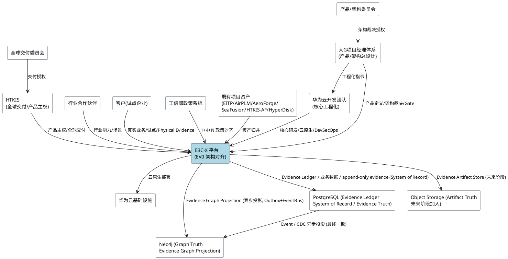

---

# **4. DFX约束**

## **4.1 性能**

1. **核心交易接口响应时间**：EBC-X Transaction Core 的核心业务交易接口（订单创建、合同签署、发票生成、付款执行等）P95 响应时间必须 ≤ 500ms。
   a. 验收条件：[试点客户在生产规模负载下发起核心交易] → [P95 响应时间 ≤ 500ms]
2. **Evidence Graph 查询响应时间**：Evidence Graph 单跳/两跳查询 P95 响应时间必须 ≤ 200ms，三跳及以上查询 P95 必须 ≤ 1s。
   a. 验收条件：[Policy Engine 或 Agent 发起 Evidence Graph 图查询] → [对应跳数的 P95 满足上限]
3. **EBC-X Core Benchmark Profile 规则**：EBC-X Core 吞吐量必须以 Benchmark Profile 形式定义，避免单一"单实例 ≥ 2000 TPS"绝对指标（交易类型/字段数/Evidence 数/是否同步写 Neo4j/是否产生审计/是否开启 RLS/租户数/并发数/机器规格均影响 TPS）。EV0 阶段建立 Profile 框架与 B1 目标，B2~B5 具体参数在 design.md 细化：
   - **B1 Transaction Profile（EV0 锁定目标）**：
     - 场景：Create Order + validation + tenant RLS + transaction commit + evidence append + audit
     - Payload ≤ 16KB
     - Concurrency / CPU / Memory：由 design.md 基准定义
     - Target：P95 ≤ 500ms，Throughput ≥ 2000 TPS，Error Rate ≤ 0.1%
   - **B2 Contract Profile（预留定义位，design.md 细化）**
   - **B3 Invoice Profile（预留定义位，design.md 细化）**
   - **B4 Inventory Profile（预留定义位，design.md 细化）**
   - **B5 Production Profile（预留定义位，design.md 细化）**
   a. 验收条件：[按 B1 Profile 压测] → [P95 ≤ 500ms 且 Throughput ≥ 2000 TPS 且 Error Rate ≤ 0.1%，系统稳定无错误率上升]
4. **Agent 执行延迟**：Governed Agent 从决策到执行完成（含权限校验、政策匹配、审批流转）的端到端延迟必须 ≤ 2s（同步路径）或可接受异步回调（异步路径）。
   a. 验收条件：[Agent 发起业务执行请求] → [同步路径 ≤ 2s 返回，或异步路径返回可追踪任务 ID]

## **4.2 可靠性**

1. **系统可用性目标**：EBC-X Core 必须达到 ≥ 99.95% 的可用性（年停机 ≤ 4.38 小时）。
   a. 验收条件：[全年运行] → [可用性 ≥ 99.95%]
2. **Evidence 不可篡改性**：append-only evidence 表必须保证一旦写入即不可修改、不可删除，任何篡改尝试必须被拒绝并审计。
   a. 验收条件：[任何角色尝试 UPDATE/DELETE evidence 记录] → [操作被拒绝并写入审计日志]
3. **故障恢复时间上限与 RPO 分级定义**：EBC-X Core 单实例故障恢复时间（RTO）必须 ≤ 5 分钟。RPO 采用分级定义，**核心交易 RPO ≤ 0（已提交事务不得丢失）**，灾备场景按以下分级：
   | 场景 | RPO |
   | --- | --- |
   | 单实例故障 | 0 |
   | 单 AZ 故障 | 0 |
   | 数据库节点故障 | 0 |
   | 同城灾备 | ≤ 30s |
   | 异地灾备 | ≤ 5min |
   | 极端区域级灾难 | 按 Country Pack / 部署等级 |
   a. 验收条件：[对应故障场景] → [RTO ≤ 5min 且 RPO 满足对应分级上限，核心交易已提交事务零丢失]
4. **数据一致性级别与 Neo4j 异步投影规则**：核心交易必须满足强一致性（线性化），PostgreSQL 事务提交即业务完成。**Neo4j Evidence Graph Projection 是异步投影**，通过 **Outbox + Event Bus 模式**与 PostgreSQL 解耦：PostgreSQL 事务内同时写入业务数据 + Evidence Ledger + Outbox Event，事务提交后由 Event Bus 异步消费 Outbox 投影至 Neo4j。**Neo4j 失败绝不能拖垮 Transaction Core**，Neo4j Graph 投影与 PostgreSQL Evidence Ledger 之间满足最终一致性且收敛时间 ≤ 3s。
   - **架构约束**：禁止 Neo4j 同步写入参与 PostgreSQL 事务协调（避免 Graph 数据库拖垮 Transaction Core）。
   a. 验收条件：[交易提交后] → [PostgreSQL 事务提交即业务完成；Neo4j 经 Outbox+EventBus 异步投影，3s 内达到最终一致；Neo4j 失败不影响 Transaction Core]

## **4.3 安全性**

1. **接口认证方式**：所有 EBC-X 对外接口必须强制认证，REST API 第一入口采用 OAuth2 + JWT，GraphQL 适配层复用同一认证体系。
   a. 验收条件：[未携带有效凭证的请求] → [返回 401 并审计]
2. **行级数据权限**：PostgreSQL 必须启用 RLS（Row Level Security），所有业务表的数据访问必须受 roles 与租户/组织维度约束。
   a. 验收条件：[用户越权访问非授权组织数据] → [RLS 拦截并返回空集或 403]
3. **敏感数据加密要求**：证据数据、凭证、个人身份信息必须在传输（TLS 1.2+）与存储（字段级加密）双重加密。
   a. 验收条件：[抓包或存储 inspection] → [敏感数据均为密文]
4. **关键操作审计要求**：所有涉及核心账务修改、Evidence 写入、Policy 变更、Agent 执行的操作必须写入不可篡改的审计日志。
   a. 验收条件：[发起上述操作] → [审计日志记录操作主体、时间、前后状态且不可篡改]
5. **HTKIS-AF 作为安全基座**：所有认证、鉴权、加密、审计能力必须由 HTKIS-AF 归并后的 Enterprise Security Foundation 统一供给，禁止各模块自建安全能力。
   a. 验收条件：[任何模块尝试自建认证/鉴权] → [架构评审拒绝]

## **4.4 可维护性**

1. **必须接入的监控指标**：EBC-X 必须接入华为云 APM/云监控，暴露核心交易 QPS、延迟分位、错误率、Evidence 写入速率、Agent 执行成功率、Policy 命中率等指标。
   a. 验收条件：[系统运行] → [上述指标可在监控面板实时查看]
2. **日志格式与内容规范**：所有日志必须采用结构化 JSON，包含 traceId、spanId、租户、操作主体、业务对象 ID，且 Evidence 相关日志必须独立流转至 append-only 日志通道。
   a. 验收条件：[任意服务日志] → [包含上述字段且 Evidence 日志独立 append-only]
3. **链路追踪要求**：全链路必须接入分布式追踪（OpenTelemetry），从 REST 入口到 Evidence 写入必须可串联单一 traceId。
   a. 验收条件：[发起一次完整业务链路] → [追踪系统可展示端到端调用链]
4. **架构治理可演进性**：10 项 EV0 架构文档必须纳入版本化管理，任何架构变更必须经过大G项目经理体系评审并更新文档版本。
   a. 验收条件：[架构变更提议] → [经评审通过且文档版本号递增]

## **4.5 兼容性**

1. **接口变更兼容策略**：REST API 采用 `/api/v1/rel/*` 版本化路径，破坏性变更必须新增版本号并保留旧版本至少 2 个 EV 周期。
   a. 验收条件：[发起破坏性接口变更] → [新版本号发布且旧版本保留]
2. **既有项目资产迁移要求**：EITP、AirPLM/MES、AeroForge-X、SeaFusion-X、HTKIS-AF、HTKIZ/HyperDisk 的归并必须保证存量数据可迁移、存量接口可适配，禁止归并导致存量客户不可用。
   a. 验收条件：[归并既有项目] → [存量数据完成迁移且存量接口保持可用]
3. **全球化数据迁移要求**：Global Core 与各 Country Pack 之间的数据模型必须保持核心字段一致，本地化字段必须以扩展表形式附加，禁止核心表因本地化而分叉。
   a. 验收条件：[新增 Country Pack] → [核心表结构不变且本地化字段以扩展表附加]
4. **云底座可迁移性**：EBC-X 必须保持对华为云的优先适配但不产生不可逆厂商锁定，核心能力必须可在符合标准的云原生环境运行。
   a. 验收条件：[将 EBC-X 部署至非华为云标准云原生环境] → [核心能力可运行]

---

# **5. 核心能力**

## **5.1 产品边界与第一性原理链路**

### **5.1.1 业务规则**

1. **第一性原理链路不可变规则（适用范围：Mutation 路径）**：EBC-X 中**所有"业务状态变更、受治理决策及自动化执行行为"**必须遵循 Business→Event→Transaction→Data→Evidence→Policy→Decision→(Human|Agent)→Execution→Verification→Closure 的不可变链路，任何环节不得跳过或倒置。
   - **Read/Query 分流**：Read/Query 路径（如用户查询订单、管理员查看报表、Dashboard 聚合查询）不强制走完整 11 阶段链路，直接经 Evidence Ledger / Graph Projection 查询返回，受 RLS 与权限约束即可。
   - **Mutation 路径**：业务状态变更、受治理决策及自动化执行必须走完整 Governed Execution Chain。
   a. 验收条件：[业务行为被触发] → [Read/Query 路径直接查询返回；Mutation 路径完整覆盖链路各环节且顺序不可变]
2. **Evidence 前置规则**：任何 Agent 执行与 Decision 输出必须以已形成的 Evidence 为输入，禁止无 Evidence 支撑的决策与执行。
   a. 验收条件：[Agent 或 Decision 发起] → [其输入可追溯到已写入的 Evidence 记录]
3. **Policy 前置规则**：任何 Agent 执行必须先经 Policy Engine 匹配，Policy 未命中或拒绝时禁止执行。
   a. 验收条件：[Agent 发起执行] → [Policy Engine 已匹配且未拒绝方可继续]
4. **Verification 闭环规则**：每次 Agent Execution 必须产生 Verification 结果，Verification 通过后方可形成新的可信 Evidence 并写入 Evidence Graph。
   a. 验收条件：[Agent 执行完成] → [产生 Verification 结果且通过后写入新 Evidence]
5. **与传统 ERP 差异化规则**：EBC-X 必须以"业务事件→证据→决策→智能体→验证→新证据"的闭环作为根本范式，禁止退化为传统"订单→库存→财务"的线性 ERP 模型。
   a. 验收条件：[架构评审] → [核心链路体现闭环范式而非线性 ERP 模型]
6. **禁止项：跳过 Evidence 直接决策**：禁止任何决策或执行绕过 Evidence 环节直接基于原始数据行动。
   a. 验收条件：[决策或执行尝试绕过 Evidence] → [架构评审拒绝]
7. **禁止项：Agent 绕过治理**：禁止 Agent 绕过权限、政策和审批直接修改核心账务。
   a. 验收条件：[Agent 尝试绕过治理修改核心账务] → [操作被拒绝并审计]

### **5.1.2 交互流程**

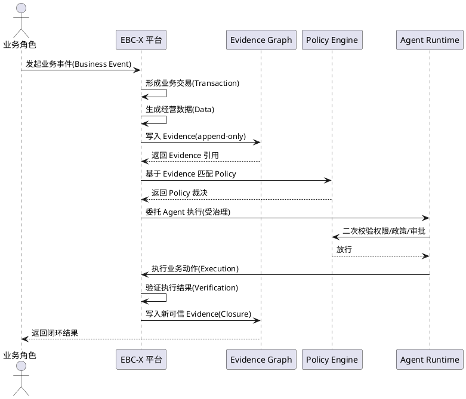

### **5.1.3 异常场景**

1. **Evidence 写入失败**
   a. 触发条件：append-only evidence 表写入失败（存储故障、约束冲突）
   b. 系统行为：回滚当前交易，记录失败原因至审计日志，不产生任何后续 Decision/Agent 行为
   c. 用户感知：返回错误码 EBCX-EVIDENCE-WRITE-FAIL，提示"证据写入失败，交易已回滚"
2. **Policy 未命中**
   a. 触发条件：Policy Engine 对当前 Evidence 无匹配规则
   b. 系统行为：阻断 Agent 执行，进入人工审批队列或返回未决
   c. 用户感知：返回错误码 EBCX-POLICY-NO-MATCH，提示"无匹配政策，已转人工审批"
3. **Agent 执行被治理拒绝**
   a. 触发条件：Agent 二次校验时权限/政策/审批未通过
   b. 系统行为：中止执行，记录拒绝原因至审计日志，不写入新 Evidence
   c. 用户感知：返回错误码 EBCX-AGENT-GOVERN-REJECT，提示"智能体执行被治理拒绝"
4. **Verification 失败**
   a. 触发条件：Agent 执行结果未通过 Verification
   b. 系统行为：不写入新可信 Evidence，标记执行为失败，触发补偿或人工介入
   c. 用户感知：返回错误码 EBCX-VERIFY-FAIL，提示"执行验证失败，已触发补偿"

## **5.2 模块树与既有项目归并关系**

### **5.2.1 业务规则**

1. **三大核心划分规则**：EBC-X 必须划分为 Business Core、Industrial Core、Trust Core 三大核心，所有能力必须归入且仅归入其中一个核心。
   a. 验收条件：[任意能力模块] → [唯一归属于 Business/Industrial/Trust Core 之一]
2. **Business Core 归并规则**：Business Core 必须归并 EITP 作为 Transaction Core，承载企业/组织/主数据/权限/财务/供应链能力。
   a. 验收条件：[EITP 资产归并] → [形成 EBC-X Transaction Core 且承载上述能力]
3. **Industrial Core 归并规则**：Industrial Core 必须归并 AirPLM/MES 作为 Industrial Manufacturing Core，归并 SeaFusion-X 作为 Digital Twin Validation Engine。
   a. 验收条件：[AirPLM/MES 与 SeaFusion-X 归并] → [形成制造核心与数字孪生验证引擎]
4. **Trust Core 归并规则**：Trust Core 必须归并 AeroForge-X 作为 Evidence Governance Engine，归并 HTKIS-AF 作为 Enterprise Security Foundation，归并 HTKIZ/HyperDisk 作为 Evidence Storage / Data Preservation Infrastructure。
   a. 验收条件：[AeroForge-X/HTKIS-AF/HTKIZ 归并] → [形成证据治理、安全基座、证据存储三大能力]
5. **归并优先于重建规则**：所有既有项目能力必须优先归并复用，仅在既有能力无法满足第一性原理链路时方可新建，且新建必须经大G项目经理体系评审。
   a. 验收条件：[能力建设提议] → [优先评估既有项目归并可行性，新建需评审通过]
6. **禁止项：从零重建既有能力**：禁止在既有项目已具备能力的情况下从零重建。
   a. 验收条件：[提议从零重建既有能力] → [架构评审拒绝]

### **5.2.2 交互流程**

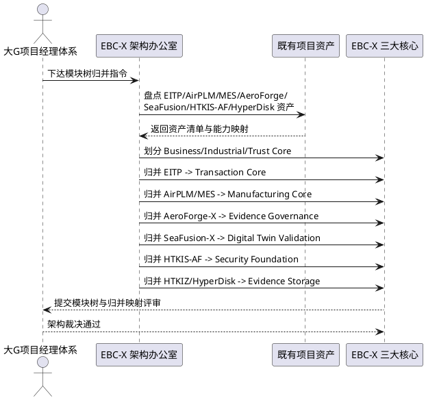

### **5.2.3 异常场景**

1. **既有项目能力冲突**
   a. 触发条件：多个既有项目对同一能力提供重叠实现
   b. 系统行为：由大G项目经理体系裁决保留方，其余归并为适配层或弃用
   c. 用户感知：架构评审记录裁决结论与保留理由
2. **归并导致存量不可用**
   a. 触发条件：归并方案使存量客户数据或接口不可用
   b. 系统行为：驳回归并方案，要求提供迁移与适配方案
   c. 用户感知：返回评审意见"归并方案需补充迁移与适配方案"

## **5.3 技术栈约束**

### **5.3.1 业务规则**

1. **云原生底座规则**：EBC-X 必须基于华为云云原生架构构建，容器化部署，禁止裸机单体部署。
   a. 验收条件：[部署 EBC-X] → [以容器化方式部署于华为云云原生环境]
2. **PostgreSQL 持久层规则**：业务数据持久层必须采用 PostgreSQL，且必须启用 RLS（行级安全）、roles（角色）、indexes（索引）、append-only 表（证据表）。
   a. 验收条件：[持久层评审] → [PostgreSQL 已启用 RLS/roles/indexes/append-only]
3. **三层真相模型规则**：EBC-X 必须采用三层真相模型：
   - **Evidence Truth = PostgreSQL Evidence Ledger / System of Record**：原始 Evidence、交易事实、Evidence 元数据、审计事实、版本、租户隔离、时间序列关系的权威持久化真相源。
   - **Graph Truth = Neo4j Evidence Graph Projection / Graph Query Truth**：Evidence Graph 的权威关系查询模型，承载图关系、路径、子图、关系推理、Policy 查询、Agent 上下文查询，**而非原始事实的唯一持久化真相源**。
   - **Artifact Truth = Immutable Object Storage**：不可变证据原件存储（PDF/图片/CAD/质检报告/发票原件/合同附件/生产数据文件/传感器数据快照）。
   - **裁决优先级**：当 PostgreSQL→Neo4j 不一致时，以 PostgreSQL Evidence Ledger 为最终事实裁决源，Neo4j 通过 Event Replay 重建。
   a. 验收条件：[架构评审] → [三层真相模型已建立，PostgreSQL 为 System of Record，Neo4j 为 Graph Query Truth 投影层，Object Storage 为 Artifact Truth]
4. **REST 第一入口规则**：对外 API 必须以 REST API（`/api/v1/rel/*`）为第一入口，GraphQL 作为第二适配层，禁止以 GraphQL 为唯一入口。
   a. 验收条件：[对外接口评审] → [REST 为第一入口且 GraphQL 为适配层]
5. **领域驱动设计规则**：业务模块必须采用 DDD，以聚合根封装业务不变式，以 Orchestrator 编排跨聚合流程，禁止贫血模型与跨聚合直接调用。
   a. 验收条件：[业务模块评审] → [采用聚合根 + Orchestrator 且无贫血模型]
6. **双语言架构规则**：系统级与算法级能力采用 Rust，业务级与编排级能力采用 Go，两者通过明确接口边界协作，禁止无边界混用。
   a. 验收条件：[代码评审] → [Rust/Go 按边界分工且接口明确]
7. **前端技术栈规则**：管理面前端必须采用 React + Antd + Vite 构建，工程化 UI 采用 React，禁止混用其他前端框架。
   a. 验收条件：[前端评审] → [采用 React + Antd + Vite]
8. **禁止项：厂商不可逆锁定**：禁止采用导致不可逆厂商锁定的技术选型，核心能力必须保持标准云原生可迁移性。
   a. 验收条件：[技术选型提议] → [不产生不可逆厂商锁定]
9. **禁止项：为 AI 而 AI**：禁止脱离第一性原理链路单纯堆砌 AI 能力，AI Agent 必须受治理且服务于闭环。
   a. 验收条件：[AI 能力提议] → [服务于第一性原理闭环且受治理]

### **5.3.2 交互流程**

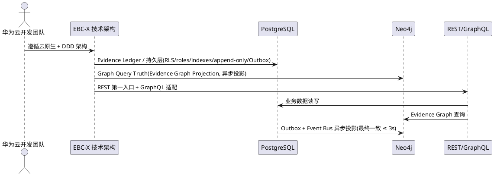

### **5.3.3 异常场景**

1. **技术选型违反约束**
   a. 触发条件：某模块技术选型违反上述任一规则
   b. 系统行为：架构评审驳回，要求改用合规选型
   c. 用户感知：返回评审意见"技术选型违反约束，需改用 X"
2. **Graph Projection 与 Evidence Ledger 不一致**
   a. 触发条件：Neo4j Evidence Graph Projection 与 PostgreSQL Evidence Ledger 超过收敛窗口未一致
   b. 系统行为：以 PostgreSQL Evidence Ledger 为最终事实裁决源，触发 Neo4j Event Replay 重建任务，告警并阻断依赖图一致性的查询
   c. 用户感知：返回错误码 EBCX-GRAPH-CONSISTENCY-FAIL，提示"图谱投影与证据账本不一致，正在以 Evidence Ledger 为准重建"

## **5.4 数据库与事件模型**

### **5.4.1 业务规则**

1. **事件驱动规则**：EBC-X 必须采用事件驱动架构，业务行为以事件为起点，事件经 Transaction 落地后产生 Evidence。
   a. 验收条件：[业务行为触发] → [以事件形式发起并经 Transaction 落地]
2. **Append-Only Evidence 表规则**：所有 Evidence 必须写入 append-only 表，仅允许追加，禁止 UPDATE 与 DELETE，任何修改尝试必须被数据库层拒绝。
   a. 验收条件：[尝试 UPDATE/DELETE evidence 表] → [数据库拒绝并审计]
3. **Evidence 不可篡改审计规则**：任何对 evidence 表的访问（读/写尝试）必须记录审计日志，包含主体、时间、操作类型。
   a. 验收条件：[访问 evidence 表] → [审计日志记录访问行为]
4. **Evidence Graph 节点定义规则**：Evidence Graph 必须包含 24 类实体节点（含 Approval 审批实体作为一等公民，详见 5.5 Evidence Graph 规范），节点必须具备唯一 ID、类型、版本、来源 Evidence 引用。
   a. 验收条件：[Evidence Graph 评审] → [24 类节点全部定义且具备上述属性，Approval 为一等公民]
5. **Evidence Graph 边定义规则**：Evidence Graph 的边必须表达业务关系（如 Order→Contract→Invoice→Payment 的归属关系、Production→Quality 的产出关系等），边必须具备类型、方向、来源 Evidence 引用、时间戳。
   a. 验收条件：[Evidence Graph 评审] → [边表达业务关系且具备上述属性]
6. **Event-Native + CQRS + Evidence Ledger 规则**：Core Transaction 必须具备 Event Sourcing / Event Replay 能力（可从事件流重建当前状态）；**不强制所有查询模型直接由事件重放生成**。采用 Command→Aggregate→Transaction→Event→Evidence→Projection 架构，Projection 可分发至 PostgreSQL Read Model / Neo4j / Search / Analytics 等多个读模型。即 **Event-Native + CQRS + Evidence Ledger**，而非 Everything = Event Sourcing。
   a. 验收条件：[Core Transaction] → [具备 Event Sourcing/Replay 能力；查询模型可由 Projection 分发而非强制全量事件重放]
7. **禁止项：可变 Evidence**：禁止以可变表存储 Evidence，禁止任何形式的 Evidence 覆盖写。
   a. 验收条件：[提议可变 Evidence 存储] → [架构评审拒绝]

### **5.4.2 交互流程**

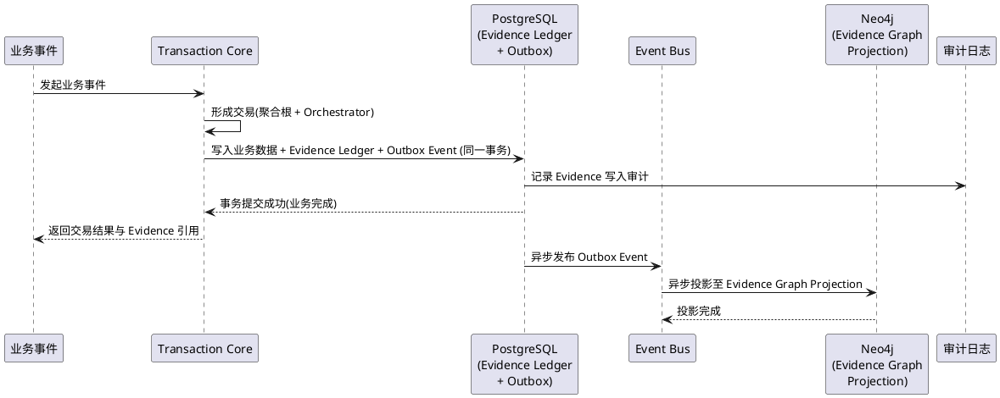

### **5.4.3 异常场景**

1. **Append-Only 写入冲突**
   a. 触发条件：并发写入同一 Evidence 键导致冲突
   b. 系统行为：采用幂等键去重，冲突时保留首次写入并记录后续为重复
   c. 用户感知：返回成功（幂等）或错误码 EBCX-EVIDENCE-DUP
2. **Event Replay 重建失败**
   a. 触发条件：Core Transaction 事件流缺失或损坏导致 Event Replay 重建失败
   b. 系统行为：告警并阻断依赖该状态的查询，触发人工修复；查询模型若由 Projection 分发则可独立降级
   c. 用户感知：返回错误码 EBCX-REPLAY-FAIL，提示"事件重放重建失败"

## **5.5 Evidence Graph 规范**

### **5.5.1 业务规则**

1. **24 类实体节点规则（第一版 Canonical Evidence Graph Core）**：Evidence Graph 必须包含以下 24 类实体节点：Enterprise、Organization、Person、Product、Material、Supplier、Customer、Order、Contract、Invoice、Payment、Production、Quality、Asset、Project、Patent、R&D、Data、Evidence、Event、Policy、Decision、Approval、Agent。
   - **Approval（审批）**：作为 Evidence Graph 一等公民，承载权限→Policy→审批→Execution 链路中的审批流转事实，使审批链成为 Graph 中可查询、可追溯、可治理的实体节点，而非游离于 Graph 之外的旁路记录。
   - **24 = 第一版 Canonical Evidence Graph Core**：EV0 阶段锁定 24 类实体作为 Canonical Core，后续 Location/Workflow/Document/Shipment/Inventory/WorkOrder 等扩展实体留待 design.md 与后续 EV 阶段评估，EV0 不无限扩张实体数量。
   a. 验收条件：[Evidence Graph Specification 评审] → [24 类节点全部定义且无遗漏，Approval 作为一等公民存在]
2. **节点属性规则**：每个节点必须具备唯一 ID、实体类型、版本号、创建时间、来源 Evidence 引用、租户/组织归属。
   a. 验收条件：[任意节点] → [具备上述全部属性]
3. **边关系定义规则**：Evidence Graph 必须至少定义以下关系类别：
   - 归属关系：Order→Contract→Invoice→Payment、Organization→Person、Enterprise→Organization
   - 交易关系：Customer→Order、Supplier→Order、Order→Production
   - 产出关系：Production→Quality、Production→Product、R&D→Patent→Product
   - 资产关系：Asset→Production、Asset→Organization
   - 证据关系：Event→Evidence、Evidence→Decision、Decision→Agent
   - 治理关系：Policy→Decision、Policy→Agent、Policy→Approval、Approval→Decision、Approval→Agent
   - 审批关系：Decision→Approval→Execution、Approval→Evidence（审批事实固化为 Evidence）
   - 数据关系：Data→Evidence、Data→Production
   a. 验收条件：[Evidence Graph Specification 评审] → [上述关系类别全部定义且审批链路为图一等公民]
4. **Graph Truth 权威性规则（Graph Query Truth）**：Neo4j 作为 Graph Truth 是 Evidence Graph 的权威**关系查询**来源（Graph Query Truth），任何 Policy Engine 与 Agent Runtime 的图查询必须以 Neo4j 为准；但 Neo4j **不是原始事实的唯一持久化真相源**，原始事实真相源为 PostgreSQL Evidence Ledger（Evidence Truth）。当二者不一致时以 PostgreSQL 为最终裁决源。
   a. 验收条件：[Policy/Agent 发起图查询] → [查询指向 Neo4j Graph Query Truth；事实裁决以 PostgreSQL Evidence Ledger 为准]
5. **Evidence 可追溯规则**：Evidence Graph 中任意节点与边必须可追溯到至少一条 append-only evidence 记录。
   a. 验收条件：[查询任意节点/边的来源] → [可定位到 evidence 记录]
6. **禁止项：无 Evidence 支撑的节点/边**：禁止在 Evidence Graph 中创建无 Evidence 支撑的节点或边。
   a. 验收条件：[尝试创建无 Evidence 支撑的节点/边] → [操作被拒绝]

### **5.5.2 交互流程**

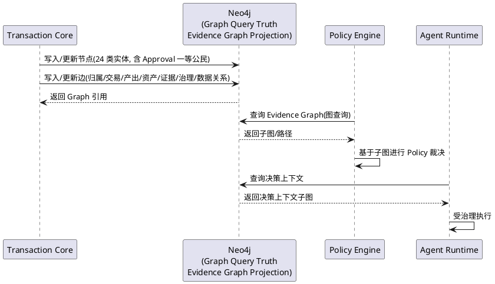

### **5.5.3 异常场景**

1. **Graph Truth 查询超时**
   a. 触发条件：Neo4j 图查询超过 4.1.2 定义的分位延迟上限
   b. 系统行为：降级返回缓存子图或阻断并告警
   c. 用户感知：返回降级结果或错误码 EBCX-GRAPH-TIMEOUT
2. **节点/边缺少 Evidence 支撑**
   a. 触发条件：写入节点/边时未提供 Evidence 引用
   b. 系统行为：拒绝写入并审计
   c. 用户感知：返回错误码 EBCX-GRAPH-NO-EVIDENCE

## **5.6 Governed Agent 架构约束**

### **5.6.1 业务规则**

1. **治理前置规则**：Governed Agent 在执行任何业务动作前必须依次通过权限校验、Policy Engine 匹配、审批流转，三者任一未通过则禁止执行。
   a. 验收条件：[Agent 发起执行] → [依次通过权限/Policy/审批后方可执行]
2. **Agent Evidence Provenance 规则**：Agent 的**治理决策上下文**必须具有 Evidence Provenance。Agent 可以读取 Current State + Evidence + Policy + Master Data（如 Order/Inventory/Customer/Price/Currency/Tax 等当前状态与主数据），但**任何影响决策的关键事实必须可追溯到 Evidence**。
   - **设计意图**：避免要求 Agent 每次查询 Order/Inventory/Customer/Price/Currency/Tax 都先转 Evidence Graph 造成性能不可接受；改为要求"决策关键事实可追溯"而非"全部输入必须来自 Graph"。
   a. 验收条件：[Agent 决策输入] → [可读取 Current State/Evidence/Policy/Master Data，但影响决策的关键事实可追溯到 Evidence 记录]
3. **执行可审计规则**：Agent 的每一次执行必须记录输入 Evidence、Policy 裁决、审批链、执行动作、Verification 结果至审计日志。
   a. 验收条件：[Agent 执行] → [审计日志完整记录上述要素]
4. **Verification 闭环规则**：Agent 执行后必须产生 Verification 结果，通过后方可写入新 Evidence，未通过则触发补偿。
   a. 验收条件：[Agent 执行完成] → [产生 Verification 且通过后写入新 Evidence]
5. **Agent 能力边界规则**：Agent 的能力范围必须由 Policy 显式授权，未授权能力禁止 Agent 执行。
   a. 验收条件：[Agent 尝试执行未授权能力] → [操作被拒绝]
6. **禁止项：Agent 绕过治理修改核心账务**：禁止 Agent 绕过权限、政策、审批直接修改核心账务（订单、合同、发票、付款、库存等）。
   a. 验收条件：[Agent 尝试绕过治理修改核心账务] → [操作被拒绝并审计]
7. **禁止项：Agent 决策关键事实无 Evidence Provenance**：禁止 Agent 在**影响决策的关键事实**无 Evidence 支撑下做出决策（Agent 可读取 Current State/Master Data，但决策关键事实必须可追溯 Evidence）。
   a. 验收条件：[Agent 决策关键事实无 Evidence Provenance] → [操作被拒绝]

### **5.6.2 交互流程**

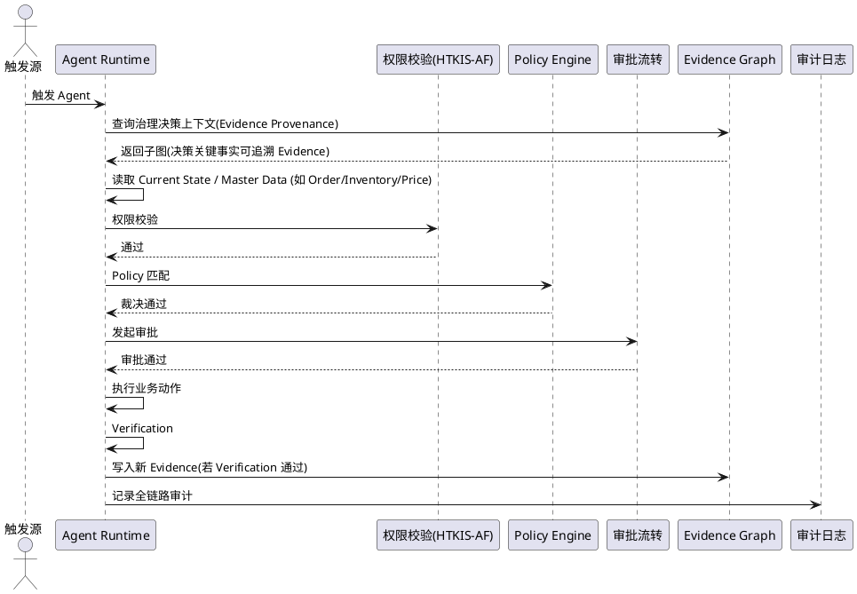

### **5.6.3 异常场景**

1. **权限校验未通过**
   a. 触发条件：Agent 主体无对应操作权限
   b. 系统行为：中止执行，审计拒绝原因
   c. 用户感知：返回错误码 EBCX-AGENT-AUTH-FAIL
2. **Policy 拒绝**
   a. 触发条件：Policy Engine 裁决为拒绝
   b. 系统行为：中止执行，审计 Policy 拒绝原因
   c. 用户感知：返回错误码 EBCX-AGENT-POLICY-REJECT
3. **审批超时**
   a. 触发条件：审批流转超时未决
   b. 系统行为：挂起执行，告警并转人工
   c. 用户感知：返回错误码 EBCX-AGENT-APPROVAL-TIMEOUT

## **5.7 权限与安全架构**

### **5.7.1 业务规则**

1. **HTKIS-AF 安全基座规则**：所有认证、鉴权、加密、审计能力必须由 HTKIS-AF 归并后的 Enterprise Security Foundation 统一供给，禁止各模块自建。
   a. 验收条件：[安全能力评审] → [由 HTKIS-AF 统一供给]
2. **RLS 行级安全规则**：PostgreSQL 所有业务表必须启用 RLS，数据访问必须受租户/组织维度与 roles 约束。
   a. 验收条件：[越权访问] → [RLS 拦截]
3. **统一认证规则**：REST API 与 GraphQL 必须复用同一 OAuth2 + JWT 认证体系，禁止双套认证。
   a. 验收条件：[认证评审] → [REST 与 GraphQL 共用同一认证]
4. **审计不可篡改规则**：审计日志必须写入 append-only 存储，禁止修改与删除。
   a. 验收条件：[尝试修改审计日志] → [被拒绝]
5. **租户隔离规则**：多租户场景下数据必须严格隔离，禁止跨租户数据泄露。
   a. 验收条件：[跨租户访问尝试] → [被拒绝并审计]
6. **禁止项：模块自建安全**：禁止任何模块自建认证、鉴权、加密、审计能力。
   a. 验收条件：[模块自建安全提议] → [架构评审拒绝]

### **5.7.2 交互流程**

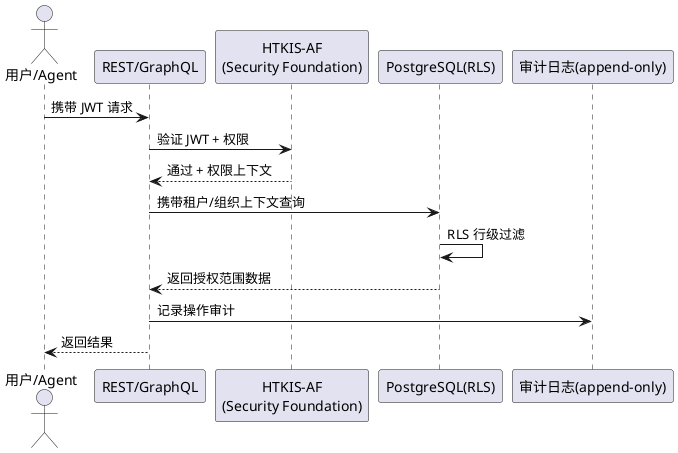

### **5.7.3 异常场景**

1. **JWT 无效或过期**
   a. 触发条件：请求携带的 JWT 无效或过期
   b. 系统行为：返回 401，审计失败原因
   c. 用户感知：返回 401 EBCX-AUTH-INVALID
2. **跨租户访问尝试**
   a. 触发条件：请求试图访问非授权租户数据
   b. 系统行为：RLS 拦截，审计并告警
   c. 用户感知：返回 403 EBCX-TENANT-ISOLATION

## **5.8 全球化架构**

### **5.8.1 业务规则**

1. **Global Core + Country Pack 规则**：EBC-X 必须采用 Global Core + Country Pack 模式，Global Core 为全球统一核心，Country Pack 为区域合规与本地化包。
   a. 验收条件：[全球化架构评审] → [采用 Global Core + Country Pack]
2. **首期 Country Pack 规则**：第一期必须至少预留 China、EU、US、Japan、ASEAN 五个 Country Pack 的扩展点。
   a. 验收条件：[架构评审] → [五个 Country Pack 扩展点已预留]
3. **核心表不分叉规则**：Global Core 与 Country Pack 之间核心字段必须一致，本地化字段必须以扩展表附加，禁止核心表因本地化分叉。
   a. 验收条件：[新增 Country Pack] → [核心表结构不变]
4. **合规优先规则**：Country Pack 必须满足对应区域的数据合规（如 EU GDPR、中国数据出境、US SOC2 等），合规未满足的 Country Pack 禁止上线。
   a. 验收条件：[Country Pack 上线] → [对应区域合规已满足]
5. **全球化从第一天设计规则**：全球化能力必须从 EV0 阶段开始设计，禁止事后补丁式国际化。
   a. 验收条件：[EV0 架构文档] → [包含 Globalization Architecture]
6. **禁止项：核心表本地化分叉**：禁止因本地化需求修改 Global Core 核心表结构。
   a. 验收条件：[提议修改核心表以适配本地化] → [架构评审拒绝]

### **5.8.2 交互流程**

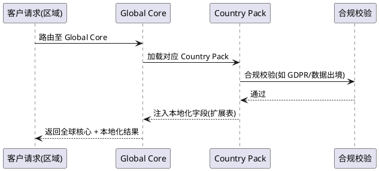

### **5.8.3 异常场景**

1. **Country Pack 合规未满足**
   a. 触发条件：Country Pack 未通过对应区域合规校验
   b. 系统行为：阻断该 Pack 上线，告警
   c. 用户感知：返回错误码 EBCX-GLOBAL-COMPLIANCE-FAIL
2. **核心表分叉尝试**
   a. 触发条件：Country Pack 提议修改核心表结构
   b. 系统行为：架构评审拒绝，要求改用扩展表
   c. 用户感知：返回评审意见"需改用扩展表附加本地化字段"

## **5.9 华为云部署架构**

### **5.9.1 业务规则**

1. **云原生部署规则**：EBC-X 必须以容器化方式部署于华为云云原生环境（CCE 等），禁止裸机单体部署。
   a. 验收条件：[部署评审] → [容器化部署于华为云云原生环境]
2. **DevSecOps 规则**：华为云团队必须采用 DevSecOps，安全左移，CI/CD 流水线必须集成 SAST/DAST/依赖扫描/镜像扫描。
   a. 验收条件：[CI/CD 流水线] → [集成四类安全扫描]
3. **基础设施即代码规则**：所有基础设施必须以 IaC 管理，禁止手工变更生产环境基础设施。
   a. 验收条件：[基础设施变更] → [通过 IaC 提交且经评审]
4. **可观测性规则**：EBC-X 必须接入华为云 APM/云监控/日志服务，满足 4.4 可维护性全部指标。
   a. 验收条件：[运行时] → [APM/监控/日志全部接入]
5. **多可用区高可用规则**：EBC-X Core 必须跨可用区部署，单可用区故障不影响服务。
   a. 验收条件：[单可用区故障] → [服务不中断]
6. **禁止项：手工变更生产基础设施**：禁止手工直接变更生产环境基础设施。
   a. 验收条件：[手工变更尝试] → [被拒绝并审计]
7. **禁止项：不可逆厂商锁定**：禁止采用导致不可逆厂商锁定的部署方案。
   a. 验收条件：[部署方案评审] → [不产生不可逆锁定]

### **5.9.2 交互流程**

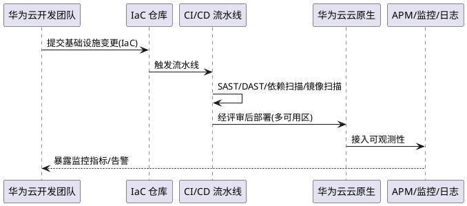

### **5.9.3 异常场景**

1. **安全扫描未通过**
   a. 触发条件：CI/CD 安全扫描发现高危问题
   b. 系统行为：阻断部署，告警并通知开发团队
   c. 用户感知：返回流水线失败 EBCX-DEVSECOPS-SCAN-FAIL
2. **单可用区故障**
   a. 触发条件：某可用区故障
   b. 系统行为：流量自动切换至健康可用区
   c. 用户感知：服务不中断

## **5.10 EV1~EV12 Gate 体系**

### **5.10.1 业务规则**

1. **Gate 强制规则**：每个 EV 阶段必须设立 Gate，未通过当前 Gate 不得进入下一阶段，禁止跨阶段并行编码。
   a. 验收条件：[任意阶段] → [未通过 Gate 不得进入下一阶段]
2. **Gate 三要素规则**：每个 Gate 必须明确定义进入条件、交付物、验收标准三要素，缺一不可。
   a. 验收条件：[Gate 定义评审] → [三要素齐全]
3. **EV0-G0 Gate 规则**：EV0-G0（Architecture Authorization）必须完成 10 项架构文档（Product Charter、Global Positioning、Policy Alignment、Domain Architecture、Technical Architecture、Data Architecture、Evidence Graph Specification、Security Architecture、Globalization Architecture、Development & Governance Rules）后方可解锁 EV1。
   a. 验收条件：[EV0-G0 评审] → [10 项文档全部完成且通过]
4. **阶段定义规则**：EV1~EV12 必须按以下定义建立 Gate：
   - EV1 Enterprise Core：企业/组织/主数据/权限
   - EV2 Transaction Core：EITP → EBC-X
   - EV3 Evidence Core：Evidence Graph
   - EV4 Finance：财务核心
   - EV5 SCM：供应链
   - EV6 Manufacturing：MES/生产
   - EV7 PLM/Quality/EAM：工业核心
   - EV8 Data Trust：工业数据基础设施
   - EV9 Agent Runtime：企业智能体
   - EV10 Digital Twin：企业数字孪生
   - EV11 Industry Network：产业链数据协同
   - EV12 Global Platform：全球化商业化
   a. 验收条件：[Gate 体系评审] → [EV1~EV12 全部定义且与上述一致]
5. **Gate 裁决权规则**：Gate 裁决权归属大G项目经理体系，华为云团队与 HTKIS 不得自判通过。
   a. 验收条件：[Gate 裁决] → [由大G项目经理体系作出]
6. **禁止项：绕过 Gate 编码**：禁止绕过 EV0 直接进入大规模业务编码，禁止绕过任意 Gate 进入下一阶段。
   a. 验收条件：[绕过 Gate 编码尝试] → [被拒绝并审计]

### **5.10.2 交互流程**

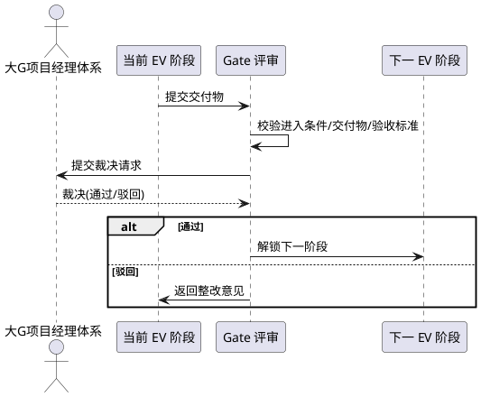

### **5.10.3 异常场景**

1. **Gate 交付物不全**
   a. 触发条件：提交的交付物缺失或不符合验收标准
   b. 系统行为：驳回，列出缺失项与整改意见
   c. 用户感知：返回 Gate 驳回意见
2. **绕过 Gate 尝试**
   a. 触发条件：未通过当前 Gate 即启动下一阶段编码
   b. 系统行为：中止下一阶段编码，审计并告警
   c. 用户感知：返回错误码 EBCX-GATE-BYPASS-BLOCKED

## **5.11 工信部 1+4+N 政策对齐矩阵（产品能力映射）**

> **对齐原则**：EBC-X 能力架构与工信部《工业数据筑基行动》提出的"1+4+N"体系进行产品能力映射。政策是政策、产品是产品，映射链路为：MIIT Policy → Capability Mapping → EBC-X Product Capability → Physical Implementation → Evidence。禁止政策包装式对齐。

### **5.11.1 业务规则**

1. **1 可信互联平台对齐规则（产品能力映射）**：EBC-X 必须提供 Enterprise Data Trust Platform，通过产品能力映射对应工信部"1：可信互联平台"（MIIT Policy → Capability Mapping → EBC-X Product Capability）。
   a. 验收条件：[政策对齐矩阵评审] → [Enterprise Data Trust Platform 经产品能力映射对齐"1：可信互联平台"]
2. **4 库对齐规则（产品能力映射）**：EBC-X 必须提供以下能力，通过产品能力映射对应工信部"4 个库"：
   - 数据资源库 → Enterprise Data Resource Lake
   - 数据技术库 → EBC-X Data Technology Hub
   - 工业数据标准库 → Enterprise Data Standard Graph
   - 高质量数据集库 → Evidence Dataset Platform
   a. 验收条件：[政策对齐矩阵评审] → [四库能力全部对齐]
3. **N 工业智能体对齐规则（产品能力映射）**：EBC-X 必须提供 Agent Runtime，通过产品能力映射对应工信部"N：工业智能体"（MIIT Policy → Capability Mapping → EBC-X Agent Runtime），且 Agent 必须受治理（见 5.6）。
   a. 验收条件：[政策对齐矩阵评审] → [Agent Runtime 经产品能力映射对齐"N：工业智能体"且受治理]
4. **政策对齐矩阵文档规则**：EV0 必须产出《EBC-X Policy Alignment》文档，明确每项工信部方向与 EBC-X 能力的映射关系。
   a. 验收条件：[EV0 交付物] → [包含 Policy Alignment 文档]
5. **政策更新跟踪规则**：EBC-X 必须建立工信部政策更新跟踪机制，政策变更时评估并更新对齐矩阵。
   a. 验收条件：[工信部政策变更] → [触发对齐矩阵评估与更新]
6. **禁止项：政策包装式对齐**：禁止仅为"政策包装"而对齐，对齐必须体现为真实产品能力。
   a. 验收条件：[对齐能力评审] → [对应能力真实可运行]

### **5.11.2 交互流程**

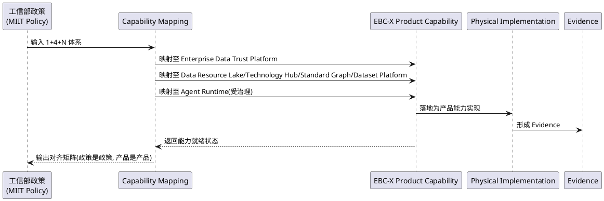

### **5.11.3 异常场景**

1. **政策变更导致对齐失效**
   a. 触发条件：工信部政策变更使现有对齐失效
   b. 系统行为：触发对齐矩阵评估，标记失效项并生成更新任务
   c. 用户感知：告警"政策对齐需更新"
2. **对齐能力未真实落地**
   a. 触发条件：对齐矩阵声明的能力未真实实现
   b. 系统行为：架构评审驳回，要求补齐真实能力
   c. 用户感知：返回评审意见"对齐能力需真实落地"

## **5.12 架构红线**

### **5.12.1 业务规则**

1. **红线一：禁止巨型 ERP**：禁止第一期直接开发 1000+ 页面 ERP 巨型应用。
   a. 验收条件：[第一期范围评审] → [非 1000+ 页面巨型 ERP]
2. **红线二：禁止大杂烩**：禁止先做"财务、采购、销售、库存、HR、CRM、OA"大杂烩式能力堆砌，第一阶段必须先建立 Core + Transaction + Evidence + Data + Policy 地基。
   a. 验收条件：[第一阶段范围] → [为 Core + Transaction + Evidence + Data + Policy 地基]
3. **红线三：禁止数百微服务**：禁止一开始拆成数百个微服务，必须以三大核心 + DDD 聚合根为粒度。
   a. 验收条件：[微服务划分评审] → [以三大核心 + 聚合根为粒度而非数百微服务]
4. **红线四：禁止为 AI 而 AI**：禁止脱离第一性原理链路单纯堆砌 AI，AI Agent 必须受治理且服务于闭环。
   a. 验收条件：[AI 能力评审] → [服务于闭环且受治理]
5. **红线五：禁止 Agent 绕过治理**：禁止 Agent 绕过权限、政策、审批直接修改核心账务。
   a. 验收条件：[Agent 行为评审] → [未绕过治理修改核心账务]
6. **红线六：禁止厂商锁定**：禁止形成厂商锁定架构，核心能力必须保持可迁移性。
   a. 验收条件：[架构评审] → [不形成不可逆厂商锁定]
7. **红线七：禁止绕过 EV0 编码**：禁止绕过 EV0 直接进入大规模业务编码。
   a. 验收条件：[研发启动评审] → [EV0-G0 通过后方可启动 EV1 编码]
8. **红线八：禁止开发团队决定产品架构**：禁止华为云团队反过来决定产品架构，产品架构裁决权归属大G项目经理体系。
   a. 验收条件：[架构裁决] → [由大G项目经理体系作出]
9. **禁止项：违反任一架构红线**：违反上述任一红线的提议或实现必须被架构评审拒绝。
   a. 验收条件：[违反红线提议] → [架构评审拒绝]

### **5.12.2 交互流程**

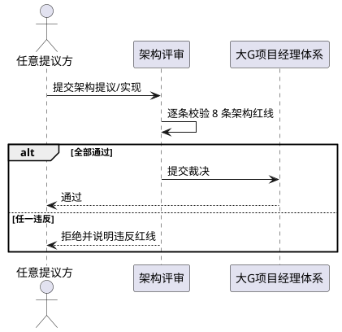

### **5.12.3 异常场景**

1. **架构红线违反**
   a. 触发条件：提议或实现违反任一架构红线
   b. 系统行为：架构评审拒绝，记录违反红线编号与原因
   c. 用户感知：返回拒绝意见"违反架构红线 X，需整改"

## **5.13 Evidence Provenance & Data Lineage（证据溯源与数据血缘）**

### **5.13.1 业务规则**

1. **Data Lineage 链路规则**：EBC-X 必须为重要数据建立完整 Data Lineage 链路：Data→Source→Event→Transaction→Evidence→Transformation→Decision→Agent→Execution→Verification。任何重要数据都必须能回答"Where did this fact come from?"。
   a. 验收条件：[查询任意重要数据的来源] → [可沿 Data Lineage 链路完整追溯到 Source 与 Evidence]
2. **Evidence Provenance 可追溯规则**：任意 Evidence 必须可追溯到 Source Event、Transaction、Operator、Policy、Verification，形成完整溯源子图。
   a. 验收条件：[查询任意 Evidence 的 Provenance] → [返回 Source Event/Transaction/Operator/Policy/Verification 完整引用]
3. **业务对象溯源子图规则**：任意核心业务对象（如 Invoice、Order、Contract、Payment）必须可查询其完整溯源子图，包含关联业务对象、Evidence、Source Event、Operator、Policy、Verification 引用。
   - **示例（Invoice 溯源子图）**：
     ```
     Invoice #INV-202609-001
            │
            ├── Order #ORD-...
            ├── Contract #CON-...
            ├── Customer #CUS-...
            ├── Payment #PAY-...
            ├── Evidence #EVD-...
            ├── Source Event #EVT-...
            ├── Operator #USR-...
            ├── Policy #POL-...
            └── Verification #VER-...
     ```
   a. 验收条件：[查询 Invoice/Order/Contract/Payment 等业务对象溯源子图] → [返回上述完整引用链]
4. **Digital Evidence Backbone 规则**：EBC-X 必须具备企业 Digital Evidence Backbone 能力，而非仅一个 ERP——任何重要经营数据均可溯源、可审计、可验证、可重放。
   a. 验收条件：[架构评审] → [Digital Evidence Backbone 能力成立，重要数据均可溯源/审计/验证/重放]
5. **Lineage 与三层真相模型联动规则**：Data Lineage 的原始事实以 PostgreSQL Evidence Ledger 为准（Evidence Truth），关系查询以 Neo4j Evidence Graph Projection 为准（Graph Truth），证据原件以 Object Storage 为准（Artifact Truth）。
   a. 验收条件：[Data Lineage 查询] → [事实裁决以 Evidence Ledger 为准，关系查询以 Graph Projection 为准，原件以 Object Storage 为准]
6. **禁止项：无 Provenance 的重要数据**：禁止重要数据无 Evidence Provenance 即对外作为决策依据或经营事实。
   a. 验收条件：[重要数据无 Provenance 即作为决策/经营事实] → [操作被拒绝]

### **5.13.2 交互流程**

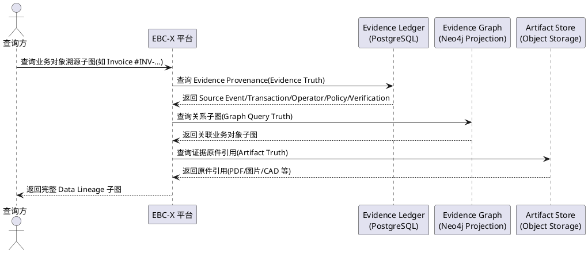

### **5.13.3 异常场景**

1. **Data Lineage 断链**
   a. 触发条件：某重要数据的 Data Lineage 链路缺失环节（如 Evidence 引用丢失、Source Event 缺失）
   b. 系统行为：标记该数据为"Lineage 不完整"，告警并阻断其作为决策依据
   c. 用户感知：返回错误码 EBCX-LINEAGE-BROKEN，提示"数据溯源链路不完整，已阻断决策使用"
2. **Provenance 查询失败**
   a. 触发条件：Evidence Provenance 查询因 Evidence Ledger 或 Graph Projection 故障失败
   b. 系统行为：降级返回部分溯源信息，标记缺失环节并告警
   c. 用户感知：返回部分溯源子图与错误码 EBCX-PROVENANCE-PARTIAL

---

# **6. 数据约束**

## **6.1 Evidence 记录**

1. **evidenceId**：全局唯一标识，必须为 UUID 或等价唯一 ID，不可空。
2. **evidenceType**：证据类型，必须对应业务事件类型（订单、合同、生产、质量等），不可空。
3. **payload**：证据内容，必须为结构化数据，包含业务事实快照，不可空。
4. **sourceEventId**：来源事件 ID，必须可追溯到原始业务事件，不可空。
5. **transactionId**：关联交易 ID，必须可追溯到 Transaction Core 中的交易，不可空。
6. **tenantId**：租户 ID，必须受租户隔离约束，不可空。
7. **createdAt**：创建时间，必须为写入时的服务端时间，不可空且写入后不可变。
8. **version**：版本号，必须单调递增，用于事件溯源与并发控制，不可空。
9. **immutability**：不可变性，记录一旦写入必须不可修改、不可删除（append-only）。

## **6.2 Evidence Graph 节点**

1. **nodeId**：节点全局唯一 ID，不可空。
2. **nodeType**：节点类型，必须为 24 类实体之一（Enterprise/Organization/Person/Product/Material/Supplier/Customer/Order/Contract/Invoice/Payment/Production/Quality/Asset/Project/Patent/R&D/Data/Evidence/Event/Policy/Decision/Approval/Agent），不可空。
3. **version**：节点版本号，必须单调递增，不可空。
4. **sourceEvidenceId**：来源 Evidence 引用，必须可追溯到 append-only evidence 记录，不可空。
5. **tenantId**：租户归属，必须受租户隔离约束，不可空。
6. **createdAt**：创建时间，不可空。
7. **properties**：节点业务属性，必须为结构化数据，可空（部分节点仅有拓扑意义）。

## **6.3 Evidence Graph 边**

1. **edgeId**：边全局唯一 ID，不可空。
2. **edgeType**：边类型，必须为定义的关系类别之一（归属/交易/产出/资产/证据/治理/审批/数据关系），不可空。
3. **fromNodeId / toNodeId**：起止节点 ID，必须指向已存在的节点，不可空。
4. **direction**：方向，必须为有向（from→to），不可空。
5. **sourceEvidenceId**：来源 Evidence 引用，必须可追溯到 append-only evidence 记录，不可空。
6. **createdAt**：创建时间，不可空。
7. **properties**：边业务属性，必须为结构化数据，可空。

## **6.4 Policy 规则**

1. **policyId**：策略全局唯一 ID，不可空。
2. **policyType**：策略类型（权限、审批、计算、禁止等），不可空。
3. **scope**：作用范围（节点类型、边类型、租户、组织），不可空。
4. **condition**：匹配条件，必须为可执行的表达式或规则集，不可空。
5. **action**：裁决动作（允许、拒绝、转人工审批），不可空。
6. **version**：版本号，必须单调递增，不可空。
7. **effectiveFrom / effectiveTo**：生效区间，effectiveTo 可空表示长期生效。

## **6.5 Agent 执行记录**

1. **agentExecutionId**：执行全局唯一 ID，不可空。
2. **agentId**：Agent 标识，不可空。
3. **inputEvidenceIds**：输入 Evidence 引用列表，必须非空且每项可追溯，不可空。
4. **policyDecisions**：Policy 裁决结果列表，必须包含权限、Policy、审批三环节结果，不可空。
5. **executionAction**：执行动作描述，不可空。
6. **verificationResult**：Verification 结果（通过/失败/补偿），不可空。
7. **outputEvidenceId**：输出 Evidence 引用，Verification 通过时必须非空，未通过时为空。
8. **auditTrail**：审计链，必须完整记录全链路，不可空。
9. **createdAt**：创建时间，不可空。

## **6.6 Gate 评审记录**

1. **gateId**：Gate 标识（如 EV0-G0、EV1-G1），不可空。
2. **deliverables**：交付物列表，必须对应该 Gate 定义的全部交付物，不可空。
3. **entryConditions**：进入条件校验结果，不可空。
4. **acceptanceCriteria**：验收标准校验结果，不可空。
5. **decision**：裁决结果（通过/驳回），由大G项目经理体系作出，不可空。
6. **decidedBy**：裁决主体，必须为大G项目经理体系，不可空。
7. **decidedAt**：裁决时间，不可空。
8. **remarks**：裁决意见，可空。

---

> **文档结束**
> 本 spec.md 定义 EBC-X EV0 架构对齐阶段的完整需求规格，覆盖产品边界、模块树、技术栈、数据库与事件模型、Evidence Graph、Agent 架构、权限安全、全球化、华为云部署、Gate 体系、政策对齐矩阵、架构红线、Evidence Provenance & Data Lineage 共 13 项要求。
> 本文档已执行 EBCX-EV0-SPEC-CORRECTION-001 全部 8 项修订 + 2 项附加修订（C01 24 Entity 修正、C02 三层真相模型、C03 First-Principle Chain 适用范围收窄、C04 Agent Evidence Provenance、C05 Event-Native+CQRS+Evidence Ledger、C06 RPO 分级、C07 Benchmark Profile、C08 Data Lineage 新模块 5.13、附加修订 1 Neo4j 异步投影+Outbox、附加修订 2 工信部政策产品能力映射措辞）。
> 后续 design.md（技术设计）与 tasks.md（任务分解）由 spec-design-agent 与 spec-task-agent 分别负责，本 agent 不予生成。