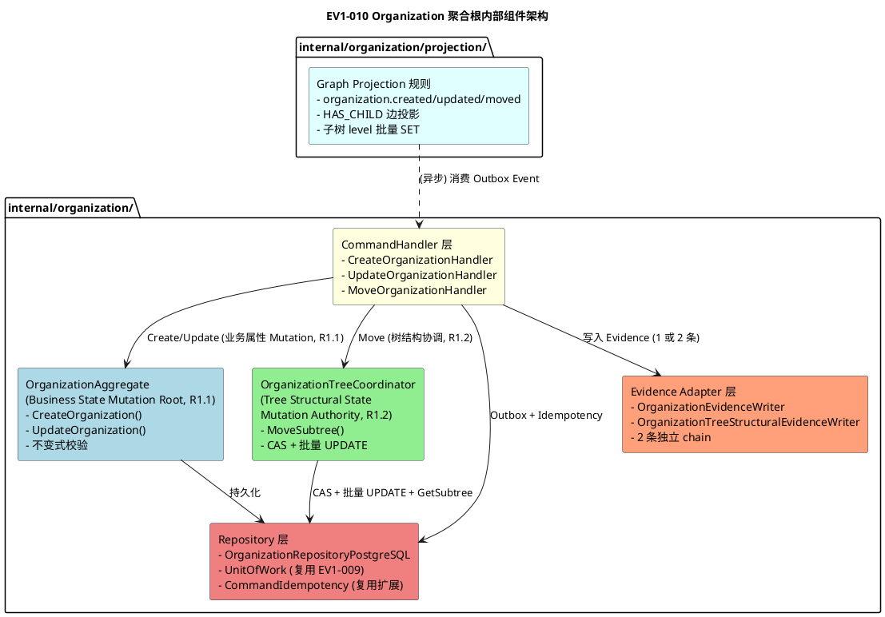
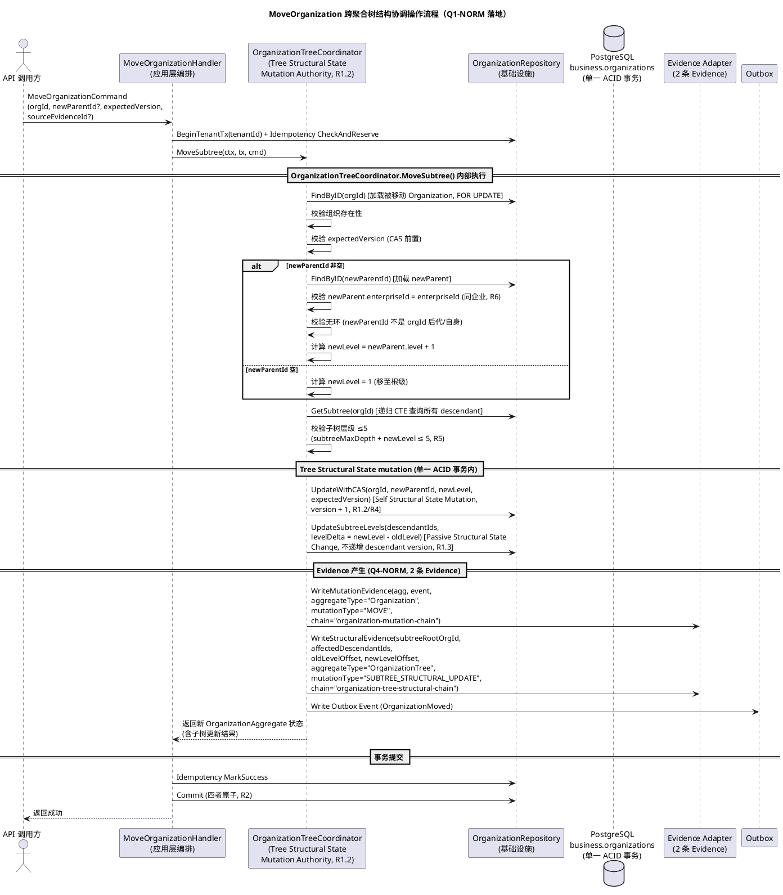
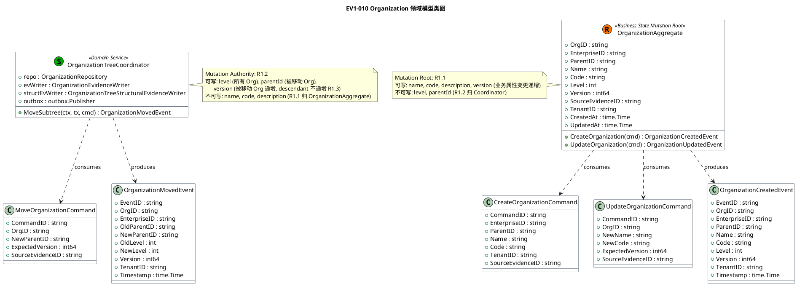
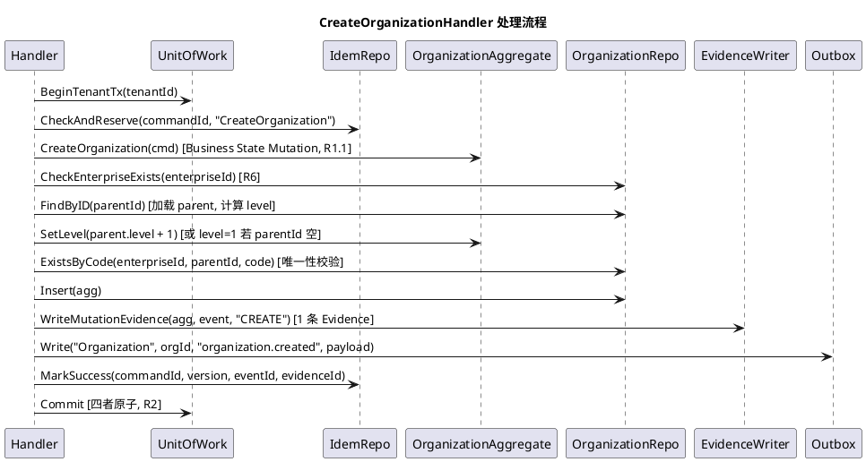
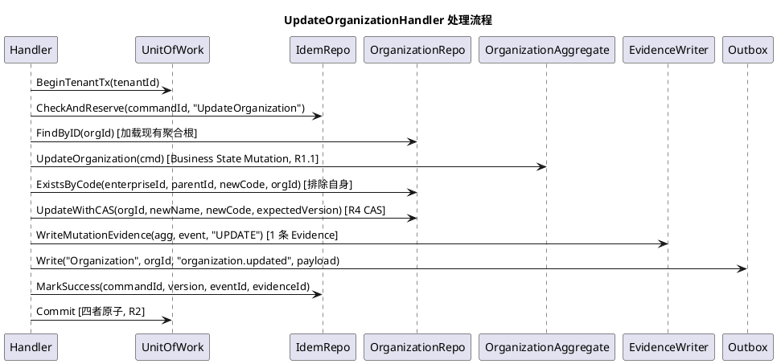
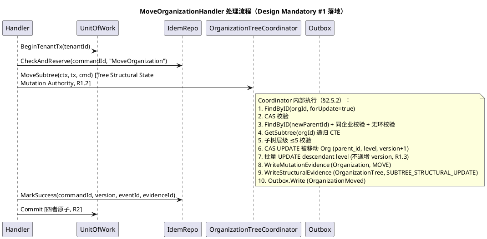
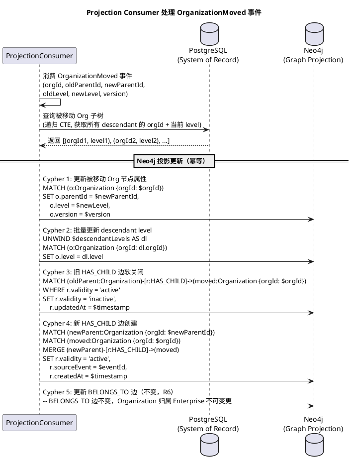
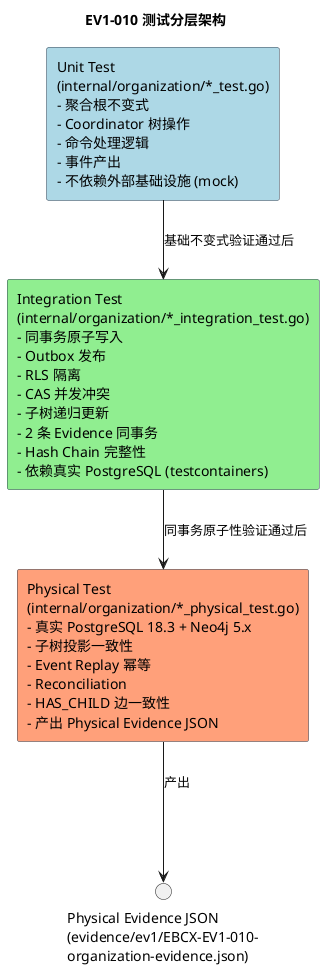

# EBC-X EV1-010 Organization 聚合根技术设计文档（design.md）

> **项目：EBC-X — Enterprise Business & Industrial Operating System（企业与工业智能运营操作系统）**
> **阶段：EV1 — Enterprise Core → EBCX-EV1-010 Organization 聚合根 → 技术设计（design.md）**
> **任务编号：EBCX-EV1-010**
> **文档版本：v1.0（首次生成，基于 spec.md v1.2 FINAL PASS / CLOSED，解决 PM 标出的 2 项 Design Mandatory 要求）**
> **状态：🟡 DESIGN v1.0（待大G项目经理 EV1-010-DESIGN Gate Review）**
> **需求基线（不可变）**：
> - `.codeartsdoer/specs/ev1_010_organization/spec.md` v1.2（EV1-010-SPEC FINAL PASS / CLOSED / 🔒 FROZEN，本设计不得修改，不得重新解释上位规范）
> - `.codeartsdoer/specs/ebcx_ev0_arch/spec.md` v1.1（EV0-SPEC PASS / CLOSED / 🔒 FROZEN）
> - `.codeartsdoer/specs/ebcx_ev0_arch/design.md` v1.1（EV0-DESIGN PASS / CLOSED / 🔒 FROZEN）
> - `.codeartsdoer/specs/ebcx_ev0_arch/tasks.md` v1.2（EV0-TASKS / 🔒 FROZEN）
> - `.codeartsdoer/specs/ev1_009_enterprise/spec.md` v1.0（EV1-009-SPEC PASS / CLOSED / 🔒 FROZEN）
> - `.codeartsdoer/specs/ev1_009_enterprise/design.md` v1.1（EV1-009-DESIGN PASS / CLOSED / 🔒 FROZEN）
> - `.codeartsdoer/specs/ev1_009_enterprise/tasks.md` v1.1（EV1-009-TASKS FINAL PASS / CLOSED / 🔒 FROZEN）
> **前置 Gate**：EV1-010-SPEC v1.2 = FINAL PASS / CLOSED（PM 已授权进入 Design 阶段），EV1-010 Design Definition = AUTHORIZED，Coding = NOT YET AUTHORIZED
> **产品/架构总设计：大G项目经理体系**
> **核心工程化：华为云团队**
> **全球交付与产品主权：HTKIS**

---

## 文档定位与约束声明

本文档是 EV1-010 spec.md（v1.2，FINAL PASS / CLOSED / 🔒 FROZEN）的**技术化、工程化、可实现化**展开，回答：

> **"OrganizationAggregate 聚合根与 OrganizationTreeCoordinator 领域服务究竟怎样在 Go + PostgreSQL + Evidence Ledger + Outbox + Kafka + Neo4j 的组合下，以 Mutation Authority 分层（R1.1-R1.4）+ 同事务原子写入（R2）+ Version CAS 乐观并发控制（R4）+ 异步 Graph 投影（R3）+ 子树结构强一致（裁决 #4）的方式真正跑起来，并产出可验证的 Physical Evidence。"**

**不可变基线约束**：
- ❌ 禁止修改 EV1-010 spec.md v1.2（已冻结，本设计严格遵守 Q1-Q4-NORM / R1.1-R1.4 / R2-R6 等规范性条款，不得重新解释上位规范）
- ❌ 禁止修改 EV0 / EV1-009 任何冻结文档与代码
- ❌ 禁止扩大 EV1-010 Scope（仅限 Organization 聚合根 + OrganizationTreeCoordinator 领域服务）
- ❌ 禁止进入 Coding（Design Gate 通过后仍需 Task Gate，未获双 Gate 授权前不得 Coding）
- ❌ 禁止自行进入 EV1-011
- ✅ 仅定义 EV1-010 的架构设计、接口契约、数据模型、事务边界、并发控制、投影链、子树投影语义闭环、测试分层

**Design Mandatory 解决声明**：本设计已完整解决 PM 在 SPEC Gate Review v1.2 中标出的 2 项 Design Mandatory 要求：
- 🟡 Design Mandatory #1（§5.3 旧流程文字统一）：本设计 §三、3.1 给出完整解决方案，将 MoveOrganization 流程彻底统一为 `Command → CommandHandler → OrganizationTreeCoordinator.MoveSubtree() → Tree Structural State mutation`
- 🟡 Design Mandatory #2（OrganizationMoved 子树投影语义）：本设计 §三、3.2 给出完整闭环方案，覆盖 6 个子问题（事件表达、Evidence payload、Projection Consumer 更新、Event Replay、HAS_CHILD 边一致性、PostgreSQL→Neo4j 一致性修复）

---

## 大G项目经理 6 条硬约束继承声明（NON-NEGOTIABLE RED LINES）

本设计严格继承并落地 spec.md v1.2 §8 定义的 6 条硬约束（R1.1-R1.4 + R2-R6），任一违反将导致 EV1-010-DESIGN Gate 直接 REJECT：

| 约束编号 | 约束内容（spec.md v1.2 §8 原文摘要） | 本设计落地位置 | 落地机制 |
|---|---|---|---|
| **R1.1** | OrganizationAggregate 是 Business State（name、code、description）的唯一 Mutation Root | §2.5.1 / §2.7.1 / §2.7.2 | OrganizationAggregate 封装 CreateOrganization / UpdateOrganization 业务属性 Mutation 入口，外部仅通过 CommandHandler → Aggregate 路径，禁止绕过聚合根直接写 business.organizations 的 name/code/description 字段 |
| **R1.2** | OrganizationTreeCoordinator 是 Tree Structural State（level、parentId）的 Mutation Authority | §2.5.2 / §2.7.3 / §三、3.1 | OrganizationTreeCoordinator.MoveSubtree() 在单一 `*sql.Tx` 内：(1) CAS UPDATE 被移动 Organization 的 parent_id/level/version；(2) 直接 SQL UPDATE 所有 descendant 的 level；(3) 同事务写入 2 条 Evidence + 1 条 Outbox Event。Coordinator 不写任何 Organization 的 name/code/description |
| **R1.3** | descendant level 变更不经过 Aggregate Mutation 方法，不递增 descendant version | §2.5.2 / §2.7.3 / §2.10.3 | descendant level 变更路径：Coordinator.MoveSubtree() → `UPDATE business.organizations SET level = ... WHERE org_id IN (descendant_ids)`，不调用 descendant OrganizationAggregate 的任何 Mutation 方法，不递增 descendant version |
| **R1.4** | MoveOrganization 产生 2 条 Evidence（Organization MOVE + OrganizationTree SUBTREE_STRUCTURAL_UPDATE） | §2.8.3 / §三、3.2 | Evidence Adapter 在同事务内写入 2 条 evidence.Record：第 1 条 chain_id="organization-mutation-chain-{tenantId}"，第 2 条 chain_id="organization-tree-structural-chain-{tenantId}"，两条 CorrelationID 相同 |
| **R2** | Idempotency + Organization + Evidence + Outbox 必须同一 ACID Transaction | §2.6.3 / §2.7.1-§2.7.3 | UnitOfWork 在单一 `*sql.Tx` 内顺序执行：Idempotency Record 预留 → 聚合根/子树状态写入 → Evidence Ledger INSERT（1 或 2 条）→ Outbox Event INSERT → Idempotency Record MarkSuccess → COMMIT，任一失败整体 ROLLBACK |
| **R3** | Neo4j 永远不得进入 Organization Mutation 主事务 | §2.9.4 / §2.9.5 | 主事务（`*sql.Tx`）内仅访问 PostgreSQL；Neo4j 投影由独立 ProjectionConsumer 异步消费 Outbox Event，主事务 COMMIT 后才触发，Neo4j 故障不阻塞主事务 |
| **R4** | Update / Move 必须实现 version-based CAS 乐观并发控制 | §2.6.2 / §2.7.2 / §2.7.3 | UpdateOrganization / MoveOrganization 使用原子 SQL `UPDATE ... SET version = version + 1 WHERE org_id = ? AND version = ?`，通过 `affectedRows == 0` 判定 CONCURRENCY_CONFLICT，禁止 SELECT-then-UPDATE 非原子方案 |
| **R5** | 组织树层级 ≤5 不变式 | §2.5.5 / §2.7.1 / §2.7.3 | 聚合根在 CreateOrganization 时校验 parent.level + 1 ≤ 5，MoveOrganization 时校验子树最大深度 + 新 level ≤ 5，违反则拒绝 |
| **R6** | Organization 必须归属于已存在的 Enterprise，enterpriseId 创建后不可变更 | §2.5.5 / §2.7.1 | CreateOrganization 时校验 enterpriseId 在 business.enterprises 表中存在（只读引用，受 RLS 隔离），UpdateOrganization / MoveOrganization 禁止变更 enterpriseId |

---

# 一、需求与存量功能关系分析

## 1.1 需求功能与存量功能对比

### 1.1.1 已实现功能（已 CLOSED 基础设施，EV1-010 直接消费）

> EV1-010 依赖的 6 项基础设施（EV1-003 / EV1-004 / EV1-005 / EV1-008 / EV1-009 / EV1-014）均已 CLOSED，本任务仅消费其能力，不重新实现。

| 需求功能（spec.md v1.2） | 存量功能（已 CLOSED 基础设施） | 代码位置 | 匹配度 | 消费方式 |
|---|---|---|---|---|
| Evidence Ledger append-only 写入 + Hash Chain（spec §5.4.1 规则 2/5） | `evidence.Record` 模型（16 字段）+ `ChainHash()` / `VerifyChain()` / `DetectTamper()` + `GenesisHash()` | `internal/evidence/model.go:13-31` / `internal/evidence/hashchain.go:23-87` | 100% | EV1-010 在同事务内构造 `evidence.Record` 并 INSERT 至 `evidence.evidence_ledger`，复用 `ChainHash()` 计算 `evidence_hash`，MoveOrganization 写入 2 条 Evidence（2 条独立 chain） |
| Outbox 同事务原子写入 + 异步发布（spec §5.4.1 规则 3） | `outbox.Publisher.Write(ctx, tx, aggType, aggID, eventType, tenantID, corrID, causID, payload)` + `PublishPending` + `IdempotentConsumer` | `internal/platform/outbox/outbox.go:34-169` | 100% | EV1-010 在主事务内调用 `Publisher.Write()` 写入 Outbox Event（OrganizationCreated/Updated/Moved），异步发布由 Outbox Publisher 基础设施保证 |
| Neo4j Graph 异步投影（spec §5.5） | `graph.ProjectionConsumer.Consume(ctx, evt)` + `ProjectionRuleRegistry` + `NodeOrganization` NodeType | `internal/platform/graph/projection.go:95-131` / `internal/platform/graph/model.go:11` | 75% | EV1-010 消费投影能力，但需**扩展** ProjectionRuleRegistry 注册 `organization.created` / `organization.updated` / `organization.moved` 规则 + HAS_CHILD 边投影逻辑（见 1.1.2） |
| 24 Entity Graph Schema 契约（spec §5.5.1 规则 2） | `graph.Node` / `graph.Edge` 结构体 + `IsValidNodeType` / `IsValidEdgeType` 校验 + 24 NodeType 枚举（含 NodeOrganization） | `internal/platform/graph/model.go:97-163` | 100% | EV1-010 投影节点使用 `NodeOrganization`（"Organization"），调用 `Node.Validate()` 校验契约 |
| 租户 RLS 行级隔离（spec §4.3 / §5.1.1 规则 8） | `security.RLSManager.BeginTenantTransaction(ctx, rlsCtx)` 连接池安全（SET LOCAL） | `internal/platform/security/rls.go:77-107` | 100% | EV1-010 每次命令处理通过 `BeginTenantTransaction` 开启事务并注入 tenant_id，RLS 自动隔离 |
| Command Idempotency 基础设施（spec §5.4 / §10.1 边界声明 4） | `business.command_idempotency` 表 + `CommandIdempotencyRepository.CheckAndReserve()` / `MarkSuccess()` + UNIQUE(tenant_id, command_id) | `internal/enterprise/repository/idempotency.go` / `idempotency_postgresql.go` / `db/migrations/V10__enterprise_aggregate.sql:47-81` | 75% | EV1-010 复用 idempotency 表与 Repository 接口，但需**扩展** command_type CHECK 约束至含 CreateOrganization / UpdateOrganization / MoveOrganization（见 1.1.2） |
| Enterprise 聚合根只读引用（spec §5.1.1 规则 4 / R6） | `business.enterprises` 表 + `EnterpriseRepository.FindByID()` | `internal/enterprise/repository/enterprise_postgresql.go:33-50` / `db/migrations/V10__enterprise_aggregate.sql:10-42` | 100% | EV1-010 CreateOrganization 时通过 Repository 只读查询 `business.enterprises` 表校验 enterpriseId 存在性，不调用 Enterprise 命令方法（TASK-R03） |
| Outbox 幂等消费 + 故障隔离与重试（spec §5.5.3） | `outbox.IdempotentConsumer.Consume(e)` + Publisher Mode 状态机 + 指数退避重试 + DLQ | `internal/platform/outbox/outbox.go:85-169` / `model.go:30-37` | 100% | Graph Projection Consumer 复用幂等机制，Neo4j/Kafka 故障时 Outbox 累积待投递，主事务不受影响 |

### 1.1.2 需要扩展的功能

| 需求功能 | 存量功能 | 差异说明 | 扩展方向 |
|---|---|---|---|
| Organization 节点 + BELONGS_TO + HAS_CHILD 边 Graph 投影规则（spec §5.5.1 规则 1-4） | `graph.ProjectionRuleRegistry.registerDefaults()` 当前注册了 15 条规则（含 enterprise.created/updated），**缺少 `organization.created` / `organization.updated` / `organization.moved` 规则**，且**缺少 HAS_CHILD 边类型** | 现有 Registry 未覆盖 Organization 节点投影规则；EV1-010 产出的 OrganizationCreated/Updated/Moved 事件无法被现有规则消费；HAS_CHILD 边（Organization→Organization）无对应 EdgeType 枚举 | EV1-010 在初始化阶段向 `ProjectionRuleRegistry` 注册 3 条规则：(1) `organization.created` → MERGE Organization 节点 + MERGE BELONGS_TO 边（Organization→Enterprise）+ MERGE HAS_CHILD 边（parent→child，若 parentId 非空）；(2) `organization.updated` → MERGE Organization 节点属性更新；(3) `organization.moved` → SET Organization 节点 parentId/level + HAS_CHILD 边变更（旧边 validity='inactive'，新边创建）+ 子树 level 批量 SET。扩展方式：通过 `rules["organization.created"] = ...` 注册 + 新增 `EdgeHasChild` EdgeType 枚举，不修改 EV1-005 基础设施源码契约（仅追加规则项与枚举值） |
| command_idempotency 表 command_type 约束扩展（spec §10.1 边界声明 4） | `business.command_idempotency` 表 `chk_idem_cmd_type` CHECK 约束当前为 `command_type IN ('CreateEnterprise', 'UpdateEnterprise')`（V10 迁移） | 现有 CHECK 约束不含 Organization 命令类型，CreateOrganization / UpdateOrganization / MoveOrganization 命令的幂等记录 INSERT 将违反 CHECK 约束 | EV1-010 V11 迁移执行 `ALTER TABLE business.command_idempotency DROP CONSTRAINT chk_idem_cmd_type; ALTER TABLE ... ADD CONSTRAINT chk_idem_cmd_type CHECK (command_type IN ('CreateEnterprise', 'UpdateEnterprise', 'CreateOrganization', 'UpdateOrganization', 'MoveOrganization'));`，兼容性扩展（新增枚举值），不破坏既有 Enterprise 幂等记录 |
| Evidence Ledger aggregateType 扩展（spec §10.4.4 Q4-NORM / §2 OrganizationTree 术语） | `evidence.evidence_ledger` 表 `aggregate_type` 字段当前承载 "Enterprise"（EV1-009），无 "Organization" / "OrganizationTree" 枚举值 | 现有 Evidence 模型无 Organization 相关 aggregateType，MoveOrganization 的第 2 条 Evidence（aggregateType="OrganizationTree"）无法表达 | EV1-010 不修改 `evidence.evidence_ledger` 表结构（aggregate_type 为 VARCHAR，无 CHECK 约束限制枚举值），仅在应用层 Evidence Adapter 中使用新的 aggregateType 取值 "Organization" / "OrganizationTree"。这是对 Evidence 模型的枚举值扩展，不修改 EV1-003 基础设施源码契约 |
| Organization 唯一性约束 + 层级约束（spec §6.1 / R5） | PostgreSQL `business.organizations` 表尚不存在（无存量表结构） | 无存量表结构与唯一性/层级索引 | EV1-010 新建 `business.organizations` 表 + `UNIQUE NULLS NOT DISTINCT (enterprise_id, parent_id, code)` 唯一索引（Code 唯一性 NULL 语义方案，详见 §五）+ `CHECK (level BETWEEN 1 AND 5)` 层级约束 + parent_id 自引用外键 |

### 1.1.3 需要新增的功能或接口

> 以下为 EV1-010 spec.md v1.2 要求但代码库完全无对应实现的部分，对应 `internal/organization/` 当前不存在（新建包）。

**A. 聚合根与领域服务模型类（internal/organization/）**
- **OrganizationAggregate**：组织聚合根（Business State Mutation Root，R1.1），封装 orgId / enterpriseId / parentId / name / code / level / version / sourceEvidenceId / tenantId / createdAt / updatedAt 状态与全部不变式校验（组织树层级 ≤5、组织唯一性、版本单调递增、Enterprise 归属、组织树无环），含 `CreateOrganization()` / `UpdateOrganization()` 业务属性 Mutation 方法（非贫血模型）
- **OrganizationTreeCoordinator**：组织树协调器（Tree Structural State Mutation Authority，Domain Service，R1.2），含 `MoveSubtree()` 跨聚合树结构协调操作方法，在单一 ACID 事务内原子更新整个子树的 level + 被移动 Organization 的 parentId/version
- **CreateOrganizationCommand / UpdateOrganizationCommand / MoveOrganizationCommand**：命令值对象
- **OrganizationCreatedEvent / OrganizationUpdatedEvent / OrganizationMovedEvent**：领域事件
- **OrganizationError 错误码枚举**：EBCX-ORGANIZATION-NOT-FOUND / EBCX-ORGANIZATION-VERSION-CONFLICT / EBCX-ORGANIZATION-LEVEL-EXCEED-MAX / EBCX-ORGANIZATION-SUBTREE-LEVEL-EXCEED-MAX / EBCX-ORGANIZATION-CYCLE-DETECTED / EBCX-ORGANIZATION-PARENT-NOT-FOUND / EBCX-ORGANIZATION-PARENT-CROSS-ENTERPRISE / EBCX-ORGANIZATION-ENTERPRISE-NOT-FOUND / EBCX-ORGANIZATION-DUPLICATE-CODE / EBCX-ORGANIZATION-CAS-CONCURRENCY-CONFLICT

**B. 持久化与事务边界类（internal/organization/repository/）**
- **OrganizationRepository 接口**：聚合根持久化抽象，含 `Insert()` / `FindByID()` / `UpdateWithCAS()` / `ExistsByCode()` / `GetSubtree()`（递归 CTE 查询子树所有后代）/ `UpdateSubtreeLevels()`（批量 UPDATE descendant level）/ `CheckEnterpriseExists()`（只读引用 business.enterprises）
- **UnitOfWork 接口**：复用 EV1-009 模式，封装 `BeginTenantTransaction` → 业务操作 → COMMIT/ROLLBACK
- **OrganizationRepositoryPostgreSQL 实现**：基于 `*sql.Tx` 的 PostgreSQL 实现，`UpdateWithCAS` 使用原子 SQL，`GetSubtree` 使用递归 CTE，`UpdateSubtreeLevels` 使用批量 `UPDATE ... WHERE org_id IN (...)`

**C. 命令处理与应用服务类（internal/organization/handler/）**
- **CreateOrganizationHandler**：应用层命令处理器，编排 RLS 事务开启 → 幂等预留 → 聚合根 CreateOrganization → Enterprise 存在性校验 → parentId 层级校验 → code 唯一性校验 → Repository Insert → Evidence 写入（1 条）→ Outbox 写入 → 幂等 MarkSuccess → 事务提交
- **UpdateOrganizationHandler**：应用层命令处理器，编排加载 → 聚合根 UpdateOrganization → code 唯一性校验（排除自身）→ Repository UpdateWithCAS → Evidence 写入（1 条）→ Outbox 写入 → 幂等 MarkSuccess → 事务提交
- **MoveOrganizationHandler**：应用层命令处理器，编排 RLS 事务开启 → 幂等预留 → **OrganizationTreeCoordinator.MoveSubtree()**（含加载被移动 Organization → CAS 校验 → newParent 校验 → 无环校验 → 子树层级校验 → CAS UPDATE 被移动 Organization → 批量 UPDATE descendant level → Evidence 写入 2 条 → Outbox 写入）→ 幂等 MarkSuccess → 事务提交
- **OrganizationCommandBus**：命令分发

**D. Evidence 写入适配类（internal/organization/evidence_adapter/）**
- **OrganizationEvidenceWriter 接口 / 实现**：将 Organization Mutation 转换为 `evidence.Record` 并在同事务 INSERT 至 `evidence.evidence_ledger`，复用 `evidence.ChainHash()`，chain_id = "organization-mutation-chain-{tenantId}"
- **OrganizationTreeStructuralEvidenceWriter 接口 / 实现**：将子树结构变更转换为第 2 条 `evidence.Record`，chain_id = "organization-tree-structural-chain-{tenantId}"，payload 含 affectedDescendantIds[] / oldLevelOffset / newLevelOffset

**E. Graph 投影规则扩展（internal/organization/projection/）**
- **OrganizationProjectionRule 注册**：向 `ProjectionRuleRegistry` 追加 `organization.created` / `organization.updated` / `organization.moved` 规则
- **HAS_CHILD 边投影逻辑**：MERGE/SET HAS_CHILD 边（parent→child），Move 时旧边 validity='inactive'、新边创建
- **子树 level 批量投影逻辑**：Move 时 Cypher SET 批量更新 descendant level

**F. 测试与 Physical Evidence 类**
- **Unit Test**（`internal/organization/*_test.go`）：聚合根不变式校验、Coordinator 树操作、命令处理逻辑、事件产出
- **Integration Test**（`internal/organization/*_integration_test.go`）：同事务原子写入、Outbox 发布、RLS 隔离、CAS 并发冲突、组织唯一性、层级校验、MoveOrganization 子树递归更新、2 条 Evidence 同事务、Command Idempotency
- **Physical Test**（`internal/organization/*_physical_test.go`）：真实 PostgreSQL 18.3 + Neo4j 5.x 验证，含子树投影一致性、Event Replay 幂等、PostgreSQL→Neo4j reconciliation
- **Physical Evidence JSON**（`evidence/ev1/EBCX-EV1-010-organization-evidence.json`）：物理证据产出，满足 EV0 TASK-H07 14 个最小字段标准

## 1.2 存量功能详细分析

### 1.2.1 Evidence Ledger 基础设施（EV1-003，已 CLOSED）

- **接口契约**：
  - 模型：`evidence.Record`（`internal/evidence/model.go:13-31`），含 16 字段：EvidenceID / ChainID / SequenceNo / PreviousEvidenceHash / EvidenceHash / EvidenceType / Payload / SourceEventID / TransactionID / TenantID / Provenance / CorrelationID / CausationID / CreatedBy / CreatedAt / Version / LegalHold
  - Hash 计算：`ChainHash(chainID, sequenceNo, previousHash, payload, sourceEventID, transactionID)` → SHA-256（`hashchain.go:23-32`）
  - 链校验：`VerifyChain(records)` 校验 prev_hash 连续性 / chain_id 一致性 / sequence 连续性
  - 篡改检测：`DetectTamper(records)` 逐条重算 hash 比对
  - EvidenceType 枚举：mandatory / decision / execution（`model.go:7-11`）
- **业务规则**：append-only 四层纵深防御（DB 权限 REVOKE + DB 触发器 + 应用层校验 + 审计 + hash 链），Runtime Role 仅 INSERT + SELECT，禁止 UPDATE/DELETE/TRUNCATE（D-GATE-01）
- **扩展点**：`Payload map[string]any` 可承载任意业务事实快照；`Provenance map[string]any` 可承载溯源引用；`aggregate_type` 为 VARCHAR 无 CHECK 枚举约束，可扩展新值
- **约束**：
  - 写入必须在调用方事务内执行（调用方传入 `*sql.Tx`），Evidence Ledger 不自管事务
  - `evidence_hash` 必须由 `ChainHash()` 计算，禁止手工填充
  - `previous_evidence_hash` 必须取同 chain 上一条记录的 `evidence_hash`，首条用 `GenesisHash(chainID)`
  - Runtime Role 无 UPDATE/DELETE 权限，修正通过写新版本 Evidence 实现（append-only 语义）
  - **多 chain 并发**：不同 chain_id 的 Evidence 写入需各自获取 `pg_advisory_xact_lock(hashtext(chain_id))`，同 chain 内通过 `SELECT ... FOR UPDATE` 序列化（EV1-009 Evidence Writer 已实现此模式，EV1-010 MoveOrganization 的 2 条 Evidence 分别属于 2 条独立 chain，需分别获取 advisory lock）

### 1.2.2 Outbox + EventBus 基础设施（EV1-004，已 CLOSED）

- **接口契约**：
  - 同事务写入：`Publisher.Write(ctx, tx, aggType, aggID, eventType, tenantID, corrID, causID, payload []byte) error`（`outbox.go:34-40`），在调用方 `*sql.Tx` 内 INSERT 至 `outbox.events`
  - 异步发布：`Publisher.PublishPending(ctx, bus)` 轮询 `status='pending'` 的 Outbox Event 并发布至 EventBus
  - 幂等消费：`IdempotentConsumer.Consume(e)` 基于 `event_id` 去重
  - 故障隔离：EventBus 不可用时 Publisher 切换至 `ModeDegraded`，Outbox 累积待投递
  - 重试与 DLQ：指数退避（1s/2s/4s/8s/16s），maxRetries=5 后移入 DLQ
- **业务规则**：至少一次投递 + 幂等消费者；Outbox 与业务数据同事务原子写入（D07）
- **约束**：`payload` 为 `[]byte`（JSON 序列化），`evidenceRef` 通过 payload JSONB 内嵌传递（EV1-009 模式）

### 1.2.3 Neo4j Graph Projection 基础设施（EV1-005，已 CLOSED）

- **接口契约**：
  - `ProjectionConsumer.Consume(ctx, evt)`：消费 Outbox Event 并投影至 Neo4j（`projection.go:95-131`）
  - `ProjectionRuleRegistry`：事件类型 → 投影规则映射（`projection.go:21-47`），含 `Register(eventType, rule)` / `Lookup(eventType)` 方法
  - `ProjectionRule`：含 NodeType / EdgeType / FromNodeType / ToNodeType，指导 MERGE 节点与边
  - `Node` / `Edge` 结构体：`Node.Validate()` 校验 24 NodeType 枚举，`Edge.Validate()` 校验 8 EdgeType 枚举（`model.go:97-163`）
- **业务规则**：异步投影，最终一致 ≤3s（Normal Mode）；Neo4j 故障不拖垮主事务（R3）；边由 Domain Event 驱动创建，禁止 Graph AI 推断（TASK-R06）
- **扩展点**：`ProjectionRuleRegistry` 可通过 `Register()` 追加规则项，不修改基础设施源码；`EdgeType` 枚举可扩展（HAS_CHILD 为新增扩展边）
- **约束**：投影消费者必须幂等（基于 event_id 去重）；Neo4j 节点/边使用 MERGE 语义（幂等创建）

### 1.2.4 EV1-009 Enterprise 聚合根实现模式（已 FINAL CLOSED，作为设计参考）

EV1-009 的实现模式是 EV1-010 的直接参考基线，以下模式将被 EV1-010 复用或扩展：

| 模式 | EV1-009 实现位置 | EV1-010 复用/扩展方式 |
|---|---|---|
| **Aggregate 模式** | `internal/enterprise/aggregate.go:13-109`：`EnterpriseAggregate` struct + `CreateEnterprise()` / `UpdateEnterprise()` 方法，封装不变式校验（name 非空/长度、version 单调递增） | EV1-010 复用：`OrganizationAggregate` struct + `CreateOrganization()` / `UpdateOrganization()` 方法，扩展不变式（层级 ≤5、code 唯一性、Enterprise 归属、无环） |
| **Command Handler 模式** | `internal/enterprise/handler/create_handler.go:40-118` / `update_handler.go:40-124`：编排 `uow.BeginTenantTx` → `idemRepo.CheckAndReserve` → `agg.Command` → `repo.ExistsByName` → `repo.Insert/UpdateWithCAS` → `evWriter.Write` → `outbox.Write` → `idemRepo.MarkSuccess` → `uow.Commit` | EV1-010 复用：CreateOrganizationHandler / UpdateOrganizationHandler 沿用此编排；**MoveOrganizationHandler 不同**：编排 `uow.BeginTenantTx` → `idemRepo.CheckAndReserve` → `coordinator.MoveSubtree()`（内含 CAS + 子树批量 UPDATE + 2 条 Evidence + Outbox）→ `idemRepo.MarkSuccess` → `uow.Commit` |
| **Evidence Writer 模式** | `internal/enterprise/evidence_adapter/writer_impl.go:35-117`：`pg_advisory_xact_lock(hashtext(chainID))` → `SELECT ... FOR UPDATE` 查询 chain predecessor → `ChainHash()` → INSERT `evidence.evidence_ledger` | EV1-010 复用：OrganizationEvidenceWriter 沿用此模式（chain_id = "organization-mutation-chain-{tenantId}"）；**新增** OrganizationTreeStructuralEvidenceWriter（chain_id = "organization-tree-structural-chain-{tenantId}"），MoveOrganization 同事务内调用 2 个 Writer 写入 2 条 Evidence |
| **UnitOfWork 模式** | `internal/enterprise/repository/unit_of_work.go:10-38`：`UnitOfWork` 接口（`BeginTenantTx` / `Commit` / `Rollback`）+ `UnitOfWorkPostgreSQL` 实现（委托 `RLSManager.BeginTenantTransaction`） | EV1-010 直接复用：`UnitOfWork` 接口与实现完全相同，不新建（共享 internal/platform/security.RLSManager） |
| **Repository + CAS SQL 模式** | `internal/enterprise/repository/enterprise_postgresql.go:17-99`：`Insert` / `FindByID` / `UpdateWithCAS`（原子 SQL `UPDATE ... SET version = version + 1 WHERE id = ? AND version = ?` RETURNING）/ `ExistsByName` | EV1-010 复用 + 扩展：`OrganizationRepositoryPostgreSQL` 沿用 Insert/FindByID/UpdateWithCAS/ExistsByCode 模式，**新增** `GetSubtree`（递归 CTE 查询子树）/ `UpdateSubtreeLevels`（批量 UPDATE descendant level）/ `CheckEnterpriseExists`（只读引用 business.enterprises） |
| **Graph Projection 注册模式** | `internal/enterprise/projection/register_rules.go:7-20`：`RegisterEnterpriseProjectionRules(registry)` 向 Registry 注册 `enterprise.created` / `enterprise.updated` 规则 | EV1-010 复用：`RegisterOrganizationProjectionRules(registry)` 注册 `organization.created` / `organization.updated` / `organization.moved` 规则，**扩展** HAS_CHILD 边投影逻辑 + 子树 level 批量 SET |
| **数据库迁移模式** | `db/migrations/V10__enterprise_aggregate.sql`：CREATE TABLE business.enterprises + UNIQUE 索引 + RLS 策略 + GRANT + command_idempotency 表 | EV1-010 沿用：V11 迁移 CREATE TABLE business.organizations + UNIQUE NULLS NOT DISTINCT 索引 + RLS 策略 + GRANT + 扩展 command_idempotency CHECK 约束 |

### 1.2.5 存量功能约束汇总

| 约束类别 | 约束内容 | 影响的设计项 |
|---|---|---|
| EV1-009 冻结约束 | 禁止修改 `internal/enterprise/` 代码、`business.enterprises` 表、`EnterpriseCreated/Updated` 事件、`EBCX-ENTERPRISE-*` 错误码（spec §11 禁止事项 2） | §2.4 / §2.6 / §六 |
| Evidence append-only 约束 | Evidence Ledger 仅 INSERT + SELECT，禁止 UPDATE/DELETE/TRUNCATE（D-GATE-01） | §2.8 |
| Neo4j 异步投影约束 | Neo4j 不得进入主事务（R3），投影最终一致 ≤3s，Neo4j 故障不拖垮主事务 | §2.9 / §2.10 |
| 多 chain advisory lock 约束 | 不同 chain_id 的 Evidence 写入需各自获取 `pg_advisory_xact_lock`，同 chain 内 `SELECT ... FOR UPDATE` 序列化 | §2.8.4 / §2.10.3 |
| command_idempotency 兼容性约束 | 扩展 command_type CHECK 约束为兼容性扩展（新增枚举值），不破坏既有 Enterprise 幂等记录 | §2.4.5 |
| PostgreSQL 版本约束 | 使用 PostgreSQL 18.3（支持 `UNIQUE NULLS NOT DISTINCT`，PG 15+ 原生支持） | §2.4.2 / §五 |
| 组织树层级约束 | level ∈ [1, 5]，根组织 level=1，子组织 level = parent.level + 1（R5） | §2.5.5 / §2.7.1 / §2.7.3 |
| Enterprise 归属不可变更约束 | enterpriseId 创建后不可变更，UpdateOrganization / MoveOrganization 禁止变更 enterpriseId（R6） | §2.5.5 / §2.7.2 / §2.7.3 |

---

# 二、增量设计方案

## 2.1 实现模型

### 2.1.1 上下文视图

**设计决策**：EV1-010 Organization 聚合根作为 Enterprise Core 限界上下文内的独立聚合根，与 EV1-009 Enterprise 聚合根通过 enterpriseId 跨聚合引用（只读），通过 Domain Event + Outbox + EventBus 异步驱动 Neo4j Graph Projection。MoveOrganization 由 OrganizationTreeCoordinator（Domain Service）作为 Mutation Authority 执行跨聚合树结构协调操作。

```plantuml
@startuml
skinparam rectangle {
    BackgroundColor #FFFFFF
    BorderColor #2C3E50
}
rectangle "Enterprise Core API\n调用方\n(REST /api/v1/rel/*\n或内部 Orchestrator)" as CALLER
rectangle "EV1-010\nOrganization 聚合根\n(OrganizationAggregate\n+ OrganizationTreeCoordinator)" as ORG #LightBlue
rectangle "EV1-009\nEnterprise 聚合根\n(已 CLOSED, FROZEN)" as ENT #LightGray
database "PostgreSQL\nbusiness.organizations\n(同事务)" as PG_ORG
database "PostgreSQL\nbusiness.enterprises\n(只读引用, R6)" as PG_ENT
database "PostgreSQL\nEvidence Ledger\n(append-only, 同事务)" as PG_EVD
database "PostgreSQL\nOutbox 表\n(同事务)" as PG_OBX
participant "Kafka EventBus\n(EV1-004)" as KAFKA
database "Neo4j Graph\nProjection\n(EV1-005, 异步)" as NEO4J
rectangle "PostgreSQL RLS\n(EV1-008)" as RLS

CALLER --> ORG : CreateOrganization / UpdateOrganization / MoveOrganization 命令
ORG --> RLS : BeginTenantTransaction(tenantId)
ORG --> PG_ENT : 只读查询 enterpriseId 存在性 (R6, 不调用 Enterprise 命令)
ORG --> PG_ORG : 聚合根状态 + 子树 level (同事务, CAS + 批量 UPDATE)
ORG --> PG_EVD : 写入 Evidence 记录 (1 或 2 条, 同事务)
ORG --> PG_OBX : 写入 Outbox Event (同事务)
PG_OBX --> KAFKA : 异步发布 OrganizationCreated/Updated/Moved
KAFKA --> NEO4J : 异步投影 Organization 节点 + BELONGS_TO + HAS_CHILD 边
NEO4J --> ORG : (最终一致 ≤3s, 故障不拖垮主事务)
@enduml
```

**关键交互说明**：
- **上游调用方**：Enterprise Core API（REST /api/v1/rel/* 或内部 Orchestrator），发起 CreateOrganization / UpdateOrganization / MoveOrganization 命令
- **下游依赖方**：
  - PostgreSQL（business.organizations 同事务写入 + business.enterprises 只读引用 + Evidence Ledger append-only + Outbox 同事务）
  - Kafka EventBus（异步发布 Outbox Event）
  - Neo4j Graph（异步投影，最终一致 ≤3s，不进主事务 R3）
- **跨聚合引用**：Organization 通过 enterpriseId 只读引用 Enterprise（不调用 Enterprise 命令方法，TASK-R03），通过 Repository 查询 `business.enterprises` 表校验存在性

### 2.1.2 服务/组件总体架构

**设计决策**：EV1-010 内部划分为 5 个核心组件，职责清晰分离，严格遵循 R1.1-R1.4 的 Mutation Authority 分层。



**组件职责说明**：

| 组件 | 职责 | Mutation Authority | 可写状态 |
|---|---|---|---|
| **OrganizationAggregate** | 封装 Organization 业务属性（name、code、description）+ 不变式校验，处理 CreateOrganization / UpdateOrganization 命令 | Business State Mutation Root（R1.1） | name / code / description / version（业务属性变更时递增） |
| **OrganizationTreeCoordinator** | 组织树协调器（Domain Service），处理 MoveOrganization 跨聚合树结构协调操作 | Tree Structural State Mutation Authority（R1.2） | level（所有 Organization）/ parentId（被移动 Organization）/ version（被移动 Organization 递增，descendant 不递增 R1.3） |
| **CommandHandler 层** | 应用层命令编排，不持有业务逻辑，编排 Aggregate/Coordinator + Repository + Evidence + Outbox + Idempotency 同事务原子完成 | 无（编排者，非 Authority） | 无（委托 Aggregate/Coordinator） |
| **Repository 层** | 持久化抽象与 PostgreSQL 实现，提供 CRUD + CAS + GetSubtree + UpdateSubtreeLevels | 无（基础设施） | 无（执行 Aggregate/Coordinator 的指令） |
| **Evidence Adapter 层** | 将 Mutation 转换为 evidence.Record 并同事务写入 Evidence Ledger，维护 2 条独立 chain 的 Hash Chain | 无（基础设施） | evidence.evidence_ledger（append-only INSERT） |
| **Graph Projection 规则** | 异步消费 Outbox Event，投影 Organization 节点 + BELONGS_TO + HAS_CHILD 边至 Neo4j | 无（异步投影） | Neo4j 节点/边（异步，不进主事务 R3） |

**配置项及取值策略**：
- `organization.max_level = 5`（组织树最大层级，R5 硬约束，不可配置）
- `organization.chain.mutation = "organization-mutation-chain-{tenantId}"`（第 1 条 Evidence chain_id）
- `organization.chain.structural = "organization-tree-structural-chain-{tenantId}"`（第 2 条 Evidence chain_id）
- `organization.projection.consistency_timeout = 3s`（Neo4j 投影最终一致超时，Normal Mode）

### 2.1.3 实现设计文档

#### 2.1.3.1 MoveOrganization 跨聚合树结构协调操作流程（Design Mandatory #1 核心落地）

**设计决策**：MoveOrganization 的执行流程严格遵循 spec.md v1.2 §10.4.1 [Q1-NORM] 的 Mutation Authority 定义，流程为 `Command → CommandHandler → OrganizationTreeCoordinator.MoveSubtree() → Tree Structural State mutation`，**绝不由 OrganizationAggregate 执行 Move**（Design Mandatory #1）。



**流程分支设计**：

| 分支 | 触发条件 | 处理策略 | 错误码 |
|---|---|---|---|
| 组织不存在 | FindByID(orgId) 返回 ErrNoRows | 事务回滚，拒绝 | EBCX-ORGANIZATION-NOT-FOUND |
| 版本并发冲突 | CAS UPDATE affectedRows == 0 | 事务回滚，拒绝 | EBCX-ORGANIZATION-VERSION-CONFLICT |
| 新父组织不存在 | FindByID(newParentId) 返回 ErrNoRows | 事务回滚，拒绝 | EBCX-ORGANIZATION-PARENT-NOT-FOUND |
| 跨企业引用 | newParent.enterpriseId ≠ enterpriseId | 事务回滚，拒绝 | EBCX-ORGANIZATION-PARENT-CROSS-ENTERPRISE |
| 组织树成环 | newParentId 是 orgId 的后代或自身 | 事务回滚，拒绝 | EBCX-ORGANIZATION-CYCLE-DETECTED |
| 子树层级超限 | subtreeMaxDepth + newLevel > 5 | 事务回滚，拒绝 | EBCX-ORGANIZATION-SUBTREE-LEVEL-EXCEED-MAX |
| Evidence 写入失败 | Evidence INSERT 失败 | 整体 ROLLBACK（R2） | EBCX-EVIDENCE-WRITE-FAILED |
| Outbox 写入失败 | Outbox INSERT 失败 | 整体 ROLLBACK（R2） | EBCX-OUTBOX-WRITE-FAILED |

**扩展点设计**：
- **OrganizationTreeCoordinator** 作为 Domain Service，未来可扩展 `MergeSubtree()`（合并子树）、`ReorderSubtree()`（子树内重排序）等跨聚合树结构协调操作，均遵循 R1.2 Mutation Authority 权限
- **Evidence Adapter** 的 2 条 chain 设计可扩展至更多 chain（如未来 OrganizationDeactivate 产生第 3 条 chain）

**事务设计**：
- **事务边界**：单一 PostgreSQL Local ACID 事务（`*sql.Tx`），覆盖 Idempotency Record + Organization 状态变更（CAS + 批量 UPDATE）+ Evidence Ledger（2 条 INSERT）+ Outbox Event（1 条 INSERT），四者原子（R2）
- **Neo4j 不进事务**（R3）：Neo4j 投影由独立 ProjectionConsumer 异步消费 Outbox Event，主事务 COMMIT 后才触发
- **锁顺序**：详见 §2.10.3 MoveOrganization 锁顺序设计

#### 2.1.3.2 CreateOrganization / UpdateOrganization 流程（Business State Mutation，R1.1）

CreateOrganization 与 UpdateOrganization 遵循 EV1-009 的 CommandHandler → Aggregate 模式（Business State Mutation Root，R1.1），流程与 EV1-009 CreateEnterprise / UpdateEnterprise 同构，差异点：

| 差异点 | EV1-009 Enterprise | EV1-010 Organization |
|---|---|---|
| 唯一性校验 | ExistsByName(tenantID, name) | ExistsByCode(enterpriseId, parentId, code)（同企业同父 code 唯一） |
| Enterprise 归属校验 | 无（自身即根） | CheckEnterpriseExists(enterpriseId)（只读引用 business.enterprises，R6） |
| 层级校验 | 无 | parent.level + 1 ≤ 5（R5） |
| Evidence 条数 | 1 条 | 1 条（Create/Update 仅 1 条，Move 为 2 条） |
| Evidence chain_id | "enterprise-mutation-chain-{tenantId}" | "organization-mutation-chain-{tenantId}" |

## 2.2 接口设计

### 2.2.1 总体设计

**接口分类依据**：按 Mutation Authority 分层（R1.1-R1.4）将接口分为 3 类：
1. **Business State Mutation 接口**（R1.1）：CreateOrganization / UpdateOrganization，经 OrganizationAggregate
2. **Tree Structural State Coordination 接口**（R1.2）：MoveOrganization，经 OrganizationTreeCoordinator
3. **基础设施接口**：Repository / EvidenceWriter / Outbox / Idempotency，被上述接口编排

**接口变更策略**：所有接口为新增接口（`internal/organization/` 为新建包），无既有接口兼容性问题。接口稳定性等级均为"稳定"（EV1-010 交付后冻结）。

### 2.2.2 接口清单

#### 2.2.2.1 OrganizationAggregate 接口（Business State Mutation Root，R1.1）

**接口签名**：
```go
// OrganizationAggregate 是 Business State 的唯一 Mutation Root（R1.1）
type OrganizationAggregate struct {
    OrgID            string
    EnterpriseID    string
    ParentID        string // 可空，空表示根组织 level=1
    Name            string
    Code            string
    Level           int
    Version         int64
    SourceEvidenceID string
    TenantID        string
    CreatedAt       time.Time
    UpdatedAt       time.Time
}

// CreateOrganization 创建组织（Business State Mutation，R1.1）
// 前置条件：cmd 字段非空校验、name 长度 1~256、code 长度 1~64
// 后置条件：聚合根状态初始化（version=1, level 由 parentId 计算），产出 OrganizationCreatedEvent
// 异常映射：ErrOrgInvalidName / ErrOrgInvalidCode / ErrOrgCommandIDRequired / ErrTenantContextMismatch
func (a *OrganizationAggregate) CreateOrganization(cmd CreateOrganizationCommand) (*OrganizationCreatedEvent, error)

// UpdateOrganization 更新组织业务属性（Business State Mutation，R1.1）
// 前置条件：cmd.EnterpriseID 非空、cmd.ExpectedVersion > 0、newName/newCode 非空校验
// 后置条件：name/code 更新，version = ExpectedVersion + 1，产出 OrganizationUpdatedEvent
// 异常映射：ErrOrgNotFound / ErrOrgVersionMonotonic / ErrOrgInvalidName / ErrOrgInvalidCode
func (a *OrganizationAggregate) UpdateOrganization(cmd UpdateOrganizationCommand) (*OrganizationUpdatedEvent, error)
```

**业务说明**：OrganizationAggregate 封装 Business State（name、code）的 Mutation 入口，外部仅通过 CommandHandler → Aggregate 路径调用。Aggregate 不处理 MoveOrganization（由 OrganizationTreeCoordinator 处理，R1.2）。

#### 2.2.2.2 OrganizationTreeCoordinator 接口（Tree Structural State Mutation Authority，R1.2）

**接口签名**：
```go
// OrganizationTreeCoordinator 是 Tree Structural State 的 Mutation Authority（R1.2，Domain Service）
type OrganizationTreeCoordinator struct {
    repo      OrganizationRepository
    evWriter  OrganizationEvidenceWriter
    structEvWriter OrganizationTreeStructuralEvidenceWriter
    outbox    *outbox.Publisher
}

// MoveSubtree 跨聚合树结构协调操作（Q1-NORM 落地）
// 前置条件：orgId 存在、expectedVersion 匹配、newParentId 校验通过、无环、子树层级 ≤5
// 后置条件：
//   - 被移动 Organization：parentId/level 更新，version + 1（Self Structural State Mutation，R1.2/R4）
//   - descendant：level 批量更新，version 不递增（Passive Structural State Change，R1.3）
//   - 2 条 Evidence 同事务写入（Q4-NORM，R1.4）
//   - 1 条 Outbox Event 同事务写入
// 异常映射：ErrOrgNotFound / ErrOrgVersionConflict / ErrOrgParentNotFound / ErrOrgParentCrossEnterprise /
//           ErrOrgCycleDetected / ErrOrgSubtreeLevelExceedMax / ErrEvidenceWriteFailed / ErrOutboxWriteFailed
func (c *OrganizationTreeCoordinator) MoveSubtree(
    ctx context.Context, tx *sql.Tx, cmd MoveOrganizationCommand,
) (*OrganizationMovedEvent, *SubtreeUpdateResult, error)
```

**业务说明**：OrganizationTreeCoordinator 是 Domain Service（非 Aggregate Root），拥有对 Tree Structural State（level、parentId）的跨聚合写权限。MoveSubtree() 在单一 ACID 事务内原子更新整个子树的 level，不经过 descendant OrganizationAggregate 的 Mutation 方法（R1.3），不递增 descendant version（Q3-NORM）。

#### 2.2.2.3 OrganizationRepository 接口（基础设施）

**接口签名**：
```go
type OrganizationRepository interface {
    // Insert 插入组织聚合根
    Insert(ctx context.Context, tx *sql.Tx, agg *OrganizationAggregate) error
    // FindByID 按 orgId 查询组织（支持 FOR UPDATE 行锁）
    FindByID(ctx context.Context, tx *sql.Tx, orgID string, forUpdate bool) (*OrganizationAggregate, error)
    // UpdateWithCAS 原子 CAS 更新业务属性（R4）
    UpdateWithCAS(ctx context.Context, tx *sql.Tx, orgID string, newName, newCode string,
        expectedVersion int64, sourceEvidenceID string) (*OrganizationAggregate, error)
    // ExistsByCode 校验同企业同父 code 唯一性（排除自身）
    ExistsByCode(ctx context.Context, tx *sql.Tx, enterpriseID, parentID, code, excludeOrgID string) (bool, error)
    // GetSubtree 递归 CTE 查询 orgId 的所有后代（含 level/depth）
    GetSubtree(ctx context.Context, tx *sql.Tx, orgID string) ([]SubtreeNode, error)
    // UpdateSubtreeLevels 批量 UPDATE descendant level（Passive Structural State Change，R1.3）
    // levelDelta = newLevel - oldLevel，descendant 新 level = descendant 原 level + levelDelta
    UpdateSubtreeLevels(ctx context.Context, tx *sql.Tx, descendantIDs []string, levelDelta int) error
    // CheckEnterpriseExists 只读引用 business.enterprises 校验 enterpriseId 存在（R6）
    CheckEnterpriseExists(ctx context.Context, tx *sql.Tx, enterpriseID string) (bool, error)
}
```

**调用示例**（MoveSubtree 内部）：
```go
// 1. 加载被移动 Organization（FOR UPDATE 行锁，防止并发修改）
agg, err := c.repo.FindByID(ctx, tx, cmd.OrgID, true)

// 2. 递归 CTE 查询子树所有后代
descendants, err := c.repo.GetSubtree(ctx, tx, cmd.OrgID)

// 3. CAS UPDATE 被移动 Organization（Self Structural State Mutation，version + 1）
movedAgg, err := c.repo.UpdateWithCAS(ctx, tx, cmd.OrgID, agg.Name, agg.Code,
    cmd.ExpectedVersion, cmd.SourceEvidenceID)
// 注：MoveSubtree 中的 CAS UPDATE 需额外 SET parent_id = newParentId, level = newLevel

// 4. 批量 UPDATE descendant level（Passive Structural State Change，不递增 version）
levelDelta := newLevel - oldLevel
err = c.repo.UpdateSubtreeLevels(ctx, tx, descendantIDs, levelDelta)
```

## 2.3 数据模型

### 2.3.1 设计目标

- **支持的业务场景**：Organization 创建/更新/移动生命周期、组织树层级 ≤5 不变式、同企业同父 code 唯一性、跨聚合树结构协调操作（MoveSubtree）、2 条 Evidence chain Hash Chain 完整性、Neo4j 异步投影最终一致
- **性能目标**：CreateOrganization / UpdateOrganization P95 ≤500ms（Local ACID 事务内完成）；MoveOrganization P95 ≤800ms（含子树递归 CTE 查询 + 批量 UPDATE + 2 条 Evidence）；Neo4j 投影最终一致 ≤3s
- **容量目标**：单租户组织数 ≤100,000（组织树层级 ≤5，平均每层 ≤20 节点）；子树批量 UPDATE 影响行数 ≤100,000
- **与存量数据兼容策略**：`business.organizations` 为新建表，无存量数据迁移；`business.command_idempotency` 扩展 CHECK 约束为兼容性扩展（新增枚举值，不破坏既有 Enterprise 幂等记录）；`evidence.evidence_ledger` 不修改表结构（aggregate_type 为 VARCHAR 无 CHECK 约束）

### 2.3.2 模型实现



**对象关系说明**：
- `OrganizationAggregate` 与 `OrganizationTreeCoordinator` 为**职责分离**关系（非组合/聚合），分别管理 Business State 与 Tree Structural State
- `OrganizationAggregate` 消费 CreateOrganizationCommand / UpdateOrganizationCommand，产出 OrganizationCreatedEvent / OrganizationUpdatedEvent
- `OrganizationTreeCoordinator` 消费 MoveOrganizationCommand，产出 OrganizationMovedEvent
- 三个 Command 与三个 Event 为值对象（Value Object），无生命周期
- `OrganizationAggregate` 与 `OrganizationTreeCoordinator` 不互相调用（职责隔离，R1.1 vs R1.2）

**对象创建和销毁策略**：
- `OrganizationAggregate`：由 `NewOrganizationAggregate()` 构造函数创建空对象，由 `CreateOrganization()` 方法填充状态；无显式销毁（Go GC）
- `OrganizationTreeCoordinator`：由 `NewOrganizationTreeCoordinator(repo, evWriter, structEvWriter, outbox)` 构造函数创建，依赖注入；无显式销毁
- Command / Event：由 CommandHandler 构造，值对象语义，不可变

**持久化策略**：
- `OrganizationAggregate` 持久化至 `business.organizations` 表（详见 §2.4.1）
- `OrganizationTreeCoordinator` 无持久化状态（Domain Service，无状态）
- Event 持久化至 Outbox 表（`outbox.events`），异步发布至 Kafka
- Evidence 持久化至 `evidence.evidence_ledger`（append-only）

## 2.4 数据库设计（V11__organization_aggregate.sql）

### 2.4.1 business.organizations 表结构

**设计决策**：新建 `business.organizations` 表承载 Organization 聚合根状态，表结构对齐 spec.md v1.2 §6.1 数据约束，含 parent_id 自引用、level 层级约束、version 乐观锁、RLS 租户隔离。

```sql
-- EBC-X EV1-010: Organization Aggregate Root
-- Design ref: design.md v1.0 §2.4.1 / spec.md v1.2 §6.1
-- R1.1: OrganizationAggregate is Business State Mutation Root
-- R1.2: OrganizationTreeCoordinator is Tree Structural State Mutation Authority
-- R5: 组织树层级 ≤5
-- R6: Enterprise 归属不可变更

CREATE TABLE IF NOT EXISTS business.organizations (
    org_id               UUID         PRIMARY KEY DEFAULT gen_random_uuid(),
    enterprise_id        UUID         NOT NULL,
    parent_id            UUID,        -- 可空，空表示根组织 level=1
    name                 VARCHAR(256) NOT NULL,
    code                 VARCHAR(64)  NOT NULL,
    level                INTEGER      NOT NULL,
    version              BIGINT       NOT NULL DEFAULT 1,
    source_evidence_id   UUID,
    tenant_id            UUID         NOT NULL,
    created_at           TIMESTAMPTZ  NOT NULL DEFAULT now(),
    updated_at           TIMESTAMPTZ  NOT NULL DEFAULT now(),

    -- 层级约束（R5）：level ∈ [1, 5]
    CONSTRAINT chk_org_level CHECK (level BETWEEN 1 AND 5),
    -- 版本约束：version ≥ 1
    CONSTRAINT chk_org_version CHECK (version >= 1),
    -- name 非空校验
    CONSTRAINT chk_org_name CHECK (length(btrim(name)) > 0 AND length(name) <= 256),
    -- code 非空校验
    CONSTRAINT chk_org_code CHECK (length(btrim(code)) > 0 AND length(code) <= 64),

    -- parent_id 自引用（同表外键）
    CONSTRAINT fk_org_parent FOREIGN KEY (parent_id)
        REFERENCES business.organizations(org_id),
    -- Enterprise 归属外键（跨表引用，R6）
    CONSTRAINT fk_org_enterprise FOREIGN KEY (enterprise_id)
        REFERENCES business.enterprises(enterprise_id)
);
```

**字段说明**：

| 字段 | 类型 | 约束 | 语义 | Mutation Authority |
|---|---|---|---|---|
| org_id | UUID | PK, NOT NULL | 组织全局唯一标识 | 创建时生成 |
| enterprise_id | UUID | NOT NULL, FK→business.enterprises | 企业归属（R6，创建后不可变更） | 创建时设置，不可变更 |
| parent_id | UUID | NULL, FK→business.organizations | 父组织（空=根组织 level=1） | OrganizationTreeCoordinator（R1.2） |
| name | VARCHAR(256) | NOT NULL, CHECK | 组织名称 | OrganizationAggregate（R1.1） |
| code | VARCHAR(64) | NOT NULL, CHECK | 组织编码（同企业同父唯一） | OrganizationAggregate（R1.1） |
| level | INTEGER | NOT NULL, CHECK [1,5] | 组织层级（R5，Tree Structural State） | OrganizationTreeCoordinator（R1.2） |
| version | BIGINT | NOT NULL, DEFAULT 1, CHECK ≥1 | 版本号（CAS 乐观锁，R4） | OrganizationAggregate（R1.1，业务属性变更递增）+ OrganizationTreeCoordinator（R1.2，被移动 Org 递增，descendant 不递增 R1.3） |
| source_evidence_id | UUID | NULL | 外部来源证据引用（optional） | 创建/更新/移动时设置 |
| tenant_id | UUID | NOT NULL, RLS | 租户标识（RLS 隔离） | RLS 注入 |
| created_at | TIMESTAMPTZ | NOT NULL, DEFAULT now() | 创建时间 | 创建时生成 |
| updated_at | TIMESTAMPTZ | NOT NULL, DEFAULT now() | 最后变更时间 | 每次变更更新 |

### 2.4.2 UNIQUE 约束 + Code 唯一性 NULL 语义方案（详见 §五）

**设计决策**：采用 **方案 A：`UNIQUE NULLS NOT DISTINCT`**（PostgreSQL 15+ 原生支持，EV1-010 使用 PostgreSQL 18.3）。

```sql
-- 组织唯一性不变式：同 enterprise + 同 parent + code 唯一
-- UNIQUE NULLS NOT DISTINCT 确保 parent_id IS NULL 时 code 唯一性约束生效
-- （PostgreSQL 默认 NULL 在 UNIQUE 中视为不相等，多个 NULL 允许，违反不变式）
CREATE UNIQUE INDEX IF NOT EXISTS idx_organizations_enterprise_parent_code
    ON business.organizations (enterprise_id, parent_id, code)
    NULLS NOT DISTINCT;
```

**方案选择理由**：
1. PostgreSQL 18.3 原生支持 `UNIQUE NULLS NOT DISTINCT`（PG 15+ 引入）
2. 语法简洁，语义明确，直接表达"NULL 值在 UNIQUE 约束中视为相等"的意图
3. 不需要 COALESCE 函数包装或部分索引组合，减少索引维护复杂度
4. 备选方案 B（`COALESCE(parent_id, '00000000-0000-0000-0000-000000000000')`）作为 PostgreSQL <15 兼容回退，本设计不采用（目标版本 PG 18.3）

### 2.4.3 RLS 策略

```sql
-- Enable RLS for tenant isolation
ALTER TABLE business.organizations ENABLE ROW LEVEL SECURITY;

DROP POLICY IF EXISTS organizations_tenant_isolation ON business.organizations;
CREATE POLICY organizations_tenant_isolation ON business.organizations
    FOR ALL TO ebcx_runtime
    USING (tenant_id::text = current_setting('app.tenant_id', true))
    WITH CHECK (tenant_id::text = current_setting('app.tenant_id', true));

-- Runtime Role: SELECT + INSERT + UPDATE (no DELETE, organizations are long-lived)
GRANT SELECT, INSERT, UPDATE ON business.organizations TO ebcx_runtime;
```

**RLS 策略说明**：与 EV1-009 `business.enterprises` 表 RLS 策略同构，`ebcx_runtime` Role 仅能访问 `tenant_id` 匹配 `current_setting('app.tenant_id')` 的行，强制租户隔离。Runtime Role 无 DELETE 权限（组织为长生命周期对象，删除归属后续 EV）。

### 2.4.4 索引设计

```sql
-- 索引 1：组织唯一性（UNIQUE NULLS NOT DISTINCT，§2.4.2）
-- 已在 §2.4.2 定义

-- 索引 2：enterprise_id + parent_id 查询（查询某企业某父组织下的所有子组织）
CREATE INDEX IF NOT EXISTS idx_organizations_enterprise_parent
    ON business.organizations (enterprise_id, parent_id);

-- 索引 3：level 查询（查询某层级的所有组织，用于层级统计/校验）
CREATE INDEX IF NOT EXISTS idx_organizations_level
    ON business.organizations (level);

-- 索引 4：tenant_id 查询（RLS 隔离查询优化）
CREATE INDEX IF NOT EXISTS idx_organizations_tenant
    ON business.organizations (tenant_id);

-- 索引 5：enterprise_id 查询（查询某企业的所有组织，用于 Enterprise 归属校验/组织树重建）
CREATE INDEX IF NOT EXISTS idx_organizations_enterprise
    ON business.organizations (enterprise_id);
```

**索引设计依据**：
- 索引 2：支撑 `GetChildrenByParent(enterpriseId, parentId)` 查询（组织树展开）
- 索引 3：支撑 `GetByLevel(level)` 查询（层级统计）
- 索引 4：支撑 RLS 约束的 `tenant_id = current_setting('app.tenant_id')` 过滤
- 索引 5：支撑 `GetByEnterprise(enterpriseId)` 查询（组织树全量重建/Enterprise 归属校验）

### 2.4.5 command_idempotency 表扩展（兼容性扩展）

```sql
-- 扩展 command_type CHECK 约束（兼容性扩展，新增枚举值，不破坏既有 Enterprise 幂等记录）
ALTER TABLE business.command_idempotency DROP CONSTRAINT IF EXISTS chk_idem_cmd_type;
ALTER TABLE business.command_idempotency ADD CONSTRAINT chk_idem_cmd_type
    CHECK (command_type IN (
        'CreateEnterprise', 'UpdateEnterprise',           -- EV1-009 既有
        'CreateOrganization', 'UpdateOrganization', 'MoveOrganization'  -- EV1-010 新增
    ));
```

**兼容性说明**：此扩展为 CHECK 约束枚举值新增，不删除既有枚举值，既有 Enterprise 幂等记录（command_type='CreateEnterprise'/'UpdateEnterprise'）不受影响。`business.command_idempotency` 表结构、UNIQUE(tenant_id, command_id) 约束、RLS 策略均不修改。

### 2.4.6 evidence.evidence_ledger 扩展（无表结构修改）

**设计决策**：`evidence.evidence_ledger` 表**不修改表结构**。`aggregate_type` 字段为 VARCHAR（无 CHECK 约束限制枚举值），EV1-010 在应用层 Evidence Adapter 中使用新的 aggregateType 取值：
- `"Organization"`：Organization 聚合根的 Mutation Evidence（Create/Update/Move 的第 1 条）
- `"OrganizationTree"`：子树结构变更的 Structural Mutation Evidence（Move 的第 2 条）

这是对 Evidence 模型的**枚举值扩展**，不修改 EV1-003 基础设施源码契约，不修改 `evidence.evidence_ledger` 表 DDL。

## 2.5 领域模型设计

### 2.5.1 OrganizationAggregate（Business State Mutation Root，R1.1）

**设计决策**：OrganizationAggregate 封装 Organization 的 Business State（name、code）与全部不变式校验，是 Business State 的唯一 Mutation Root（R1.1）。Aggregate **不处理 MoveOrganization**（由 OrganizationTreeCoordinator 处理，R1.2），**不直接写 level/parentId**（Tree Structural State 归 Coordinator）。

**不变式校验清单**：

| 不变式 | 校验方法 | 触发时机 | 错误码 |
|---|---|---|---|
| name 非空且长度 1~256 | `validateName(name)` | CreateOrganization / UpdateOrganization | ErrOrgInvalidName |
| code 非空且长度 1~64 | `validateCode(code)` | CreateOrganization / UpdateOrganization | ErrOrgInvalidCode |
| version 单调递增 | CAS UPDATE `WHERE version = ?` | UpdateOrganization | ErrOrgVersionConflict |
| Enterprise 归属（R6） | `CheckEnterpriseExists(enterpriseId)` | CreateOrganization | ErrOrgEnterpriseNotFound |
| 组织唯一性（同企业同父 code 唯一） | `ExistsByCode(enterpriseId, parentId, code)` | CreateOrganization / UpdateOrganization | ErrOrgDuplicateCode |
| 层级 ≤5（R5） | `parent.level + 1 ≤ 5` | CreateOrganization | ErrOrgLevelExceedMax |
| enterpriseId 不可变更 | UpdateOrganization 禁止变更 enterpriseId | UpdateOrganization | ErrOrgEnterpriseImmutable |

**关键设计约束**：
- OrganizationAggregate 的 `CreateOrganization()` / `UpdateOrganization()` 方法仅修改 Business State（name、code、version），**不修改 level / parentId**
- level 在 CreateOrganization 时由 Aggregate 根据 parentId 计算（`level = parent.level + 1` 或 `level = 1`），但 level 的后续变更（MoveOrganization）由 Coordinator 执行
- UpdateOrganization 禁止变更 parentId / level / enterpriseId（仅更新 name / code）

### 2.5.2 OrganizationTreeCoordinator（Tree Structural State Mutation Authority，R1.2）

**设计决策**：OrganizationTreeCoordinator 是 Domain Service（非 Aggregate Root），拥有对 Tree Structural State（level、parentId）的跨聚合写权限（R1.2）。MoveSubtree() 是其核心方法，在单一 ACID 事务内原子更新整个子树的结构状态。

**MoveSubtree() 内部执行步骤**（对齐 §2.1.3.1 流程图）：

| 步骤 | 操作 | Mutation Authority | version 递增 | Evidence |
|---|---|---|---|---|
| 1 | FindByID(orgId, forUpdate=true) 加载被移动 Organization | 读 | - | - |
| 2 | 校验 expectedVersion（CAS 前置） | - | - | - |
| 3 | FindByID(newParentId) 加载 newParent + 校验同企业（R6）+ 无环 | 读 | - | - |
| 4 | GetSubtree(orgId) 递归 CTE 查询所有 descendant | 读 | - | - |
| 5 | 校验子树层级 ≤5（subtreeMaxDepth + newLevel ≤ 5，R5） | - | - | - |
| 6 | CAS UPDATE 被移动 Organization（SET parent_id, level, version=version+1） | R1.2（Self Structural State Mutation） | **是**（被移动 Org） | 第 1 条 Evidence |
| 7 | 批量 UPDATE descendant level（SET level = level + levelDelta，不递增 version） | R1.2（Passive Structural State Change，R1.3） | **否**（descendant） | 第 2 条 Evidence |
| 8 | WriteMutationEvidence（aggregateType="Organization", mutationType="MOVE"） | - | - | 第 1 条 Evidence 写入 |
| 9 | WriteStructuralEvidence（aggregateType="OrganizationTree", mutationType="SUBTREE_STRUCTURAL_UPDATE"） | - | - | 第 2 条 Evidence 写入 |
| 10 | Outbox.Write（OrganizationMoved 事件） | - | - | - |

**关键设计约束**：
- Coordinator **不写**任何 Organization 的 name / code / description（R1.1 归 OrganizationAggregate）
- Coordinator **不调用** descendant OrganizationAggregate 的任何 Mutation 方法（R1.3）
- descendant level 变更通过直接 SQL UPDATE `UPDATE business.organizations SET level = level + $levelDelta WHERE org_id IN ($descendantIds)`，不递增 descendant version（Q3-NORM）
- 2 条 Evidence 在同一 ACID 事务内原子写入（Q4-NORM，R1.4），分别属于 2 条独立 chain

**无环校验算法**：从 newParentId 向上遍历 parentId 链至根，若途中遇到 orgId 则拒绝（成环）。算法复杂度 O(n) n≤5（组织树层级 ≤5）。

**子树层级校验算法**：GetSubtree 返回所有 descendant 及其 depth（相对 orgId 的层级差），subtreeMaxDepth = max(depth)。若 subtreeMaxDepth + newLevel > 5 则拒绝（EBCX-ORGANIZATION-SUBTREE-LEVEL-EXCEED-MAX）。

### 2.5.3 Command 定义

**CreateOrganizationCommand**：
```go
type CreateOrganizationCommand struct {
    CommandID       string  // 幂等键，UUID
    EnterpriseID    string  // 目标企业，UUID
    ParentID        string  // 父组织，可空（空=根组织 level=1）
    Name            string  // 组织名称，1~256
    Code            string  // 组织编码，1~64
    TenantID        string  // 租户标识，RLS 注入
    SourceEvidenceID string // 外部来源证据引用，optional
}
```

**UpdateOrganizationCommand**：
```go
type UpdateOrganizationCommand struct {
    CommandID        string  // 幂等键，UUID
    OrgID            string  // 目标组织，UUID
    NewName          string  // 新名称，1~256
    NewCode          string  // 新编码，1~64
    ExpectedVersion  int64   // CAS 乐观锁期望版本
    SourceEvidenceID string  // 外部来源证据引用，optional
}
```

**MoveOrganizationCommand**：
```go
type MoveOrganizationCommand struct {
    CommandID        string  // 幂等键，UUID
    OrgID            string  // 被移动组织，UUID
    NewParentID      string  // 新父组织，可空（空=移至根级 level=1）
    ExpectedVersion  int64   // CAS 乐观锁期望版本
    SourceEvidenceID string  // 外部来源证据引用，optional
}
```

### 2.5.4 Event 定义

**OrganizationCreatedEvent**（对齐 spec.md v1.2 §6.2）：
```go
type OrganizationCreatedEvent struct {
    EventID          string
    EventType        string  // 固定 "OrganizationCreated"
    OrgID            string
    EnterpriseID     string
    ParentID         string  // 可空
    Name             string
    Code             string
    Level            int
    Version          int64   // 创建时为 1
    SourceEvidenceID string
    TenantID         string
    Timestamp        time.Time
    TraceID          string
}
```

**OrganizationUpdatedEvent**（对齐 spec.md v1.2 §6.3）：
```go
type OrganizationUpdatedEvent struct {
    EventID          string
    EventType        string  // 固定 "OrganizationUpdated"
    OrgID            string
    EnterpriseID     string  // 不变
    ParentID         string  // 不变
    NewName          string
    NewCode          string
    Level            int     // 不变
    Version          int64   // 旧 version + 1
    SourceEvidenceID string
    TenantID         string
    Timestamp        time.Time
    TraceID          string
}
```

**OrganizationMovedEvent**（对齐 spec.md v1.2 §6.4，Design Mandatory #2 核心）：
```go
type OrganizationMovedEvent struct {
    EventID          string
    EventType        string  // 固定 "OrganizationMoved"
    OrgID            string
    EnterpriseID     string  // 不变
    OldParentID      string  // 可空
    NewParentID      string  // 可空
    OldLevel         int
    NewLevel         int
    Version          int64   // 旧 version + 1（被移动 Org，descendant 不递增）
    SourceEvidenceID string
    TenantID         string
    Timestamp        time.Time
    TraceID          string
    // 注：事件不包含 affectedDescendantIds 列表（Design Mandatory #2 决策，
    // Projection Consumer 通过查询 PostgreSQL 重建子树，详见 §三、3.2）
}
```

### 2.5.5 不变式校验汇总

| 不变式 | 约束编号 | 校验位置 | 校验时机 | 错误码 |
|---|---|---|---|---|
| 组织树层级 ≤5 | R5 | OrganizationAggregate.CreateOrganization / OrganizationTreeCoordinator.MoveSubtree | Create: parent.level+1≤5; Move: subtreeMaxDepth+newLevel≤5 | EBCX-ORGANIZATION-LEVEL-EXCEED-MAX / EBCX-ORGANIZATION-SUBTREE-LEVEL-EXCEED-MAX |
| 组织唯一性（同企业同父 code 唯一） | - | OrganizationRepository.ExistsByCode + DB UNIQUE 索引 | Create / Update | EBCX-ORGANIZATION-DUPLICATE-CODE |
| 版本单调递增 | R4 | CAS UPDATE WHERE version = ? | Update / Move | EBCX-ORGANIZATION-VERSION-CONFLICT |
| Enterprise 归属 | R6 | OrganizationRepository.CheckEnterpriseExists | Create | EBCX-ORGANIZATION-ENTERPRISE-NOT-FOUND |
| enterpriseId 不可变更 | R6 | UpdateOrganization / MoveOrganization 禁止变更 | Update / Move | EBCX-ORGANIZATION-ENTERPRISE-IMMUTABLE |
| 组织树无环 | - | OrganizationTreeCoordinator.MoveSubtree 无环校验 | Move | EBCX-ORGANIZATION-CYCLE-DETECTED |
| 跨企业引用禁止 | R6 | MoveSubtree 校验 newParent.enterpriseId = enterpriseId | Move | EBCX-ORGANIZATION-PARENT-CROSS-ENTERPRISE |
| level 由聚合根计算 | - | Create: level=parent.level+1; Move: level=newParent.level+1 | Create / Move | EBCX-ORGANIZATION-LEVEL-FORBIDDEN_SET |

## 2.6 Repository 设计

### 2.6.1 OrganizationRepository 接口

详见 §2.2.2.3 接口签名。接口定义为 `internal/organization/repository/organization.go`，含 7 个方法：Insert / FindByID / UpdateWithCAS / ExistsByCode / GetSubtree / UpdateSubtreeLevels / CheckEnterpriseExists。

### 2.6.2 OrganizationPostgreSQLRepository 实现

**Insert**（对齐 EV1-009 模式）：
```sql
INSERT INTO business.organizations
    (org_id, enterprise_id, parent_id, name, code, level, version,
     source_evidence_id, tenant_id, created_at, updated_at)
VALUES ($1, $2, $3, $4, $5, $6, $7, $8, $9, $10, $11)
```
UNIQUE 冲突（idx_organizations_enterprise_parent_code）映射为 ErrOrgDuplicateCode。

**FindByID**（支持 FOR UPDATE 行锁）：
```sql
SELECT org_id, enterprise_id, parent_id, name, code, level, version,
       source_evidence_id, tenant_id, created_at, updated_at
FROM business.organizations
WHERE org_id = $1
[FOR UPDATE]  -- forUpdate=true 时加行锁
```

**UpdateWithCAS**（R4 version-based CAS，对齐 EV1-009 模式）：
```sql
UPDATE business.organizations
SET name = $1, code = $2, version = version + 1,
    source_evidence_id = $3, updated_at = now()
WHERE org_id = $4 AND version = $5
RETURNING org_id, enterprise_id, parent_id, name, code, level, version,
          source_evidence_id, tenant_id, created_at, updated_at
```
`affectedRows == 0` 判定 CONCURRENCY_CONFLICT（ErrOrgVersionConflict）或 NOT_FOUND（ErrOrgNotFound）。

**ExistsByCode**（组织唯一性校验，排除自身）：
```sql
SELECT EXISTS(
    SELECT 1 FROM business.organizations
    WHERE enterprise_id = $1 AND parent_id IS NOT DISTINCT FROM $2
      AND code = $3
      AND ($4::uuid IS NULL OR org_id <> $4::uuid)
)
```
注：`parent_id IS NOT DISTINCT FROM $2` 确保 NULL 语义正确（NULL IS NOT DISTINCT FROM NULL = true）。

**GetSubtree**（递归 CTE 查询子树所有后代，含 depth）：
```sql
WITH RECURSIVE subtree AS (
    -- 基础：直接子节点（depth=1）
    SELECT org_id, enterprise_id, parent_id, name, code, level, version, 1 AS depth
    FROM business.organizations
    WHERE parent_id = $1
    UNION ALL
    -- 递归：子节点的子节点
    SELECT o.org_id, o.enterprise_id, o.parent_id, o.name, o.code, o.level, o.version, s.depth + 1
    FROM business.organizations o
    JOIN subtree s ON o.parent_id = s.org_id
)
SELECT org_id, enterprise_id, parent_id, name, code, level, version, depth
FROM subtree
ORDER BY depth, org_id
```
返回 `[]SubtreeNode`，每个 SubtreeNode 含 OrgID / Level / Depth。subtreeMaxDepth = max(depth)。

**UpdateSubtreeLevels**（批量 UPDATE descendant level，Passive Structural State Change，R1.3）：
```sql
UPDATE business.organizations
SET level = level + $1, updated_at = now()
WHERE org_id = ANY($2::uuid[])
```
注：`level = level + $levelDelta`（levelDelta = newLevel - oldLevel），**不递增 version**（R1.3，Q3-NORM）。`updated_at` 更新为 now() 记录被动变更时间。

**CheckEnterpriseExists**（只读引用 business.enterprises，R6）：
```sql
SELECT EXISTS(SELECT 1 FROM business.enterprises WHERE enterprise_id = $1)
```
注：此查询受 RLS 隔离（tenant_id 匹配），跨租户 Enterprise 不可见。

### 2.6.3 UnitOfWork 扩展（复用 EV1-009 模式）

**设计决策**：EV1-010 **直接复用** EV1-009 的 `UnitOfWork` 接口与 `UnitOfWorkPostgreSQL` 实现（`internal/enterprise/repository/unit_of_work.go`），不新建。UnitOfWork 接口（`BeginTenantTx` / `Commit` / `Rollback`）与 Organization 聚合根无关，是通用事务边界管理，共享 `internal/platform/security.RLSManager`。

**复用方式**：`internal/organization/handler/` 的 Handler 通过依赖注入接收 `repository.UnitOfWork` 接口（EV1-009 定义），运行时注入 `UnitOfWorkPostgreSQL` 实例。不修改 EV1-009 `unit_of_work.go` 源码。

## 2.7 Command Handler 设计

### 2.7.1 CreateOrganizationHandler（经 OrganizationAggregate，R1.1）

**处理流程**（对齐 EV1-009 CreateEnterpriseHandler 模式）：



**编排顺序**：BeginTenantTx → Idempotency CheckAndReserve → Aggregate.CreateOrganization → CheckEnterpriseExists（R6）→ FindByID(parentId) → SetLevel → ExistsByCode → Insert → EvidenceWriter（1 条）→ Outbox.Write → Idempotency MarkSuccess → Commit。任一失败整体 ROLLBACK（R2）。

### 2.7.2 UpdateOrganizationHandler（经 OrganizationAggregate + CAS，R1.1/R4）

**处理流程**（对齐 EV1-009 UpdateEnterpriseHandler 模式）：



**关键约束**：UpdateOrganization 仅更新 name / code（Business State），**不变更 parentId / level / enterpriseId**（R1.1，parentId/level 归 Coordinator R1.2，enterpriseId 不可变更 R6）。

### 2.7.3 MoveOrganizationHandler（经 OrganizationTreeCoordinator.MoveSubtree()，R1.2）

**处理流程**（Design Mandatory #1 核心，**经 Coordinator 而非 Aggregate**）：



**Design Mandatory #1 落地说明**：MoveOrganizationHandler **不调用** OrganizationAggregate 的任何方法，而是调用 `OrganizationTreeCoordinator.MoveSubtree()`。流程为 `Command → CommandHandler → OrganizationTreeCoordinator.MoveSubtree() → Tree Structural State mutation`，**绝不为** `Command → OrganizationAggregate → Move`。Coordinator 内部完成 CAS UPDATE + 批量 UPDATE + 2 条 Evidence + Outbox 写入，Handler 仅负责事务边界 + 幂等 + 编排。

## 2.8 Evidence Adapter 设计

### 2.8.1 复用 EV1-009 Evidence Writer 模式

**设计决策**：EV1-010 复用 EV1-009 的 Evidence Writer 模式（`internal/enterprise/evidence_adapter/writer_impl.go:35-117`），核心模式为：
1. `pg_advisory_xact_lock(hashtext(chainID))` 获取 chain advisory lock（防止并发 chain 写入冲突）
2. `SELECT sequence_no, evidence_hash FROM evidence.evidence_ledger WHERE chain_id = $1 ORDER BY sequence_no DESC LIMIT 1 FOR UPDATE` 查询 chain predecessor（`FOR UPDATE` 行锁序列化同 chain 写入）
3. `evidence.ChainHash(chainID, sequenceNo, previousHash, payloadBytes, eventID, transactionID)` 计算 evidence_hash
4. INSERT `evidence.evidence_ledger`（append-only）

EV1-010 新建 2 个 Evidence Writer：
- **OrganizationEvidenceWriter**：chain_id = `"organization-mutation-chain-{tenantId}"`，承载 Organization 聚合根的 Mutation Evidence（Create/Update/Move 的第 1 条）
- **OrganizationTreeStructuralEvidenceWriter**：chain_id = `"organization-tree-structural-chain-{tenantId}"`，承载子树结构变更的 Structural Mutation Evidence（Move 的第 2 条）

### 2.8.2 扩展 aggregate_type 枚举

**设计决策**：`evidence.evidence_ledger` 表的 `aggregate_type` 字段为 VARCHAR（无 CHECK 约束），EV1-010 在应用层使用新的 aggregateType 取值：

| aggregateType | 用途 | mutationType | Evidence 条数 | chain_id |
|---|---|---|---|---|
| `"Organization"` | Organization 聚合根 Mutation Evidence | CREATE / UPDATE / MOVE | Create/Update: 1 条; Move 第 1 条 | organization-mutation-chain-{tenantId} |
| `"OrganizationTree"` | 子树结构变更 Structural Mutation Evidence | SUBTREE_STRUCTURAL_UPDATE | Move 第 2 条 | organization-tree-structural-chain-{tenantId} |

**兼容性说明**：此为枚举值扩展，不修改 `evidence.evidence_ledger` 表 DDL，不修改 EV1-003 基础设施源码契约。既有 Enterprise Evidence（aggregateType="Enterprise"）不受影响。

### 2.8.3 MoveOrganization 的 2 条 Evidence 写入方案（Q4-NORM 落地）

**设计决策**：MoveOrganization 在同一 ACID 事务内原子写入 2 条 Evidence（Q4-NORM，R1.4），分别属于 2 条独立 chain。

**第 1 条 Evidence（被移动 Organization 的 Mutation Evidence）**：
- aggregateId = 被移动 Organization 的 orgId
- aggregateType = `"Organization"`
- mutationType = `"MOVE"`
- chain_id = `"organization-mutation-chain-{tenantId}"`
- payload 含：orgId / enterpriseId / oldParentId / newParentId / oldLevel / newLevel / newVersion / tenantId / sourceEvidenceId
- evidenceType = `mandatory`
- SequenceNo 在 organization-mutation-chain 内单调递增

**第 2 条 Evidence（子树结构变更的 Structural Mutation Evidence）**：
- aggregateId = 被移动 Organization 的 orgId（以被移动 Organization 为子树根标识）
- aggregateType = `"OrganizationTree"`
- mutationType = `"SUBTREE_STRUCTURAL_UPDATE"`
- chain_id = `"organization-tree-structural-chain-{tenantId}"`
- payload 含：subtreeRootOrgId / affectedDescendantIds[] / oldLevelOffset / newLevelOffset / tenantId / sourceEvidenceId
  - `affectedDescendantIds[]`：子树所有 descendant 的 orgId 列表（不含被移动 Organization 自身），由 GetSubtree() 返回
  - `oldLevelOffset`：被移动 Organization 的 oldLevel
  - `newLevelOffset`：被移动 Organization 的 newLevel
  - descendant 新 level = descendant 原 level - oldLevelOffset + newLevelOffset（即 descendant 原 level + levelDelta，levelDelta = newLevel - oldLevel）
- evidenceType = `mandatory`
- SequenceNo 在 organization-tree-structural-chain 内单调递增

**两条 Evidence 的关联字段**：
- CorrelationID 相同（同一次 MoveOrganization 操作的 UUID）
- CausationID 指向同一条 OrganizationMoved 领域事件（eventID）
- 在同一 PostgreSQL ACID 事务内原子写入，任一失败整体 ROLLBACK（R2）

**写入顺序**：先写第 1 条（organization-mutation-chain），再写第 2 条（organization-tree-structural-chain）。两条分别获取各自的 `pg_advisory_xact_lock`，不互相阻塞（不同 chain_id 的 advisory lock 不冲突）。

### 2.8.4 Chain Hash 维护（2 条独立 chain）

**设计决策**：2 条 Evidence 在各自 chain 内独立维护 Hash Chain（PreviousEvidenceHash 连续），**不跨 chain 链接**。

| Chain | chain_id | PreviousEvidenceHash 来源 | GenesisHash |
|---|---|---|---|
| organization-mutation-chain | `organization-mutation-chain-{tenantId}` | 同 chain 上一条 Evidence 的 evidence_hash | `GenesisHash("organization-mutation-chain-{tenantId}")` |
| organization-tree-structural-chain | `organization-tree-structural-chain-{tenantId}` | 同 chain 上一条 Evidence 的 evidence_hash | `GenesisHash("organization-tree-structural-chain-{tenantId}")` |

**并发控制**：
- 同一 chain_id 的并发写入通过 `pg_advisory_xact_lock(hashtext(chainID))` + `SELECT ... FOR UPDATE` 序列化（对齐 EV1-009 模式）
- 不同 chain_id 的写入不互相阻塞（advisory lock 基于 hashtext(chainID) 哈希，不同 chain_id 的哈希值不同）
- MoveOrganization 的 2 条 Evidence 分别获取 2 个 advisory lock，lock 顺序固定（先 organization-mutation-chain，后 organization-tree-structural-chain），防止死锁

**Hash Chain 完整性验证**：
- `VerifyChain(records)` 校验每条 chain 的 prev_hash 连续性 / chain_id 一致性 / sequence 连续性
- `DetectTamper(records)` 逐条重算 hash 比对
- 2 条 chain 独立验证，不跨 chain 校验

## 2.9 Graph Projection 设计

### 2.9.1 Organization 节点 Contract

**设计决策**：Organization 节点遵循 EV1-014 24 Entity Graph Schema 契约，`nodeType='Organization'`。

**节点属性 Contract**：
| 属性 | 类型 | 必填 | 语义 | 来源 |
|---|---|---|---|---|
| orgId | UUID | 是 | 组织全局唯一标识 | OrganizationAggregate.OrgID |
| enterpriseId | UUID | 是 | 企业归属 | OrganizationAggregate.EnterpriseID |
| parentId | UUID | 否 | 父组织（空=根组织） | OrganizationAggregate.ParentID |
| name | String | 是 | 组织名称 | OrganizationAggregate.Name |
| code | String | 是 | 组织编码 | OrganizationAggregate.Code |
| level | Integer | 是 | 组织层级 [1,5] | OrganizationAggregate.Level |
| version | Long | 是 | 版本号 | OrganizationAggregate.Version |
| tenantId | UUID | 是 | 租户标识 | OrganizationAggregate.TenantID |
| timestamp | DateTime | 是 | 投影时间 | Event.Timestamp |

**节点生命周期**：
- **创建**：OrganizationCreated 事件驱动 MERGE Organization 节点
- **更新**：OrganizationUpdated 事件驱动 SET Organization 节点属性（name、code、version）
- **移动**：OrganizationMoved 事件驱动 SET Organization 节点属性（parentId、level、version）+ 子树 level 批量 SET
- **删除**：不实现（组织为长生命周期对象，删除归属后续 EV）

**Cypher MERGE 语义**（幂等创建）：
```cypher
MERGE (o:Organization {orgId: $orgId, tenantId: $tenantId})
SET o.enterpriseId = $enterpriseId,
    o.parentId = $parentId,
    o.name = $name,
    o.code = $code,
    o.level = $level,
    o.version = $version,
    o.timestamp = $timestamp
```

### 2.9.2 BELONGS_TO 边 Contract

**设计决策**：BELONGS_TO 边（Organization → Enterprise）是 Canonical Graph Contract 8 类边之一（EV0 spec.md §5.5.1 规则 3），由 OrganizationCreated 事件驱动创建。

**边 Contract**：
| 要素 | 值 |
|---|---|
| edgeType | `BELONGS_TO` |
| source | Organization 节点 |
| target | Enterprise 节点 |
| provenance | { sourceEvent: eventId, sourceEvidenceId: evidenceId } |
| lifecycle | { validity: 'active', createdAt: timestamp } |
| 创建时机 | OrganizationCreated 事件投影 |
| 变更时机 | 不变更（Organization 归属 Enterprise 不可变更，R6） |
| 删除时机 | 不删除（Organization 不删除） |

**Cypher MERGE 语义**：
```cypher
MATCH (o:Organization {orgId: $orgId, tenantId: $tenantId})
MATCH (e:Enterprise {enterpriseId: $enterpriseId, tenantId: $tenantId})
MERGE (o)-[r:BELONGS_TO]->(e)
SET r.sourceEvent = $eventId,
    r.sourceEvidenceId = $evidenceId,
    r.validity = 'active',
    r.createdAt = $timestamp
```

### 2.9.3 HAS_CHILD 边 Contract（正式定义，详见 §四）

**设计决策**：HAS_CHILD 边（parent Organization → child Organization）是 EV1-010 扩展 Graph Edge（非 Canonical 8 类边之一，非 BELONGS_TO），由 OrganizationCreated / OrganizationMoved 事件驱动创建/变更。Contract 正式定义详见 §四。

### 2.9.4 MoveOrganization 子树投影完整方案（Design Mandatory #2 核心，详见 §三、3.2）

MoveOrganization 的子树投影完整方案覆盖 6 个子问题（事件表达、Evidence payload、Projection Consumer 更新、Event Replay、HAS_CHILD 边一致性、PostgreSQL→Neo4j 一致性修复），详见 §三、3.2 完整闭环方案。

### 2.9.5 Event Replay 方案

**设计决策**：Event Replay 通过重放 Outbox Event 重建 Neo4j 投影，以 PostgreSQL Evidence Ledger 为最终事实裁决源（三层真相模型）。

**Replay 流程**：
1. 从 Outbox 表（或 Kafka DLQ）读取待重放的 OrganizationCreated / OrganizationUpdated / OrganizationMoved 事件
2. 对每个事件，ProjectionConsumer 重新执行投影逻辑（MERGE 节点 + MERGE/SET 边）
3. 对于 OrganizationMoved 事件，额外执行子树 level 批量 SET（查询 PostgreSQL 获取 affectedDescendantIds + levelDelta）

**Replay 幂等性保证**：
- 节点投影使用 Cypher MERGE 语义（基于 orgId + tenantId 唯一），重复 MERGE 结果一致
- 边投影使用 Cypher MERGE 语义（基于 source.orgId + target.orgId + edgeType 唯一），重复 MERGE 结果一致
- 属性更新使用 Cypher SET 语义，重复 SET 最终一致
- 子树 level 批量 SET 使用 `SET o.level = o.level + $levelDelta`，**注意**：重复 Replay 会导致 level 累加错误，因此 Replay 前需先从 PostgreSQL 查询当前正确 level，使用 `SET o.level = $correctLevel`（绝对值 SET）而非相对值 SET

**Replay 冲突处理**：
- 如果 Neo4j 已有部分数据，Replay 不会重复创建节点/边（MERGE 语义）
- 如果 Neo4j 节点属性与 PostgreSQL 不一致，Replay 使用 PostgreSQL 值覆盖（SET 语义，PostgreSQL 为最终裁决源）
- 如果 Neo4j 存在 PostgreSQL 已删除的节点（Organization 不删除，此场景不应出现），Replay 不处理（保留 Neo4j 节点，待人工裁决）

### 2.9.6 一致性修复方案（Reconciliation）

**设计决策**：提供 Reconciliation 机制检测并修复 PostgreSQL → Neo4j 不一致，以 PostgreSQL Evidence Ledger 为最终事实裁决源。

**Reconciliation Job 设计**：
- **触发方式**：定期调度（如每小时）或手动触发（管理 API）
- **检测范围**：对每个 tenant 的每个 Organization，比对 PostgreSQL 的 (level, parentId, version) 与 Neo4j 的 (level, parentId, version)
- **检测算法**：
  1. 从 PostgreSQL 查询所有 Organization 的 (orgId, level, parentId, version)
  2. 从 Neo4j 查询所有 Organization 节点的 (orgId, level, parentId, version)
  3. 比对差异：PostgreSQL 有 Neo4j 无（缺失）、Neo4j 有 PostgreSQL 无（多余）、两者都有但属性不一致（属性差异）
- **修复策略**：
  - **缺失**：重放该 Organization 的 OrganizationCreated 事件（+ OrganizationMoved 事件若存在）
  - **多余**：记录告警日志，不自动删除（待人工裁决，因 Organization 不删除）
  - **属性差异**：重放该 Organization 的最近一次事件（OrganizationCreated / OrganizationUpdated / OrganizationMoved），使用 PostgreSQL 值覆盖 Neo4j
- **子树一致性修复**：对 MoveOrganization 导致的子树 level 不一致，重放 OrganizationMoved 事件，ProjectionConsumer 重新执行子树 level 批量 SET（从 PostgreSQL 查询当前正确 level，绝对值 SET）

**不一致检测指标**：
- `reconciliation.missing_nodes`：PostgreSQL 有 Neo4j 无的节点数
- `reconciliation.extra_nodes`：Neo4j 有 PostgreSQL 无的节点数
- `reconciliation.property_mismatch`：属性不一致的节点数
- `reconciliation.subtree_level_mismatch`：子树 level 不一致的节点数

**最终裁决源**：PostgreSQL Evidence Ledger（三层真相模型）。当 PostgreSQL → Neo4j 出现不一致时，以 PostgreSQL 为准，Neo4j 通过 Event Replay / Reconciliation 重建。

## 2.10 锁顺序设计

### 2.10.1 CreateOrganization 锁顺序

**锁顺序**（单一 ACID 事务内）：
1. `BeginTenantTransaction` → RLS Session 级锁（`SET LOCAL app.tenant_id`）
2. `command_idempotency` 行锁：`INSERT INTO business.command_idempotency`（UNIQUE(tenant_id, command_id) 冲突检测）
3. `business.enterprises` 行锁：`SELECT ... FROM business.enterprises WHERE enterprise_id = ?`（只读，无 FOR UPDATE，R6 校验）
4. `business.organizations` parent 行锁：`SELECT ... FROM business.organizations WHERE org_id = parentId`（只读，无 FOR UPDATE，level 计算）
5. `evidence.evidence_ledger` chain 锁：`pg_advisory_xact_lock(hashtext("organization-mutation-chain-{tenantId}"))` + `SELECT ... FOR UPDATE`（chain predecessor 查询）
6. `business.organizations` INSERT：新行写入（无行锁冲突，新 orgId）
7. `outbox.events` INSERT：Outbox Event 写入

**死锁风险**：无。锁顺序固定，无循环等待。parent 行锁为只读（无 FOR UPDATE），不与其他事务冲突。

### 2.10.2 UpdateOrganization 锁顺序

**锁顺序**（单一 ACID 事务内）：
1. `BeginTenantTransaction` → RLS Session 级锁
2. `command_idempotency` 行锁：INSERT（UNIQUE 冲突检测）
3. `business.organizations` 行锁：`SELECT ... FROM business.organizations WHERE org_id = ? FOR UPDATE`（加载现有聚合根，行锁防止并发修改）
4. `evidence.evidence_ledger` chain 锁：`pg_advisory_xact_lock` + `SELECT ... FOR UPDATE`
5. `business.organizations` CAS UPDATE：`UPDATE ... WHERE org_id = ? AND version = ?`（行锁 + CAS）
6. `outbox.events` INSERT

**死锁风险**：无。org_id 行锁顺序固定（先 SELECT FOR UPDATE 再 UPDATE），不产生循环等待。

### 2.10.3 MoveOrganization 锁顺序（含子树 level 批量 UPDATE 的位置）

**锁顺序**（单一 ACID 事务内）：
1. `BeginTenantTransaction` → RLS Session 级锁
2. `command_idempotency` 行锁：INSERT（UNIQUE 冲突检测）
3. `business.organizations` 被移动 Org 行锁：`SELECT ... FROM business.organizations WHERE org_id = ? FOR UPDATE`（加载被移动 Organization，行锁防止并发 Move/Update）
4. `business.organizations` newParent 行锁：`SELECT ... FROM business.organizations WHERE org_id = newParentId`（只读，无 FOR UPDATE，newParent 校验）
5. `business.organizations` 子树查询：`GetSubtree(orgId)` 递归 CTE（只读，无 FOR UPDATE，子树层级校验）
6. `business.organizations` CAS UPDATE 被移动 Org：`UPDATE ... SET parent_id, level, version = version + 1 WHERE org_id = ? AND version = ?`（行锁 + CAS，Self Structural State Mutation）
7. **`business.organizations` 批量 UPDATE descendant level**：`UPDATE ... SET level = level + levelDelta WHERE org_id IN (descendantIds)`（**批量行锁**，Passive Structural State Change，R1.3，不递增 version）
8. `evidence.evidence_ledger` chain 1 锁：`pg_advisory_xact_lock(hashtext("organization-mutation-chain-{tenantId}"))` + `SELECT ... FOR UPDATE`（第 1 条 Evidence chain predecessor）
9. `evidence.evidence_ledger` INSERT 第 1 条 Evidence
10. `evidence.evidence_ledger` chain 2 锁：`pg_advisory_xact_lock(hashtext("organization-tree-structural-chain-{tenantId}"))` + `SELECT ... FOR UPDATE`（第 2 条 Evidence chain predecessor）
11. `evidence.evidence_ledger` INSERT 第 2 条 Evidence
12. `outbox.events` INSERT

**子树 level 批量 UPDATE 的位置**：在 CAS UPDATE 被移动 Org（步骤 6）之后、Evidence 写入（步骤 8）之前。理由：
- 必须在 CAS UPDATE 之后：确保被移动 Org 的 parent_id/level 已更新，子树 level 偏移量（levelDelta = newLevel - oldLevel）已确定
- 必须在 Evidence 写入之前：确保子树 level 变更已完成，Evidence payload 中的 affectedDescendantIds[] 与实际变更一致
- 批量 UPDATE 使用 `WHERE org_id IN (descendantIds)`，PostgreSQL 会获取匹配行的行锁，由于 descendantIds 在步骤 5 GetSubtree 时确定（只读快照），且被移动 Org 已在步骤 3 FOR UPDATE 锁定，不会产生死锁

**死锁风险分析**：
- 被移动 Org 行锁（步骤 3）→ CAS UPDATE 行锁（步骤 6）：同一行，无死锁
- 批量 UPDATE descendant 行锁（步骤 7）：descendant 行未被其他步骤锁定，无死锁
- 2 条 Evidence chain advisory lock（步骤 8、10）：不同 chain_id，advisory lock 不冲突，lock 顺序固定（先 chain 1 后 chain 2），无死锁
- **并发 Move 冲突**：若两个并发 Move 操作涉及重叠子树，步骤 3 的 FOR UPDATE 行锁会序列化（先获取锁的事务先执行，后获取的事务等待），不会产生死锁（锁顺序一致）

## 2.11 RLS 设计

**设计决策**：`business.organizations` 表 RLS 策略与 EV1-009 `business.enterprises` 表同构（详见 §2.4.3），强制 tenant 隔离。

**RLS 策略**：
```sql
ALTER TABLE business.organizations ENABLE ROW LEVEL SECURITY;
CREATE POLICY organizations_tenant_isolation ON business.organizations
    FOR ALL TO ebcx_runtime
    USING (tenant_id::text = current_setting('app.tenant_id', true))
    WITH CHECK (tenant_id::text = current_setting('app.tenant_id', true));
GRANT SELECT, INSERT, UPDATE ON business.organizations TO ebcx_runtime;
```

**RLS 覆盖范围**：
- `USING` 子句：过滤查询结果，`ebcx_runtime` Role 仅能 SELECT/UPDATE/DELETE 匹配 `tenant_id = current_setting('app.tenant_id')` 的行
- `WITH CHECK` 子句：校验 INSERT/UPDATE 的新行，确保 `tenant_id` 匹配当前 RLS 上下文，禁止跨租户写入
- Runtime Role 权限：SELECT + INSERT + UPDATE（无 DELETE，组织为长生命周期对象）

**RLS 与 Command Idempotency 交互**：
- `business.command_idempotency` 表已有 RLS 策略（V10 迁移），EV1-010 复用，不修改
- Organization 命令的幂等记录受 `command_idempotency` RLS 隔离，与 Organization 数据隔离一致

**RLS 与 Evidence Ledger 交互**：
- `evidence.evidence_ledger` 表已有 RLS 策略（EV1-003），EV1-010 写入的 2 条 Evidence 受 Evidence Ledger RLS 隔离
- chain_id 含 tenantId（`organization-mutation-chain-{tenantId}`），确保不同租户的 Evidence chain 隔离

**RLS 与 Graph Projection 交互**：
- Neo4j 投影节点含 tenantId 属性，查询时通过 tenantId 过滤实现租户隔离
- ProjectionConsumer 消费 Outbox Event 时，Event payload 含 tenantId，投影至 Neo4j 时保留 tenantId 属性

## 2.12 测试分层设计

### 2.12.1 Unit Test（`internal/organization/*_test.go`）

**测试范围**：聚合根不变式校验、Coordinator 树操作、命令处理逻辑、事件产出（不依赖外部基础设施，使用 mock）。

| Test ID | 测试内容 | 验证点 | 关联 REQ |
|---|---|---|---|
| T01-U01 | OrganizationAggregate.CreateOrganization 命令处理 | 状态初始化正确、事件产出字段完整 | REQ-001 |
| T01-U02 | CreateOrganization Enterprise 归属校验 | enterpriseId 不存在拒绝 ErrOrgEnterpriseNotFound | REQ-002 |
| T01-U03 | CreateOrganization parentId 层级校验 | parent.level=5 拒绝 ErrOrgLevelExceedMax | REQ-003 |
| T01-U04 | CreateOrganization parentId 跨企业校验 | 跨企业 parent 拒绝 ErrOrgParentCrossEnterprise | REQ-004 |
| T01-U05 | CreateOrganization 组织唯一性校验 | 同企业同父 code 唯一 ErrOrgDuplicateCode | REQ-005 |
| T01-U06 | CreateOrganization level 计算规则 | level = parent.level + 1 / level = 1 | REQ-006 |
| T01-U07 | 聚合根边界编译期校验 | 跨聚合直接调用 lint 拒绝 | REQ-026 |
| T02-U01 | OrganizationAggregate.UpdateOrganization 命令处理 | name/code 更新、version 递增 | REQ-009 |
| T02-U02 | UpdateOrganization 版本单调递增校验 | CAS 乐观锁 ErrOrgVersionConflict | REQ-010 |
| T02-U03 | UpdateOrganization code 唯一性校验 | 排除自身 | REQ-011 |
| T02-U04 | UpdateOrganization 禁止变更 parentId/level/enterpriseId | 禁止字段变更 | REQ-012 |
| T03-U01 | OrganizationTreeCoordinator.MoveSubtree 命令处理 | 被移动 Org parentId/level/version 更新 | REQ-013 |
| T03-U02 | MoveSubtree 组织树无环校验 | newParentId 是后代/自身拒绝 ErrOrgCycleDetected | REQ-014 |
| T03-U03 | MoveSubtree 子树层级校验 | subtreeMaxDepth + newLevel > 5 拒绝 | REQ-015 |
| T03-U04 | MoveSubtree 禁止跨企业移动 | 跨企业 parent 拒绝 | REQ-017 |
| T03-U05 | MoveSubtree descendant version 不递增 | R1.3/Q3-NORM 验证 | REQ-013 |
| T03-U06 | MoveSubtree Coordinator 不写业务属性 | name/code 不变 | R1.2 |

### 2.12.2 Integration Test（`internal/organization/*_integration_test.go`）

**测试范围**：同事务原子写入、Outbox 发布、RLS 隔离、CAS 并发冲突、组织唯一性、层级校验、MoveOrganization 子树递归更新、2 条 Evidence 同事务、Command Idempotency、Evidence Hash Chain（依赖真实 PostgreSQL，可使用 testcontainers）。

| Test ID | 测试内容 | 验证点 | 关联 REQ |
|---|---|---|---|
| T11-I01 | CreateOrganization 同事务原子写入 | 四者原子（Idempotency + Org + Evidence + Outbox） | REQ-001/REQ-018 |
| T11-I02 | CreateOrganization DB UNIQUE 约束 | UNIQUE NULLS NOT DISTINCT 生效 | REQ-005 |
| T11-I03 | CreateOrganization Evidence Ledger 记录字段完整 | 16 字段完整、aggregateType="Organization" | REQ-007 |
| T11-I04 | CreateOrganization Outbox Event 异步发布至 Kafka | Outbox 含 organization.created | REQ-008 |
| T11-I05 | UpdateOrganization CAS 并发冲突 | 并发仅一个成功 | REQ-009/REQ-010 |
| T11-I06 | MoveOrganization 子树递归更新 | descendant level 递归更新、同事务原子 | REQ-013/REQ-016 |
| T11-I07 | MoveOrganization 子树层级校验 | subtreeMaxDepth + newLevel > 5 拒绝 | REQ-015 |
| T11-I08 | MoveOrganization 子树 level 递归更新同事务原子 | 整体 ROLLBACK 无部分成功 | REQ-016 |
| T11-I09 | Evidence Ledger + Outbox 同事务原子写入 | ROLLBACK 无部分成功 | REQ-018 |
| T11-I10 | Evidence Hash Chain 完整性 | 2 条 chain 各自 SequenceNo 连续、PreviousEvidenceHash 连续 | REQ-019 |
| T11-I11 | Command Idempotency 幂等命中 | 重复 commandId 返回首次结果 | REQ-024 |
| T11-I12 | RLS 租户行级隔离 | 跨租户访问拒绝 | REQ-025 |
| T11-I13 | MoveOrganization 2 条 Evidence 同事务原子 | 2 条 Evidence CorrelationID 相同、任一失败整体 ROLLBACK | R1.4/Q4-NORM |
| T11-I14 | MoveOrganization descendant version 不递增 | R1.3 验证 | R1.3/Q3-NORM |

### 2.12.3 Physical Test（`internal/organization/*_physical_test.go`）

**测试范围**：真实 PostgreSQL 18.3 + Neo4j 5.x 验证，产出 Physical Evidence JSON（满足 EV0 TASK-H07 14 个最小字段标准）。

| Test ID | 测试内容 | 验证点 | 关联 REQ |
|---|---|---|---|
| T12-P01 | Evidence Hash Chain Physical 验证 | VerifyChain + DetectTamper 真实 PG 验证 | REQ-019 |
| T12-P02 | Neo4j Graph Organization 节点投影 | nodeType='Organization'、属性符合契约 | REQ-020 |
| T12-P03 | Neo4j Graph BELONGS_TO 边投影 | Organization→Enterprise 边、由 Domain Event 驱动 | REQ-021 |
| T12-P04 | Neo4j Graph HAS_CHILD 边投影 | parent→child 边、Move 时旧边 validity='inactive'/新边创建 | REQ-022 |
| T12-P05 | Neo4j Graph 投影最终一致 ≤3s | Neo4j 故障隔离 + 最终一致 | REQ-023 |
| T12-P06 | Physical Evidence JSON 产出 | 14 个最小字段完整 | REQ-027 |
| T12-P07 | Provenance 一致性 | git_commit = 实际代码 commit | REQ-028 |
| T12-P08 | MoveOrganization 子树投影一致性 | Neo4j descendant level 与 PostgreSQL 一致 | Design Mandatory #2 |
| T12-P09 | Event Replay 幂等性 | 重放 OrganizationMoved 事件，Neo4j 状态一致 | Design Mandatory #2 |
| T12-P10 | PostgreSQL→Neo4j Reconciliation | 不一致检测 + 修复 | Design Mandatory #2 |
| T12-P11 | MoveOrganization HAS_CHILD 边一致性 | 旧边 validity='inactive'、新边 validity='active'、子树内部边不变 | Design Mandatory #2 |
| T12-P12 | UNIQUE NULLS NOT DISTINCT Physical 验证 | parentId IS NULL 时 code 唯一性生效 | 裁决 #3 |

---

# 三、Design Mandatory 解决方案

## 3.1 Design Mandatory #1：§5.3 旧流程文字统一

### 3.1.1 问题陈述

spec.md v1.2 §5.3 的旧流程文字仍把 OrganizationAggregate 写成 Move 的执行者（如"聚合根接收命令"、"聚合根校验"等），与 §10.4.1 [Q1-NORM] 的最终规范（CommandHandler → OrganizationTreeCoordinator.MoveSubtree()）存在叙述层面不一致。

### 3.1.2 解决方案

**本设计将 MoveOrganization 流程彻底统一为**：
```
Command
  ↓
CommandHandler
  ↓
OrganizationTreeCoordinator.MoveSubtree()
  ↓
Tree Structural State mutation
```

**绝不为**：
```
Command → OrganizationAggregate → Move
```

**具体落地**：

1. **MoveOrganizationHandler 不调用 OrganizationAggregate 的任何方法**：MoveOrganizationHandler（§2.7.3）仅调用 `OrganizationTreeCoordinator.MoveSubtree()`，不调用 `OrganizationAggregate.CreateOrganization()` 或 `OrganizationAggregate.UpdateOrganization()`。OrganizationAggregate 不含 Move 相关方法。

2. **OrganizationAggregate 不含 Move 方法**：OrganizationAggregate 的方法仅包括 `CreateOrganization()` 和 `UpdateOrganization()`（Business State Mutation，R1.1），**不含 `Move()` 方法**。Move 的 Mutation Authority 是 OrganizationTreeCoordinator（R1.2），不是 OrganizationAggregate。

3. **OrganizationTreeCoordinator.MoveSubtree() 是 Move 的唯一执行入口**：所有 Move 逻辑（CAS 校验、newParent 校验、无环校验、子树层级校验、CAS UPDATE、批量 UPDATE descendant level、2 条 Evidence 写入、Outbox 写入）均在 Coordinator 内部执行（§2.5.2，§2.1.3.1 流程图）。

4. **流程图统一**：本设计 §2.1.3.1 的 MoveOrganization 流程图严格遵循 `Command → CommandHandler → OrganizationTreeCoordinator.MoveSubtree() → Tree Structural State mutation`，不出现 `OrganizationAggregate` 作为 Move 执行者的表述。

5. **spec.md §5.3 旧流程文字的处理**：spec.md v1.2 已冻结，本设计不修改 spec.md。本设计通过 §2.1.3.1 / §2.5.2 / §2.7.3 的规范性设计文档，以 Design 层的权威表述覆盖 spec.md §5.3 的旧流程文字。Design Gate Review 时，以本设计的流程为准。后续 Coding 阶段严格按本设计实现，不按 spec.md §5.3 旧流程文字实现。

### 3.1.3 验证方式

- **Unit Test T03-U01/T03-U06**：验证 OrganizationTreeCoordinator.MoveSubtree() 是 Move 的唯一执行入口，Coordinator 不写业务属性（name/code 不变）
- **代码评审**：验证 MoveOrganizationHandler 不调用 OrganizationAggregate 的任何方法，OrganizationAggregate 不含 Move 方法
- **编译期 lint**：验证不存在 `OrganizationAggregate.Move()` 方法定义

## 3.2 Design Mandatory #2：OrganizationMoved 子树投影语义完整闭环

### 3.2.0 问题陈述

MoveOrganization 会修改整个 descendant subtree 的 level，但 OrganizationMoved 事件的核心字段主要是 oldParentId/newParentId/oldLevel/newLevel/version。Design 必须完整定义以下闭环的 6 个子问题，不能留成"以后再处理"。

### 3.2.1 问题 1：OrganizationMoved 事件如何表达 subtree structural impact

**决策**：OrganizationMoved 事件**不包含** affectedDescendantIds 列表，Projection Consumer 通过查询 PostgreSQL 重建子树。

**方案选择与理由**：

| 方案 | 描述 | 优缺点 | 选择 |
|---|---|---|---|
| A. 事件含 affectedDescendantIds[] | OrganizationMoved 事件 payload 包含所有 descendant orgId 列表 | ✅ Consumer 无需查 PG; ❌ 事件 payload 可能极大（子树 10 万节点），Kafka 消息大小受限，Outbox payload 字段膨胀 | ❌ 不选 |
| B. Consumer 查 PG 重建子树 | 事件仅含被移动 Org 信息，Consumer 消费时查 PG 获取子树 | ✅ 事件 payload 小; ✅ 子树信息始终最新（PG 为 SoR）; ❌ Consumer 依赖 PG 查询 | ✅ **选** |
| C. 额外 SubtreeStructuralUpdated 事件 | Move 产生 2 个领域事件（OrganizationMoved + SubtreeStructuralUpdated） | ✅ 事件职责分离; ❌ 事件数量翻倍，Outbox/Kafka 负担增加; ❌ 2 个事件需保序消费，复杂度增加 | ❌ 不选 |

**选择方案 B**。理由：
1. 事件 payload 保持精简（仅被移动 Org 的 oldParentId/newParentId/oldLevel/newLevel/version），对齐 spec.md v1.2 §6.4
2. Projection Consumer 消费 OrganizationMoved 事件时，通过递归 CTE 查询 PostgreSQL 获取子树（`SELECT org_id, level FROM business.organizations WHERE ... 递归 CTE`），子树信息始终为最新（PostgreSQL 为 System of Record）
3. 子树结构变更的**事实记录**通过第 2 条 Evidence（aggregateType="OrganizationTree", mutationType="SUBTREE_STRUCTURAL_UPDATE"）承载，该 Evidence 的 payload 含 affectedDescendantIds[]（详见问题 2），但这是 Evidence（事实记录），不是领域事件（驱动投影）

**Projection Consumer 重建子树的查询**：
```sql
-- 消费 OrganizationMoved 事件时，查询被移动 Org 的子树（已更新后的 level）
WITH RECURSIVE subtree AS (
    SELECT org_id, level, 1 AS depth
    FROM business.organizations
    WHERE parent_id = $movedOrgId
    UNION ALL
    SELECT o.org_id, o.level, s.depth + 1
    FROM business.organizations o
    JOIN subtree s ON o.parent_id = s.org_id
)
SELECT org_id, level FROM subtree
```

### 3.2.2 问题 2：第二条 OrganizationTree/SUBTREE_STRUCTURAL_UPDATE Evidence 如何作为结构变更事实

**决策**：第 2 条 Evidence 的 payload 包含 affectedDescendantIds[] + oldLevelOffset + newLevelOffset，作为子树结构变更的不可篡改事实记录。

**第 2 条 Evidence payload 结构**：
```json
{
  "subtreeRootOrgId": "uuid-of-moved-org",
  "affectedDescendantIds": ["uuid-desc-1", "uuid-desc-2", "..."],
  "oldLevelOffset": 3,
  "newLevelOffset": 1,
  "levelDelta": -2,
  "tenantId": "uuid-tenant",
  "sourceEvidenceId": "uuid-source-evidence-or-null",
  "movedOrgOldParentId": "uuid-old-parent",
  "movedOrgNewParentId": "uuid-new-parent",
  "movedOrgOldLevel": 3,
  "movedOrgNewLevel": 1,
  "movedOrgNewVersion": 5
}
```

**字段说明**：
- `subtreeRootOrgId`：被移动 Organization 的 orgId（子树根标识）
- `affectedDescendantIds[]`：子树所有 descendant 的 orgId 列表（不含被移动 Organization 自身），由 `GetSubtree(orgId)` 在 MoveSubtree() 执行时返回
- `oldLevelOffset`：被移动 Organization 的 oldLevel（子树根的原 level）
- `newLevelOffset`：被移动 Organization 的 newLevel（子树根的新 level）
- `levelDelta`：level 变更偏移量 = newLevelOffset - oldLevelOffset（descendant 新 level = descendant 原 level + levelDelta）
- `movedOrgNewVersion`：被移动 Organization 递增后的 version（descendant version 不递增，R1.3）

**Evidence 与领域事件的职责区分**：
- **OrganizationMoved 领域事件**（Outbox → Kafka → Neo4j）：驱动 Graph 投影，payload 精简（仅被移动 Org 信息），不含 affectedDescendantIds[]
- **第 2 条 Evidence**（evidence.evidence_ledger append-only）：记录子树结构变更的不可篡改事实，payload 含 affectedDescendantIds[]，用于审计/溯源/Reconciliation

### 3.2.3 问题 3：Projection Consumer 如何更新 descendant level

**决策**：Projection Consumer 消费 OrganizationMoved 事件后，先查询 PostgreSQL 获取子树所有 descendant 的当前正确 level，然后在 Neo4j 中使用 Cypher SET 子句批量更新（绝对值 SET，非相对值 SET）。

**Projection Consumer 处理 OrganizationMoved 事件的流程**：



**方案选择与理由**：

| 方案 | 描述 | 优缺点 | 选择 |
|---|---|---|---|
| A. Cypher SET 批量更新 | 查询 PG 获取正确 level，Cypher SET 批量更新 descendant level | ✅ 性能好（批量）; ✅ 幂等（绝对值 SET）; ✅ 保留节点/边历史 | ✅ **选** |
| B. 删除旧边重新创建 | 删除子树所有节点/边，重新创建 | ❌ 性能差（大量删除+创建）; ❌ 丢失历史; ❌ 破坏子树内部 HAS_CHILD 边 | ❌ 不选 |
| C. 相对值 SET (level = level + delta) | Cypher `SET o.level = o.level + $delta` | ✅ 无需查 PG; ❌ 不幂等（重复 Replay 累加错误） | ❌ 不选 |

**选择方案 A**。关键点：
1. **绝对值 SET 而非相对值 SET**：从 PostgreSQL 查询当前正确 level，使用 `SET o.level = dl.level`（绝对值），确保 Replay 幂等（重复执行结果一致）
2. **UNWIND 批量更新**：使用 Cypher `UNWIND $descendantLevels AS dl` 批量参数化更新，性能优于逐条更新
3. **不删除旧边重新创建**：保留节点/边历史，HAS_CHILD 边使用 validity 软关闭（详见问题 5）

### 3.2.4 问题 4：Event Replay 如何恢复整个 subtree

**决策**：Event Replay 通过重放 OrganizationMoved 事件，Projection Consumer 重新执行子树投影逻辑（查询 PostgreSQL + Cypher SET 批量更新），Replay 是幂等的。

**Replay 流程**：
1. 从 Outbox 表（或 Kafka DLQ）读取待重放的 OrganizationMoved 事件
2. ProjectionConsumer 重新执行问题 3 的处理流程：
   a. 查询 PostgreSQL 获取子树所有 descendant 的当前正确 level
   b. Cypher 1: SET 被移动 Org 节点属性（parentId, level, version）
   c. Cypher 2: UNWIND 批量 SET descendant level（绝对值）
   d. Cypher 3: 旧 HAS_CHILD 边软关闭（validity='inactive'）
   e. Cypher 4: 新 HAS_CHILD 边 MERGE 创建（validity='active'）

**Replay 幂等性保证**：
- **节点属性 SET 幂等**：`SET o.parentId = $newParentId, o.level = $newLevel, o.version = $version`，重复执行结果一致（绝对值 SET）
- **descendant level 批量 SET 幂等**：`UNWIND ... SET o.level = dl.level`，dl.level 来自 PostgreSQL 查询（当前正确值），重复执行结果一致（绝对值 SET）
- **HAS_CHILD 边 MERGE 幂等**：`MERGE (newParent)-[r:HAS_CHILD]->(moved)` 基于节点 + 边类型唯一，重复 MERGE 不创建重复边
- **HAS_CHILD 边 SET 幂等**：`SET r.validity = 'active'` / `SET r.validity = 'inactive'`，重复执行结果一致

**Replay 冲突处理**：
- 如果 Neo4j 已有部分数据（如被移动 Org 节点已存在），Replay 使用 MERGE 语义（不重复创建）+ SET 语义（PostgreSQL 值覆盖），结果一致
- 如果 Neo4j 节点属性与 PostgreSQL 不一致，Replay 使用 PostgreSQL 值覆盖（SET 语义，PostgreSQL 为最终裁决源）
- 如果 Neo4j 已有部分 descendant level 更新、部分未更新，Replay 的批量 SET 会统一覆盖所有 descendant level（从 PostgreSQL 查询的完整列表），确保最终一致

**Replay 不重复/不冲突的根本原因**：
1. 节点/边使用 MERGE 语义（基于 orgId + tenantId / source.orgId + target.orgId + edgeType 唯一），重复 MERGE 不创建重复
2. 属性使用绝对值 SET（从 PostgreSQL 查询当前正确值），重复 SET 结果一致
3. ProjectionConsumer 复用 Outbox IdempotentConsumer（基于 event_id 去重），同一事件不会被重复消费（除非显式 Replay）

### 3.2.5 问题 5：Move 后旧 HAS_CHILD / 新 HAS_CHILD 如何保证一致

**决策**：旧 parent 的 HAS_CHILD 边标记 validity='inactive'（软关闭，保留历史），新 parent 的 HAS_CHILD 边创建（validity='active'），descendant 之间的 HAS_CHILD 边**不需要更新**（子树内部关系不变）。

**HAS_CHILD 边变更方案**：

| 边类别 | Move 前 | Move 后 | 处理方式 |
|---|---|---|---|
| 旧 parent → 被移动 Org | validity='active' | validity='inactive' | Cypher 3: SET validity='inactive'（软关闭，保留历史） |
| 新 parent → 被移动 Org | 不存在 | validity='active' | Cypher 4: MERGE 创建（validity='active'） |
| 被移动 Org → 其直接子节点 | validity='active' | validity='active'（不变） | 不处理（子树内部关系不变） |
| 子树内部 parent → child | validity='active' | validity='active'（不变） | 不处理（子树内部关系不变） |

**关键设计点**：
1. **旧边软关闭而非删除**：`SET r.validity = 'inactive'` 而非 `DELETE r`，保留历史父子关系（审计/溯源需求）。查询当前有效组织树时通过 `WHERE r.validity = 'active'` 过滤。
2. **新边 MERGE 创建**：`MERGE (newParent)-[r:HAS_CHILD]->(moved)` 确保幂等（重复 Replay 不创建重复边）。
3. **子树内部边不变**：Move 操作仅改变子树根的 parent，子树内部所有 parent-child 关系保持不变。例如，若 A→B→C（A 是 B 的 parent，B 是 C 的 parent），Move B 到 D 下，变为 D→B→C，其中 B→C 边不变（validity='active'），仅 A→B 边软关闭、D→B 边创建。
4. **BELONGS_TO 边不变**：Organization 归属 Enterprise 不可变更（R6），BELONGS_TO 边在 Move 后不变。

**Cypher 实现**（对齐问题 3 的 Cypher 3/4）：
```cypher
// Cypher 3: 旧 HAS_CHILD 边软关闭
MATCH (oldParent:Organization)-[r:HAS_CHILD]->(moved:Organization {orgId: $orgId})
WHERE r.validity = 'active' AND oldParent.orgId = $oldParentId
SET r.validity = 'inactive',
    r.updatedAt = $timestamp,
    r.inactiveByEvent = $eventId

// Cypher 4: 新 HAS_CHILD 边创建（若 newParentId 非空）
MATCH (newParent:Organization {orgId: $newParentId})
MATCH (moved:Organization {orgId: $orgId})
MERGE (newParent)-[r:HAS_CHILD]->(moved)
SET r.validity = 'active',
    r.sourceEvent = $eventId,
    r.sourceEvidenceId = $evidenceId,
    r.createdAt = $timestamp
```

**注**：若 newParentId 为空（移至根级），不创建新 HAS_CHILD 边（根组织无 parent）。

### 3.2.6 问题 6：PostgreSQL → Neo4j 不一致时如何利用 Event Replay 修复

**决策**：提供 Reconciliation 机制检测并修复 PostgreSQL → Neo4j 不一致，以 PostgreSQL Evidence Ledger 为最终事实裁决源（三层真相模型）。

**Reconciliation 机制设计**（详见 §2.9.6）：

**1. 不一致检测**：
- **触发方式**：定期调度（如每小时）或手动触发（管理 API `/api/v1/admin/reconciliation/organization`）
- **检测算法**：
  ```
  for each tenant:
    pgOrgs = SELECT org_id, level, parent_id, version FROM business.organizations WHERE tenant_id = tenant
    neo4jOrgs = MATCH (o:Organization {tenantId: tenant}) RETURN o.orgId, o.level, o.parentId, o.version
    for each pgOrg in pgOrgs:
      neo4jOrg = find in neo4jOrgs where orgId == pgOrg.org_id
      if neo4jOrg not found: record "missing_node" (PG 有 Neo4j 无)
      else if neo4jOrg.level != pgOrg.level OR neo4jOrg.parentId != pgOrg.parent_id OR neo4jOrg.version != pgOrg.version:
        record "property_mismatch" (属性不一致)
    for each neo4jOrg in neo4jOrgs:
      if neo4jOrg.orgId not in pgOrgs: record "extra_node" (Neo4j 有 PG 无)
  ```

**2. 不一致修复**：
- **missing_node**（PG 有 Neo4j 无）：重放该 Organization 的 OrganizationCreated 事件（+ 后续 OrganizationUpdated / OrganizationMoved 事件若存在），ProjectionConsumer 重新投影
- **property_mismatch**（属性不一致）：重放该 Organization 的最近一次事件（OrganizationCreated / OrganizationUpdated / OrganizationMoved），ProjectionConsumer 使用 PostgreSQL 值覆盖 Neo4j
- **extra_node**（Neo4j 有 PG 无）：记录告警日志，不自动删除（Organization 不删除，此场景不应出现，待人工裁决）
- **subtree_level_mismatch**（子树 level 不一致）：重放导致不一致的 OrganizationMoved 事件，ProjectionConsumer 重新执行子树 level 批量 SET（从 PostgreSQL 查询当前正确 level，绝对值 SET）

**3. HAS_CHILD 边一致性修复**：
- 检测：对每个 Organization 的 HAS_CHILD 边，比对 PostgreSQL 的 parent_id 与 Neo4j 的 HAS_CHILD 边（validity='active'）
- 修复：重放相关事件（OrganizationCreated / OrganizationMoved），ProjectionConsumer 重新执行 HAS_CHILD 边 MERGE/SET

**4. Reconciliation 幂等性**：
- Reconciliation 可重复执行，每次执行后 Neo4j 状态趋向与 PostgreSQL 一致
- 修复操作通过 Event Replay（幂等，详见问题 4），不会产生副作用

**5. 最终裁决源**：
- PostgreSQL Evidence Ledger（三层真相模型的 Evidence Truth）
- 当 PostgreSQL → Neo4j 出现不一致时，以 PostgreSQL 为准，Neo4j 通过 Event Replay / Reconciliation 重建
- Neo4j 为投影层（Graph Truth），非原始事实持久化真相源

**Reconciliation 指标与告警**：
- `reconciliation.missing_nodes` / `reconciliation.extra_nodes` / `reconciliation.property_mismatch` / `reconciliation.subtree_level_mismatch` / `reconciliation.has_child_edge_mismatch`
- 任一指标 > 0 时触发告警，记录 Reconciliation 修复日志

### 3.2.7 Design Mandatory #2 完整闭环验证

| 问题 | 解决方案 | 落地位置 | 验证 Test |
|---|---|---|---|
| 1. 事件表达 subtree impact | 方案 B：事件不含 affectedDescendantIds[]，Consumer 查 PG 重建子树 | §3.2.1 / §2.5.4 OrganizationMovedEvent | T12-P08 |
| 2. 第 2 条 Evidence payload | 含 affectedDescendantIds[] + oldLevelOffset + newLevelOffset + levelDelta | §3.2.2 / §2.8.3 | T11-I13 / T12-P01 |
| 3. Consumer 更新 descendant level | 方案 A：查 PG 获取正确 level，Cypher SET 批量更新（绝对值 SET） | §3.2.3 / §2.9.4 | T12-P08 |
| 4. Event Replay 恢复 subtree | 重放 OrganizationMoved，Consumer 重新执行投影逻辑，幂等（MERGE + 绝对值 SET） | §3.2.4 / §2.9.5 | T12-P09 |
| 5. HAS_CHILD 边一致性 | 旧边 validity='inactive' 软关闭，新边 MERGE 创建，子树内部边不变 | §3.2.5 / §2.9.3 / §四 | T12-P11 |
| 6. PG→Neo4j 不一致修复 | Reconciliation 机制：检测 + Event Replay 修复，PG 为最终裁决源 | §3.2.6 / §2.9.6 | T12-P10 |

---

# 四、HAS_CHILD 边 Contract 正式定义

> 本节正式定义 HAS_CHILD 边的 Contract 要素，对齐 spec.md v1.2 §13.2 裁决 #2（HAS_CHILD 是 EV1-010 扩展 Graph Edge，非 Canonical Graph Contract 8 类边之一，非 BELONGS_TO，Design 阶段定义 Contract）。

## 4.1 Contract 要素定义

| 要素 | 值 | 说明 |
|---|---|---|
| **edgeType** | `'HAS_CHILD'` | 扩展 Graph Edge 类型枚举值，非 Canonical 8 类边之一（BELONGS_TO / TRADES_WITH / PRODUCES / USES_ASSET / EVIDENCED_BY / GOVERNED_BY / APPROVED_BY / DERIVED_FROM），非 BELONGS_TO 的复用 |
| **source** | Organization 节点（parent） | source.nodeType = 'Organization'，source 为父组织节点 |
| **target** | Organization 节点（child） | target.nodeType = 'Organization'，target 为子组织节点 |
| **provenance** | `{ sourceEvent: eventId, sourceEvidenceId: evidenceId }` | 边的来源证据，sourceEvent 为驱动边创建/变更的领域事件 ID，sourceEvidenceId 为对应的 Mutation Evidence ID |
| **lifecycle** | `{ validity: 'active' \| 'inactive', createdAt: timestamp, updatedAt: timestamp, inactiveByEvent?: eventId }` | 边的生命周期状态。validity='active' 表示当前有效的父子关系；validity='inactive' 表示历史父子关系（Move 后旧边软关闭）。inactiveByEvent 记录导致边软关闭的事件 ID |
| **创建时机** | OrganizationCreated 事件投影（若 parentId 非空） | parent → child 边创建，validity='active' |
| **变更时机** | OrganizationMoved 事件投影 | 旧 parent → 被移动 Org 边软关闭（validity='inactive'），新 parent → 被移动 Org 边创建（validity='active'） |
| **不变时机** | OrganizationUpdated 事件投影 | UpdateOrganization 不变更 parentId/level，HAS_CHILD 边不变 |
| **删除时机** | 不删除 | 组织为长生命周期对象，HAS_CHILD 边不物理删除，仅软关闭（validity='inactive'） |

## 4.2 Move 时旧边处理策略

**决策**：旧 HAS_CHILD 边**标记 validity='inactive'（软关闭）**，不直接删除。

**理由**：
1. **保留历史**：软关闭保留历史父子关系，支持审计/溯源查询（如"该组织曾经属于哪个父组织"）
2. **可恢复**：若 Move 操作需回退（如业务纠错），可将旧边 validity 重新设为 'active'，新边设为 'inactive'
3. **不破坏图完整性**：软关闭不删除边，Neo4j 图结构保持完整，仅通过 validity 过滤当前有效关系

**Cypher 实现**：
```cypher
// 旧边软关闭
MATCH (oldParent:Organization {orgId: $oldParentId})-[r:HAS_CHILD]->(moved:Organization {orgId: $orgId})
WHERE r.validity = 'active'
SET r.validity = 'inactive',
    r.updatedAt = $timestamp,
    r.inactiveByEvent = $eventId
```

## 4.3 Replay 行为

**决策**：Replay 时 HAS_CHILD 边使用 MERGE 语义（基于 source.orgId + target.orgId + edgeType 唯一），SET validity/updatedAt/inactiveByEvent。

**Replay 幂等性**：
- MERGE 基于节点 + 边类型唯一，重复 MERGE 不创建重复边
- SET validity 为绝对值（'active' 或 'inactive'），重复 SET 结果一致
- 若 Replay 时旧边已为 'inactive'，重复 SET 'inactive' 无副作用
- 若 Replay 时新边已为 'active'，重复 MERGE + SET 'active' 无副作用

**Replay Cypher**：
```cypher
// Replay 旧边软关闭（幂等）
MATCH (oldParent:Organization {orgId: $oldParentId})-[r:HAS_CHILD]->(moved:Organization {orgId: $orgId})
SET r.validity = 'inactive',
    r.updatedAt = $timestamp,
    r.inactiveByEvent = $eventId

// Replay 新边创建（幂等，MERGE）
MATCH (newParent:Organization {orgId: $newParentId})
MATCH (moved:Organization {orgId: $orgId})
MERGE (newParent)-[r:HAS_CHILD]->(moved)
SET r.validity = 'active',
    r.sourceEvent = $eventId,
    r.sourceEvidenceId = $evidenceId,
    r.createdAt = $timestamp
```

## 4.4 validity 语义

| validity 值 | 语义 | 查询过滤 | 创建/变更场景 |
|---|---|---|---|
| `'active'` | 当前有效的父子关系 | 查询当前组织树时 `WHERE r.validity = 'active'` | OrganizationCreated（parentId 非空）/ OrganizationMoved（新边） |
| `'inactive'` | 历史父子关系（Move 后旧边软关闭） | 查询历史组织树时 `WHERE r.validity = 'inactive'`（审计/溯源） | OrganizationMoved（旧边软关闭） |

**查询当前有效组织树**（过滤 validity='active'）：
```cypher
MATCH (parent:Organization)-[r:HAS_CHILD]->(child:Organization)
WHERE r.validity = 'active' AND parent.tenantId = $tenantId
RETURN parent, r, child
```

## 4.5 是否允许直接删除还是仅允许 validity='inactive' 软关闭

**决策**：**仅允许 validity='inactive' 软关闭，禁止直接 DELETE**。

**理由**：
1. 组织为长生命周期对象，HAS_CHILD 边承载历史父子关系，直接删除将丢失历史
2. 软关闭保留边记录，支持审计/溯源/Reconciliation
3. Neo4j Runtime Role 无 DELETE 权限（对齐 EV1-005 基础设施安全策略），仅允许 SET 属性

**禁止操作**：
```cypher
// 禁止：直接删除 HAS_CHILD 边
DELETE r
```

**允许操作**：
```cypher
// 允许：软关闭 HAS_CHILD 边
SET r.validity = 'inactive', r.updatedAt = $timestamp
```

## 4.6 HAS_CHILD 边与 Canonical Graph Contract 的关系

**声明**：HAS_CHILD 是 EV1-010 扩展 Graph Edge，**非** Canonical Graph Contract 的 8 类边之一（BELONGS_TO / TRADES_WITH / PRODUCES / USES_ASSET / EVIDENCED_BY / GOVERNED_BY / APPROVED_BY / DERIVED_FROM），**非** BELONGS_TO 的复用。

**扩展方式**：
- 在 `internal/platform/graph/model.go` 的 EdgeType 枚举中新增 `EdgeHasChild = "HAS_CHILD"`
- 在 `Edge.Validate()` 中新增 `EdgeHasChild` 校验
- 不修改 Canonical 8 类边的契约，仅追加扩展边类型

**与 BELONGS_TO 的区别**：
| 维度 | BELONGS_TO | HAS_CHILD |
|---|---|---|
| 语义 | Organization 归属 Enterprise（跨聚合归属） | Organization 父子层级（同聚合内树结构） |
| source → target | Organization → Enterprise | Organization(parent) → Organization(child) |
| 变更时机 | 不变更（R6，Enterprise 归属不可变更） | OrganizationMoved 时变更（旧边软关闭，新边创建） |
| Canonical Contract | 是（8 类边之一） | 否（扩展边） |

---

# 五、Code 唯一性 NULL 语义方案

> 本节正式定义 Code 唯一性的 NULL 语义方案，对齐 spec.md v1.2 §13.2 裁决 #3（保持 UNIQUE + Design 阶段处理 NULL 语义）。

## 5.1 问题陈述

组织唯一性不变式要求 `UNIQUE(enterprise_id, parent_id, code)`，即同 Enterprise + 同 Parent + Code 唯一。但 parentId 可空（根组织，level=1），PostgreSQL 默认 UNIQUE 约束的 NULL 语义将 NULL 值视为不相等（多个 NULL 允许），导致同企业下多个根组织（parentId IS NULL）可以拥有相同 code，违反组织唯一性不变式。

## 5.2 方案选择

**决策**：采用 **方案 A：`UNIQUE NULLS NOT DISTINCT`**（PostgreSQL 15+ 原生支持）。

| 方案 | 描述 | 优缺点 | 选择 |
|---|---|---|---|
| A. UNIQUE NULLS NOT DISTINCT | PostgreSQL 15+ 原生语法，NULL 值在 UNIQUE 约束中视为相等 | ✅ 语法简洁; ✅ 语义明确; ✅ PG 18.3 原生支持; ❌ PG <15 不支持 | ✅ **选** |
| B. COALESCE 唯一索引 | `CREATE UNIQUE INDEX ... ON business.organizations (enterprise_id, COALESCE(parent_id, '00000000-0000-0000-0000-000000000000'), code)` | ✅ PG 全版本兼容; ❌ 索引表达式复杂; ❌ 需维护哨兵 UUID 常量 | ❌ 备选（PG <15 兼容回退） |
| C. 部分索引 + CHECK 组合 | 分 parent_id IS NULL 和 parent_id IS NOT NULL 两个部分唯一索引 | ✅ PG 全版本兼容; ❌ 两个索引维护复杂; ❌ 语义不直观 | ❌ 不选 |

**选择方案 A 的理由**：
1. EV1-010 使用 PostgreSQL 18.3（spec.md §7.2 测试验收），PG 15+ 原生支持 `UNIQUE NULLS NOT DISTINCT`
2. 语法简洁，直接表达"NULL 值在 UNIQUE 约束中视为相等"的意图，语义明确
3. 不需要 COALESCE 函数包装或部分索引组合，减少索引维护复杂度
4. 方案 B 作为 PostgreSQL <15 兼容回退备选，本设计不采用（目标版本 PG 18.3）

## 5.3 实现

```sql
-- 组织唯一性不变式：同 enterprise + 同 parent + code 唯一
-- UNIQUE NULLS NOT DISTINCT 确保 parent_id IS NULL 时 code 唯一性约束生效
CREATE UNIQUE INDEX IF NOT EXISTS idx_organizations_enterprise_parent_code
    ON business.organizations (enterprise_id, parent_id, code)
    NULLS NOT DISTINCT;
```

## 5.4 语义验证

| 场景 | enterprise_id | parent_id | code | 预期行为 |
|---|---|---|---|---|
| 同企业同父同 code | E1 | P1 | C1 | 第二条 INSERT 拒绝（UNIQUE 冲突） |
| 同企业不同父同 code | E1 | P2 | C1 | 允许（跨 parent 允许同 code） |
| 不同企业同父同 code | E2 | P1 | C1 | 允许（跨企业允许同 code，RLS 隔离） |
| 同企业根组织同 code（parentId=NULL） | E1 | NULL | C1 | 第二条 INSERT 拒绝（NULLS NOT DISTINCT，NULL 视为相等） |
| 同企业根组织不同 code | E1 | NULL | C2 | 允许（code 不同） |

## 5.5 应用层校验补充

除 DB UNIQUE 约束外，应用层 `OrganizationRepository.ExistsByCode()` 也使用 `parent_id IS NOT DISTINCT FROM $2` 语义校验唯一性（详见 §2.6.2），双重保证组织唯一性不变式。

---

# 六、与 EV1-009 的兼容性声明

> 本节声明 EV1-010 与 EV1-009 的兼容性，明确复用哪些基础设施、扩展哪些枚举值，确保不侵入 EV1-009 已冻结边界。

## 6.1 复用的基础设施（不修改源码）

| 复用项 | 来源 | 复用方式 | 修改情况 |
|---|---|---|---|
| **UnitOfWork 接口与实现** | `internal/enterprise/repository/unit_of_work.go` | 依赖注入 `repository.UnitOfWork` 接口，运行时注入 `UnitOfWorkPostgreSQL` | ❌ 不修改源码 |
| **RLSManager** | `internal/platform/security/rls.go` | 通过 `BeginTenantTransaction` 开启 RLS 事务 | ❌ 不修改源码 |
| **Evidence Ledger 基础设施** | `internal/evidence/model.go` / `hashchain.go` | 复用 `evidence.Record` 16 字段模型 + `ChainHash()` / `VerifyChain()` / `GenesisHash()` | ❌ 不修改源码 |
| **Outbox Publisher** | `internal/platform/outbox/outbox.go` | 复用 `Publisher.Write()` 同事务写入 + `PublishPending` 异步发布 + `IdempotentConsumer` | ❌ 不修改源码 |
| **Graph ProjectionConsumer** | `internal/platform/graph/projection.go` | 复用 `ProjectionConsumer.Consume()` + `ProjectionRuleRegistry` | ❌ 不修改源码（仅追加规则项） |
| **24 Entity Graph Schema** | `internal/platform/graph/model.go` | 复用 `NodeOrganization` NodeType + `Node.Validate()` / `Edge.Validate()` | ❌ 不修改源码（仅追加 EdgeHasChild 枚举） |
| **business.enterprises 表** | `db/migrations/V10__enterprise_aggregate.sql` | 只读引用，校验 enterpriseId 存在性（R6） | ❌ 不修改表结构 |
| **business.command_idempotency 表** | `db/migrations/V10__enterprise_aggregate.sql` | 复用表结构与 Repository 接口 | ⚠️ 扩展 CHECK 约束（兼容性扩展，见 §6.2） |
| **CommandIdempotencyRepository 接口** | `internal/enterprise/repository/idempotency.go` / `idempotency_postgresql.go` | 复用 `CheckAndReserve()` / `MarkSuccess()` 方法 | ❌ 不修改源码 |

## 6.2 扩展的枚举值（兼容性扩展）

| 扩展项 | 扩展内容 | 扩展方式 | 兼容性影响 |
|---|---|---|---|
| **command_idempotency.command_type CHECK 约束** | 新增 `'CreateOrganization'` / `'UpdateOrganization'` / `'MoveOrganization'` 枚举值 | `ALTER TABLE ... DROP CONSTRAINT chk_idem_cmd_type; ALTER TABLE ... ADD CONSTRAINT chk_idem_cmd_type CHECK (command_type IN (...));` | ✅ 兼容性扩展（新增枚举值，不删除既有值），既有 Enterprise 幂等记录不受影响 |
| **evidence.evidence_ledger.aggregate_type 枚举值** | 新增 `"Organization"` / `"OrganizationTree"` 取值 | 应用层使用新取值，不修改表 DDL（aggregate_type 为 VARCHAR 无 CHECK 约束） | ✅ 无表结构修改，既有 Enterprise Evidence 不受影响 |
| **graph.EdgeType 枚举** | 新增 `EdgeHasChild = "HAS_CHILD"` | 在 `internal/platform/graph/model.go` EdgeType 枚举中追加 | ✅ 追加枚举值，不删除既有值，既有边类型校验不受影响 |
| **ProjectionRuleRegistry 规则项** | 新增 `organization.created` / `organization.updated` / `organization.moved` 规则 | 通过 `RegisterOrganizationProjectionRules(registry)` 追加 | ✅ 追加规则项，不修改既有规则，Enterprise 投影规则不受影响 |

## 6.3 不修改的 EV1-009 产物

| EV1-009 产物 | 修改情况 | 依据 |
|---|---|---|
| `internal/enterprise/` 全部代码 | ❌ 不修改 | spec.md §11 禁止事项 2 / EV1-009 FINAL CLOSED / FROZEN |
| `business.enterprises` 表结构 | ❌ 不修改 | spec.md §11 禁止事项 2 |
| `EnterpriseCreated` / `EnterpriseUpdated` 领域事件 | ❌ 不修改 | spec.md §11 禁止事项 2 |
| `EBCX-ENTERPRISE-*` 错误码 | ❌ 不修改 | spec.md §11 禁止事项 2 |
| EV1-009 spec.md / design.md / tasks.md | ❌ 不修改 | spec.md §11 禁止事项 1 / FROZEN |

## 6.4 新增的 EV1-010 产物（与 EV1-009 完全隔离）

| 新增产物 | 路径 | 与 EV1-009 隔离方式 |
|---|---|---|
| OrganizationAggregate 代码 | `internal/organization/`（新建包） | 独立 Go package，不导入 `internal/enterprise/` 的聚合根类型 |
| business.organizations 表 | `db/migrations/V11__organization_aggregate.sql` | 独立表，仅通过 enterprise_id 外键引用 business.enterprises |
| OrganizationCreated/Updated/Moved 领域事件 | `internal/organization/event.go` | 独立事件类型，不与 Enterprise 事件冲突 |
| EBCX-ORGANIZATION-* 错误码 | `internal/organization/errors.go` | 独立错误码前缀，不与 EBCX-ENTERPRISE-* 冲突 |
| Evidence chain_id | `organization-mutation-chain-{tenantId}` / `organization-tree-structural-chain-{tenantId}` | 独立 chain_id，不与 `enterprise-mutation-chain-{tenantId}` 冲突 |

---

# 七、测试策略

> 本节定义 EV1-010 的分层测试策略，对齐 spec.md v1.2 §7.2 测试验收 + §9 Requirement→Evidence 追踪矩阵，确保所有需求有对应测试覆盖。

## 7.1 测试分层架构



## 7.2 Unit Test 策略

**目标**：验证聚合根不变式校验、Coordinator 树操作逻辑、命令处理逻辑、事件产出，不依赖外部基础设施。

**测试范围**（对齐 §2.12.1）：
- OrganizationAggregate.CreateOrganization / UpdateOrganization 不变式校验（name/code 非空/长度、version 单调递增、enterpriseId 不可变更）
- OrganizationTreeCoordinator.MoveSubtree 树操作逻辑（无环校验、子树层级校验、level 计算、descendant version 不递增 R1.3、Coordinator 不写业务属性 R1.2）
- Command / Event 值对象构造与字段完整性
- 错误码映射（每个不变式违反对应正确错误码）

**Mock 策略**：Repository / EvidenceWriter / Outbox 使用 mock 接口，验证调用顺序与参数，不访问真实数据库。

**关键 Test ID**：T01-U01~U07 / T02-U01~U04 / T03-U01~U06（共 17 个 Unit Test）

## 7.3 Integration Test 策略

**目标**：验证同事务原子写入、Outbox 发布、RLS 隔离、CAS 并发冲突、组织唯一性、层级校验、MoveOrganization 子树递归更新、2 条 Evidence 同事务、Command Idempotency、Evidence Hash Chain，依赖真实 PostgreSQL（使用 testcontainers 或共享 PG 实例）。

**测试范围**（对齐 §2.12.2）：
- 同事务原子性（四者原子：Idempotency + Organization + Evidence + Outbox，任一失败整体 ROLLBACK）
- DB UNIQUE 约束（UNIQUE NULLS NOT DISTINCT 生效，parentId IS NULL 时 code 唯一）
- Evidence Ledger 记录字段完整（16 字段、aggregateType="Organization"/"OrganizationTree"）
- Outbox Event 异步发布至 Kafka
- CAS 并发冲突（并发仅一个成功）
- MoveOrganization 子树递归更新（descendant level 递归更新、同事务原子、descendant version 不递增 R1.3）
- 子树层级校验（subtreeMaxDepth + newLevel > 5 拒绝）
- Evidence Hash Chain 完整性（2 条 chain 各自 SequenceNo 连续、PreviousEvidenceHash 连续）
- Command Idempotency（重复 commandId 返回首次结果）
- RLS 租户行级隔离（跨租户访问拒绝）
- MoveOrganization 2 条 Evidence 同事务原子（CorrelationID 相同、任一失败整体 ROLLBACK）

**关键 Test ID**：T11-I01~I14（共 14 个 Integration Test）

## 7.4 Physical Test 策略

**目标**：真实 PostgreSQL 18.3 + Neo4j 5.x 验证，产出 Physical Evidence JSON（满足 EV0 TASK-H07 14 个最小字段标准），覆盖子树投影一致性、Event Replay 幂等、Reconciliation、HAS_CHILD 边一致性。

**测试范围**（对齐 §2.12.3）：
- Evidence Hash Chain Physical 验证（VerifyChain + DetectTamper 真实 PG）
- Neo4j Graph Organization 节点投影（nodeType='Organization'、属性符合契约）
- Neo4j Graph BELONGS_TO 边投影（Organization→Enterprise、由 Domain Event 驱动）
- Neo4j Graph HAS_CHILD 边投影（parent→child、Move 时旧边 validity='inactive'/新边创建）
- Neo4j Graph 投影最终一致 ≤3s（Neo4j 故障隔离 + 最终一致）
- **MoveOrganization 子树投影一致性**（Design Mandatory #2）：Neo4j descendant level 与 PostgreSQL 一致
- **Event Replay 幂等性**（Design Mandatory #2）：重放 OrganizationMoved 事件，Neo4j 状态一致
- **PostgreSQL→Neo4j Reconciliation**（Design Mandatory #2）：不一致检测 + 修复
- **MoveOrganization HAS_CHILD 边一致性**（Design Mandatory #2）：旧边 validity='inactive'、新边 validity='active'、子树内部边不变
- **UNIQUE NULLS NOT DISTINCT Physical 验证**（裁决 #3）：parentId IS NULL 时 code 唯一性生效
- Physical Evidence JSON 产出（14 个最小字段完整）
- Provenance 一致性（git_commit = 实际代码 commit）

**关键 Test ID**：T12-P01~P12（共 12 个 Physical Test）

**Physical Evidence JSON 路径**：`evidence/ev1/EBCX-EV1-010-organization-evidence.json`

**14 个最小字段标准**（EV0 TASK-H07）：execution_id / timestamp / environment / git_commit / test_command / actual_output / actual_metrics / database_state / event_id / evidence_id / trace_id / failure_injection_result / verification_result / verifier

## 7.5 测试通过标准

| 层级 | 通过标准 | 不承认的情况 |
|---|---|---|
| Unit Test | 全部 PASS（17 个） | - |
| Integration Test | 全部 PASS（14 个） | 仅 Mock 测试 PASS 不承认 |
| Physical Test | 全部 PASS（12 个），Physical Evidence JSON 产出 | 仅 Unit + Integration PASS 不承认 Physical PASS；Mock PASS ≠ Real Infrastructure PASS |

**Test PASS ≠ Physical PASS**（spec.md §7.2 规则 4/5）：仅 Unit + Integration Test PASS 不承认 Physical PASS，必须由真实 Infrastructure（PostgreSQL 18.3 + Neo4j 5.x）验证。

## 7.6 Requirement → Evidence 追踪矩阵（Design 细化）

> 本节细化 spec.md v1.2 §9 的初始追踪矩阵，将 Test ID 细化至具体 Unit/Integration/Physical Test。

| 需求编号 | 需求描述 | 硬约束 | Test ID | 测试层级 |
|---|---|---|---|---|
| REQ-001 | CreateOrganization 命令处理 | R1.1/R2/R6 | T01-U01 / T11-I01 | Unit + Integration |
| REQ-002 | CreateOrganization Enterprise 归属校验 | R6 | T01-U02 | Unit |
| REQ-003 | CreateOrganization parentId 层级校验 | R5 | T01-U03 | Unit |
| REQ-004 | CreateOrganization parentId 跨企业校验 | R6 | T01-U04 | Unit |
| REQ-005 | CreateOrganization 组织唯一性校验 | R1.1 | T01-U05 / T11-I02 / T12-P12 | Unit + Integration + Physical |
| REQ-006 | CreateOrganization level 计算规则 | R5 | T01-U06 | Unit |
| REQ-007 | CreateOrganization Evidence-First | R2/TASK-R04 | T11-I03 | Integration |
| REQ-008 | CreateOrganization Outbox Event 同事务写入 | R2 | T11-I04 | Integration |
| REQ-009 | UpdateOrganization 命令处理 | R1.1/R2/R4 | T02-U01 / T11-I05 | Unit + Integration |
| REQ-010 | UpdateOrganization 版本单调递增校验 | R4 | T02-U02 / T11-I05 | Unit + Integration |
| REQ-011 | UpdateOrganization code 唯一性校验 | R1.1 | T02-U03 | Unit |
| REQ-012 | UpdateOrganization 禁止变更 parentId/level/enterpriseId | R1.1 | T02-U04 | Unit |
| REQ-013 | MoveOrganization 命令处理 | R1.2/R2/R4/R5 | T03-U01 / T03-U05 / T03-U06 / T11-I06 / T11-I14 | Unit + Integration |
| REQ-014 | MoveOrganization 组织树无环校验 | R1.2 | T03-U02 | Unit |
| REQ-015 | MoveOrganization 子树层级校验 | R5 | T03-U03 / T11-I07 | Unit + Integration |
| REQ-016 | MoveOrganization 子树 level 递归更新 | R1.2/R2 | T11-I06 / T11-I08 | Integration |
| REQ-017 | MoveOrganization 禁止跨企业移动 | R6 | T03-U04 | Unit |
| REQ-018 | Evidence Ledger + Outbox 同事务原子写入 | R2 | T11-I01 / T11-I09 | Integration |
| REQ-019 | Evidence Hash Chain 完整性 | R2/TASK-R04 | T11-I10 / T12-P01 | Integration + Physical |
| REQ-020 | Neo4j Graph 异步投影 Organization 节点 | R3 | T12-P02 | Physical |
| REQ-021 | Neo4j Graph BELONGS_TO 边投影 | R3/TASK-R06 | T12-P03 | Physical |
| REQ-022 | Neo4j Graph HAS_CHILD 边投影 | R3/TASK-R06 | T12-P04 / T12-P11 | Physical |
| REQ-023 | Neo4j Graph 投影最终一致 ≤3s | R3 | T12-P05 | Physical |
| REQ-024 | Command Idempotency 幂等命中 | R2 | T11-I11 | Integration |
| REQ-025 | RLS 租户行级隔离 | - | T11-I12 | Integration |
| REQ-026 | 聚合根边界编译期校验（TASK-R03） | R1.1 | T01-U07 | Unit |
| REQ-027 | Physical Evidence JSON 产出 | TASK-R09 | T12-P06 | Physical |
| REQ-028 | Provenance 一致性 | TASK-R09 | T12-P07 | Physical |
| REQ-029（Design Mandatory #2） | MoveOrganization 子树投影一致性 | R3 | T12-P08 / T12-P09 / T12-P10 | Physical |
| REQ-030（R1.4/Q4-NORM） | MoveOrganization 2 条 Evidence 同事务原子 | R1.4/R2 | T11-I13 | Integration |

**测试总计**：Unit Test 17 个 + Integration Test 14 个 + Physical Test 12 个 = **43 个测试**

---

# 八、设计决策汇总

> 本节汇总 EV1-010 design.md 的所有设计决策，便于 Design Gate Review 审查。

| 决策编号 | 决策内容 | 决策依据 | 落地位置 |
|---|---|---|---|
| D-001 | MoveOrganization 流程统一为 CommandHandler → OrganizationTreeCoordinator.MoveSubtree() | Design Mandatory #1 / Q1-NORM / R1.2 | §2.1.3.1 / §2.7.3 / §3.1 |
| D-002 | OrganizationMoved 事件不含 affectedDescendantIds[]，Consumer 查 PG 重建子树 | Design Mandatory #2 问题 1 | §2.5.4 / §3.2.1 |
| D-003 | 第 2 条 Evidence payload 含 affectedDescendantIds[] + oldLevelOffset + newLevelOffset | Design Mandatory #2 问题 2 / Q4-NORM | §2.8.3 / §3.2.2 |
| D-004 | Projection Consumer 查 PG 获取正确 level，Cypher SET 批量更新（绝对值 SET） | Design Mandatory #2 问题 3 | §3.2.3 / §2.9.4 |
| D-005 | Event Replay 幂等：MERGE 节点/边 + 绝对值 SET 属性 | Design Mandatory #2 问题 4 | §3.2.4 / §2.9.5 |
| D-006 | HAS_CHILD 旧边 validity='inactive' 软关闭，新边 MERGE 创建，子树内部边不变 | Design Mandatory #2 问题 5 / 裁决 #2 | §3.2.5 / §四 |
| D-007 | Reconciliation 机制检测 + Event Replay 修复，PG 为最终裁决源 | Design Mandatory #2 问题 6 | §3.2.6 / §2.9.6 |
| D-008 | HAS_CHILD 边仅允许 validity='inactive' 软关闭，禁止 DELETE | 裁决 #2 / 审计需求 | §4.5 |
| D-009 | Code 唯一性采用 UNIQUE NULLS NOT DISTINCT（PG 15+） | 裁决 #3 / PG 18.3 | §2.4.2 / §五 |
| D-010 | 2 条 Evidence 独立 chain（organization-mutation-chain + organization-tree-structural-chain） | Q4-NORM / R1.4 | §2.8.4 |
| D-011 | descendant level 批量 UPDATE 不递增 descendant version | R1.3 / Q3-NORM | §2.5.2 / §2.6.2 |
| D-012 | 复用 EV1-009 UnitOfWork / RLSManager / Evidence Ledger / Outbox 基础设施 | 兼容性 / spec §10.1 | §六 |
| D-013 | 扩展 command_idempotency CHECK 约束为兼容性扩展（新增枚举值） | spec §10.1 边界声明 4 | §2.4.5 / §6.2 |
| D-014 | evidence.evidence_ledger 不修改表结构，仅扩展 aggregateType 枚举值 | Q4-NORM / EV1-003 契约 | §2.4.6 / §6.2 |
| D-015 | GetSubtree 使用递归 CTE 查询子树所有后代 | PostgreSQL 18.3 / 性能 | §2.6.2 |
| D-016 | MoveOrganization 锁顺序：被移动 Org FOR UPDATE → CAS UPDATE → 批量 UPDATE descendant → 2 条 Evidence chain advisory lock | 死锁预防 / R2 | §2.10.3 |

---

# 九、变更记录（Change Log）

## v1.0（2026-09-09，首次生成）

- **首次生成 EV1-010 Organization 聚合根技术设计文档 design.md v1.0**
- **基于 spec.md v1.2 FINAL PASS / CLOSED**，严格遵守 Q1-Q4-NORM / R1.1-R1.4 / R2-R6 等规范性条款
- **解决 PM 标出的 2 项 Design Mandatory 要求**：
  - 🟡 Design Mandatory #1（§5.3 旧流程文字统一）：§3.1 给出完整解决方案，流程统一为 CommandHandler → OrganizationTreeCoordinator.MoveSubtree()
  - 🟡 Design Mandatory #2（OrganizationMoved 子树投影语义）：§3.2 给出完整闭环方案，覆盖 6 个子问题
- **覆盖 9 大技术方案**：数据库迁移 / 领域模型 / Repository / Command Handler / Evidence Adapter / Graph Projection / 锁顺序 / RLS / 测试分层
- **正式定义 HAS_CHILD 边 Contract**（§四）与 Code 唯一性 NULL 语义方案（§五）
- **声明与 EV1-009 的兼容性**（§六）：复用基础设施 + 兼容性扩展枚举值 + 不修改 EV1-009 产物
- **测试总计**：Unit Test 17 个 + Integration Test 14 个 + Physical Test 12 个 = 43 个测试

---

> **文档结束** | EBC-X EV1-010 Organization 聚合根技术设计文档 design.md v1.0 | 待大G项目经理 EV1-010-DESIGN Gate Review