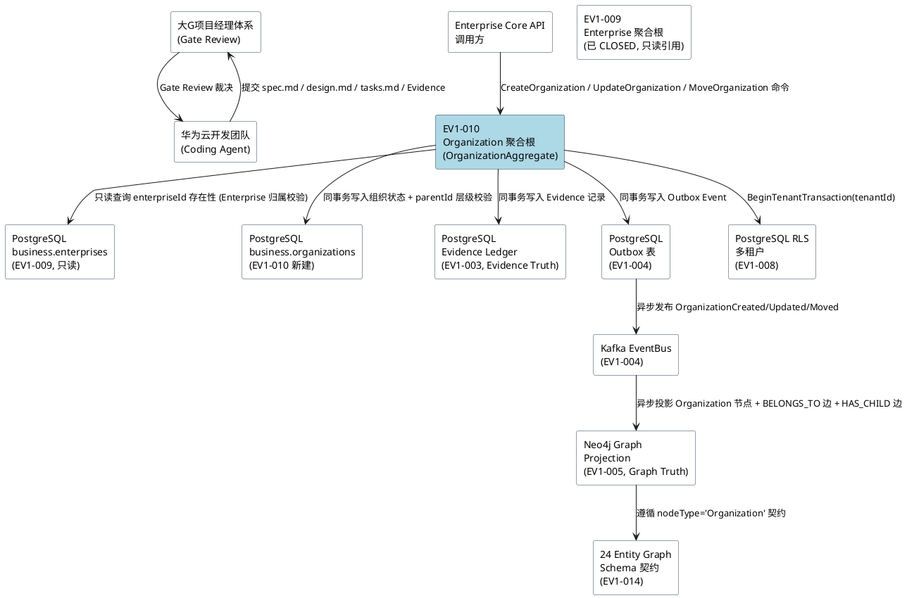
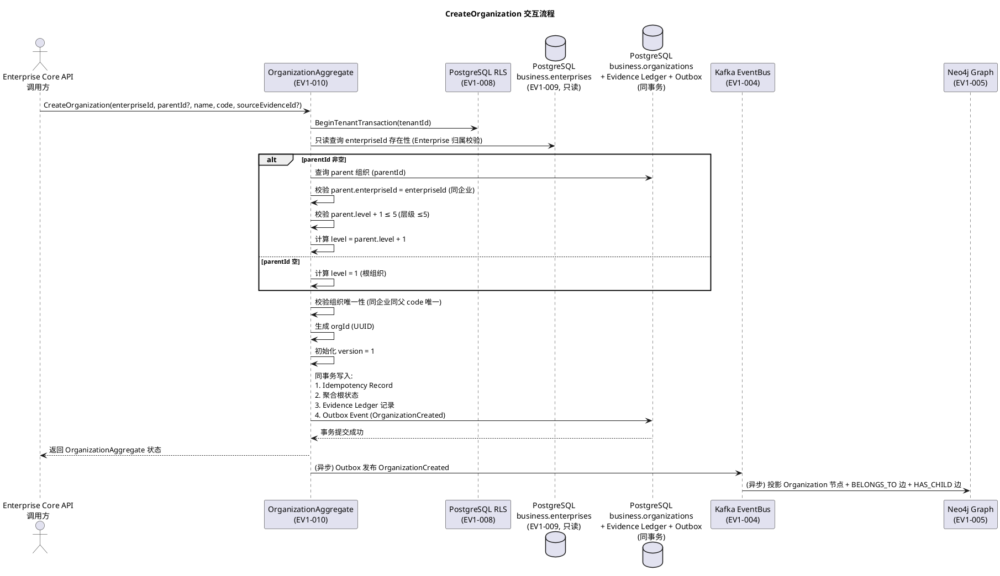
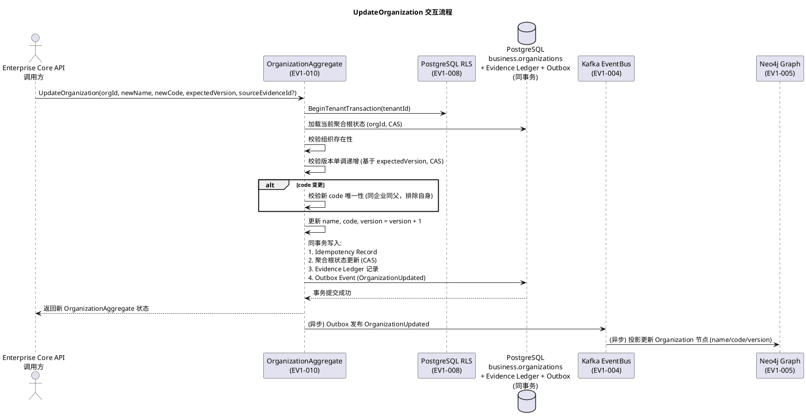
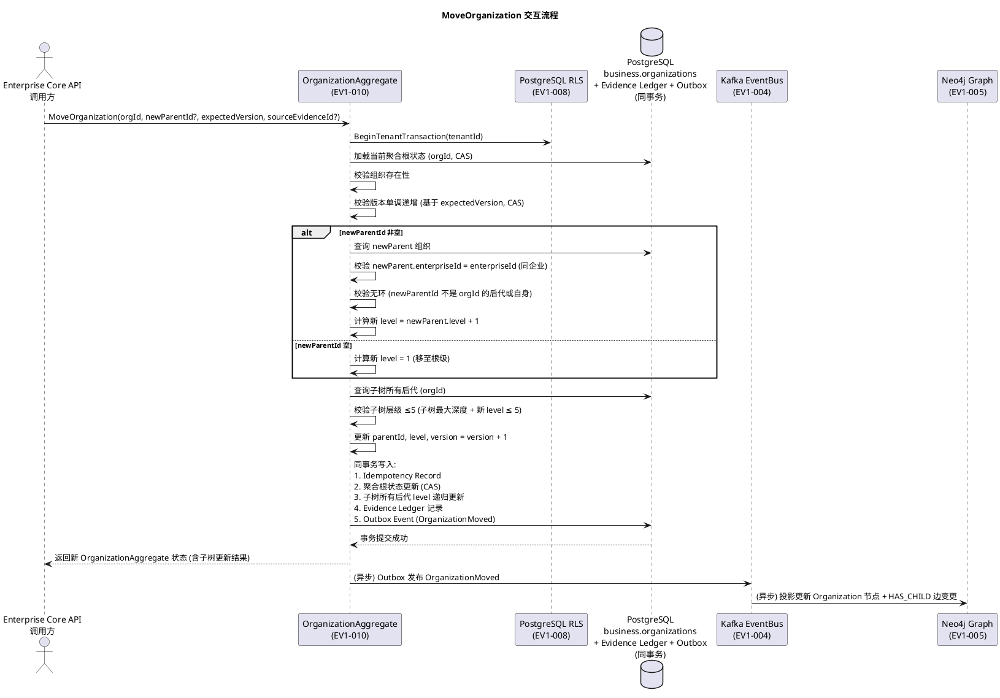
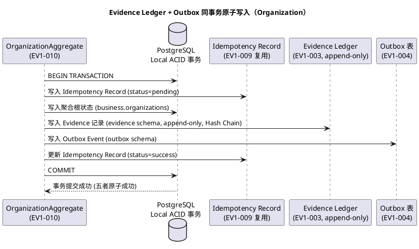
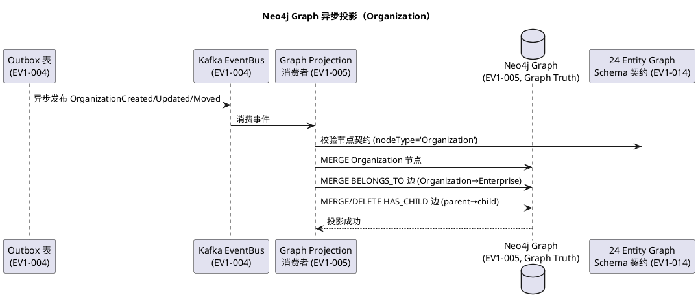
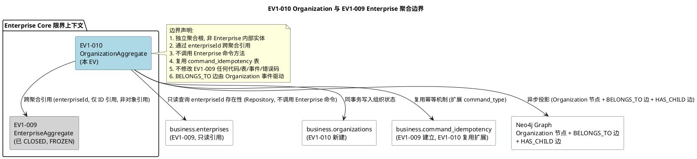

# EBC-X EV1-010 Organization 聚合根需求规格说明书

> **项目：EBC-X — Enterprise Business & Industrial Operating System（企业与工业智能运营操作系统）**
> **阶段：EV1 — Enterprise Core → EBCX-EV1-010 Organization 聚合根**
> **任务编号：EBCX-EV1-010**
> **文档版本：v1.0（首次生成，待大G项目经理 EV1-010-SPEC Gate Review）**
> **状态：🟡 SPEC v1.0（待审查）**
> **需求基线（不可变）**：
> - `.codeartsdoer/specs/ebcx_ev0_arch/spec.md` v1.1（EV0-SPEC PASS / CLOSED / 🔒 FROZEN）
> - `.codeartsdoer/specs/ebcx_ev0_arch/design.md` v1.1（EV0-DESIGN PASS / CLOSED / 🔒 FROZEN）
> - `.codeartsdoer/specs/ebcx_ev0_arch/tasks.md` v1.2（EV0-TASKS / 🔒 FROZEN）
> - `.codeartsdoer/specs/ev1_009_enterprise/spec.md` v1.0（EV1-009-SPEC PASS / CLOSED / 🔒 FROZEN）
> - `.codeartsdoer/specs/ev1_009_enterprise/design.md` v1.1（EV1-009-DESIGN PASS / CLOSED / 🔒 FROZEN）
> - `.codeartsdoer/specs/ev1_009_enterprise/tasks.md` v1.1（EV1-009-TASKS FINAL PASS / CLOSED / 🔒 FROZEN）
> **前置 Gate**：EV1-009 = FINAL PASS / CLOSED（大G项目经理 2026-09-09 裁决，Git commit `af121c628651ea1575649ee2d69f2273c4d5c866`，Evidence commit `dc7554a4e89c1797c4637085f29c66fc13ccc528`，46/46 测试 PASS），EV1-010 已 AUTHORIZED
> **产品/架构总设计：大G项目经理体系**
> **核心工程化：华为云团队**
> **全球交付与产品主权：HTKIS**

---

## 文档定位与约束声明

本文档是 EBCX-EV1-010（实现 Organization 聚合根）的**需求规格说明书**，回答：

> **"EV1-010 这一具体任务究竟要交付什么业务能力、满足什么验收标准、禁止做什么。"**

**不可变基线约束**：
- ❌ 禁止修改 EV0 spec.md / design.md / tasks.md（均已 FROZEN）
- ❌ 禁止修改 EV1-009 spec.md / design.md / tasks.md（均已 FINAL CLOSED / FROZEN，46/46 测试 PASS）
- ❌ 禁止扩大 EV1-010 Scope（仅限 Organization 聚合根，不包含 Person / MasterData / Permission / User / Authorization）
- ❌ 禁止自行进入 EV1-011 或任何后续任务
- ❌ 禁止未获 Gate 授权前进入 Coding
- ✅ 仅定义 EV1-010 的业务行为、业务规则、验收标准、禁止事项

**关联冻结文档**：
- EV0 spec.md：§5.10 EV1 Enterprise Core、§5.5 Evidence Graph 24 类节点（Organization 为第 2 类节点）、§5.5.1 规则 3 边关系（BELONGS_TO: Enterprise→Organization）
- EV0 design.md：D02 Domain Boundary（6 限界上下文 / 聚合根边界）、D03 Enterprise Core（OrganizationAggregate，组织树层级 ≤5，parentId 自引用）、§2.3.2 核心领域对象类图（Enterprise "1" *-- "many" Organization 组合关系）
- EV0 tasks.md：L519-535 EBCX-EV1-010 任务定义
- EV1-009 spec.md / design.md / tasks.md：Enterprise 聚合根已冻结边界（R1/R2/R3/R4 硬约束、EnterpriseAggregate 结构、business.enterprises 表、错误码体系）

**遵守红线**：TASK-R03（聚合根边界）、TASK-R04（Evidence First）、TASK-R05（Mutation 进入治理链）、TASK-R06（边由 Domain Event 驱动，非 Graph AI 推断）、TASK-R09（Evidence First）

---

## 业务背景与上下文

### 上一阶段基线（EV1-009 FINAL CLOSED）

EV1-009 Enterprise 聚合根已正式 FINAL PASS / CLOSED，其交付的不可变基线包括：

1. **EnterpriseAggregate 聚合根**：承载企业根节点生命周期，含 `enterpriseId / name / version / sourceEvidenceId / tenantId / createdAt / updatedAt`，封装企业唯一性与版本单调递增不变式。
2. **4 条硬约束已验收通过**：
   - **R1**：Enterprise Aggregate 是唯一 Mutation Root
   - **R2**：Idempotency + Enterprise + Evidence + Outbox 必须同一 ACID Transaction（四者原子）
   - **R3**：Neo4j 永远不得进入 Enterprise Mutation 主事务
   - **R4**：Update 必须实现 version-based CAS 乐观并发控制
3. **既有数据库表**：`business.enterprises`（含 `UNIQUE(tenant_id, name)` 索引、RLS 策略）、`business.command_idempotency`（命令幂等记录）
4. **既有领域事件**：`EnterpriseCreated` / `EnterpriseUpdated`，已通过 Outbox → Kafka → Neo4j 异步投影链路验证
5. **既有错误码体系**：`EBCX-ENTERPRISE-*` / `EBCX-TENANT-*` / `EBCX-EVIDENCE-*` / `EBCX-OUTBOX-*` / `EBCX-TRANSACTION-*` / `EBCX-IDEMPOTENCY-*`
6. **46/46 测试全部 PASS**，Physical Evidence 已产出

### EV1-010 业务目标

在 EV1-009 Enterprise 聚合根已冻结的基础上，引入 EBC-X 企业内部 **Organization 聚合根**。Organization 表示 Enterprise 内部可独立识别和管理的组织单元（如集团、公司、事业部、部门、班组等），承载企业内部的组织树层级结构。

EV1-010 应明确：
- Organization 的领域职责与身份（独立聚合根，非 Enterprise 聚合的内部实体）
- Organization 的生命周期（创建、变更、移动）
- Organization 与 Enterprise 之间的聚合边界和一致性约束
- Organization 内部组织树层级 ≤5 不变式（EV0 D03 定义）
- 必要的不变量和领域规则
- 可验证的 Evidence / Acceptance Criteria

### 既有架构边界（EV0 D03 锁定）

EV0 design.md D03 Enterprise Core 已锁定 Organization 聚合根的架构契约：
- **OrganizationAggregate**：组织树（parentId 自引用，层级校验）
- **组织树层级 ≤5**：创建时校验 `parent.level + 1 ≤ 5`
- **Enterprise "1" *-- "many" Organization**：组合关系（Enterprise 为根，Organization 为内部组织单元）
- **24 Entity Graph Schema**：Organization 为第 2 类节点，`nodeType='Organization'`
- **BELONGS_TO 边**：`Enterprise→Organization` 归属关系（EV0 spec.md §5.5.1 规则 3）

---

## Scope / Non-Scope

### ✅ In-Scope（EV1-010 必须交付）

1. **OrganizationAggregate 聚合根**：封装 orgId / enterpriseId / parentId / name / code / level / version / sourceEvidenceId / tenantId / createdAt / updatedAt 状态与全部不变式校验（非贫血模型）。
2. **Organization Identity**：orgId（UUID，全局唯一），由聚合根在创建时生成。
3. **Organization 生命周期命令**：
   - `CreateOrganization`：在指定 Enterprise 下创建组织单元，含 parentId（可空，空表示根组织）、name、code、enterpriseId。
   - `UpdateOrganization`：更新组织单元的 name / code（版本化更新，version 递增）。
   - `MoveOrganization`：移动组织单元至新 parent（重新计算 level，校验层级 ≤5 不变式，version 递增）。
4. **Organization 领域事件**：
   - `OrganizationCreated`：组织创建事件。
   - `OrganizationUpdated`：组织更新事件。
   - `OrganizationMoved`：组织移动事件（含 oldParentId / newParentId / oldLevel / newLevel）。
5. **Organization 不变式校验**：
   - 组织树层级 ≤5 不变式（level ∈ [1, 5]，根组织 level=1）。
   - 组织唯一性不变式（同 enterprise + 同 parent 下 code 唯一）。
   - 版本单调递增不变式（version 严格递增）。
   - Enterprise 归属不变式（enterpriseId 必须指向已存在的 Enterprise）。
   - 组织树无环不变式（parentId 链不得形成环，MoveOrganization 时校验）。
6. **Evidence Ledger + Outbox 同事务原子写入**：复用 EV1-003 / EV1-004 基础设施，与 EV1-009 相同的四者原子事务模型（Idempotency + Organization + Evidence + Outbox）。
7. **Neo4j Graph 异步投影**：投影 Organization 节点（`nodeType='Organization'`）+ BELONGS_TO 边至 Enterprise（含 HAS_CHILD 边至 parent Organization，若 parentId 非空），复用 EV1-005 / EV1-014 基础设施。
8. **Command Idempotency**：复用 EV1-009 已建立的 `business.command_idempotency` 表与幂等机制（扩展 command_type 至 CreateOrganization / UpdateOrganization / MoveOrganization）。
9. **数据库迁移**：新建 `business.organizations` 表（含层级、parentId 自引用、唯一性约束、RLS 策略）。
10. **测试分层**：Unit Test + Integration Test + Physical Test（真实 PostgreSQL 18.3 + Neo4j 5.x），产出 Physical Evidence JSON。
11. **错误码体系**：新增 `EBCX-ORGANIZATION-*` 错误码，复用既有 `EBCX-TENANT-*` / `EBCX-EVIDENCE-*` / `EBCX-OUTBOX-*` / `EBCX-TRANSACTION-*` / `EBCX-IDEMPOTENCY-*`。

### ❌ Non-Scope（EV1-010 明确排除）

1. **不实现 Person 聚合根**（人员 + 角色）——归属 EBCX-EV1-011。
2. **不实现 MasterData 聚合根**（产品/物料/客户/供应商）——归属 EBCX-EV1-012。
3. **不实现 Permission 聚合根**（权限 + 角色 + RLS 上下文）——归属 EBCX-EV1-013。
4. **不实现 User / Identity / Authentication**——归属 HTKIS-AF 统一供给，非 EBC-X 自建。
5. **不实现 Authorization / Permission 查询**——归属 EV1-013。
6. **不实现 Enterprise Query / Read Model**——归属 EV1-009 已冻结范围或后续查询侧 EV。
7. **不实现 Organization Query / Read Model**（CQRS 查询侧优化）——本 EV 仅实现 Mutation 侧聚合根，查询侧归属后续 EV。
8. **不实现 UI / API 扩展**——本 EV 仅实现领域层 + 应用层命令处理，REST API 端点扩展归属后续 EV。
9. **不实现 Transaction Orchestrator 11 阶段编排**——归属 EBCX-EV2-005，本任务仅实现聚合根命令处理与领域事件产出。
10. **不实现 Organization 删除命令**——组织单元为长生命周期对象，删除归属后续 EV（需级联校验 Person / 资产归属）。
11. **不实现 Organization 启用/停用状态机**——本 EV 聚焦组织树结构与层级，状态机归属后续 EV。
12. **不修改 EV1-009 Enterprise 已冻结实现**——EV1-009 的 `internal/enterprise/` 代码、`business.enterprises` 表、`EnterpriseAggregate` 结构、领域事件均不得修改。
13. **不实现跨聚合直接调用**——Organization 不得直接调用 Enterprise 聚合根，跨聚合通信通过 Domain Event + Orchestrator 编排（TASK-R03）。
14. **不实现 Organization 与 Person / MasterData / Asset 的关联**——这些聚合根尚未实现，本 EV 仅实现 Organization 与 Enterprise 的 BELONGS_TO 边。

---

# **1. 组件定位**

## **1.1 核心职责**

本组件（Organization 聚合根）承载 Enterprise 内部组织单元的生命周期管理与组织树层级不变式校验，实现以组织为内部管理对象的创建、变更、移动与可信证据沉淀能力。

> EV1-010 范围内本组件的核心职责是：实现 `OrganizationAggregate` 聚合根（含 orgId / enterpriseId / parentId / name / code / level / version / sourceEvidenceId / tenantId），封装组织树层级 ≤5、组织唯一性、版本单调递增、Enterprise 归属、组织树无环等不变式，处理 CreateOrganization / UpdateOrganization / MoveOrganization 命令，产出 OrganizationCreated / OrganizationUpdated / OrganizationMoved 事件，并在同一 PostgreSQL 事务内原子写入 Evidence Ledger + Outbox Event，最终异步投影至 Neo4j Graph 的 Organization 节点 + BELONGS_TO 边至 Enterprise。

## **1.2 核心输入**

1. **CreateOrganization 命令**：来源于 Enterprise Core API 调用方（REST /api/v1/rel/* 或内部 Orchestrator），包含 enterpriseId（目标企业）、parentId（父组织，可空表示根组织）、name（组织名称）、code（组织编码）、tenantId（租户标识，由 RLS 注入）与可选 sourceEvidenceId，作为组织创建的业务指令。
2. **UpdateOrganization 命令**：来源于 Enterprise Core API 调用方，包含目标 orgId、新 name / 新 code、expectedVersion（CAS 乐观锁）与可选 sourceEvidenceId，作为组织版本化更新的业务指令。
3. **MoveOrganization 命令**：来源于 Enterprise Core API 调用方，包含目标 orgId、newParentId（新父组织，可空表示移至根级）、expectedVersion 与可选 sourceEvidenceId，作为组织在组织树内移动的业务指令。
4. **EV1-009 Enterprise 聚合根状态（只读引用）**：来源于已 CLOSED 的 EV1-009，提供 enterpriseId 存在性校验依赖。本组件通过 Repository 查询 `business.enterprises` 表校验 enterpriseId 存在（只读，不修改 Enterprise 聚合根）。
5. **EV1-003 Evidence Ledger 能力**：来源于已 CLOSED 的 EV1-003 基础设施，提供 append-only Evidence 写入与 Hash Chain 能力。
6. **EV1-004 Outbox + EventBus 能力**：来源于已 CLOSED 的 EV1-004 基础设施，提供同事务原子写入 Outbox Event 与异步发布至 EventBus（Kafka）的能力。
7. **EV1-005 Neo4j Graph Projection 能力**：来源于已 CLOSED 的 EV1-005 基础设施，提供异步投影至 Neo4j Graph 的能力。
8. **EV1-014 24 Entity Graph Schema 能力**：来源于已 CLOSED 的 EV1-014 基础设施，提供 Organization 节点类型（`nodeType='Organization'`）与 BELONGS_TO / HAS_CHILD 边类型的 Graph Schema 契约。
9. **租户上下文（RLS）**：来源于 EV1-008 多租户基础，通过 `BeginTenantTransaction` 注入 tenant_id 至 PostgreSQL Session，作为行级安全隔离的强制输入。

## **1.3 核心输出**

1. **OrganizationAggregate 状态**：输出给 Enterprise Core 内部与下游聚合根（Person / MasterData / Asset，本任务不实现），包含 orgId / enterpriseId / parentId / name / code / level / version / sourceEvidenceId / tenantId，作为组织单元的权威状态。
2. **OrganizationCreated / OrganizationUpdated / OrganizationMoved 领域事件**：输出给 Outbox → EventBus（Kafka）→ Neo4j Graph Projection，作为组织生命周期变更的领域事件，驱动 Graph 异步投影。
3. **Evidence Ledger 记录**：输出给 PostgreSQL Evidence Ledger（append-only），作为组织创建/更新/移动行为的不可篡改证据，对应 Evidence Truth。
4. **Neo4j Graph Organization 节点 + BELONGS_TO 边**：输出给 Neo4j Evidence Graph Projection，`nodeType='Organization'`，含 BELONGS_TO 边至 Enterprise 节点、HAS_CHILD 边至 parent Organization 节点（若 parentId 非空），作为组织在 Graph Truth 中的关系查询投影。
5. **Physical Evidence JSON**：输出给 `evidence/ev1/EBCX-EV1-010-organization-evidence.json`，含聚合根测试、Evidence 记录、Graph 节点与边验证，作为大G项目经理 Gate Review 的物理证据。
6. **Unit Test + Integration Test + Physical Test 结果**：输出给 CI/CD 流水线与 Gate Review，作为代码质量与不变式校验的验证证据。

## **1.4 职责边界**

本组件（Organization 聚合根）**不负责**以下事项：

1. **不负责**实现 Enterprise 聚合根——已由 EV1-009 FINAL CLOSED 提供，本任务仅通过 Repository 只读引用 `business.enterprises` 表校验 enterpriseId 存在性。
2. **不负责**实现 Person 聚合根（人员 + 角色）——归属 EBCX-EV1-011。
3. **不负责**实现 MasterData 聚合根（产品/物料/客户/供应商）——归属 EBCX-EV1-012。
4. **不负责**实现 Permission 聚合根（权限 + 角色 + RLS 上下文）——归属 EBCX-EV1-013。
5. **不负责**实现 Evidence Ledger 基础设施——已由 EV1-003 CLOSED 提供，本任务仅消费其写入能力。
6. **不负责**实现 Outbox + EventBus 基础设施——已由 EV1-004 CLOSED 提供，本任务仅消费其同事务原子写入与异步发布能力。
7. **不负责**实现 Neo4j Graph Projection 基础设施——已由 EV1-005 CLOSED 提供，本任务仅消费其异步投影能力。
8. **不负责**实现 24 Entity Graph Schema——已由 EV1-014 CLOSED 提供，本任务仅遵循 Organization 节点与 BELONGS_TO / HAS_CHILD 边契约。
9. **不负责**实现 Transaction Orchestrator 11 阶段编排——归属 EBCX-EV2-005，本任务仅实现聚合根命令处理与领域事件产出。
10. **不负责**跨聚合直接调用 Enterprise 聚合根——聚合根间通过 Domain Event + Orchestrator 编排，禁止跨聚合直接调用（TASK-R03）。本任务对 Enterprise 的引用仅通过 Repository 只读查询 `business.enterprises` 表，不调用 `EnterpriseAggregate` 的命令方法。
11. **不负责**同步强一致写入 Neo4j Graph——Graph 投影通过 Outbox + EventBus 异步完成，最终一致 ≤3s，禁止同步写入拖垮聚合根命令（D-GATE-05）。
12. **不负责**实现 Organization 删除命令——组织单元为长生命周期对象，删除归属后续 EV。
13. **不负责**实现 Organization 启用/停用状态机——本 EV 聚焦组织树结构与层级。
14. **不负责**实现 Organization Query / Read Model（CQRS 查询侧）——本 EV 仅实现 Mutation 侧聚合根。
15. **不负责**实现 REST API 端点扩展——本 EV 仅实现领域层 + 应用层命令处理。
16. **不负责**扩大 Scope 至 EV1-011 或任何后续任务——未获 Gate 授权前禁止进入。

---

# **2. 领域术语**

**OrganizationAggregate（组织聚合根）**
: EBC-X Enterprise Core 限界上下文中的组织单元聚合根，承载 Enterprise 内部组织单元的生命周期管理与组织树层级不变式校验，是企业内部组织结构的独立聚合根（非 Enterprise 聚合的内部实体）。
: 备注：对应 EV0 design.md D03 Enterprise Core 的 `OrganizationAggregate`，组织树层级 ≤5，parentId 自引用。

**orgId（组织标识）**
: Organization 聚合根的全局唯一标识，UUID 类型，由聚合根在创建时生成，作为组织单元在 Evidence Graph 中的唯一节点标识。

**enterpriseId（企业归属标识）**
: Organization 聚合根所属的 Enterprise 标识，UUID 类型，指向已存在的 Enterprise 聚合根，作为组织单元的企业归属依据。
: 备注：跨聚合引用，Organization 不嵌入 Enterprise 聚合内，通过 enterpriseId 引用。

**parentId（父组织标识）**
: Organization 聚合根的父组织标识，UUID 类型，可空（空表示根组织，level=1），指向同一 enterpriseId 下的另一个 Organization，构成组织树层级结构。
: 备注：parentId 自引用，组织树层级 ≤5 不变式。

**name（组织名称）**
: Organization 聚合根的组织名称，字符串类型，非空必填，长度 1~256 字符，作为组织单元的显示名称。

**code（组织编码）**
: Organization 聚合根的组织编码，字符串类型，非空必填，长度 1~64 字符，同一 enterprise + 同一 parent 下唯一（组织唯一性不变式），作为组织单元的业务编码。
: 备注：组织编码用于业务识别，name 用于显示，二者分离。

**level（组织层级）**
: Organization 聚合根在组织树中的层级，整数类型，取值范围 [1, 5]，根组织 level=1，子组织 level = parent.level + 1，组织树层级 ≤5 不变式（EV0 D03 定义）。
: 备注：level 由聚合根在创建/移动时根据 parent.level 计算，禁止直接设置。

**version（组织版本）**
: Organization 聚合根的版本号，单调递增整数，初始为 1，每次 UpdateOrganization / MoveOrganization 命令执行后递增，作为组织状态变更的版本追踪。
: 备注：版本单调递增是聚合根不变式之一，禁止回退或跳跃。

**sourceEvidenceId（源证据标识）**
: Organization 聚合根创建/更新/移动时引用的源 Evidence 记录标识，指向 Evidence Ledger 中的 append-only 证据记录，作为组织变更的可溯源依据。
: 备注：对应 Evidence-First 原则（TASK-R04），每个 Mutation 必须有源证据支撑。

**tenantId（租户标识）**
: Organization 聚合根所属的租户标识，通过 RLS 行级安全策略强制隔离，作为多租户场景下组织数据的归属与隔离依据。
: 备注：由 EV1-008 多租户基础提供 RLS 上下文，通过 `BeginTenantTransaction` 注入。

**组织树层级 ≤5 不变式（Organization Tree Level ≤5 Invariant）**
: Organization 聚合根的核心不变式之一，要求组织树层级 level ∈ [1, 5]，根组织 level=1，子组织 level = parent.level + 1，禁止创建或移动至 level > 5 的组织单元。
: 备注：EV0 D03 定义，组织树层级校验 O(n) n≤5。

**组织唯一性不变式（Organization Uniqueness Invariant）**
: Organization 聚合根的核心不变式之一，要求同一 enterpriseId + 同一 parentId 下 code 唯一，禁止同企业同父组织下创建同 code 的组织单元。
: 备注：跨 parent 允许同 code（如不同部门下可有同名班组）。

**版本单调递增不变式（Version Monotonic Increase Invariant）**
: Organization 聚合根的核心不变式之一，要求 version 严格单调递增，UpdateOrganization / MoveOrganization 命令必须基于当前最新版本执行，禁止并发更新导致版本回退或跳跃。

**Enterprise 归属不变式（Enterprise Ownership Invariant）**
: Organization 聚合根的核心不变式之一，要求 enterpriseId 必须指向已存在的 Enterprise 聚合根（`business.enterprises` 表中存在对应记录），禁止创建孤儿组织（无企业归属）。

**组织树无环不变式（Organization Tree Acyclic Invariant）**
: Organization 聚合根的核心不变式之一，要求 parentId 链不得形成环，MoveOrganization 时必须校验 newParentId 不是当前 orgId 的后代（含自身），防止组织树成环。
: 备注：MoveOrganization 专属不变式，CreateOrganization 时 parentId 指向已存在组织不会成环。

**CreateOrganization 命令（创建组织命令）**
: 触发 Organization 聚合根创建的命令，含 commandId（幂等键）/ enterpriseId / parentId（可空）/ name / code / tenantId / 可选 sourceEvidenceId，执行后产出 OrganizationCreated 事件。
: 备注：属于 Mutation 路径，必须走第一性原理链路（TASK-R05）。

**UpdateOrganization 命令（更新组织命令）**
: 触发 Organization 聚合根版本化更新的命令，含 commandId / orgId / newName / newCode / expectedVersion / 可选 sourceEvidenceId，执行后产出 OrganizationUpdated 事件，version 递增。
: 备注：仅更新 name / code，不变更 parentId / level / enterpriseId（变更 parent 用 MoveOrganization）。

**MoveOrganization 命令（移动组织命令）**
: 触发 Organization 聚合根在组织树内移动的命令，含 commandId / orgId / newParentId（可空，空表示移至根级）/ expectedVersion / 可选 sourceEvidenceId，执行后产出 OrganizationMoved 事件，level 重新计算，version 递增。
: 备注：MoveOrganization 需校验组织树无环不变式与层级 ≤5 不变式（含子树层级校验）。

**OrganizationCreated 事件（组织创建事件）**
: Organization 聚合根创建成功后产出的领域事件，含 eventId / eventType / orgId / enterpriseId / parentId / name / code / level / version / sourceEvidenceId / tenantId / timestamp / traceId，通过 Outbox → EventBus 异步发布，驱动 Neo4j Graph 投影。

**OrganizationUpdated 事件（组织更新事件）**
: Organization 聚合根版本化更新成功后产出的领域事件，含 eventId / eventType / orgId / enterpriseId / parentId / newName / newCode / level / version / sourceEvidenceId / tenantId / timestamp / traceId，通过 Outbox → EventBus 异步发布，驱动 Neo4j Graph 投影更新。

**OrganizationMoved 事件（组织移动事件）**
: Organization 聚合根在组织树内移动成功后产出的领域事件，含 eventId / eventType / orgId / enterpriseId / oldParentId / newParentId / oldLevel / newLevel / version / sourceEvidenceId / tenantId / timestamp / traceId，通过 Outbox → EventBus 异步发布，驱动 Neo4j Graph 投影更新（含 HAS_CHILD 边变更）。

**BELONGS_TO 边（归属关系边）**
: Neo4j Graph 中 Organization 节点至 Enterprise 节点的归属关系边，edgeType='BELONGS_TO'，由 OrganizationCreated 事件驱动创建，表示组织单元归属于企业。
: 备注：EV0 spec.md §5.5.1 规则 3 定义，BELONGS_TO: Enterprise→Organization。

**HAS_CHILD 边（父子组织关系边）**
: Neo4j Graph 中 parent Organization 节点至 child Organization 节点的父子关系边，edgeType='HAS_CHILD'，由 OrganizationCreated / OrganizationMoved 事件驱动创建/变更，表示组织树的层级结构。
: 备注：EV0 8 Edge Type 之外的扩展边类型，需在 design.md 阶段裁决是否纳入 Canonical Graph Contract 或作为扩展边。本 spec.md 仅定义业务语义，边类型契约归属 design.md。

**同事务原子写入（Same-Transaction Atomic Write）**
: Organization 聚合根 Mutation 时，Idempotency Record + 聚合根状态变更 + Evidence Ledger 写入 + Outbox Event 写入在同一 PostgreSQL Local ACID 事务内完成，保证四者原子性。
: 备注：对齐 EV1-009 R2 四者原子事务模型，Neo4j Graph 投影不在同事务内（异步）。

---

# **3. 角色与边界**

## **3.1 核心角色**

1. **大G项目经理体系（Gate Review 裁决者）**：负责对 EV1-010 spec.md / design.md / tasks.md 进行 Gate Review，裁决 PASS / CONDITIONAL PASS / FAIL，是 EV1-010 进入 Coding 的唯一授权主体。
2. **华为云开发团队（Coding Agent）**：负责在 Gate 授权后实现 OrganizationAggregate 代码、Unit Test、Integration Test、Physical Test、Physical Evidence，是工程实现主体。
3. **Enterprise Core API 调用方（业务角色）**：通过 REST /api/v1/rel/* 或内部 Orchestrator 发起 CreateOrganization / UpdateOrganization / MoveOrganization 命令，是 Organization 聚合根的业务输入来源。

## **3.2 外部系统**

1. **PostgreSQL `business.enterprises` 表（EV1-009 提供，只读引用）**：承载 Enterprise 聚合根状态，本任务通过 Repository 只读查询校验 enterpriseId 存在性，不修改该表。
2. **PostgreSQL `business.command_idempotency` 表（EV1-009 提供，复用扩展）**：承载命令幂等记录，本任务扩展 command_type 至 CreateOrganization / UpdateOrganization / MoveOrganization，复用既有表结构与 UNIQUE(tenant_id, command_id) 约束。
3. **PostgreSQL Evidence Ledger（EV1-003 提供）**：承载 Organization 聚合根 Mutation 的 append-only 证据写入，是 Evidence Truth 的 System of Record。
4. **PostgreSQL Outbox 表（EV1-004 提供）**：承载 OrganizationCreated / OrganizationUpdated / OrganizationMoved 领域事件的同事务原子写入，驱动异步发布至 EventBus。
5. **Kafka EventBus（EV1-004 提供）**：承载 Organization 领域事件的异步发布，驱动 Neo4j Graph Projection 消费。
6. **Neo4j Evidence Graph Projection（EV1-005 提供）**：承载 Organization 节点（`nodeType='Organization'`）+ BELONGS_TO 边 + HAS_CHILD 边的异步投影，是 Graph Truth 的关系查询模型。
7. **24 Entity Graph Schema 契约（EV1-014 提供）**：定义 Organization 节点类型与 BELONGS_TO 边类型的 Graph Schema 契约，约束投影节点符合 Canonical Graph Contract。
8. **PostgreSQL RLS 多租户（EV1-008 提供）**：通过 `BeginTenantTransaction` 注入 tenant_id 至 Session，强制行级安全隔离。
9. **CI/CD 流水线（EV1-021 提供，本任务消费）**：承载 Unit Test + Integration Test + Physical Evidence 的自动化验证。

## **3.3 交互上下文**

---

# **4. DFX约束**

## **4.1 性能**

1. **聚合根命令处理响应时间**：CreateOrganization / UpdateOrganization / MoveOrganization 命令的 P95 响应时间 ≤500ms（Local ACID 事务内完成聚合根状态变更 + Evidence 写入 + Outbox 写入，不含 Neo4j 异步投影；MoveOrganization 含子树层级校验，P95 ≤800ms）。
   a. 验收条件：[B1 Benchmark Profile 执行] → [Create/Update P95 ≤500ms，Move P95 ≤800ms]
2. **Neo4j Graph 投影最终一致延迟**：OrganizationCreated / OrganizationUpdated / OrganizationMoved 事件发布至 Kafka 后，Neo4j Graph 出现对应 Organization 节点与边的延迟 ≤3s（Normal Mode，TASK-H03）。
   a. 验收条件：[Outbox Event 发布至 Kafka] → [Neo4j Graph 含 Organization 节点与边，延迟 ≤3s]
3. **聚合根不变式校验耗时**：组织树层级校验、组织唯一性校验、Enterprise 归属校验、版本单调递增校验的单项耗时 ≤10ms（同事务内索引查询）；MoveOrganization 的子树层级校验耗时 ≤50ms（子树深度 ≤5，节点数 ≤1000 假设）。
   a. 验收条件：[不变式校验执行] → [单项 ≤10ms，子树校验 ≤50ms]
4. **组织树层级校验复杂度**：组织树层级校验算法复杂度 O(n)，n ≤5（层级深度），常数级复杂度。
   a. 验收条件：[层级校验执行] → [O(n) n≤5，常数级复杂度]

## **4.2 可靠性**

1. **同事务原子性**：Organization 聚合根 Mutation 时，Idempotency Record + 聚合根状态变更 + Evidence Ledger 写入 + Outbox Event 写入必须在同一 PostgreSQL Local ACID 事务内完成，四者原子成功或原子失败，禁止部分成功。
   a. 验收条件：[Mutation 执行中任一环节失败] → [整个事务回滚，无部分写入]
2. **Evidence Ledger 不可篡改**：Organization 聚合根写入的 Evidence 记录必须符合 EV1-003 的 append-only 四层纵深防御（DB 权限 REVOKE + DB 触发器 + 应用层校验 + 审计），禁止 UPDATE / DELETE / TRUNCATE。
   a. 验收条件：[尝试 UPDATE/DELETE/TRUNCATE Organization Evidence 记录] → [数据库明确拒绝并产生 ERROR]
3. **Neo4j 故障不拖垮聚合根**：Neo4j Graph Projection 故障时，Organization 聚合根命令处理必须正常完成（Local ACID 事务成功），Graph 投影通过 Outbox 重投机制最终一致。
   a. 验收条件：[Neo4j 故障] → [Organization 命令处理成功，Outbox Event 待重投]
4. **Outbox 至少一次投递**：OrganizationCreated / OrganizationUpdated / OrganizationMoved 事件通过 Outbox 投递至 Kafka 必须满足至少一次语义，消费者需幂等处理。
   a. 验收条件：[Outbox Event 投递] → [至少一次到达 Kafka，消费者幂等]
5. **Command Idempotency**：相同 commandId 重复提交必须返回首次执行结果，不产生新 Evidence / Outbox Event，复用 EV1-009 已建立的幂等机制。
   a. 验收条件：[相同 commandId 重复提交] → [返回首次结果，无新 Evidence / Outbox Event]

## **4.3 安全性**

1. **租户行级隔离**：Organization 聚合根的所有读写操作必须通过 `BeginTenantTransaction(tenantId)` 注入 RLS 上下文，禁止跨租户访问组织数据。
   a. 验收条件：[Tenant A 创建 Organization] → [Tenant B 查询不到该 Organization，RLS 阻止]
2. **Evidence Provenance 保持**：Organization 聚合根 Mutation 产生的 Evidence 记录必须包含 git_commit、trace_id、event_id、evidence_id 等 Provenance 字段，且 git_commit 与实际验证代码 commit 一致。
   a. 验收条件：[Evidence 记录审查] → [git_commit = 实际代码 commit，Provenance 完整]
3. **聚合根边界编译期校验**：Organization 聚合根禁止被其他聚合根（含 Enterprise）直接调用，跨聚合通信必须通过 Domain Event + Orchestrator，编译期 lint 拒绝跨聚合直接调用。
   a. 验收条件：[跨聚合直接调用 Organization 聚合根] → [编译期 lint 拒绝]
4. **Enterprise 归属只读引用**：Organization 对 Enterprise 的引用仅通过 Repository 只读查询 `business.enterprises` 表，禁止调用 `EnterpriseAggregate` 的命令方法（CreateEnterprise / UpdateEnterprise），禁止修改 Enterprise 聚合根状态。
   a. 验收条件：[Organization 命令处理] → [仅只读查询 business.enterprises，不调用 Enterprise 命令方法]

## **4.4 可维护性**

1. **Physical Evidence 产出**：EV1-010 必须产出 `evidence/ev1/EBCX-EV1-010-organization-evidence.json`，含聚合根测试、Evidence 记录、Graph 节点与边验证，符合 Physical Evidence 最小字段标准（TASK-H07）。
   a. 验收条件：[EV1-010 完成] → [Physical Evidence JSON 存在且字段完整]
2. **测试分层**：EV1-010 必须包含 Unit Test（聚合根不变式校验、命令处理逻辑）+ Integration Test（同事务原子写入、Outbox 发布、Graph 投影、RLS 租户隔离、组织树层级校验、CAS 并发冲突）+ Physical Test（真实 PostgreSQL + Neo4j 验证），禁止仅 Unit Test 声明完成。
   a. 验收条件：[EV1-010 测试审查] → [Unit + Integration + Physical 三层测试全部 PASS]
3. **Test PASS ≠ Physical PASS**：Unit Test + Integration Test PASS 不等于 Physical Evidence PASS，必须由真实 Infrastructure（PostgreSQL 18.3 + Neo4j）验证产出 Physical Evidence。
   a. 验收条件：[仅 Mock 测试 PASS] → [不承认 Physical PASS，需真实 Infrastructure 验证]

## **4.5 兼容性**

1. **EV0 冻结架构兼容**：EV1-010 实现必须严格遵循 EV0 FROZEN 的 spec.md §5.10 / §5.5 / design.md D02 / D03，禁止架构漂移。
   a. 验收条件：[EV1-010 实现审查] → [与 EV0 FROZEN 设计零漂移]
2. **EV1-009 冻结边界兼容**：EV1-010 实现不得修改 EV1-009 的任何代码、数据库表、领域事件、错误码，仅通过只读引用 `business.enterprises` 表与复用 `business.command_idempotency` 表扩展 command_type。
   a. 验收条件：[EV1-010 实现审查] → [EV1-009 代码与表结构零修改，仅扩展 command_idempotency.command_type 约束]
3. **24 Entity Graph Schema 兼容**：Organization 节点投影必须符合 EV1-014 定义的 24 Entity Graph Schema 契约，`nodeType='Organization'`，BELONGS_TO 边符合契约，禁止自定义节点类型。
   a. 验收条件：[Neo4j Graph 投影] → [Organization 节点 nodeType='Organization'，BELONGS_TO 边符合契约]
4. **Domain Event 向后兼容**：OrganizationCreated / OrganizationUpdated / OrganizationMoved 事件 schema 必须版本化管理，向后兼容，禁止破坏性变更。
   a. 验收条件：[事件 schema 变更] → [向后兼容，旧消费者可继续消费]
5. **Command Idempotency 表扩展兼容**：扩展 `business.command_idempotency.command_type` 约束至含 CreateOrganization / UpdateOrganization / MoveOrganization，不得破坏既有 Enterprise 幂等记录。
   a. 验收条件：[command_type 扩展] → [既有 Enterprise 幂等记录不受影响，新 Organization 幂等记录正常写入]

---

# **5. 核心能力**

## **5.1 Organization 聚合根创建（CreateOrganization）**

### **5.1.1 业务规则**

1. **组织创建命令处理规则**：CreateOrganization 命令必须由 Enterprise Core API 调用方发起，聚合根接收命令后执行：校验 Enterprise 归属 → 校验 parentId 层级（若非空）→ 校验组织唯一性 → 生成 orgId → 计算 level（parentId 非空时 level = parent.level + 1，空时 level = 1）→ 初始化 version=1 → 写入聚合根状态 → 同事务写入 Evidence Ledger → 同事务写入 Outbox Event（OrganizationCreated）→ 事务提交 → 返回聚合根状态。
   a. 验收条件：[CreateOrganization 命令执行] → [聚合根状态创建，level 正确计算，version=1，Evidence + Outbox 同事务写入]
2. **Enterprise 归属校验规则**：CreateOrganization 必须校验 enterpriseId 指向已存在的 Enterprise（`business.enterprises` 表中存在对应记录，受 RLS 隔离），不存在则拒绝。
   a. 验收条件：[CreateOrganization 不存在的 enterpriseId] → [拒绝，返回 EBCX-ORGANIZATION-ENTERPRISE-NOT-FOUND]
3. **parentId 层级校验规则**：CreateOrganization 时若 parentId 非空，必须校验 parent 组织存在且 parent.enterpriseId = 当前 enterpriseId（同企业内引用），并校验 parent.level + 1 ≤ 5（组织树层级 ≤5 不变式），违反则拒绝。
   a. 验收条件：[CreateOrganization parentId 非空且 parent.level = 5] → [拒绝，返回 EBCX-ORGANIZATION-LEVEL-EXCEED-MAX]
4. **parentId 跨企业校验规则**：CreateOrganization 时若 parentId 非空，必须校验 parent.enterpriseId = 当前 enterpriseId，禁止跨企业引用 parent 组织。
   a. 验收条件：[CreateOrganization parentId 指向其他企业的组织] → [拒绝，返回 EBCX-ORGANIZATION-PARENT-CROSS-ENTERPRISE]
5. **组织唯一性校验规则**：同一 enterpriseId + 同一 parentId 下 code 必须唯一，创建时若已存在同 code 组织则拒绝。
   a. 验收条件：[同企业同父组织下创建同 code 组织] → [拒绝，返回 EBCX-ORGANIZATION-DUPLICATE-CODE]
6. **orgId 生成规则**：orgId 必须为 UUID，由聚合根在创建时生成，全局唯一。
   a. 验收条件：[CreateOrganization 执行] → [orgId 为 UUID 且全局唯一]
7. **level 计算规则**：CreateOrganization 时 level 由聚合根根据 parentId 计算：parentId 非空时 level = parent.level + 1，parentId 空时 level = 1，禁止命令参数直接设置 level。
   a. 验收条件：[CreateOrganization parentId 非空] → [level = parent.level + 1]；[CreateOrganization parentId 空] → [level = 1]
8. **version 初始化规则**：CreateOrganization 执行后 version 必须初始化为 1。
   a. 验收条件：[CreateOrganization 执行] → [version = 1]
9. **Evidence-First 规则（TASK-R04）**：CreateOrganization 必须在同事务内写入 Evidence Ledger 记录，记录含 orgId / enterpriseId / parentId / name / code / level / version / tenantId / sourceEvidenceId / git_commit / trace_id / event_id / evidence_id / timestamp，append-only 不可篡改。
   a. 验收条件：[CreateOrganization 执行] → [Evidence Ledger 含对应 Evidence 记录，字段完整]
10. **Outbox Event 同事务写入规则**：CreateOrganization 必须在同事务内写入 Outbox Event（OrganizationCreated），事件含 orgId / enterpriseId / parentId / name / code / level / version / sourceEvidenceId / tenantId / timestamp / traceId，事务提交后异步发布至 Kafka。
   a. 验收条件：[CreateOrganization 事务提交] → [Outbox 含 OrganizationCreated Event，异步发布至 Kafka]
11. **Mutation 进入治理链规则（TASK-R05）**：CreateOrganization 属于 Mutation 路径，必须走第一性原理链路，本任务实现 Transaction + Data + Evidence 阶段，Policy/Decision/Agent/Execution/Verification 阶段在 EV2 编排。
   a. 验收条件：[CreateOrganization 执行] → [Transaction + Data + Evidence 阶段完成，Mutation 进入治理链]
12. **禁止项：跨租户创建**：禁止 CreateOrganization 命令指定与 RLS 上下文不一致的 tenantId，tenantId 必须由 `BeginTenantTransaction` 注入，禁止命令参数覆盖。
    a. 验收条件：[CreateOrganization 命令 tenantId ≠ RLS 上下文 tenantId] → [拒绝，返回 EBCX-TENANT-CONTEXT-MISMATCH]
13. **禁止项：贫血模型**：OrganizationAggregate 必须封装业务不变式与命令处理逻辑，禁止贫血模型（仅 getter/setter 无业务逻辑）。
    a. 验收条件：[代码评审] → [OrganizationAggregate 含不变式校验与命令处理逻辑，非贫血模型]
14. **禁止项：直接设置 level**：禁止 CreateOrganization 命令参数直接设置 level，level 必须由聚合根根据 parentId 计算。
    a. 验收条件：[CreateOrganization 命令含 level 参数] → [拒绝，level 由聚合根计算]

### **5.1.2 交互流程**

### **5.1.3 异常场景**

1. **Enterprise 不存在**
   a. 触发条件：CreateOrganization 的 enterpriseId 在 `business.enterprises` 表中不存在（或跨租户不可见）
   b. 系统行为：聚合根校验 Enterprise 归属失败，事务回滚，不写入任何数据
   c. 用户感知：返回错误码 EBCX-ORGANIZATION-ENTERPRISE-NOT-FOUND
2. **父组织不存在**
   a. 触发条件：CreateOrganization 的 parentId 在 `business.organizations` 表中不存在
   b. 系统行为：聚合根校验 parent 存在性失败，事务回滚
   c. 用户感知：返回错误码 EBCX-ORGANIZATION-PARENT-NOT-FOUND
3. **父组织跨企业引用**
   a. 触发条件：CreateOrganization 的 parentId 指向其他企业的组织（parent.enterpriseId ≠ 当前 enterpriseId）
   b. 系统行为：聚合根校验同企业引用失败，事务回滚
   c. 用户感知：返回错误码 EBCX-ORGANIZATION-PARENT-CROSS-ENTERPRISE
4. **组织树层级超限**
   a. 触发条件：CreateOrganization 的 parent.level = 5，子组织 level = 6 > 5
   b. 系统行为：聚合根校验层级 ≤5 不变式失败，事务回滚
   c. 用户感知：返回错误码 EBCX-ORGANIZATION-LEVEL-EXCEED-MAX
5. **组织编码重复**
   a. 触发条件：同企业同父组织下已存在同 code 组织
   b. 系统行为：聚合根校验组织唯一性失败，事务回滚
   c. 用户感知：返回错误码 EBCX-ORGANIZATION-DUPLICATE-CODE
6. **租户上下文不匹配**
   a. 触发条件：CreateOrganization 命令的 tenantId 与 RLS 上下文不一致
   b. 系统行为：聚合根拒绝命令，不开启事务
   c. 用户感知：返回错误码 EBCX-TENANT-CONTEXT-MISMATCH
7. **Evidence Ledger 写入失败**
   a. 触发条件：同事务内 Evidence Ledger 写入失败
   b. 系统行为：整个 Local ACID 事务回滚，聚合根状态不创建，Outbox 不写入
   c. 用户感知：返回错误码 EBCX-EVIDENCE-WRITE-FAILED，事务原子失败
8. **Outbox 写入失败**
   a. 触发条件：同事务内 Outbox Event 写入失败
   b. 系统行为：整个 Local ACID 事务回滚，聚合根状态不创建，Evidence 不写入
   c. 用户感知：返回错误码 EBCX-OUTBOX-WRITE-FAILED，事务原子失败
9. **Neo4j Graph 投影失败**
   a. 触发条件：Neo4j Graph Projection 故障或超时
   b. 系统行为：聚合根命令处理正常完成（Local ACID 事务成功），Outbox Event 待重投，Graph 投影最终一致
   c. 用户感知：命令返回成功，Graph 投影延迟，Outbox 重投机制保证最终一致

## **5.2 Organization 聚合根版本化更新（UpdateOrganization）**

### **5.2.1 业务规则**

1. **组织更新命令处理规则**：UpdateOrganization 命令必须由 Enterprise Core API 调用方发起，聚合根接收命令后执行：加载当前聚合根状态 → 校验组织存在性 → 校验版本单调递增 → 校验新 code 唯一性（若 code 变更）→ 更新 name / code → version 递增 → 同事务写入 Evidence Ledger → 同事务写入 Outbox Event（OrganizationUpdated）→ 事务提交 → 返回新聚合根状态。
   a. 验收条件：[UpdateOrganization 命令执行] → [聚合根状态更新，version 递增，Evidence + Outbox 同事务写入]
2. **组织存在性校验规则**：UpdateOrganization 必须校验目标 orgId 存在，不存在则拒绝。
   a. 验收条件：[UpdateOrganization 不存在的 orgId] → [拒绝，返回 EBCX-ORGANIZATION-NOT-FOUND]
3. **版本单调递增校验规则**：UpdateOrganization 必须基于当前最新 version 执行（CAS 乐观锁），执行后 version = 旧 version + 1，禁止并发更新导致版本回退或跳跃。
   a. 验收条件：[并发 UpdateOrganization 基于同一旧 version] → [仅一个成功，其余拒绝，返回 EBCX-ORGANIZATION-VERSION-CONFLICT]
4. **组织编码唯一性校验规则（更新场景）**：UpdateOrganization 更新 code 时，若新 code 与同企业同父组织下其他组织 code 冲突则拒绝（排除自身）。
   a. 验收条件：[UpdateOrganization 更新 code 至同企业同父已存在 code（非自身）] → [拒绝，返回 EBCX-ORGANIZATION-DUPLICATE-CODE]
5. **Evidence-First 规则（TASK-R04）**：UpdateOrganization 必须在同事务内写入 Evidence Ledger 记录，记录含 orgId / enterpriseId / parentId / newName / newCode / level / 新 version / tenantId / sourceEvidenceId / git_commit / trace_id / event_id / evidence_id / timestamp，append-only 不可篡改。
   a. 验收条件：[UpdateOrganization 执行] → [Evidence Ledger 含对应 Evidence 记录，字段完整]
6. **Outbox Event 同事务写入规则**：UpdateOrganization 必须在同事务内写入 Outbox Event（OrganizationUpdated），事件含 orgId / enterpriseId / parentId / newName / newCode / level / 新 version / sourceEvidenceId / tenantId / timestamp / traceId，事务提交后异步发布至 Kafka。
   a. 验收条件：[UpdateOrganization 事务提交] → [Outbox 含 OrganizationUpdated Event，异步发布至 Kafka]
7. **Mutation 进入治理链规则（TASK-R05）**：UpdateOrganization 属于 Mutation 路径，必须走第一性原理链路，本任务实现 Transaction + Data + Evidence 阶段。
   a. 验收条件：[UpdateOrganization 执行] → [Transaction + Data + Evidence 阶段完成，Mutation 进入治理链]
8. **禁止项：版本回退**：禁止 UpdateOrganization 将 version 设置为小于当前 version 的值，version 必须严格单调递增。
   a. 验收条件：[UpdateOrganization 尝试 version 回退] → [拒绝，返回 EBCX-ORGANIZATION-VERSION-MONOTONIC-VIOLATION]
9. **禁止项：跨租户更新**：禁止 UpdateOrganization 命令更新非当前 RLS 上下文租户的 Organization。
   a. 验收条件：[UpdateOrganization 跨租户访问] → [RLS 阻止，返回 EBCX-TENANT-ACCESS-DENIED]
10. **禁止项：变更 parentId / level / enterpriseId**：UpdateOrganization 仅更新 name / code，禁止变更 parentId / level / enterpriseId（变更 parent 用 MoveOrganization，enterpriseId 不可变更）。
    a. 验收条件：[UpdateOrganization 命令含 parentId / level / enterpriseId 参数] → [拒绝，这些字段不可通过 UpdateOrganization 变更]

### **5.2.2 交互流程**

### **5.2.3 异常场景**

1. **组织不存在**
   a. 触发条件：UpdateOrganization 的 orgId 不存在
   b. 系统行为：聚合根校验组织存在性失败，事务不开启
   c. 用户感知：返回错误码 EBCX-ORGANIZATION-NOT-FOUND
2. **版本并发冲突**
   a. 触发条件：并发 UpdateOrganization 基于同一旧 version 执行
   b. 系统行为：仅第一个事务成功提交，其余事务校验版本单调递增失败，事务回滚
   c. 用户感知：返回错误码 EBCX-ORGANIZATION-VERSION-CONFLICT
3. **组织编码重复（更新场景）**
   a. 触发条件：UpdateOrganization 更新 code 至同企业同父下已存在 code（非自身）
   b. 系统行为：聚合根校验编码唯一性失败，事务回滚
   c. 用户感知：返回错误码 EBCX-ORGANIZATION-DUPLICATE-CODE
4. **跨租户访问**
   a. 触发条件：UpdateOrganization 尝试更新非当前 RLS 上下文租户的 Organization
   b. 系统行为：RLS 策略阻止访问，返回 0 行
   c. 用户感知：返回错误码 EBCX-TENANT-ACCESS-DENIED
5. **Evidence Ledger 写入失败**
   a. 触发条件：同事务内 Evidence Ledger 写入失败
   b. 系统行为：整个 Local ACID 事务回滚，聚合根状态不更新，Outbox 不写入
   c. 用户感知：返回错误码 EBCX-EVIDENCE-WRITE-FAILED，事务原子失败
6. **Neo4j Graph 投影失败**
   a. 触发条件：Neo4j Graph Projection 故障或超时
   b. 系统行为：聚合根命令处理正常完成，Outbox Event 待重投，Graph 投影最终一致
   c. 用户感知：命令返回成功，Graph 投影延迟，Outbox 重投机制保证最终一致

## **5.3 Organization 聚合根移动（MoveOrganization）**

### **5.3.1 业务规则**

1. **组织移动命令处理规则**：MoveOrganization 命令必须由 Enterprise Core API 调用方发起，聚合根接收命令后执行：加载当前聚合根状态 → 校验组织存在性 → 校验版本单调递增 → 校验 newParentId（若非空）→ 校验组织树无环不变式 → 计算新 level → 校验子树层级 ≤5 不变式（含所有后代）→ 更新 parentId / level → version 递增 → 同事务写入 Evidence Ledger → 同事务写入 Outbox Event（OrganizationMoved）→ 事务提交 → 返回新聚合根状态。
   a. 验收条件：[MoveOrganization 命令执行] → [聚合根 parentId/level 更新，子树 level 递归更新，version 递增，Evidence + Outbox 同事务写入]
2. **组织存在性校验规则**：MoveOrganization 必须校验目标 orgId 存在，不存在则拒绝。
   a. 验收条件：[MoveOrganization 不存在的 orgId] → [拒绝，返回 EBCX-ORGANIZATION-NOT-FOUND]
3. **版本单调递增校验规则**：MoveOrganization 必须基于当前最新 version 执行（CAS 乐观锁），执行后 version = 旧 version + 1。
   a. 验收条件：[并发 MoveOrganization 基于同一旧 version] → [仅一个成功，其余拒绝，返回 EBCX-ORGANIZATION-VERSION-CONFLICT]
4. **newParentId 校验规则**：MoveOrganization 时若 newParentId 非空，必须校验 newParent 组织存在且 newParent.enterpriseId = 当前 enterpriseId（同企业内引用），并校验 newParent.level + 1 ≤ 5（新层级 ≤5 不变式）。
   a. 验收条件：[MoveOrganization newParentId 非空且 newParent.level = 5] → [拒绝，返回 EBCX-ORGANIZATION-LEVEL-EXCEED-MAX]
5. **组织树无环不变式校验规则**：MoveOrganization 时必须校验 newParentId 不是当前 orgId 的后代（含自身），防止组织树成环。校验算法：从 newParentId 向上遍历 parentId 链至根，若途中遇到 orgId 则拒绝。
   a. 验收条件：[MoveOrganization newParentId 是 orgId 的后代或自身] → [拒绝，返回 EBCX-ORGANIZATION-CYCLE-DETECTED]
6. **子树层级校验规则**：MoveOrganization 时必须校验移动后子树所有节点的 level ≤ 5。新 level 计算：当前组织新 level = newParent.level + 1（newParentId 非空）或 1（newParentId 空），子树所有后代 level = 原 level - 原 oldLevel + 新 level。若子树最大深度 + 新 level > 5 则拒绝。
   a. 验收条件：[MoveOrganization 子树最大深度 + 新 level > 5] → [拒绝，返回 EBCX-ORGANIZATION-SUBTREE-LEVEL-EXCEED-MAX]
7. **新 level 计算规则**：MoveOrganization 时新 level 由聚合根根据 newParentId 计算：newParentId 非空时 newLevel = newParent.level + 1，newParentId 空时 newLevel = 1，禁止命令参数直接设置 level。
   a. 验收条件：[MoveOrganization newParentId 非空] → [newLevel = newParent.level + 1]；[MoveOrganization newParentId 空] → [newLevel = 1]
8. **子树 level 递归更新规则**：MoveOrganization 时当前组织的所有后代组织的 level 必须递归更新：后代新 level = 后代原 level - 当前组织原 level + 当前组织新 level。子树更新在同一事务内完成。
   a. 验收条件：[MoveOrganization 执行] → [子树所有后代 level 递归更新，同事务原子]
9. **Evidence-First 规则（TASK-R04）**：MoveOrganization 必须在同事务内写入 Evidence Ledger 记录，记录含 orgId / enterpriseId / oldParentId / newParentId / oldLevel / newLevel / 新 version / tenantId / sourceEvidenceId / git_commit / trace_id / event_id / evidence_id / timestamp，append-only 不可篡改。
   a. 验收条件：[MoveOrganization 执行] → [Evidence Ledger 含对应 Evidence 记录，字段完整]
10. **Outbox Event 同事务写入规则**：MoveOrganization 必须在同事务内写入 Outbox Event（OrganizationMoved），事件含 orgId / enterpriseId / oldParentId / newParentId / oldLevel / newLevel / 新 version / sourceEvidenceId / tenantId / timestamp / traceId，事务提交后异步发布至 Kafka。
    a. 验收条件：[MoveOrganization 事务提交] → [Outbox 含 OrganizationMoved Event，异步发布至 Kafka]
11. **Mutation 进入治理链规则（TASK-R05）**：MoveOrganization 属于 Mutation 路径，必须走第一性原理链路，本任务实现 Transaction + Data + Evidence 阶段。
    a. 验收条件：[MoveOrganization 执行] → [Transaction + Data + Evidence 阶段完成，Mutation 进入治理链]
12. **禁止项：跨企业移动**：禁止 MoveOrganization 将组织移动至其他企业的 parent 下（newParent.enterpriseId ≠ 当前 enterpriseId）。
    a. 验收条件：[MoveOrganization newParent 跨企业] → [拒绝，返回 EBCX-ORGANIZATION-PARENT-CROSS-ENTERPRISE]
13. **禁止项：变更 enterpriseId**：禁止 MoveOrganization 变更组织的 enterpriseId，组织归属企业不可变更。
    a. 验收条件：[MoveOrganization 命令含 enterpriseId 参数] → [拒绝，enterpriseId 不可变更]
14. **禁止项：直接设置 level**：禁止 MoveOrganization 命令参数直接设置 level，level 必须由聚合根根据 newParentId 计算。
    a. 验收条件：[MoveOrganization 命令含 level 参数] → [拒绝，level 由聚合根计算]

### **5.3.2 交互流程**

### **5.3.3 异常场景**

1. **组织不存在**
   a. 触发条件：MoveOrganization 的 orgId 不存在
   b. 系统行为：聚合根校验组织存在性失败，事务不开启
   c. 用户感知：返回错误码 EBCX-ORGANIZATION-NOT-FOUND
2. **新父组织不存在**
   a. 触发条件：MoveOrganization 的 newParentId 在 `business.organizations` 表中不存在
   b. 系统行为：聚合根校验 newParent 存在性失败，事务回滚
   c. 用户感知：返回错误码 EBCX-ORGANIZATION-PARENT-NOT-FOUND
3. **新父组织跨企业引用**
   a. 触发条件：MoveOrganization 的 newParentId 指向其他企业的组织
   b. 系统行为：聚合根校验同企业引用失败，事务回滚
   c. 用户感知：返回错误码 EBCX-ORGANIZATION-PARENT-CROSS-ENTERPRISE
4. **组织树成环**
   a. 触发条件：MoveOrganization 的 newParentId 是当前 orgId 的后代或自身
   b. 系统行为：聚合根校验无环不变式失败，事务回滚
   c. 用户感知：返回错误码 EBCX-ORGANIZATION-CYCLE-DETECTED
5. **子树层级超限**
   a. 触发条件：MoveOrganization 后子树最大深度 + 新 level > 5
   b. 系统行为：聚合根校验子树层级 ≤5 不变式失败，事务回滚
   c. 用户感知：返回错误码 EBCX-ORGANIZATION-SUBTREE-LEVEL-EXCEED-MAX
6. **版本并发冲突**
   a. 触发条件：并发 MoveOrganization 基于同一旧 version 执行
   b. 系统行为：仅第一个事务成功提交，其余事务校验版本单调递增失败，事务回滚
   c. 用户感知：返回错误码 EBCX-ORGANIZATION-VERSION-CONFLICT
7. **跨租户访问**
   a. 触发条件：MoveOrganization 尝试移动非当前 RLS 上下文租户的 Organization
   b. 系统行为：RLS 策略阻止访问，返回 0 行
   c. 用户感知：返回错误码 EBCX-TENANT-ACCESS-DENIED
8. **Evidence Ledger 写入失败**
   a. 触发条件：同事务内 Evidence Ledger 写入失败
   b. 系统行为：整个 Local ACID 事务回滚，聚合根状态不更新，子树 level 不更新，Outbox 不写入
   c. 用户感知：返回错误码 EBCX-EVIDENCE-WRITE-FAILED，事务原子失败
9. **Neo4j Graph 投影失败**
   a. 触发条件：Neo4j Graph Projection 故障或超时
   b. 系统行为：聚合根命令处理正常完成，Outbox Event 待重投，Graph 投影最终一致
   c. 用户感知：命令返回成功，Graph 投影延迟，Outbox 重投机制保证最终一致

## **5.4 Evidence Ledger + Outbox 同事务原子写入**

### **5.4.1 业务规则**

1. **同事务原子性规则**：Organization 聚合根 Mutation 时，Idempotency Record + 聚合根状态变更 + Evidence Ledger 写入 + Outbox Event 写入必须在同一 PostgreSQL Local ACID 事务内完成，四者原子成功或原子失败（对齐 EV1-009 R2 四者原子事务模型）。
   a. 验收条件：[Mutation 执行] → [四者同事务原子写入，无部分成功]
2. **Evidence Ledger append-only 规则**：写入 Evidence Ledger 的记录必须符合 EV1-003 的 append-only 四层纵深防御，禁止 UPDATE / DELETE / TRUNCATE。
   a. 验收条件：[尝试篡改 Evidence 记录] → [数据库明确拒绝并产生 ERROR]
3. **Outbox Event 投递语义规则**：Outbox Event 投递至 Kafka 必须满足至少一次语义，消费者需幂等处理。
   a. 验收条件：[Outbox Event 投递] → [至少一次到达 Kafka，消费者幂等]
4. **Provenance 完整性规则**：Evidence 记录必须包含 git_commit / trace_id / event_id / evidence_id / timestamp 等 Provenance 字段，且 git_commit 与实际验证代码 commit 一致。
   a. 验收条件：[Evidence 记录审查] → [Provenance 字段完整，git_commit 一致]
5. **Evidence Hash Chain 规则**：Organization Evidence 记录必须复用 EV1-003 的 Hash Chain 能力（ChainHash / GenesisHash / VerifyChain / DetectTamper），chain_id = "organization-mutation-chain-{tenantId}"，SequenceNo 单调递增，PreviousEvidenceHash 连续。
   a. 验收条件：[Evidence Chain 验证] → [SequenceNo 连续，PreviousEvidenceHash 连续，Hash Chain 完整]
6. **禁止项：Neo4j 同事务写入**：禁止将 Neo4j Graph 投影纳入同事务，Graph 投影必须通过 Outbox + EventBus 异步完成，最终一致 ≤3s。
   a. 验收条件：[同事务内尝试写入 Neo4j] → [拒绝，Graph 投影必须异步]

### **5.4.2 交互流程**

### **5.4.3 异常场景**

1. **Idempotency Record 写入失败**
   a. 触发条件：同事务内 Idempotency Record 写入失败（如 UNIQUE 冲突，表示重复命令）
   b. 系统行为：若 UNIQUE 冲突则返回首次结果（幂等命中），其他失败则整个事务回滚
   c. 用户感知：幂等命中返回首次结果，或返回错误码 EBCX-IDEMPOTENCY-RECORD-FAILED
2. **Evidence Ledger 写入失败**
   a. 触发条件：同事务内 Evidence Ledger 写入失败
   b. 系统行为：整个事务回滚，聚合根状态与 Outbox 均不写入
   c. 用户感知：返回错误码 EBCX-EVIDENCE-WRITE-FAILED
3. **Outbox 写入失败**
   a. 触发条件：同事务内 Outbox Event 写入失败
   b. 系统行为：整个事务回滚，聚合根状态与 Evidence 均不写入
   c. 用户感知：返回错误码 EBCX-OUTBOX-WRITE-FAILED
4. **事务提交失败**
   a. 触发条件：事务 COMMIT 失败（如死锁、约束冲突）
   b. 系统行为：整个事务回滚，无任何写入
   c. 用户感知：返回错误码 EBCX-TRANSACTION-COMMIT-FAILED

## **5.5 Neo4j Graph 异步投影**

### **5.5.1 业务规则**

1. **Graph 投影触发规则**：OrganizationCreated / OrganizationUpdated / OrganizationMoved 事件通过 Outbox → Kafka 异步发布后，Neo4j Graph Projection 消费者消费事件并投影至 Neo4j，创建/更新 Organization 节点（`nodeType='Organization'`）+ BELONGS_TO 边至 Enterprise + HAS_CHILD 边至 parent Organization（若 parentId 非空）。
   a. 验收条件：[OrganizationCreated/Updated/Moved 事件发布至 Kafka] → [Neo4j Graph 消费并投影 Organization 节点与边]
2. **Graph 节点契约规则**：Organization 节点必须符合 EV1-014 定义的 24 Entity Graph Schema 契约，`nodeType='Organization'`，节点属性含 orgId / enterpriseId / parentId / name / code / level / version / tenantId / timestamp。
   a. 验收条件：[Neo4j Graph Organization 节点] → [nodeType='Organization'，属性符合契约]
3. **BELONGS_TO 边投影规则**：OrganizationCreated 事件驱动创建 BELONGS_TO 边（Organization 节点 → Enterprise 节点），edgeType='BELONGS_TO'，边属性含 sourceEvent / sourceEvidenceId / validity='active'。BELONGS_TO 边由 Domain Event 驱动创建，禁止 Graph AI 推断（TASK-R06）。
   a. 验收条件：[OrganizationCreated 事件投影] → [Neo4j Graph 含 BELONGS_TO 边（Organization→Enterprise），由 Domain Event 驱动]
4. **HAS_CHILD 边投影规则**：OrganizationCreated / OrganizationMoved 事件驱动创建/变更 HAS_CHILD 边（parent Organization 节点 → child Organization 节点），edgeType='HAS_CHILD'，边属性含 sourceEvent / sourceEvidenceId / validity='active'。MoveOrganization 时旧 HAS_CHILD 边删除（或标记 validity='inactive'），新 HAS_CHILD 边创建。HAS_CHILD 边由 Domain Event 驱动创建，禁止 Graph AI 推断（TASK-R06）。
   a. 验收条件：[OrganizationCreated/Moved 事件投影] → [Neo4j Graph 含 HAS_CHILD 边（parent→child），由 Domain Event 驱动，Move 时旧边删除/新边创建]
5. **Graph 投影最终一致规则**：Graph 投影通过 Outbox + EventBus 异步完成，最终一致 ≤3s（Normal Mode），Neo4j 故障不拖垮聚合根命令处理。
   a. 验收条件：[Neo4j 故障] → [聚合根命令处理成功，Graph 投影待重投，最终一致 ≤3s]
6. **Graph Truth vs Evidence Truth 裁决规则**：当 PostgreSQL → Neo4j 出现不一致时，以 PostgreSQL Evidence Ledger 为最终事实裁决源，Neo4j 为投影层可通过 Event Replay 重建。
   a. 验收条件：[PostgreSQL 与 Neo4j 不一致] → [以 PostgreSQL 为准，Neo4j 通过 Event Replay 重建]
7. **禁止项：同步 Graph 写入**：禁止聚合根命令处理同步写入 Neo4j Graph，Graph 投影必须异步完成。
   a. 验收条件：[聚合根命令处理同步写入 Neo4j] → [拒绝，Graph 投影必须异步]
8. **禁止项：Graph AI 推断节点/边**：Organization 节点与 BELONGS_TO / HAS_CHILD 边必须由 Domain Event 驱动创建，禁止 Graph AI 推断创建节点或边（TASK-R06）。
   a. 验收条件：[Graph 中出现非 Domain Event 驱动的 Organization 节点或边] → [拒绝，节点/边必须由 Domain Event 驱动]

### **5.5.2 交互流程**

### **5.5.3 异常场景**

1. **Neo4j Graph 故障**
   a. 触发条件：Neo4j Graph Projection 故障或不可达
   b. 系统行为：聚合根命令处理正常完成（Local ACID 事务成功），Outbox Event 待重投，Graph 投影通过重投机制最终一致
   c. 用户感知：命令返回成功，Graph 投影延迟，最终一致 ≤3s
2. **Graph 节点契约不匹配**
   a. 触发条件：投影节点不符合 EV1-014 的 24 Entity Graph Schema 契约
   b. 系统行为：Graph Projection 消费者拒绝投影，记录错误日志，Outbox Event 待重投
   c. 用户感知：Graph 投影失败，Outbox 重投机制保证最终一致
3. **Kafka EventBus 故障**
   a. 触发条件：Kafka EventBus 故障或不可达
   b. 系统行为：Outbox Event 待重投，聚合根命令处理正常完成
   c. 用户感知：命令返回成功，Event 发布延迟，Outbox 重投机制保证最终一致

---

# **6. 数据约束**

## **6.1 OrganizationAggregate（组织聚合根）**

1. **orgId**：UUID 类型，全局唯一，由聚合根在创建时生成，非空必填，作为组织单元在 Evidence Graph 中的唯一节点标识。
2. **enterpriseId**：UUID 类型，非空必填，指向已存在的 Enterprise 聚合根（`business.enterprises` 表中存在对应记录），作为组织单元的企业归属依据，创建后不可变更。
3. **parentId**：UUID 类型，可空（空表示根组织，level=1），指向同一 enterpriseId 下的另一个 Organization，构成组织树层级结构，parentId 链不得形成环（组织树无环不变式）。
4. **name**：字符串类型，非空必填，长度 1~256 字符，作为组织单元的显示名称。
5. **code**：字符串类型，非空必填，长度 1~64 字符，同一 enterpriseId + 同一 parentId 下唯一（组织唯一性不变式），作为组织单元的业务编码。
6. **level**：整数类型，非空必填，取值范围 [1, 5]，根组织 level=1，子组织 level = parent.level + 1，由聚合根根据 parentId 计算，禁止直接设置（组织树层级 ≤5 不变式）。
7. **version**：整数类型，非空必填，初始为 1，每次 UpdateOrganization / MoveOrganization 递增 1，严格单调递增（版本单调递增不变式），作为组织状态变更的版本追踪。
8. **sourceEvidenceId**：UUID 类型，可空（创建时可选），指向 Evidence Ledger 中的 append-only 证据记录，作为组织变更的可溯源依据。
9. **tenantId**：UUID 类型，非空必填，由 RLS 上下文注入（`BeginTenantTransaction`），禁止命令参数覆盖，作为多租户场景下组织数据的归属与隔离依据。
10. **createdAt**：时间戳类型，非空必填，由聚合根在创建时生成，作为组织创建时间。
11. **updatedAt**：时间戳类型，非空必填，由聚合根在创建/更新/移动时生成，作为组织最后变更时间。

## **6.2 OrganizationCreated 事件（组织创建领域事件）**

1. **eventId**：UUID 类型，全局唯一，非空必填，作为事件唯一标识。
2. **eventType**：字符串类型，固定值 "OrganizationCreated"，非空必填，作为事件类型标识。
3. **orgId**：UUID 类型，非空必填，对应聚合根的 orgId。
4. **enterpriseId**：UUID 类型，非空必填，对应聚合根的 enterpriseId。
5. **parentId**：UUID 类型，可空，对应聚合根的 parentId。
6. **name**：字符串类型，非空必填，对应聚合根的 name。
7. **code**：字符串类型，非空必填，对应聚合根的 code。
8. **level**：整数类型，非空必填，对应聚合根的 level（创建时由 parentId 计算）。
9. **version**：整数类型，非空必填，对应聚合根的 version（创建时为 1）。
10. **sourceEvidenceId**：UUID 类型，可空，对应聚合根的 sourceEvidenceId。
11. **tenantId**：UUID 类型，非空必填，对应聚合根的 tenantId。
12. **timestamp**：时间戳类型，非空必填，事件生成时间。
13. **traceId**：字符串类型，非空必填，链路追踪标识，用于 Provenance。

## **6.3 OrganizationUpdated 事件（组织更新领域事件）**

1. **eventId**：UUID 类型，全局唯一，非空必填。
2. **eventType**：字符串类型，固定值 "OrganizationUpdated"，非空必填。
3. **orgId**：UUID 类型，非空必填。
4. **enterpriseId**：UUID 类型，非空必填（不变）。
5. **parentId**：UUID 类型，可空（不变）。
6. **newName**：字符串类型，非空必填，对应聚合根更新后的 name。
7. **newCode**：字符串类型，非空必填，对应聚合根更新后的 code。
8. **level**：整数类型，非空必填（不变，UpdateOrganization 不变更 level）。
9. **version**：整数类型，非空必填，对应聚合根更新后的 version（旧 version + 1）。
10. **sourceEvidenceId**：UUID 类型，可空。
11. **tenantId**：UUID 类型，非空必填。
12. **timestamp**：时间戳类型，非空必填。
13. **traceId**：字符串类型，非空必填。

## **6.4 OrganizationMoved 事件（组织移动领域事件）**

1. **eventId**：UUID 类型，全局唯一，非空必填。
2. **eventType**：字符串类型，固定值 "OrganizationMoved"，非空必填。
3. **orgId**：UUID 类型，非空必填。
4. **enterpriseId**：UUID 类型，非空必填（不变）。
5. **oldParentId**：UUID 类型，可空，移动前的 parentId。
6. **newParentId**：UUID 类型，可空，移动后的 parentId。
7. **oldLevel**：整数类型，非空必填，移动前的 level。
8. **newLevel**：整数类型，非空必填，移动后的 level。
9. **version**：整数类型，非空必填，对应聚合根移动后的 version（旧 version + 1）。
10. **sourceEvidenceId**：UUID 类型，可空。
11. **tenantId**：UUID 类型，非空必填。
12. **timestamp**：时间戳类型，非空必填。
13. **traceId**：字符串类型，非空必填。

## **6.5 Evidence Ledger 记录（组织 Evidence）**

1. **evidenceId**：UUID 类型，全局唯一，非空必填，作为 Evidence 记录唯一标识。
2. **aggregateId**：UUID 类型，非空必填，对应聚合根的 orgId。
3. **aggregateType**：字符串类型，固定值 "Organization"，非空必填，标识聚合根类型。
4. **mutationType**：字符串类型，取值 "CREATE" / "UPDATE" / "MOVE"，非空必填，标识变更类型。
5. **payload**：JSON 类型，非空必填，含聚合根状态快照（orgId / enterpriseId / parentId / name / code / level / version / tenantId / sourceEvidenceId，Move 含 oldParentId / newParentId / oldLevel / newLevel）。
6. **tenantId**：UUID 类型，非空必填，对应聚合根的 tenantId，RLS 行级隔离。
7. **gitCommit**：字符串类型，非空必填，实际验证代码 commit hash，用于 Provenance 一致性校验。
8. **traceId**：字符串类型，非空必填，链路追踪标识。
9. **eventId**：UUID 类型，非空必填，对应领域事件的 eventId。
10. **timestamp**：时间戳类型，非空必填，Evidence 记录生成时间。
11. **previousHash**：字符串类型，非空必填，前一条 Evidence 记录的 hash，用于 Hash Chain（TASK-H01）。
12. **currentHash**：字符串类型，非空必填，当前 Evidence 记录的 hash，用于 Hash Chain（TASK-H01）。

---

# **7. 验收标准（Acceptance Criteria）**

> 以下验收标准对应 EV0 tasks.md L528-532 的 EBCX-EV1-010 验收标准，并扩展为可验证的 EARS 格式。

## **7.1 功能验收**

1. **组织创建后 Evidence Ledger 含对应 Evidence 记录**：CreateOrganization 命令执行成功后，PostgreSQL Evidence Ledger 必须存在一条 Evidence 记录，aggregateId = orgId，aggregateType = "Organization"，mutationType = "CREATE"，payload 含聚合根状态快照。
   a. 验收条件：[CreateOrganization 执行成功] → [Evidence Ledger 含对应 Evidence 记录，字段完整]
2. **Outbox Event 发布至 Kafka 并投影至 Neo4j**：CreateOrganization / UpdateOrganization / MoveOrganization 事务提交后，Outbox Event 必须异步发布至 Kafka，Graph Projection 消费者消费事件并投影至 Neo4j Graph。
   a. 验收条件：[Mutation 事务提交] → [Outbox Event 发布至 Kafka，Neo4j Graph 含对应节点与边]
3. **Neo4j Graph 含 Organization 节点（nodeType='Organization'）+ BELONGS_TO 边 + HAS_CHILD 边**：Neo4j Graph Projection 完成后，Graph 中必须存在 Organization 节点，`nodeType='Organization'`，节点属性符合 EV1-014 契约；含 BELONGS_TO 边至 Enterprise 节点；若 parentId 非空，含 HAS_CHILD 边至 parent Organization 节点。
   a. 验收条件：[Graph Projection 完成] → [Neo4j Graph 含 Organization 节点 + BELONGS_TO 边 + HAS_CHILD 边，属性符合契约]
4. **聚合根不变式校验通过**：组织树层级 ≤5 不变式、组织唯一性不变式、版本单调递增不变式、Enterprise 归属不变式、组织树无环不变式必须通过校验，违反不变式的命令被拒绝。
   a. 验收条件：[违反不变式的命令] → [拒绝，返回对应错误码]
5. **组织树层级 >5 被拒绝**：创建或移动组织至 level > 5 时，聚合根必须拒绝并返回 EBCX-ORGANIZATION-LEVEL-EXCEED-MAX 或 EBCX-ORGANIZATION-SUBTREE-LEVEL-EXCEED-MAX。
   a. 验收条件：[组织树层级 >5 的命令] → [拒绝，返回 EBCX-ORGANIZATION-LEVEL-EXCEED-MAX 或 EBCX-ORGANIZATION-SUBTREE-LEVEL-EXCEED-MAX]
6. **BELONGS_TO 边由 Domain Event 驱动创建（非 Graph AI 推断）**：Neo4j Graph 中的 BELONGS_TO 边必须由 OrganizationCreated 事件驱动创建，禁止 Graph AI 推断创建边（TASK-R06）。
   a. 验收条件：[Neo4j Graph BELONGS_TO 边审查] → [边由 OrganizationCreated 事件驱动，含 sourceEvent 引用]
7. **HAS_CHILD 边由 Domain Event 驱动创建（非 Graph AI 推断）**：Neo4j Graph 中的 HAS_CHILD 边必须由 OrganizationCreated / OrganizationMoved 事件驱动创建/变更，禁止 Graph AI 推断创建边（TASK-R06）。
   a. 验收条件：[Neo4j Graph HAS_CHILD 边审查] → [边由 OrganizationCreated/Moved 事件驱动，含 sourceEvent 引用]
8. **MoveOrganization 子树 level 递归更新**：MoveOrganization 执行后，当前组织的所有后代组织的 level 必须递归更新，子树更新在同一事务内原子完成。
   a. 验收条件：[MoveOrganization 执行] → [子树所有后代 level 递归更新，同事务原子]
9. **Command Idempotency 幂等命中**：相同 commandId 重复提交必须返回首次执行结果，不产生新 Evidence / Outbox Event。
   a. 验收条件：[相同 commandId 重复提交] → [返回首次结果，无新 Evidence / Outbox Event]

## **7.2 测试验收**

1. **Unit Test 全部通过**：聚合根不变式校验（层级 ≤5、组织唯一性、版本单调递增、Enterprise 归属、组织树无环）、命令处理逻辑、事件产出的 Unit Test 全部 PASS。
   a. 验收条件：[Unit Test 执行] → [全部 PASS]
2. **Integration Test 全部通过**：同事务原子写入、Outbox 发布、Graph 投影、RLS 租户隔离、CAS 并发冲突、组织唯一性、组织树层级校验、MoveOrganization 子树递归更新、Command Idempotency、Evidence Hash Chain 的 Integration Test 全部 PASS。
   a. 验收条件：[Integration Test 执行] → [全部 PASS]
3. **Physical Test 全部通过**：真实 PostgreSQL 18.3 + Neo4j 5.x 验证的 Physical Test 全部 PASS，产出 Physical Evidence JSON。
   a. 验收条件：[Physical Test 执行] → [全部 PASS，Physical Evidence JSON 产出]
4. **Test PASS ≠ Physical PASS**：仅 Unit + Integration Test PASS 不承认 Physical PASS，必须由真实 Infrastructure 验证。
   a. 验收条件：[仅 Mock 测试 PASS] → [不承认 Physical PASS]
5. **Mock PASS ≠ Real Infrastructure PASS**：Mock 测试 PASS 不等于真实 Infrastructure PASS，必须由真实 PostgreSQL + Neo4j 验证。
   a. 验收条件：[Mock 测试 PASS] → [需真实 Infrastructure 验证]

## **7.3 Evidence 验收**

1. **Physical Evidence JSON 产出**：EV1-010 必须产出 `evidence/ev1/EBCX-EV1-010-organization-evidence.json`，含聚合根测试、Evidence 记录、Graph 节点与边验证，符合 Physical Evidence 最小字段标准（TASK-H07）。
   a. 验收条件：[EV1-010 完成] → [Physical Evidence JSON 存在且字段完整]
2. **Provenance 一致性**：Evidence JSON 的 git_commit 必须与实际验证代码 commit 一致。
   a. 验收条件：[Evidence JSON git_commit] → [等于实际代码 commit]

## **7.4 红线验收**

1. **TASK-R03 聚合根边界**：OrganizationAggregate 禁止被其他聚合根（含 Enterprise）直接调用，跨聚合通信通过 Domain Event + Orchestrator，编译期 lint 拒绝跨聚合直接调用。
   a. 验收条件：[跨聚合直接调用] → [编译期 lint 拒绝]
2. **TASK-R04 Evidence First**：CreateOrganization / UpdateOrganization / MoveOrganization 必须在同事务内写入 Evidence Ledger 记录，append-only 不可篡改。
   a. 验收条件：[Mutation 执行] → [Evidence Ledger 含对应记录]
3. **TASK-R05 Mutation 进入治理链**：CreateOrganization / UpdateOrganization / MoveOrganization 属于 Mutation 路径，必须走第一性原理链路。
   a. 验收条件：[Mutation 执行] → [进入第一性原理链路 Transaction + Data + Evidence 阶段]
4. **TASK-R06 边由 Domain Event 驱动**：BELONGS_TO 边与 HAS_CHILD 边必须由 Domain Event 驱动创建，禁止 Graph AI 推断创建边。
   a. 验收条件：[Graph 边审查] → [边由 Domain Event 驱动，含 sourceEvent 引用]
5. **TASK-R09 Evidence First**：所有 Physical Claim 必须由真实 Infrastructure Evidence 支撑，禁止仅声明无证据。
   a. 验收条件：[Physical Claim] → [由真实 Infrastructure Evidence 支撑]

---

# **8. 硬约束（Hard Constraints，NON-NEGOTIABLE RED LINES）**

> 本节定义 EV1-010 的硬约束，对齐 EV1-009 的 R1/R2/R3/R4 四条硬约束，并新增 R5/R6 两条 Organization 专属硬约束。任一违反将导致 EV1-010-DESIGN Gate 直接 REJECT。

| 约束编号 | 约束内容 | 落地机制 | 验收证据 |
|---|---|---|---|
| **R1** | Organization Aggregate 是 Organization 唯一 Mutation Root | OrganizationAggregate 封装全部 Mutation 入口（CreateOrganization / UpdateOrganization / MoveOrganization），外部仅通过 CommandHandler → Aggregate 路径，禁止绕过聚合根直接写 `business.organizations` 表 | 编译期 lint + 代码评审 |
| **R2** | Idempotency + Organization + Evidence + Outbox 必须同一 ACID Transaction（四者原子） | UnitOfWork 在单一 `*sql.Tx` 内顺序执行：Idempotency Record 预留 → 聚合根状态写入 → Evidence Ledger INSERT → Outbox Event INSERT → Idempotency Record MarkSuccess → COMMIT，任一失败整体 ROLLBACK（对齐 EV1-009 R2） | Integration Test 同事务原子性验证 |
| **R3** | Neo4j 永远不得进入 Organization Mutation 主事务 | 主事务（`*sql.Tx`）内仅访问 PostgreSQL；Neo4j 投影由独立 ProjectionConsumer 异步消费 Outbox Event，主事务 COMMIT 后才触发，Neo4j 故障不阻塞主事务（对齐 EV1-009 R3） | Physical Test Neo4j 故障隔离验证 |
| **R4** | Update / Move 必须实现 version-based CAS 乐观并发控制 | UpdateOrganization / MoveOrganization 使用原子 SQL `UPDATE ... SET version = version + 1 WHERE id = ? AND version = ?`，通过 `affectedRows == 0` 判定 CONCURRENCY_CONFLICT，禁止 SELECT-then-UPDATE 非原子方案（对齐 EV1-009 R4） | Integration Test CAS 并发冲突验证 |
| **R5** | 组织树层级 ≤5 不变式（Organization 专属） | 聚合根在 CreateOrganization / MoveOrganization 时校验 level ∈ [1, 5]：Create 时 parent.level + 1 ≤ 5，Move 时子树最大深度 + 新 level ≤ 5，违反则拒绝并返回 EBCX-ORGANIZATION-LEVEL-EXCEED-MAX 或 EBCX-ORGANIZATION-SUBTREE-LEVEL-EXCEED-MAX | Unit Test 层级校验 + Integration Test 子树层级校验 |
| **R6** | Organization 必须归属于已存在的 Enterprise，且 enterpriseId 创建后不可变更（Organization 专属） | CreateOrganization 时校验 enterpriseId 在 `business.enterprises` 表中存在（只读引用，受 RLS 隔离），UpdateOrganization / MoveOrganization 禁止变更 enterpriseId，违反则拒绝并返回 EBCX-ORGANIZATION-ENTERPRISE-NOT-FOUND | Unit Test Enterprise 归属校验 + Integration Test 跨企业引用拒绝 |

---

# **9. Requirement → Evidence 初始追踪矩阵**

> 本节建立每个需求到验收证据的初始映射，后续 design.md / tasks.md 阶段将细化为具体 Test ID。

| 需求编号 | 需求描述 | 硬约束 | 验收证据（Evidence） | Test ID（待 design.md 细化） |
|---|---|---|---|---|
| REQ-001 | CreateOrganization 命令处理 | R1 / R2 / R6 | Unit Test 命令处理 + Integration Test 同事务原子 + Evidence Ledger 记录 | T01-U01 / T11-I01 |
| REQ-002 | CreateOrganization Enterprise 归属校验 | R6 | Unit Test Enterprise 存在/不存在校验 | T01-U02 |
| REQ-003 | CreateOrganization parentId 层级校验 | R5 | Unit Test 层级 ≤5 校验（parent.level=5 拒绝） | T01-U03 |
| REQ-004 | CreateOrganization parentId 跨企业校验 | R6 | Unit Test 跨企业 parent 拒绝 | T01-U04 |
| REQ-005 | CreateOrganization 组织唯一性校验 | R1 | Unit Test 同企业同父 code 唯一 + Integration Test DB UNIQUE 约束 | T01-U05 / T11-I02 |
| REQ-006 | CreateOrganization level 计算规则 | R5 | Unit Test level = parent.level + 1 / level = 1 | T01-U06 |
| REQ-007 | CreateOrganization Evidence-First | R2 / TASK-R04 | Integration Test Evidence Ledger 记录字段完整 | T11-I03 |
| REQ-008 | CreateOrganization Outbox Event 同事务写入 | R2 | Integration Test Outbox Event 异步发布至 Kafka | T11-I04 |
| REQ-009 | UpdateOrganization 命令处理 | R1 / R2 / R4 | Unit Test 命令处理 + Integration Test CAS 并发冲突 | T02-U01 / T11-I05 |
| REQ-010 | UpdateOrganization 版本单调递增校验 | R4 | Unit Test CAS 乐观锁 + Integration Test 并发冲突 | T02-U02 / T11-I05 |
| REQ-011 | UpdateOrganization code 唯一性校验 | R1 | Unit Test code 唯一性（排除自身） | T02-U03 |
| REQ-012 | UpdateOrganization 禁止变更 parentId/level/enterpriseId | R1 | Unit Test 禁止字段变更 | T02-U04 |
| REQ-013 | MoveOrganization 命令处理 | R1 / R2 / R4 / R5 | Unit Test 命令处理 + Integration Test 子树递归更新 | T03-U01 / T11-I06 |
| REQ-014 | MoveOrganization 组织树无环校验 | R1 | Unit Test 无环校验（newParentId 是后代/自身拒绝） | T03-U02 |
| REQ-015 | MoveOrganization 子树层级校验 | R5 | Unit Test 子树最大深度 + 新 level ≤ 5 + Integration Test 子树层级校验 | T03-U03 / T11-I07 |
| REQ-016 | MoveOrganization 子树 level 递归更新 | R1 / R2 | Integration Test 子树 level 递归更新同事务原子 | T11-I08 |
| REQ-017 | MoveOrganization 禁止跨企业移动 | R6 | Unit Test 跨企业 parent 拒绝 | T03-U04 |
| REQ-018 | Evidence Ledger + Outbox 同事务原子写入 | R2 | Integration Test 四者原子 + ROLLBACK 无部分成功 | T11-I09 |
| REQ-019 | Evidence Hash Chain 完整性 | R2 / TASK-R04 | Integration Test Hash Chain 连续 + Physical Test VerifyChain | T11-I10 / T12-P01 |
| REQ-020 | Neo4j Graph 异步投影 Organization 节点 | R3 | Physical Test Neo4j 含 Organization 节点，nodeType='Organization' | T12-P02 |
| REQ-021 | Neo4j Graph BELONGS_TO 边投影 | R3 / TASK-R06 | Physical Test Neo4j 含 BELONGS_TO 边，由 Domain Event 驱动 | T12-P03 |
| REQ-022 | Neo4j Graph HAS_CHILD 边投影 | R3 / TASK-R06 | Physical Test Neo4j 含 HAS_CHILD 边，Move 时旧边删除/新边创建 | T12-P04 |
| REQ-023 | Neo4j Graph 投影最终一致 ≤3s | R3 | Physical Test Neo4j 故障隔离 + 最终一致 ≤3s | T12-P05 |
| REQ-024 | Command Idempotency 幂等命中 | R2 | Integration Test 重复 commandId 返回首次结果 | T11-I11 |
| REQ-025 | RLS 租户行级隔离 | - | Integration Test 跨租户访问拒绝 | T11-I12 |
| REQ-026 | 聚合根边界编译期校验（TASK-R03） | R1 | 编译期 lint 跨聚合直接调用拒绝 | T01-U07 |
| REQ-027 | Physical Evidence JSON 产出 | TASK-R09 | Physical Test Evidence JSON 字段完整 | T12-P06 |
| REQ-028 | Provenance 一致性 | TASK-R09 | Physical Test git_commit = 实际代码 commit | T12-P07 |

---

# **10. 与 EV1-009 的领域边界声明**

> 本节明确 Organization 聚合根与 Enterprise 聚合根（EV1-009 已冻结）的聚合边界，确保 EV1-010 不侵入 EV1-009 已冻结边界。

## **10.1 聚合边界声明**

1. **Organization 是独立聚合根，非 Enterprise 聚合的内部实体**：OrganizationAggregate 是 Enterprise Core 限界上下文中的独立聚合根，不嵌入 EnterpriseAggregate 聚合内。Organization 与 Enterprise 是两个独立的聚合根，各自封装自己的不变式与命令处理逻辑。
   - 依据：EV0 design.md D02 Domain Boundary（6 限界上下文，每上下文含多个聚合根，跨上下文通过 Event + Orchestrator 通信）。
   - 边界声明：Organization 不依赖 Enterprise 聚合的内部状态，仅通过 enterpriseId 引用。

2. **Organization 通过 enterpriseId 跨聚合引用 Enterprise**：Organization 聚合根持有 enterpriseId 字段，作为跨聚合引用（Reference），指向 Enterprise 聚合根。这是 DDD 中常见的跨聚合引用模式（通过 ID 引用，非对象引用）。
   - 依据：EV0 design.md §2.3.2 核心领域对象类图（Enterprise "1" *-- "many" Organization 组合关系，但实现上通过 ID 引用）。
   - 边界声明：Organization 不持有 EnterpriseAggregate 对象引用，仅持有 enterpriseId 字符串。

3. **Organization 不直接调用 Enterprise 聚合根命令方法**：Organization 聚合根的命令处理（CreateOrganization / UpdateOrganization / MoveOrganization）不得调用 EnterpriseAggregate 的命令方法（CreateEnterprise / UpdateEnterprise），跨聚合通信通过 Domain Event + Orchestrator 编排（TASK-R03）。
   - 依据：EV0 design.md D01 Logical Architecture（禁止跨聚合直接调用，必须经 Orchestrator 或 Event）。
   - 边界声明：Organization 对 Enterprise 的引用仅通过 Repository 只读查询 `business.enterprises` 表校验 enterpriseId 存在性，不调用 Enterprise 命令方法。

4. **Organization 复用 EV1-009 的 Command Idempotency 基础设施**：Organization 复用 EV1-009 已建立的 `business.command_idempotency` 表与幂等机制，扩展 command_type 约束至含 CreateOrganization / UpdateOrganization / MoveOrganization，不新建独立幂等表。
   - 依据：EV1-009 design.md §2.4.6 Command Idempotency（UNIQUE(tenant_id, command_id) 约束做幂等判定）。
   - 边界声明：扩展 command_type 约束是兼容性扩展（CHECK 约束新增枚举值），不破坏既有 Enterprise 幂等记录。

5. **Organization 不修改 EV1-009 的任何代码、数据库表、领域事件、错误码**：EV1-009 的 `internal/enterprise/` 代码、`business.enterprises` 表结构、`EnterpriseCreated` / `EnterpriseUpdated` 领域事件、`EBCX-ENTERPRISE-*` 错误码均不得修改。
   - 依据：EV1-009 FINAL CLOSED / FROZEN 状态。
   - 边界声明：EV1-010 新增 `internal/organization/` 代码、`business.organizations` 表、`OrganizationCreated` / `OrganizationUpdated` / `OrganizationMoved` 领域事件、`EBCX-ORGANIZATION-*` 错误码，与 EV1-009 完全隔离。

6. **Organization 与 Enterprise 的 Neo4j Graph 关系**：Organization 节点通过 BELONGS_TO 边关联 Enterprise 节点，边由 OrganizationCreated 事件驱动创建（非 Enterprise 事件驱动），归属 EV1-010 的投影责任。
   - 依据：EV0 spec.md §5.5.1 规则 3（BELONGS_TO: Enterprise→Organization）。
   - 边界声明：BELONGS_TO 边的创建由 Organization 的 Domain Event 驱动，不由 Enterprise 的 Domain Event 驱动，EV1-010 承担 BELONGS_TO 边的投影责任。

## **10.2 聚合边界 PlantUML 图**

---

# **11. 禁止事项（Prohibitions）**

> 以下禁止事项对应大G项目经理的约束，违反任一禁止事项将导致 Gate Review FAIL。

1. **禁止修改 EV0 Frozen Design**：EV0 spec.md / design.md / tasks.md 已 FROZEN，EV1-010 实现不得修改任何 EV0 文档。
2. **禁止修改 EV1-009 Frozen Implementation**：EV1-009 spec.md / design.md / tasks.md / `internal/enterprise/` 代码 / `business.enterprises` 表 / `EnterpriseCreated` / `EnterpriseUpdated` 事件 / `EBCX-ENTERPRISE-*` 错误码均已 FINAL CLOSED / FROZEN，EV1-010 不得修改任何 EV1-009 产物。
3. **禁止扩大 EV1-010 Scope**：仅限 Organization 聚合根，不包含 Person / MasterData / Permission / User / Authorization 聚合根，不包含 Transaction Orchestrator，不包含 EV1-011 及后续任务。
4. **禁止自行进入 EV1-011**：未获 EV1-010 Gate PASS 授权前，禁止启动 EV1-011 或任何后续任务。
5. **禁止未获 Gate 授权前 Coding**：EV1-010 必须先完成 spec.md / design.md / tasks.md 定义及对应 Gate Review，未获 Gate 明确授权前不得进入 Coding。
6. **禁止 Mock 冒充 Physical Evidence**：所有 Physical Claim 必须由真实 Infrastructure（PostgreSQL 18.3 + Neo4j）Evidence 支撑，Mock PASS ≠ Real Infrastructure PASS。
7. **禁止 Test PASS 冒充 Physical PASS**：Unit + Integration Test PASS 不等于 Physical Evidence PASS，必须由真实 Infrastructure 验证。
8. **禁止跨聚合直接调用**：Organization 聚合根不得直接调用 Enterprise 聚合根命令方法，跨聚合通信通过 Domain Event + Orchestrator 编排（TASK-R03）。Organization 对 Enterprise 的引用仅通过 Repository 只读查询。
9. **禁止同步 Graph 写入**：Neo4j Graph 投影必须通过 Outbox + EventBus 异步完成，禁止聚合根命令处理同步写入 Neo4j。
10. **禁止 Graph AI 推断节点/边**：Organization 节点与 BELONGS_TO / HAS_CHILD 边必须由 Domain Event 驱动创建，禁止 Graph AI 推断创建节点或边（TASK-R06）。
11. **禁止贫血模型**：OrganizationAggregate 必须封装业务不变式与命令处理逻辑，禁止仅 getter/setter 的贫血模型。
12. **禁止破坏 Provenance**：所有代码变更必须保持 Provenance，Evidence.git_commit = 实际验证代码 commit。
13. **禁止跨租户访问**：Organization 聚合根的所有读写操作必须通过 RLS 行级隔离，禁止跨租户访问。
14. **禁止版本回退/跳跃**：version 必须严格单调递增，禁止回退或跳跃。
15. **禁止部分事务成功**：Idempotency Record + 聚合根状态变更 + Evidence 写入 + Outbox 写入必须同事务原子，禁止部分成功。
16. **禁止直接设置 level**：level 必须由聚合根根据 parentId / newParentId 计算，禁止命令参数直接设置 level。
17. **禁止变更 enterpriseId**：Organization 创建后 enterpriseId 不可变更，UpdateOrganization / MoveOrganization 禁止变更 enterpriseId。
18. **禁止组织树成环**：MoveOrganization 时必须校验组织树无环不变式，禁止 newParentId 是当前 orgId 的后代或自身。
19. **禁止组织树层级 >5**：创建或移动组织至 level > 5 必须拒绝，组织树层级 ≤5 不变式不可违反。
20. **禁止跨企业引用 parent**：CreateOrganization / MoveOrganization 的 parentId / newParentId 必须指向同一 enterpriseId 下的组织，禁止跨企业引用。

---

# **12. 依赖与产出**

## **12.1 依赖任务（已 CLOSED）**

| 依赖任务 | 提供能力 | 状态 |
|---|---|---|
| EBCX-EV1-003 | Evidence Ledger 基础设施（append-only + 四层纵深防御 + RLS + Hash Chain） | ✅ CLOSED |
| EBCX-EV1-004 | Outbox + EventBus 基础设施（同事务原子写入 + 异步发布至 Kafka） | ✅ CLOSED |
| EBCX-EV1-005 | Neo4j Graph Projection 基础设施（异步投影 + 最终一致 ≤3s） | ✅ CLOSED |
| EBCX-EV1-008 | 多租户 RLS 基础设施（BeginTenantTransaction + 行级隔离） | ✅ CLOSED |
| EBCX-EV1-014 | 24 Entity Graph Schema + Node/Edge Contract（Organization 节点 + BELONGS_TO 边契约） | ✅ CLOSED |
| EBCX-EV1-009 | Enterprise 聚合根（business.enterprises 表只读引用 + command_idempotency 表复用扩展） | ✅ FINAL CLOSED |

## **12.2 产出物**

| 产出物 | 路径 | 说明 |
|---|---|---|
| OrganizationAggregate 代码 | `internal/organization/` (Go) | 聚合根实现 + 命令处理 + 事件产出 |
| Unit Test | `internal/organization/*_test.go` | 不变式校验 + 命令处理逻辑 |
| Integration Test | `internal/organization/*_integration_test.go` | 同事务原子写入 + Outbox + Graph 投影 + 层级校验 + CAS |
| Physical Test | `internal/organization/*_physical_test.go` | 真实 PostgreSQL + Neo4j 验证 |
| Physical Evidence JSON | `evidence/ev1/EBCX-EV1-010-organization-evidence.json` | 物理证据，含聚合根测试 + Evidence 记录 + Graph 节点与边验证 |
| 数据库迁移 | `db/migrations/V11__organization_aggregate.sql` | business.organizations 表 + 索引 + RLS 策略 + command_idempotency.command_type 扩展 |

---

# **13. 关键决策点（需大G项目经理审查）**

> 以下关键决策点需大G项目经理在 EV1-010-SPEC Gate Review 时审查裁决：

1. **Scope 边界确认**：本 spec.md 严格限定 EV1-010 仅实现 Organization 聚合根，不包含 Person / MasterData / Permission / User / Authorization。请大G项目经理确认 Scope 边界与 EV0 tasks.md L519-535 一致，无扩大。

2. **HAS_CHILD 边类型契约归属**：本 spec.md 定义 HAS_CHILD 边（parent Organization → child Organization）作为组织树层级关系的 Graph 投影边，但 EV0 8 Edge Type 枚举（BELONGS_TO / TRADES_WITH / PRODUCES / USES_ASSET / EVIDENCED_BY / GOVERNED_BY / APPROVED_BY / DERIVED_FROM）未显式包含 HAS_CHILD。请大G项目经理裁决：HAS_CHILD 是纳入 Canonical Graph Contract（扩展 8 Edge Type 至 9 类），还是作为 BELONGS_TO 的复用（Organization→parent Organization 用 BELONGS_TO 边），还是作为扩展边类型（非 Canonical）。建议在 design.md 阶段裁决。

3. **组织唯一性不变式粒度**：本 spec.md 定义组织唯一性为"同一 enterpriseId + 同一 parentId 下 code 唯一"，允许跨 parent 同 code（如不同部门下可有同名班组）。请大G项目经理确认此粒度是否符合业务预期，或要求"同一 enterpriseId 下 code 唯一"（更严格的全企业唯一）。

4. **MoveOrganization 子树更新事务范围**：本 spec.md 定义 MoveOrganization 时子树所有后代 level 递归更新在同一事务内完成。若子树规模较大（如 1000+ 节点），同事务更新可能影响性能（P95 ≤800ms 目标）。请大G项目经理裁决：是否允许子树更新拆分为多个事务（最终一致），或坚持同事务原子（强一致但性能受限）。建议在 design.md 阶段裁决。

5. **sourceEvidenceId 可空性**：本 spec.md 定义 sourceEvidenceId 在 CreateOrganization / UpdateOrganization / MoveOrganization 时可选（可空），与 EV1-009 一致。请大G项目经理确认是否要求 sourceEvidenceId 在所有 Mutation 时必填（更严格的 Evidence-First），或保持可选。

6. **Organization 删除命令归属**：本 spec.md 明确排除 Organization 删除命令（Non-Scope 第 10 项），理由是组织单元为长生命周期对象，删除需级联校验 Person / 资产归属。请大G项目经理确认删除命令归属后续 EV，或要求在本 EV 实现。

7. **Organization 启用/停用状态机归属**：本 spec.md 明确排除 Organization 启用/停用状态机（Non-Scope 第 11 项）。请大G项目经理确认状态机归属后续 EV，或要求在本 EV 实现。

8. **Physical Evidence 字段标准**：本 spec.md 引用 TASK-H07 Physical Evidence 最小字段标准，但未列出具体最小字段清单（已在 EV0 tasks.md 中定义）。请大G项目经理确认 EV1-010 Physical Evidence JSON 是否需在本 spec.md 中重复列出最小字段，或引用 EV0 tasks.md 即可。

9. **Mutation 治理链阶段归属**：本 spec.md 定义 CreateOrganization / UpdateOrganization / MoveOrganization 走第一性原理链路的 Transaction + Data + Evidence 阶段，Policy / Decision / Agent / Execution / Verification 阶段归属 EV2。请大G项目经理确认 EV1-010 仅实现 Transaction + Data + Evidence 阶段，不提前实现 Policy/Agent 阶段。

10. **Gate Review 流程确认**：本 spec.md 完成后，需大G项目经理进行 EV1-010-SPEC Gate Review，裁决通过后方可进入 design.md（spec-design-agent）。请大G项目经理确认 Gate Review 流程与 EV1-009 一致。

---

> **文档结束**
> 本 spec.md 定义 EBCX-EV1-010 Organization 聚合根的完整需求规格，覆盖业务背景与上下文、Scope/Non-Scope、组件定位、领域术语、角色边界、DFX 约束、核心能力（CreateOrganization / UpdateOrganization / MoveOrganization / Evidence+Outbox 同事务 / Neo4j 异步投影）、数据约束、验收标准、硬约束（R1-R6）、Requirement→Evidence 追踪矩阵、与 EV1-009 的领域边界声明、禁止事项、依赖产出、关键决策点共 13 项内容。
> **下一步**：提交大G项目经理进行 EV1-010-SPEC Gate Review，裁决通过后由 spec-design-agent 生成 design.md。